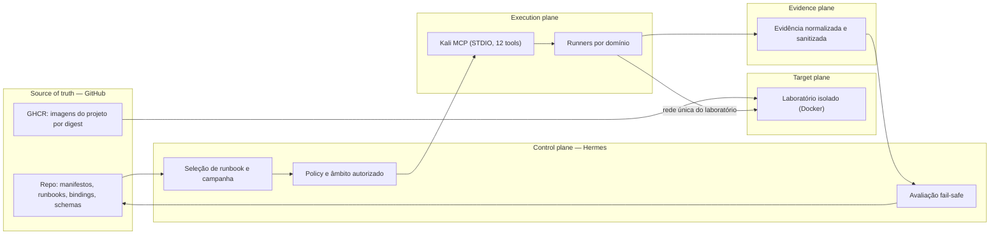
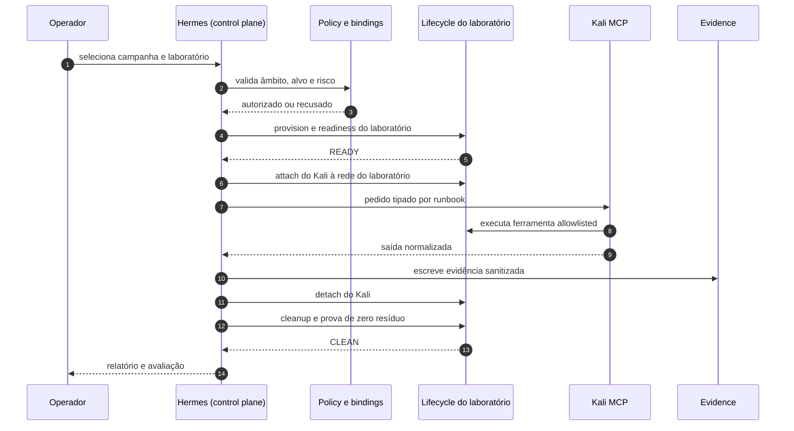
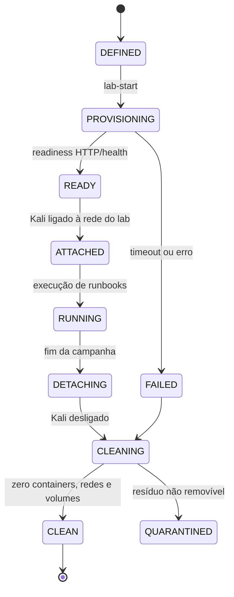
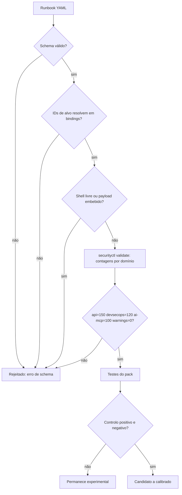
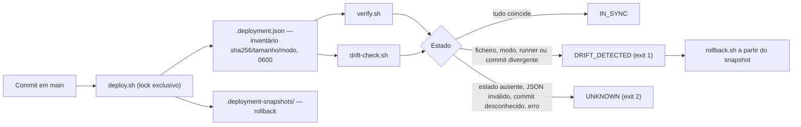
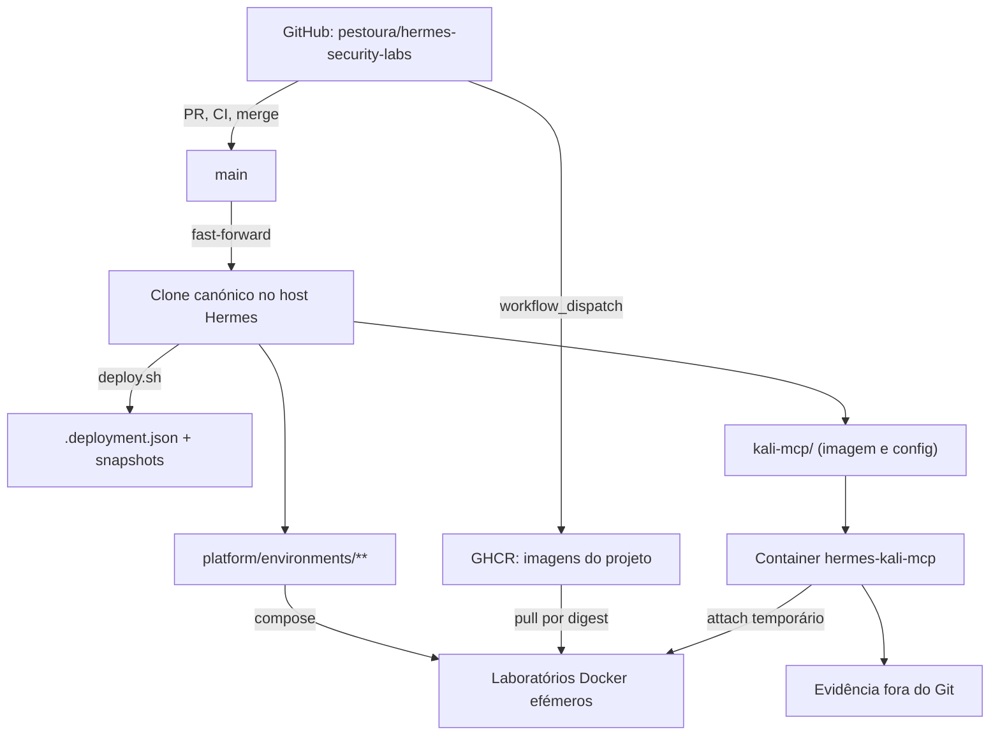
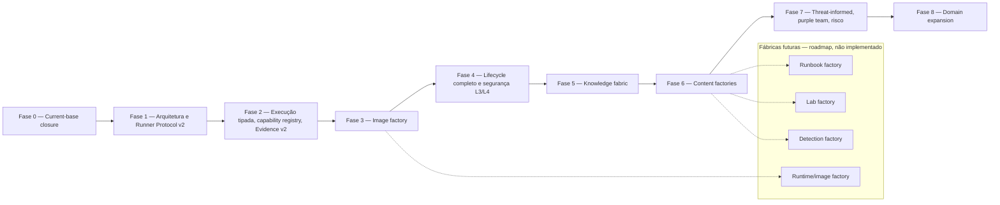

# Architecture

Descrição do sistema tal como está implementado hoje, com o alvo do roadmap v2
identificado explicitamente. Funcionalidades marcadas **roadmap** não existem em
runtime.

## 1. Planos do sistema

- **Control plane — Hermes.** Autorização, seleção de runbooks, planeamento de
  campanha, estado, avaliação dos resultados e reporting. Não executa ferramentas
  ofensivas diretamente e não guarda evidência bruta fora do evidence root.
- **Execution plane — Kali MCP e runners.** Mantém as ferramentas autorizadas
  (12 ferramentas MCP por STDIO, `docker exec -i hermes-kali-mcp`). Executa apenas
  perfis permitidos e nunca decide autorização.
- **Target plane — laboratórios.** Ambientes descartáveis, uma rede por
  laboratório, sem egress por omissão, sem exposição na LAN.
- **Evidence plane.** Resultados normalizados e guardados fora do Git.
- **Source of truth — GitHub.** Código, manifestos, schemas, runbooks e workflows.

### Arquitetura de alto nível



## 2. Fluxo canónico de execução

```text
runbook → binding → policy → adapter/runner → tool → normalize → evaluate → evidence
```

| Etapa | Responsável | Garantia |
| --- | --- | --- |
| runbook | `security/packs/<domain>/runbooks` | determinístico, sem shell livre |
| binding | `security/bindings/labs.yaml` | o alvo resolve para um laboratório registado |
| policy | `security/packs/<domain>/…/policy.py` | âmbito, risco e deny-by-default |
| adapter | `security/packs/<domain>/adapters` | pedido tipado, sem interpolação arbitrária |
| runner/tool | Kali MCP | apenas ferramentas allowlisted |
| normalize | pack runtime | saída estruturada; erro classificado |
| evaluate | control plane | ausência de sinal nunca produz `secure` |
| evidence | evidence root | sanitizada, fora do Git |

### Sequência de uma campanha



## 3. Lifecycle de laboratório

Estados observados pelo lifecycle atual, alinhados com o alvo v2.



Invariantes:

- uma única rede por laboratório;
- attach/detach decididos por estado real observado, nunca por suposição;
- cleanup idempotente com prova de ausência;
- `QUARANTINED` exige intervenção explícita e não é ignorável.

## 4. Validação de um runbook



## 5. Deployment e drift

O deployment não é um upload: é a prova de que o estado aplicado no host
corresponde a um commit conhecido do repositório.



Regra fail-safe: ausência de prova, erro ou evidência insuficiente **nunca** produz
`IN_SYNC`.

## 6. Boundaries de confiança e segurança

| Fronteira | Regra |
| --- | --- |
| Control plane → execution plane | apenas pedidos dentro de contrato; o executor não amplia âmbito |
| Execution plane → target plane | apenas a rede do laboratório ativo; sem egress por omissão |
| Target plane → host | sem publicação na LAN; portas apenas em `127.0.0.1` |
| Qualquer plano → evidence | append-only por execução; partilha sempre sanitizada |
| GitHub → Hermes | sem deployment automático, sem self-hosted runner, sem exposição do Docker socket |
| Hermes → GHCR | credencial read-only; consumo por digest imutável |

## 7. Monorepo, runtime, imagem Kali, labs e GitHub



## 8. Alvo do roadmap v2



Detalhe canónico em
[reference architecture](architecture/security-validation-reference-architecture.md)
e [roadmap](roadmap/security-validation-platform-v2.md).

## Ver também

- [Security model](security-model.md)
- [Operator guide](operator-guide.md)
- [Arquitetura consolidada da camada security](../security/docs/architecture.md)
