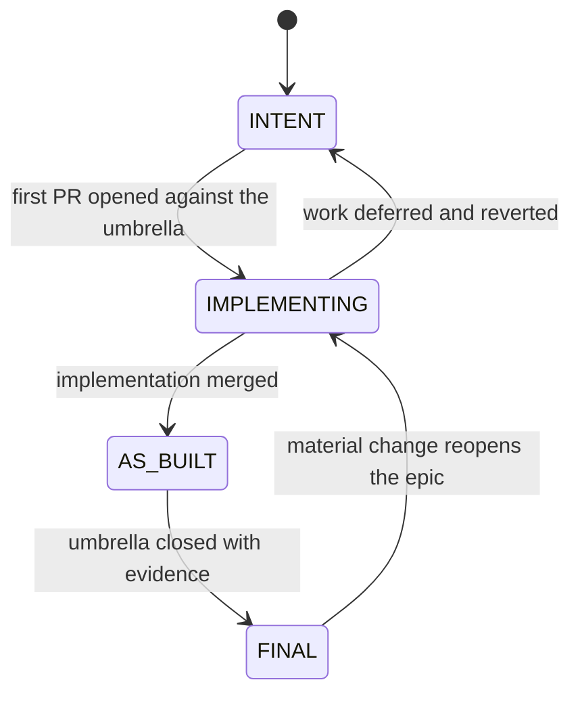

# Architecture documentation lifecycle — Intent → As-Built → Final

> Contract for how architectural and epic documentation evolves. Applies to every concept
> epic document under [`docs/roadmap/epics/`](../roadmap/epics/) and to the
> [platform intent document](security-validation-platform-v2-intent.md).

## 1. Purpose

Documentation must never claim more than what exists, and implementation must never land
without recording what was actually built. This contract closes the gap between intent and
reality by making the epic document a mandatory, versioned deliverable of every umbrella.

## 2. Lifecycle states

| State | Meaning | Sections 14 and 15 |
| --- | --- | --- |
| `INTENT` | Designed, agreed, not started | both empty and marked reserved |
| `IMPLEMENTING` | Work has started on the delivery umbrella | 14 updated per pull request |
| `AS_BUILT` | Implementation merged | 15 populated with what was built |
| `FINAL` | Umbrella closed with evidence | 15 complete, divergences recorded |

## 3. Obligations by moment

### 3.1 When work starts

- Set section 2 status to `IMPLEMENTING`.
- Record the umbrella issue and the branch or pull request in section 14.
- Confirm the open questions in section 13 are still open, or resolve them with an ADR.

### 3.2 During pull requests

Every pull request that changes behaviour covered by a concept epic must, in the same pull
request:

- append to section 14 with the pull request reference and what changed;
- record any deviation from sections 6 to 11 explicitly, as a deviation, not by silently
  rewriting the intent;
- add or update an ADR when the deviation is a material decision (see section 4);
- bump the document version and add a row to section 16.

### 3.3 When the umbrella closes

- Populate section 15 with the as-built architecture: what exists, where it lives, which
  contracts are real.
- Link evidence: test runs, validation output, catalogue counts, artefact digests.
- Set section 2 status to `FINAL`.
- **No umbrella may be closed while section 15 of any concept epic it covers is empty.**

### 3.4 After closure

A material change to a `FINAL` epic returns it to `IMPLEMENTING`. Historical rows in section
16 are never rewritten or deleted.

## 4. When an ADR is required

An Architecture Decision Record is required when a decision:

- changes a trust boundary, a plane responsibility or an authorization rule;
- changes a contract schema consumed by another epic;
- changes an intrusiveness level, a refusal rule or a fail-safe invariant;
- introduces or removes a dependency between concept epics;
- diverges from an acceptance criterion published in section 11.

ADRs live under `docs/architecture/adr/` and are referenced from sections 13, 14 and 15.
Formatting and numbering are owned by [`EPIC-01`](../roadmap/epics/EPIC-01-architecture-and-canonical-contracts.md).

## 5. Recording divergence

Divergence between intent and implementation is expected and must be visible. It is recorded
as a table row in section 15:

| Intent reference | What was built instead | Reason | Decision record |
| --- | --- | --- | --- |
| section 6, paragraph 2 | … | … | ADR-00XX |

Rewriting sections 3 to 11 to match the implementation retroactively is prohibited: intent is
historical record.

## 6. Evidence requirements

Every claim in section 15 must reference at least one of:

- a merged commit or pull request;
- a CI run or a local gate output recorded in the umbrella issue;
- a catalogue or validation count;
- an artefact digest or attestation reference.

Evidence must never contain credentials, tokens, cookies, private keys or raw unredacted
output.

## 7. Definition of Done additions

An umbrella issue is Done only when all of the following hold:

- [ ] every covered concept epic document is at `AS_BUILT` or `FINAL`;
- [ ] section 15 is populated and cites evidence;
- [ ] divergences from intent are recorded with reasons;
- [ ] ADRs exist for every material decision;
- [ ] acceptance criteria in section 11 are each marked met, not met, or superseded;
- [ ] the documentation tests pass.

## 8. Automation

The tests in [`docs/tests/test_epic_catalogue.py`](../tests/test_epic_catalogue.py) enforce the
mechanical part of this contract: document count, identifier uniqueness, mandatory sections,
status values, mapping validity, dependency validity and link resolution. Semantic quality
remains a human review responsibility.

Promotion itself is gated separately and fail-closed by
`roadmap/tests/test_lifecycle_evidence_gate.py`:

- every concept epic must declare a known lifecycle state;
- an `AS_BUILT` or `FINAL` epic must cite at least one exact 40-character commit SHA **and**
  at least one CI run identifier in section 15, satisfying section 6 mechanically;
- an `AS_BUILT` or `FINAL` epic must declare the reached states in its section 2 table;
- an `INTENT` or `IMPLEMENTING` epic must never declare `AS_BUILT` or `FINAL` reached;
- section 15 must not contain credential-shaped material.

The gate proves that cited evidence exists and is exact. It deliberately does not judge
whether that evidence satisfies the acceptance criteria in section 11: promotion by
association, by umbrella closure or by indirect coverage remains prohibited and remains a
human review decision.

## 9. Related documents

- [Platform v2 intent](security-validation-platform-v2-intent.md)
- [Epic catalogue — 45 concept epics](../roadmap/epic-catalogue-45.md)
- [Documentation governance](../documentation-governance.md)
- [Contributor guide](../contributor-guide.md)
