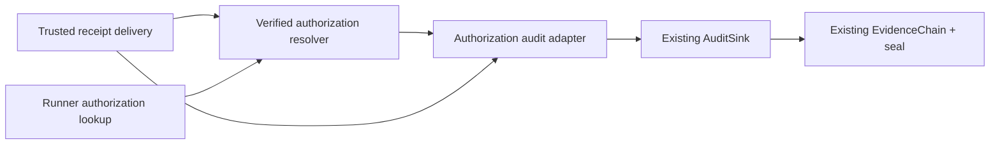

# Authorization Receipt Audit Evidence

Status: **MVP / repository-only**  
Change: `CHG-HSL-078`  
Decision: `ADR-0015`

## Purpose

Provide a deterministic, sanitized audit trail for TB1 authorization receipt registration, lookup and refusal decisions while keeping the receipt-delivery/resolver path non-operational in the committed repository state.

## Event coverage

The closed public event model covers:

- `REGISTERED` — a signed TB1 receipt was verified and registered locally;
- `LOOKUP_HIT` — a still-live verified authorization reference resolved successfully;
- `LOOKUP_MISS` — the reference was unknown or invalid;
- `LOOKUP_EXPIRED` — cached verified metadata was no longer live and was evicted;
- `REFUSED` — delivery or registration was denied with a stable bounded reason code.

## Canonical audit chain

The authorization audit adapter feeds the existing LAB_L1 `AuditSink` / EvidenceChain only. It does not implement a second ledger, store, chain, seal or verifier.

## Trusted context

Campaign/run/step/attempt/principal/correlation fields must come from a trusted local composition or schema-validated Runner request. They must not be copied from an unverified receipt.

## Data minimization

The public audit record contains no raw receipt, signature/base64, public/private key, target, parameters, credentials, secrets, tokens, cookies or headers.

A canonical authorization reference is represented only by its SHA-256 digest. Invalid or unbounded references are represented as `null` rather than being copied into evidence.

## Success-path fail closed

When an audit observer is configured:

- successful registration is not reported until the `REGISTERED` event is appended;
- if that append fails, the resolver registration must be rolled back with `forget()`;
- a lookup hit that cannot be audited returns no authority.

A denial remains denial if refusal auditing fails. Audit failure never converts a refusal into success.

## Idempotency

The existing monotonic receipt-delivery sequence remains authoritative. An exact duplicate delivery remains idempotent and does not create a second `REGISTERED` audit event.

## Runtime posture

This change does not enable:

- receipt delivery policy;
- resolver policy;
- AF_UNIX receipt socket;
- TB1 trust-store installation;
- real signer/provider;
- HITL promotion;
- Runner or target effect.

The canonical state remains `DISABLED / deny / NOT_RUN / execution_authority=none`, campaign `BLOCKED / HOLD`, and #403 remains the separate unresolved signer/provider decision.
