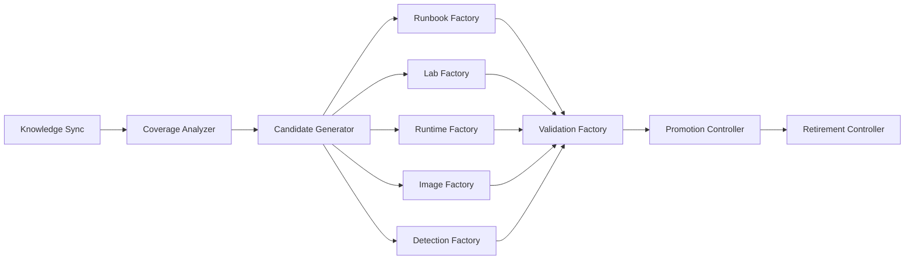
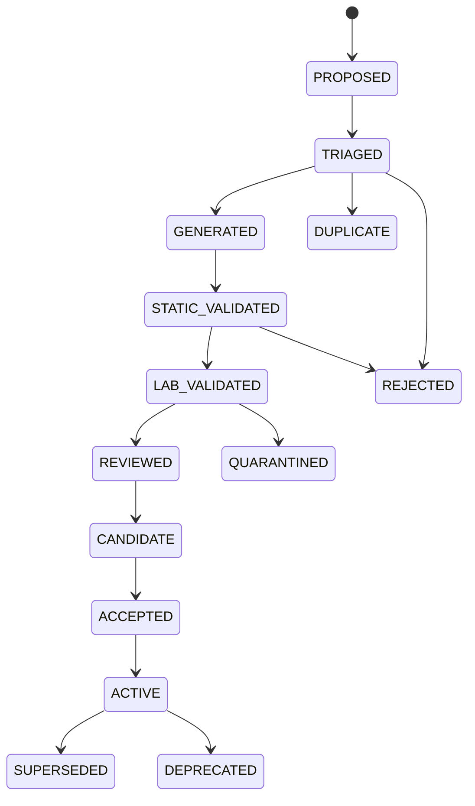

# Continuous Content Factories

> Como o conteúdo de validação (runbooks, labs, runtimes, imagens e deteções) é
> proposto, validado e promovido de forma contínua sem degradar a qualidade.

## 1. Componentes

| Componente | Função |
| --- | --- |
| Knowledge Sync | Ingestão incremental das fontes e emissão de eventos de diff |
| Coverage Analyzer | Deteta lacunas por framework, ativo, técnica, pilar e maturidade |
| Candidate Generator | Produz propostas não executáveis a partir de lacunas priorizadas |
| Runbook Factory | Materializa propostas de runbook em estrutura versionada |
| Lab Factory | Propõe laboratórios ou variantes de famílias existentes |
| Runtime Factory | Propõe perfis de runtime necessários a novas capacidades |
| Image Factory | Constrói imagens candidatas com SBOM, assinatura e proveniência |
| Detection Factory | Propõe estratégias de deteção e expectativas associadas |
| Validation Factory | Executa validação estática e validação em laboratório |
| Promotion Controller | Aplica gates e promove conteúdo revisto |
| Retirement Controller | Deprecia, supersede ou quarentena conteúdo degradado |

## 2. Lifecycle de conteúdo

`PROPOSED → TRIAGED → GENERATED → STATIC_VALIDATED → LAB_VALIDATED → REVIEWED → CANDIDATE → ACCEPTED → ACTIVE`

Estados terminais ou de exceção: `REJECTED`, `DUPLICATE`, `SUPERSEDED`, `DEPRECATED`,
`QUARANTINED`.

Regra absoluta: **nunca há auto-merge**. A transição `REVIEWED → CANDIDATE` exige
revisão humana registada, e `ACCEPTED` exige aprovação explícita no fluxo de PR.

## 3. Preferência por bindings, fixtures e variantes

Antes de criar conteúdo novo, a factory tenta, por esta ordem:

1. reutilizar um runbook existente com novo *binding* a um laboratório;
2. acrescentar uma *fixture* a um laboratório existente;
3. criar uma *variante* dentro de uma família de laboratórios;
4. apenas em último recurso, criar um artefacto novo.

Isto evita a proliferação de um laboratório por CVE e mantém a manutenção viável.

## 4. Laboratórios e controlos

Cada família de laboratórios suporta os estados `VULNERABLE`, `MITIGATED` e `FIXED`.
A validação exige controlo positivo (deteta quando vulnerável) e controlo negativo
(não deteta quando corrigido). Sem ambos, o conteúdo não passa de `LAB_VALIDATED`.

## 5. Anti-degradation gates

| Gate | Critério |
| --- | --- |
| Coverage | A proposta reduz uma lacuna real e não duplica cobertura existente |
| Duplication | Similaridade acima do limiar bloqueia e marca `DUPLICATE` |
| Reproducibility | Execuções repetidas produzem o mesmo resultado |
| FP/FN | Falsos positivos e negativos dentro do limite definido por maturidade |
| Cost | Tempo e recursos dentro do orçamento por execução |
| Staleness | Conteúdo sem revalidação dentro da janela é despromovido |

## 6. Learning proposals

A evidência de campanhas alimenta propostas de melhoria: novas variantes, ajustes de
deteção, correções de mapeamento e retirada de conteúdo com má taxa de sinal. Estas
propostas entram no mesmo lifecycle em `PROPOSED` e estão sujeitas às mesmas gates.
Nenhuma aprendizagem altera conteúdo ativo sem revisão.
