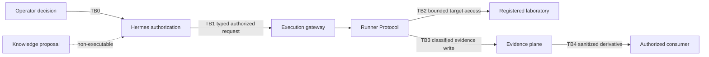

# Canonical architecture contract inventory

This inventory identifies the contracts that cross Security Validation Platform v2 trust boundaries. It defines ownership, authority and failure behaviour; it does **not** claim that planned schemas or runtime enforcement already exist.

## Contract principles

1. A contract has one canonical owner and one versioned source location.
2. Consumers reference the canonical contract instead of restating it.
3. A producer cannot grant itself authority that belongs to another plane.
4. Unknown versions, invalid schemas or missing authorization fail closed.
5. Contract metadata never transports secrets or unnecessary raw evidence.
6. Runtime implementation status is recorded separately from architectural intent.

## Inventory

| Contract | Boundary | Authority / owner | Producer → consumer | Canonical implementation owner | Current state | Fail-safe rule |
| --- | --- | --- | --- | --- | --- | --- |
| Operator decision and authorization request | `TB0` | control plane / `SVP2-A-02` | authenticated operator → Hermes | Rules of Engagement as Code (`EPIC-28`) | `INTENT` | missing identity, approval or active authorization prevents planning and execution |
| Active authorization reference | `TB1` | Hermes control plane | Hermes → execution gateway | Typed Kali MCP and RoE epics (`EPIC-03`, `EPIC-28`) | `INTENT` | invalid, expired or scope-mismatched reference is refused before dispatch |
| Typed execution request | `TB1` | gateway protocol owner / `SVP2-B-01` | Hermes → gateway | Typed Kali MCP (`EPIC-03`) | `INTENT` | unknown operation, version or schema is refused without partial execution |
| Typed execution outcome | `TB1` | gateway protocol owner / `SVP2-B-01` | gateway → Hermes | Typed Kali MCP (`EPIC-03`) | `INTENT` | malformed or unverifiable outcome is inconclusive and cannot yield `PASS` |
| Runner dispatch and result | internal execution boundary | Runner Protocol owner / `SVP2-B-02` | gateway → runner → gateway | Runner Protocol v2 (`EPIC-05`) | contract block `AS_BUILT`; adapters `NOT_RUN`; [`platform/runner-protocol/`](../../../platform/runner-protocol/README.md) | missing correlation, incompatibility, timeout or cancellation is a normalized non-success outcome |
| Laboratory target and network attachment | `TB2` | lifecycle owner / `SVP2-B-03` | runner/runtime → registered laboratory | Transactional lifecycle (`EPIC-04`) | `INTENT`; current lifecycle remains separate | target or network outside the active laboratory contract is refused |
| Evidence write envelope | `TB3` | Evidence Plane owner / `SVP2-D-01` | runner and laboratory observers → evidence plane | Evidence Plane (`EPIC-10`) | `INTENT` | missing identifiers, classification or integrity metadata rejects the record or marks execution inconclusive |
| Evidence derivative and publication request | `TB4` | Evidence Plane and authorized publisher | restricted evidence → sanitized derivative → consumer | Evidence Plane and redaction (`EPIC-10`, `EPIC-12`) | `INTENT` | failed classification or redaction blocks publication |
| Knowledge proposal | proposal path into control plane | knowledge plane / `SVP2-E-02` | knowledge service → Hermes | Knowledge API and planner (`EPIC-40`, `EPIC-43`) | `INTENT` | proposal is non-executable and cannot create authorization |
| Knowledge snapshot reference | knowledge/evidence association | knowledge plane / `SVP2-E-02` | knowledge plane → campaign and evidence records | Knowledge snapshots (`EPIC-40`, `EPIC-44`) | `INTENT` | missing or unverifiable snapshot prevents a reproducibility claim |

## Required common metadata

The exact schemas belong to their implementation epics. Cross-plane contracts must converge on these common concepts without independently redefining them:

- contract name and semantic version;
- `campaign_id`, `run_id`, `step_id` and `attempt_id` where execution is involved;
- source and destination plane identities;
- authorization or proposal reference appropriate to the crossing;
- operation/capability identifier;
- creation and expiry time where authority is time-bound;
- classification and evidence references where data is emitted;
- normalized outcome or refusal code;
- provenance: repository commit, artefact digest or knowledge snapshot as applicable.

## Contract authority and precedence

Precedence rules:

1. the active authorization contract limits every downstream executable contract;
2. a runtime profile or capability may restrict authorization further but may not expand it;
3. evidence records describe what happened and do not retroactively authorize it;
4. knowledge proposals influence planning but never execution authority;
5. an issue, comment or runtime-local configuration cannot override the versioned canonical contract.

## Compatibility and change control

A contract change requires an ADR when it changes authority, a boundary, a refusal rule, mandatory metadata or consumer-visible semantics. Compatible additions still require schema versioning and tests. Breaking changes require an explicit compatibility or migration plan and must not be inferred from implementation code alone.

## Implementation status discipline

- `INTENT` means the architectural contract is defined but runtime enforcement is not claimed.
- `IMPLEMENTING` means an owning epic has started and records its branch/PR.
- `AS_BUILT` means the concrete schema and enforcement are in `main` with evidence.
- `FINAL` means the delivery umbrella is closed and limitations are documented.

The machine-readable concept catalogue and each epic document remain the authoritative source for lifecycle status.

## Related decisions and documents

- [ADR index](../adr/README.md)
- [ADR-0001 — plane separation](../adr/ADR-0001-plane-separation-and-authorization-authority.md)
- [ADR-0002 — trust-boundary numbering](../adr/ADR-0002-canonical-trust-boundary-numbering.md)
- [ADR-0003 — typed contracts](../adr/ADR-0003-typed-contracts-over-generic-execution.md)
- [Reference architecture](../security-validation-reference-architecture.md)
- [Architecture documentation lifecycle](../architecture-documentation-lifecycle.md)
