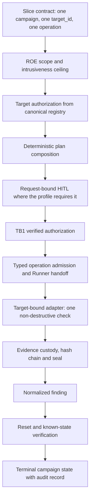

# First PTaaS vertical slice — design and specification

**Status:** `DESIGN / EM_VALIDACAO` — specification only, no production implementation.
**Change record:** `CHG-HSL-083` (`DOC_ONLY`).
**Decision record:** [ADR-0017](adr/ADR-0017-first-ptaas-vertical-slice-composition.md) (Proposed).
**Baseline read:** `c63fee752bfd28868da54eb9650943e2b504f659`.

> **This document changes no policy, gate, schema, template, runtime state or campaign observation.** `VAL-HSL-RUNNER-L1-LIVE-PROMOTION` remains `BLOCKED / HOLD`. `promotion_allowed: false`, `runtime_status: NOT_RUN`, `execution_authority: none`, `supplier_selection: NO_SELECTION`, `trust-store: ABSENT` are unchanged. Repository acceptance of a specification is never execution authority.

## 1. Objective

Specify the smallest end-to-end PTaaS traversal that one `LAB_L1` campaign can perform:

1. the campaign receives one explicitly authorized, allowlisted target;
2. one safe non-destructive check runs through the existing tool/runner path;
3. evidence is preserved through the existing Evidence Plane;
4. at least one normalized finding is produced;
5. the campaign reaches an auditable terminal state;
6. Human-in-the-Loop appears only where the resolved assurance profile already requires it.

The slice is a composition specification. It introduces no new capability, no new authority and no new offensive surface.

## 2. Facts

Facts are statements verified by reading the repository at the baseline SHA.

| Fact | Location |
| --- | --- |
| The walking-skeleton lifecycle is already the accepted delivery shape | [`../delivery-operating-model.md`](../delivery-operating-model.md) |
| Campaign states include `DRAFT, AUTHORIZED, READY, RUNNING, PAUSED, STOPPING, STOPPED, COMPLETED, ABORTED, EXPIRED` | [`../../platform/roe-contract/campaign_kill_switch_transition.py`](../../platform/roe-contract/campaign_kill_switch_transition.py) |
| `target_id` is the only execution authority; reachability is not authorization | [`../../platform/targets/execution_authorization.py`](../../platform/targets/execution_authorization.py) |
| `webgoat-web` exists with `authorization_state: LAB_ONLY`, `lifecycle: PROVISIONED` and a declared scope | [`../../platform/targets/target-registry.yaml`](../../platform/targets/target-registry.yaml) |
| Typed operations are registry-declared; `web.discovery.headers` and `web.discovery.tls` exist | [`../../platform/gateway-protocol/operation-registry.yaml`](../../platform/gateway-protocol/operation-registry.yaml) |
| A deterministic dry-run plan composer already resolves scenario → environment → target authorization → operation → tool → backend → lifecycle → readiness → evidence expectations → reset proof | [`../../platform/scenario-registry/scenario_plan.py`](../../platform/scenario-registry/scenario_plan.py) |
| The WebGoat L1 adapter is target-bound, read-only HTTP, `status: CANDIDATE`, `runtime_status: NOT_RUN`, resolver default `deny-all` | [`../../platform/runner-adapters/webgoat_l1_adapter.py`](../../platform/runner-adapters/webgoat_l1_adapter.py), [`adapter-registry.yaml`](../../platform/runner-adapters/adapter-registry.yaml) |
| The controlled candidate returns `execution_authority: CONTROLLED_CI_ONLY` for `system.health.read` and `CONTROLLED_EFFECT_NOT_IMPLEMENTED` otherwise | [`../../platform/gateway-protocol/controlled_runtime_candidate.py`](../../platform/gateway-protocol/controlled_runtime_candidate.py) |
| Evidence custody, hash chain, seal, local store and verifier exist and are accepted repository-side | [`../../platform/evidence-plane/`](../../platform/evidence-plane/) |
| A finding schema and a finding state machine exist (`OBSERVED → VALIDATED → TRIAGED → …`) | [`../../platform/risk-findings/finding.schema.json`](../../platform/risk-findings/finding.schema.json), [`risk_findings.py`](../../platform/risk-findings/risk_findings.py) |
| The resolved profile is `LAB_L1` with `requires_request_bound_hitl: true` and `requires_hash_chain: true`; `requires_external_worm_backend` and `requires_tenant_isolation` are `false` | [`../../platform/assurance/current-assurance-profile.yaml`](../../platform/assurance/current-assurance-profile.yaml) |
| Lifecycle, readiness, orphan detection and zero-residue proof contracts exist | [`../../platform/lab-lifecycle/`](../../platform/lab-lifecycle/) |
| Every authorization, delivery, resolver and custody policy in the repository is `DISABLED` / `deny` / `NOT_RUN` | policy YAML files under `platform/runner-authorization/`, `platform/runner-dispatch/`, `platform/evidence-plane/` |
| Trust store is `OBSERVED_ABSENT`; no signer/provider is selected | [`../roadmap/current-walking-skeleton-status.md`](../roadmap/current-walking-skeleton-status.md) |

## 3. Assumptions

Assumptions are not verified facts. Each one must be confirmed by a later evidence-bearing change before implementation depends on it.

- A1: `web.discovery.headers` against `webgoat-web` is non-destructive in the accepted WebGoat lab and stays inside that target's declared scope.
- A2: the WebGoat lab can be brought to readiness through the accepted lifecycle path without any new provisioning capability.
- A3: the existing local evidence store is sufficient custody for the slice under `LAB_L1`, because production WORM backend and tenant isolation are `PROD`-only readiness.
- A4: exactly one normalized finding can be derived from a headers/TLS discovery observation without inventing risk-component values; if any canonical risk component would have to be fabricated, the finding must be emitted in a state that does not require a complete risk assessment.
- A5: request-bound HITL can be satisfied by the existing approval path already required by the profile, without a new approval surface.
- A6: the traversal record can be produced deterministically for a given contract and component set, so it is reviewable before any effect.

Assumption A4 is the one most likely to be wrong; specification of the finding shape (section 6.5) is written so that a missing risk component is a refusal, never a fabricated value.

## 4. Constraints

- No production code in this change. Design, specification and change-record documentation only.
- No live Vault. Vault and the Hermes MCP Bridge are supporting dependencies and must not become the lane.
- No real secrets, no credential use, no token, cookie, header or key material at any seam.
- No destructive action, no broad scanning, exactly one target and one operation.
- No persistence outside the evidence custody already governed by the Evidence Plane.
- Every existing policy stays `DISABLED` / `deny` / `NOT_RUN`; the specification enables nothing.
- No new authority-shaped component; authority stays with already-accepted components (ADR-0017 Option C).
- No blocker is closed and no campaign observation moves off `BLOCKED / OPEN`.
- No supplier, provider or backend is selected.

## 5. Data flow

Seam-by-seam contract:

| # | Seam | Owning component | Input | Output | Refusal is terminal |
| --- | --- | --- | --- | --- | --- |
| S1 | Scope resolution | `roe_contract.py` | slice contract | bounded scope, intrusiveness ceiling | yes |
| S2 | Target authorization | `execution_authorization.py` | `target_id` | allow/deny decision with stable reason code | yes |
| S3 | Plan composition | `scenario_plan.py` | scenario, target, operation | deterministic dry-run plan | yes |
| S4 | HITL | profile-required approval path | plan digest | request-bound approval or refusal | yes |
| S5 | Authorization | `authorization_receipt.py`, `verified_authorization_resolver.py` | approval, plan | verified authorization metadata | yes |
| S6 | Admission and handoff | `admission.py`, `runner_handoff.py` | verified authorization, typed operation | canonical v2 envelope | yes |
| S7 | Effect | `webgoat_l1_adapter.py` via `router.py` | v2 envelope | structured outcome | yes |
| S8 | Custody | `evidence_plane.py`, `evidence_chain.py`, `seal.py` | structured outcome | verified evidence refs, sealed chain | yes |
| S9 | Finding | `risk_findings.py` | verified evidence refs | one normalized finding | yes |
| S10 | Reset | `lifecycle_protocol.py`, zero-residue proof | lab state | known-state proof | yes |
| S11 | Terminal state | `campaign_kill_switch_transition.py` state space | all prior seam records | terminal campaign state + audit record | n/a |

The slice binder resolves and verifies seams; it performs no effect, issues no authorization, writes no custody record and mutates no campaign state itself.

## 6. Specification

### 6.1 Slice contract

One committed schema plus one committed YAML instance declaring, for exactly one campaign:

- `campaign_id`, `assurance_profile` (must resolve to `LAB_L1`);
- exactly one `target_id` (`webgoat-web`), which must resolve `LAB_ONLY` and execution-ready in the canonical registry;
- exactly one `operation_id` with `intrusiveness_level` at most `L1` and `destructive: false`;
- the required evidence tuple (section 6.4);
- the required finding shape (section 6.5);
- the terminal-state definition (section 6.6);
- `execution_authority: none`, `runtime_status: NOT_RUN`, `promotion_allowed: false` as literal declared invariants.

The contract is a scope declaration. Presence of a target or operation in the contract is explicitly not authorization; S2 and S5 remain the only authority.

### 6.2 Traversal binder

A resolver that, given the contract, resolves each seam's owning component, verifies that seam's declared precondition, and emits one deterministic traversal record listing per seam: seam id, owning component path, precondition verified true/false, and a stable reason code. It refuses fail-closed on the first unsatisfied precondition. It has no effect path, no network, no subprocess and no state mutation.

### 6.3 Non-destructive check

One typed operation from the existing registry, executed through the existing adapter/tool path, with the adapter's existing prohibitions intact: fixed endpoint, no redirect following, no arbitrary locator input, no shell, no subprocess, no credentials, no egress beyond the fixed lab endpoint, durable idempotency required before any effect.

### 6.4 Evidence requirements

Minimum evidence tuple for one traversal, all through existing components:

- the decision record for S2 (identifiers, boolean, stable reason code only);
- the deterministic plan digest from S3;
- the request-bound approval reference from S4, as a digest;
- the verified-authorization reference from S5, as a digest;
- the canonical request envelope digest and structured outcome from S6–S7;
- the custody references and the sealed hash-chain state digest from S8;
- the normalized finding reference from S9;
- the known-state/zero-residue proof from S10;
- the terminal-state audit record from S11.

Audit and evidence requirements:

- every record is sanitized: identifiers, digests, booleans, stable reason codes; never raw payloads, raw locators, signature material, credentials or secrets;
- custody must be verified after write; an unverifiable write refuses;
- the audit path is part of the positive traversal: if a positive seam cannot be audited, the traversal refuses. A refusal remains a refusal even if refusal auditing itself fails;
- the hash chain covers the traversal record, because `requires_hash_chain: true` under the resolved profile;
- evidence is repository-external and ephemeral until a separate change accepts sanitized facts into source-of-truth.

### 6.5 Normalized finding

At least one finding conforming to the existing `finding.schema.json`, produced only from verified evidence references. Rules:

- initial state is the first state of the existing state machine; the slice performs no state transition it cannot evidence;
- no canonical risk component may be fabricated. If a complete risk assessment cannot be derived from observed evidence, the finding is emitted without a fabricated assessment and the traversal records the limitation explicitly; it must never be filled with default or invented component values;
- content is sanitized as in section 6.4;
- an absent or non-conforming finding is a traversal refusal, not a warning.

### 6.6 Terminal state and failure semantics

Terminal states are drawn only from the existing campaign state space. The slice defines:

- `COMPLETED` — every seam S1–S10 verified, evidence tuple complete and verified, at least one conforming finding, known-state proof present, audit record written;
- `ABORTED` — any seam refused fail-closed, or the external kill switch engaged; the traversal preserves whatever evidence was already verified and records the refusing seam plus its stable reason code;
- `STOPPED` — kill-switch-driven restrictive transition through the existing planner, no new stop path.

Failure semantics:

- fail-closed everywhere; the default outcome of an unresolvable seam is refusal, never continuation;
- refusal precedence is seam order: the first unsatisfied precondition is the recorded cause, and later seams are not evaluated;
- `UNKNOWN` is fail-safe and is never converted into `PASS`;
- partial evidence never produces `COMPLETED`;
- a terminal state is auditable only if its audit record and the evidence tuple references are both present and verified.

## 7. Acceptance criteria

Criteria for the future implementation change, not satisfied by this document:

- AC1: a committed slice contract validates against its committed schema and declares exactly one target and one operation.
- AC2: the declared `target_id` resolves `LAB_ONLY` and execution-ready through the canonical registry, and the declared operation exists in the operation registry at intrusiveness `L1` or lower.
- AC3: the binder emits a deterministic traversal record for a fixed contract and component set: identical input yields byte-identical output.
- AC4: each seam S1–S11 names an existing component path that exists in the tree; no seam is owned by a component created by the slice.
- AC5: the binder refuses fail-closed on the first unsatisfied precondition and records the seam id plus a stable reason code.
- AC6: the evidence tuple in section 6.4 is complete and each element is verified after write; an unverifiable element refuses.
- AC7: at least one finding conforming to `finding.schema.json` is produced from verified evidence only, with no fabricated risk component.
- AC8: the traversal reaches exactly one terminal state from the existing campaign state space, with an audit record.
- AC9: HITL is required exactly where the resolved profile requires it, and nowhere else; no new approval surface exists.
- AC10: no policy value moves from `DISABLED`/`deny`/`NOT_RUN`; `promotion_allowed=false`, `runtime_status=NOT_RUN`, `execution_authority=none`, `supplier_selection=NO_SELECTION` and `trust-store=ABSENT` are asserted unchanged.
- AC11: no Vault, signer, trust-store, credential, secret or Bridge dependency is on the slice's critical path.
- AC12: sanitization holds: no raw payload, locator, signature, credential, secret, token, cookie or header appears in any record.

## 8. Test strategy

For the future implementation change:

- schema tests: the slice contract schema rejects more than one target, more than one operation, intrusiveness above `L1`, `destructive: true`, and any missing declared invariant.
- determinism test: the traversal record is byte-identical across two resolutions of the same contract.
- seam-existence test: every seam's declared component path exists in the tree at the tested SHA.
- fail-closed tests: one test per seam asserting that an unsatisfied precondition refuses with the expected stable reason code and that no later seam is evaluated.
- refusal-precedence test: with two seams unsatisfied, the earlier seam is the recorded cause.
- authority tests: contract presence alone never authorizes; an `UNVERIFIED`/`BLOCKED`/`EXTERNAL`/absent/out-of-scope target denies before any handler is reached.
- evidence tests: an unverifiable custody write refuses; a tampered chain entry, a tampered seal digest and a mismatched evidence digest all surface as unverified.
- finding tests: a conforming finding is produced from verified evidence; a missing canonical risk component produces a recorded limitation, never a fabricated value; a non-conforming finding refuses.
- invariant tests: `promotion_allowed=false`, `runtime_status=NOT_RUN`, `execution_authority=none`, `supplier_selection=NO_SELECTION`, `trust-store=ABSENT` and every policy `DISABLED`/`NOT_RUN` asserted literally.
- sanitization tests: AST-based guards asserting the binder imports no forbidden module and performs no socket send, subprocess, credential read or privileged call; token scans must inspect AST nodes rather than raw source text, because the guard list itself collides with legitimate field names and prose.
- negative-scope test: a second target or a second operation in the contract is rejected at schema level.

This change itself is validated only by the existing repository documentation, ADR and change-record consistency suites.

## 9. Out of scope

- Any production implementation, module, schema file or policy change.
- Enabling any policy, gate, promotion or runtime path.
- Live Vault use, Vault provisioning, signer selection, provider attestation, trust-store generation or installation.
- Hermes MCP Bridge changes; the Bridge remains a supporting dependency.
- Real secrets, credentials, tokens or key material.
- Destructive operations, broad scanning, more than one target, more than one operation, persistence outside governed evidence custody.
- Closing `#403`, `#53` or any open live-promotion blocker.
- Moving any campaign observation off `BLOCKED / OPEN`, or changing `state`/`promotionRecommendation` in any validation campaign.
- Production WORM backend and production tenant isolation, which remain `PROD`-only readiness.

## 10. Rollout and rollback

Rollout of this change: documentation-only. The branch carries an ADR proposal, this specification and one `DOC_ONLY` change record. Nothing is installed, enabled, deployed or observed. There is no runtime effect to stage.

Rollback of this change: revert the documentation commit. No policy, gate, schema, campaign, runtime, host, container, identity or trust artefact is touched, so revert is complete and requires no compensating action.

Rollout of the future implementation, for completeness and not authorized here: a separate evidence-bearing change record, repository acceptance first, then a separately governed live traversal with explicit owner approval, retaining every current invariant until live evidence and explicit Human-in-the-Loop promotion exist.

## 11. Self-review

- Placeholders: none. No `TBD`, `TODO`, `XXX` or unnamed component remains; every seam names an existing repository path.
- Ambiguity: assumptions are separated from facts in sections 2 and 3; the weakest assumption (A4, finding derivability) is bounded by an explicit refusal rule in section 6.5 so it cannot be resolved by fabrication.
- Scope creep: the specification adds one contract, one YAML instance and one binder, and no authority. Vault, Bridge, signer, trust store, WORM backend and tenant isolation are all held out of the critical path in sections 4 and 9.
- Invariant preservation: `BLOCKED / HOLD`, `promotion_allowed=false`, `runtime_status=NOT_RUN`, `execution_authority=none`, `supplier_selection=NO_SELECTION` and `trust-store=ABSENT` are asserted unchanged and are restated as acceptance criteria AC10 rather than left implicit.
- Honest gaps: this document contains no live evidence and claims none. Nothing here has been executed. The composition is a recommendation in validation, and implementation requires separate owner approval.
