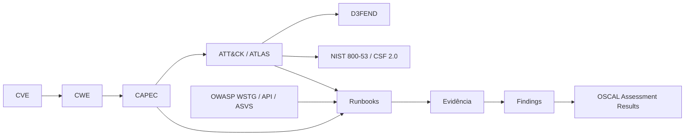

# Framework Crosswalk

> Como a plataforma se relaciona com frameworks públicos de teste, controlo e
> conhecimento adversário, e como evitar mapeamentos simplistas.

## 1. Frameworks considerados

| Framework | Natureza | Uso na plataforma |
| --- | --- | --- |
| PTES | Metodologia de pentest | Estrutura de fases da campanha e cobertura de ciclo completo |
| NIST SP 800-115 | Guia técnico de teste de segurança | Classificação de técnicas de teste e requisitos de planeamento/relato |
| NIST CSF 2.0 | Funções de governação e operação | Agrupamento de objetivos de resiliência e comunicação executiva |
| NIST SP 800-53 / OSCAL | Catálogo de controlos e formato máquina | Mapeamento de resultados para controlos e exportação de assessment |
| OWASP WSTG | Guia de teste web | Cobertura de runbooks web |
| OWASP API Security | Riscos de API | Cobertura do pack API |
| OWASP ASVS | Requisitos de verificação | Definição de nível de verificação e critérios de aceitação |
| MITRE ATT&CK | Comportamento adversário | Base de threat-informed validation e purple team |
| MITRE ATLAS | Ameaças a sistemas de IA | Cobertura do pack AI/MCP |
| MITRE CAPEC | Padrões de ataque | Ponte entre fraqueza e comportamento |
| MITRE CWE | Tipos de fraqueza | Ligação entre vulnerabilidade concreta e classe de causa |
| TIBER-EU | Threat-led penetration testing | Modelo de exercícios informados por inteligência e resiliência |
| MITRE D3FEND | Contramedidas defensivas | Expectativas de deteção e mitigação |

## 2. Direção dos mapeamentos

Os mapeamentos são direcionais e não simétricos. Um controlo NIST não implica cobertura
de uma técnica ATT&CK; implica, no máximo, uma expectativa de mitigação a validar.

## 3. Níveis de confiança

| Nível | Significado |
| --- | --- |
| `AUTHORITATIVE` | Relação publicada pela fonte oficial do framework |
| `DIRECT` | Relação explícita numa fonte primária ligada ao artefacto concreto |
| `INHERITED` | Derivada por transitividade de relações de nível superior |
| `INFERRED` | Derivada por regra determinística documentada |
| `HEURISTIC` | Derivada por semelhança ou correspondência aproximada |
| `HUMAN_REVIEWED` | Confirmada por revisão humana registada |
| `REJECTED` | Avaliada e explicitamente rejeitada |

Regras: nenhuma decisão de risco ou de cobertura pode assentar apenas em `HEURISTIC`;
relações `INFERRED` e `HEURISTIC` exigem registo da regra que as gerou; `REJECTED`
é persistido para impedir regeneração silenciosa.

## 4. Proveniência

Cada relação regista: fonte, identificador na fonte, versão/snapshot, data de
observação, método de derivação, autor (humano ou processo) e nível de confiança.
Sem proveniência completa, a relação não é publicada no grafo.

## 5. Prevenção de mappings simplistas

Anti-padrões proibidos:

- afirmar cobertura de uma técnica ATT&CK a partir da simples execução de um runbook;
- mapear CVE diretamente para técnica sem passar por CWE/CAPEC ou fonte autoritativa;
- tratar categorias OWASP como equivalentes a controlos NIST;
- agregar níveis de confiança diferentes num único indicador sem os separar;
- usar contagem de mapeamentos como métrica de maturidade.

Controlos aplicados: separação obrigatória entre *mapped*, *validated* e *effective*;
métricas de cobertura sempre qualificadas pelo nível de confiança; limitações
declaradas em qualquer relatório derivado.

## 6. Uso em relatórios

Um relatório distingue três afirmações: o que foi mapeado (conhecimento), o que foi
testado (evidência) e o que foi demonstrado (avaliação). Nunca são apresentadas como
a mesma coisa.
