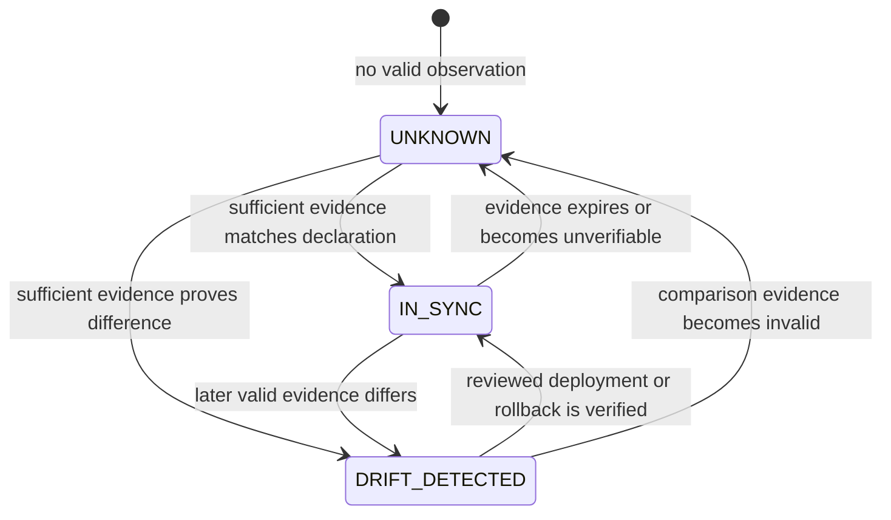

# Runtime source-of-truth policy

> Canonical policy for EPIC-02. The machine-readable declaration is
> [`platform/registry.yaml`](../../platform/registry.yaml). This document explains the
> contract; it does not replace it.

## 1. Authority model

Git is the only authority for desired runtime state. `platform/registry.yaml` is the
catalogue root and references each authoritative artefact class instead of duplicating its
contents.

| Artefact class | Canonical declaration | Authority |
| --- | --- | --- |
| catalogue root | `platform/registry.yaml` | runtime IDs, policy and canonical references |
| rollout plan | `platform/rollout.yaml` | delivery order and planned environment IDs |
| runtime profiles | `platform/runtimes/*.yaml` | runtime identity, drivers, lifecycle, isolation and release-identity state |
| runtime schema | `platform/schemas/runtime-profile.schema.json` | profile structure and image identity invariants |
| laboratory manifests | `platform/environments/**` | environment identity, runtime reference, resources and lifecycle |
| laboratory schema | `platform/schemas/lab-manifest.schema.json` | environment manifest structure |
| runtime templates | `platform/runtime/**` | repository-owned implementation templates |

A declaration is authoritative only when it is versioned in Git, referenced by the
catalogue root where applicable and passes repository validation.

## 2. Non-authoritative information

The following data is evidence or work tracking, never desired state:

- `.deployment.json` and deployment snapshots;
- host, container, network and volume observations;
- GitHub issues, comments and check output;
- temporary, generated, cached or exported files;
- local emergency changes not reconciled through Git.

Observed data may establish `IN_SYNC`, `DRIFT_DETECTED` or `UNKNOWN`. It cannot promote
itself into the desired declaration.

## 3. Drift contract



| State | Meaning | Permitted claim |
| --- | --- | --- |
| `IN_SYNC` | sufficient valid observation matches the expected Git declaration | synchronization may be asserted for the observed scope and timestamp |
| `DRIFT_DETECTED` | sufficient valid observation proves a material difference | drift may be asserted; review and deliberate remediation are required |
| `UNKNOWN` | observation is missing, malformed, stale, incompatible or unverifiable | neither synchronization nor drift absence may be asserted |

`UNKNOWN` is fail-safe. Missing or unparsable evidence is not converted into
`DRIFT_DETECTED` or `IN_SYNC`. Automatic reconciliation is forbidden.

## 4. Runtime profiles

Each runtime ID appears exactly once in `platform/registry.yaml` and references exactly one
profile under `platform/runtimes/`. Every profile validates against the runtime-profile
schema. Orphan profiles, duplicate IDs, duplicate paths, ID mismatches and unresolved
environment runtime references fail CI.

Current declared profiles:

| Runtime | State | Current boundary |
| --- | --- | --- |
| `docker` | `CURRENT` | host driver profile; lab image identity remains in existing manifests/compose until release manifests exist |
| `kubernetes` | `CURRENT-LIMITED` | multiple drivers catalogued; no implicit host-cluster installation |
| `virtual-machine` | `CURRENT-LIMITED` | read-only host audit only; provisioning remains planned |
| `cloud` | `CLOUD-SANDBOX` | no real cloud account or resource activation |
| `emulator` | `EXTERNAL-HARDWARE` | no emulator or external hardware installation |

A catalogue state does not prove runtime readiness. Readiness remains observed evidence and
must be validated by the owning implementation epic.

## 5. Image and release identity

Image digest identity belongs to an immutable runtime release. It is not repeated or
overridden in each environment manifest.

Profile release states are:

- `PINNED` — `image` and valid `sha256` digest are mandatory;
- `UNPINNED` — an existing image-backed release is not yet reproducibly pinned;
- `NOT_APPLICABLE` — the profile identifies a host runtime/driver rather than an image;
- `PLANNED` — no active release identity exists yet.

A required digest that is absent produces `UNKNOWN`. `NOT_APPLICABLE` on a host runtime does
not waive digest requirements for runner or laboratory images introduced by later epics.

## 6. Validation and operational boundaries

Repository CI executes:

```text
python platform/scripts/validate_source_of_truth.py validate
python -m pytest -q platform/tests -p no:cacheprovider
```

The validator is read-only. It validates repository contracts and does not inspect or alter
Hermes, Kali MCP, Docker, networks, volumes or laboratories.

The existing deployment comparator remains the operational drift implementation. EPIC-02
does not alter it and does not add automatic remediation.

## 7. Change process

1. change the canonical declaration in a small branch;
2. update the relevant profile, schema, ADR and epic documentation when semantics change;
3. run source-of-truth, catalogue, documentation and security gates;
4. merge only from the validated head;
5. deploy or roll back deliberately through the existing controlled process;
6. verify observed state against the merged Git revision;
7. preserve `UNKNOWN` until valid comparison evidence exists.

## 8. Related records

- [ADR-0006 — versioned source of truth and provenance](adr/ADR-0006-versioned-source-of-truth-and-provenance.md)
- [ADR-0009 — runtime source of truth and drift semantics](adr/ADR-0009-runtime-source-of-truth-and-drift-semantics.md)
- [Deployment tracking](../deployment-tracking.md)
- [EPIC-02](../roadmap/epics/EPIC-02-single-source-of-truth-for-runtime.md)
