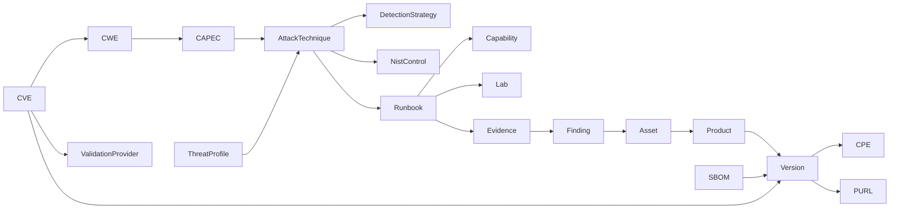

# Security Knowledge Fabric

> Modelo de conhecimento versionado que sustenta o planeamento informado por ameaça.

## 1. Entidades

| Entidade | Descrição |
| --- | --- |
| `Asset` | Sistema, serviço ou componente sob validação |
| `Product` | Produto de software identificável |
| `Version` | Versão concreta de um produto |
| `CPE` | Identificador de plataforma para aplicabilidade |
| `PURL` | Identificador de pacote para aplicabilidade |
| `SBOM` | Inventário de componentes de um artefacto |
| `CVE` | Vulnerabilidade concreta publicada |
| `CWE` | Classe de fraqueza |
| `CAPEC` | Padrão de ataque |
| `AttackTechnique` | Técnica ATT&CK (Enterprise/Mobile/ICS) ou ATLAS |
| `DetectionStrategy` | Estratégia de deteção esperada |
| `NistControl` | Controlo NIST SP 800-53 |
| `Runbook` | Procedimento de validação versionado |
| `Capability` | Capacidade de execução disponível num runtime |
| `Lab` | Ambiente alvo reprodutível |
| `Finding` | Resultado validado de uma campanha |
| `Evidence` | Artefacto de prova com cadeia de custódia |
| `ThreatProfile` | Perfil de ameaça relevante para um contexto |
| `ValidationProvider` | Fornecedor de validação de uma vulnerabilidade |

## 2. Relações

Todas as arestas transportam `confidence` e `provenance`, conforme
[`framework-crosswalk.md`](framework-crosswalk.md).

## 3. Pipeline de derivação

`CVE → CWE → CAPEC → ATT&CK/ATLAS → NIST/D3FEND → runbooks / capabilities / labs`

Etapas: normalização da fonte, resolução de identificadores, derivação de relações com
nível de confiança, resolução de conflitos, materialização de vistas e publicação de
snapshot. Cada etapa é determinística e reexecutável a partir das fontes brutas.

## 4. Sync versionado de fontes

| Fonte | Modo | Notas |
| --- | --- | --- |
| CVE / NVD / CPE | Incremental por janela temporal | Suporte a reprocessamento total |
| CWE | Por versão do catálogo | Diff entre versões |
| CAPEC | Por versão do catálogo | Diff entre versões |
| ATT&CK (Enterprise/Mobile/ICS) | STIX/TAXII | Versão de bundle registada |
| ATLAS | Publicação versionada | Cobertura de sistemas de IA |
| KEV | Incremental | Sinal de exploração conhecida |
| EPSS | Diário | Série temporal, não valor único |
| CSAF / VEX / vendor advisories | Por documento assinado | Aplicabilidade e estado |
| NIST / OSCAL | Por catálogo versionado | Controlos e perfis |
| OWASP (WSTG/API/ASVS) | Por versão publicada | Cobertura de teste |

Os dados brutos ingeridos são imutáveis; qualquer correção gera um novo registo.

## 5. Snapshots e temporalidade

Cada campanha fixa um `knowledge_snapshot_id`. O snapshot regista as versões de todas
as fontes usadas. Resultados são sempre interpretados contra o snapshot que os gerou.
Séries temporais (EPSS, KEV, estado VEX) são guardadas com data de observação, nunca
sobrescritas.

## 6. Conflitos e source precedence

Precedência por omissão: fonte autoritativa do framework > advisory do fornecedor
assinado (CSAF/VEX) > agregador nacional > derivação interna > heurística. Conflitos
não são silenciosamente resolvidos: são persistidos com as posições em desacordo e o
critério aplicado, e podem ser escalados para revisão humana.

## 7. Security Knowledge API e queries

Consultas suportadas, todas com filtro por snapshot e por confiança mínima:

- vulnerabilidades aplicáveis a um ativo por CPE/PURL/SBOM;
- técnicas relevantes para um threat profile e respetivas deteções esperadas;
- runbooks e capacidades que validam uma técnica ou uma vulnerabilidade;
- laboratórios que reproduzem uma classe de fraqueza;
- lacunas de cobertura por pilar, framework ou ativo;
- controlos NIST relacionados com um conjunto de findings.

## 8. Campaign proposals

O conhecimento produz *propostas* de campanha: alvos candidatos, técnicas relevantes,
runbooks aplicáveis, laboratórios necessários, nível de intrusividade estimado e
limitações conhecidas. As propostas não são executáveis por si; requerem autorização
do control plane. Conhecimento propõe, Hermes autoriza, runtimes executam.
