# Security Validation Platform v2 — Intent

> **Status: INTENT.** This document describes the intended end-to-end design of the
> platform. Except where a section is explicitly marked `CURRENT/IMPLEMENTED`, nothing
> here exists yet. Delivery is tracked through the 21 umbrella epics
> ([#76](https://github.com/pestoura/hermes-security-labs/issues/76)–[#96](https://github.com/pestoura/hermes-security-labs/issues/96));
> the design space is documented as 45 concept epics in the
> [epic catalogue](../roadmap/epic-catalogue-45.md).
>
> This document contains no executable offensive instructions.

## 1. Status legend

| Marker | Meaning |
| --- | --- |
| `CURRENT/IMPLEMENTED` | Exists in the repository today and is validated by CI |
| `INTENT/PLANNED` | Designed, agreed as direction, not built |
| `FUTURE/DEPENDENT` | Depends on planned work that does not exist yet; not schedulable |

Nothing in this document asserts formal compliance or certification with any framework.
Framework relationships are expressed as **aligned** or **mapped** only.

## 2. What exists today — `CURRENT/IMPLEMENTED`

| Domain | State |
| --- | --- |
| Runbooks | 370 catalogue entries validated (`api=150`, `devsecops=120`, `ai-mcp=100`, warnings=0) |
| Execution | Kali MCP with a generic command surface |
| Laboratories | Docker environments for Web/API, DevSecOps and AI/MCP, catalogued and bound |
| Deployment | `deployment/` with deploy, verify, drift-check and rollback, tri-state verdicts |
| Supply chain | GHCR adoption per environment with provenance |
| Documentation | Canonical set under [`docs/README.md`](../README.md) with automated tests |
| Backlog | 21 umbrella epics in [`roadmap/epics/security-validation-platform-v2.yaml`](../../roadmap/epics/security-validation-platform-v2.yaml) |

Structural limitations this intent addresses: untyped execution, no capability registry,
non-normalized evidence, manual framework mapping, and no threat-informed selection of
validation content.

## 3. Vision — `INTENT/PLANNED`

Answer, repeatably and auditably: *does this control prevent, detect, or fail against this
adversary behaviour, on this asset, today?*

To do that the platform separates four responsibilities and never lets one component hold
all of them:

1. **Knowledge proposes** — the knowledge fabric derives what should be validated.
2. **Hermes authorizes** — the control plane decides what may run, against what, when.
3. **Runtimes execute** — typed, bounded, isolated execution only.
4. **Evidence attests** — verdicts derive from recorded evidence, never from claims.

## 4. Principles

1. **Knowledge proposes, Hermes authorizes, runtimes execute.**
2. **Fail-safe evaluation.** Missing evidence, error or timeout never yields `PASS`.
3. **Typed over generic.** Declared capabilities replace free command execution.
4. **Isolation by default.** Default-deny egress, one network per lab, no privileged
   containers, no host network, no Docker socket, no host mounts.
5. **Provenance everywhere.** Images, knowledge, evidence and findings carry origin,
   version and confidence.
6. **Reproducible or not accepted.** Content without demonstrated reproducibility stays
   a candidate.
7. **Never auto-merge generated content.** Generation proposes; humans promote.
8. **Separate raw from sanitized.** Raw evidence never leaves its retention class.
9. **Intent is documented before it is built, and as-built is documented before closure.**

## 5. Planes

| Plane | Responsibility | Concept epics |
| --- | --- | --- |
| Control | Authorization, planning, orchestration, refusal | `EPIC-01`, `EPIC-02`, `EPIC-09`, `EPIC-28`, `EPIC-43` |
| Knowledge | Entities, relationships, provenance, synchronization, queries | `EPIC-21`, `EPIC-36`–`EPIC-45` |
| Execution | Typed gateway, runners, labs, images, capabilities, network | `EPIC-03`–`EPIC-08`, `EPIC-16`–`EPIC-20`, `EPIC-29`, `EPIC-30`, `EPIC-35` |
| Evidence | Records, custody, classification, redaction, retention, replay | `EPIC-10`, `EPIC-12` |
| Assurance | Observability, reliability, maturity, findings, risk, reporting | `EPIC-11`, `EPIC-13`, `EPIC-14`, `EPIC-22`–`EPIC-27`, `EPIC-31`–`EPIC-34` |

### 5.1 Plane diagram

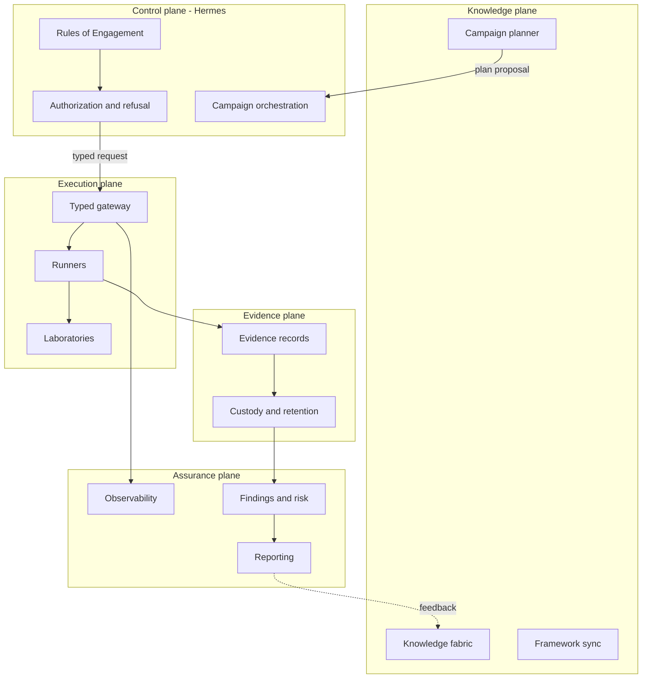

## 6. Trust boundaries

| Boundary | Between | Crossing rule |
| --- | --- | --- |
| TB0 | Operator and control plane | Authenticated human decision; no automation may self-authorize |
| TB1 | Control plane and execution plane | Only typed requests bound to an active authorization contract |
| TB2 | Execution plane and laboratory | One network per lab, default-deny egress, no host resources |
| TB3 | Execution plane and evidence plane | Append-only evidence writes with content hashes |
| TB4 | Evidence plane and publication | Classification and redaction enforced before any export |

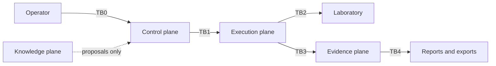

## 7. Trust model and intrusiveness levels — `INTENT/PLANNED`

| Level | Meaning | Minimum requirements |
| --- | --- | --- |
| L0 | Passive, read-only observation | Active contract |
| L1 | Non-intrusive interaction | Active contract, target in scope |
| L2 | Intrusive but non-destructive | Named approver, evidence capture |
| L3 | Potentially disruptive | Named approver, rollback plan, monitoring window |
| L4 | Destructive or high impact | Dual approval, rehearsed rollback, kill switch verified |

Rules: the effective ceiling is the intersection of capability level, contract ceiling and
runtime profile. A step above the ceiling is refused deterministically with a reason code.
The kill switch is effective in every active campaign state.

## 8. End-to-end campaign — `INTENT/PLANNED`

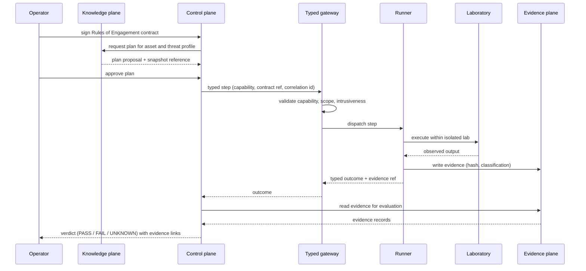

`UNKNOWN` is produced whenever evidence is missing, unreadable or insufficient.

## 9. State machines — `INTENT/PLANNED`

### 9.1 Campaign

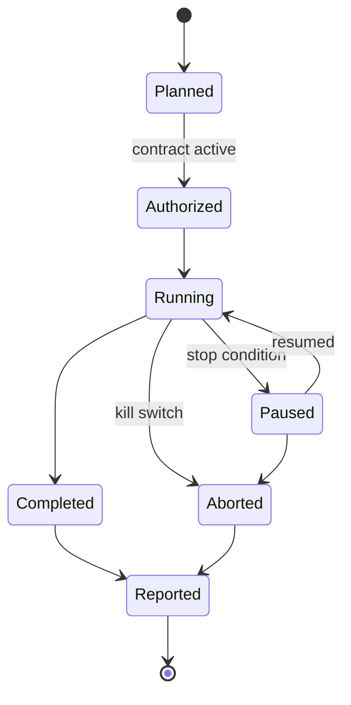

### 9.2 Laboratory lifecycle

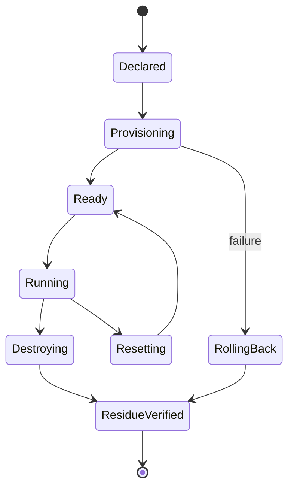

Every terminal transition emits a residue proof. Failure to prove zero residue is a failure,
not a warning.

## 10. Factories and continuous evolution — `INTENT/PLANNED`

Four content factories share one promotion lifecycle. They are cross-cutting concepts, not
numbered epics.

| Factory | Produces | Promotion gate |
| --- | --- | --- |
| Runbook Factory | Validation content candidates | Reproducibility evidence + human review |
| Lab Factory | Laboratory definitions and variants | Deterministic reset + zero-residue proof |
| Runtime / Image Factory | Execution images and capability layers | Provenance, SBOM, signature verification |
| Detection Validation Factory | Detection expectations and outcomes | Independent defensive telemetry |

### 10.1 Laboratory variants

Each laboratory family may exist in three declared variants so that both detection and
remediation can be validated:

| Variant | Purpose |
| --- | --- |
| `vulnerable` | The weakness is present and reachable |
| `mitigated` | A compensating control is in place; the weakness remains |
| `fixed` | The weakness is removed |

A validation content item is considered reproducible only when it distinguishes the
`vulnerable` variant from the `fixed` variant deterministically.

### 10.2 Continuous learning from campaigns

Campaign outcomes feed back into coverage analysis, knowledge confidence and detection
expectations. Feedback never mutates accepted content automatically; it produces proposals.

## 11. Knowledge fabric — `INTENT/PLANNED`

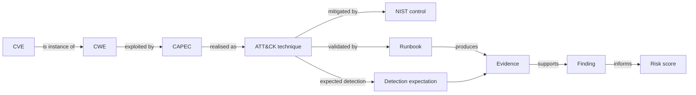

Every edge carries source, ingestion version and confidence. Campaign planning consumes a
pinned snapshot so historical campaigns remain reproducible.

## 12. Threat intelligence and defensive validation — `INTENT/PLANNED`

Threat profiles select techniques; the attack graph records validated preconditions and
outcomes; detection expectations turn each execution into a purple-team datapoint recorded as
prevented, detected, alerted, missed or unknown. Absent defensive telemetry yields `UNKNOWN`,
never `missed`.

## 13. Domain expansion — `FUTURE/DEPENDENT`

Kubernetes, identity, cloud, mobile, IoT/OT and AI/agentic runtimes reuse the same lab
contract, capability registry and evidence plane. None is schedulable before the runtime
foundation and the capability registry exist.

## 14. Mapping 45 → 21

The full table lives in the [epic catalogue](../roadmap/epic-catalogue-45.md#5-mapping-45--21).
The diagrams below are split by pillar group for legibility.

### 14.1 Pillars A–B — governance and runtime foundation

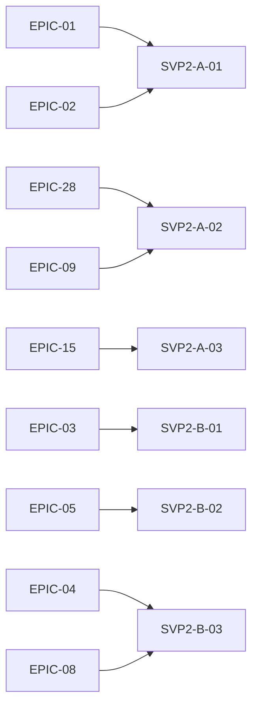

### 14.2 Pillars C–D — factory, evidence and assurance

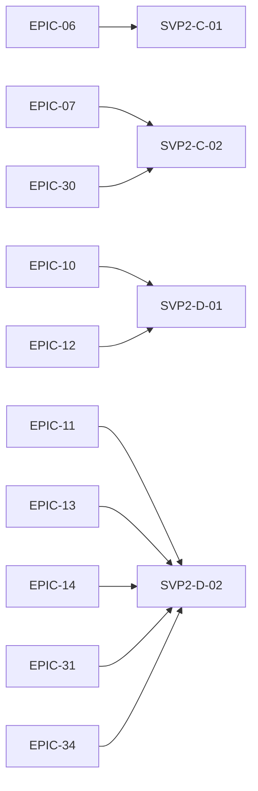

### 14.3 Pillar E — knowledge fabric

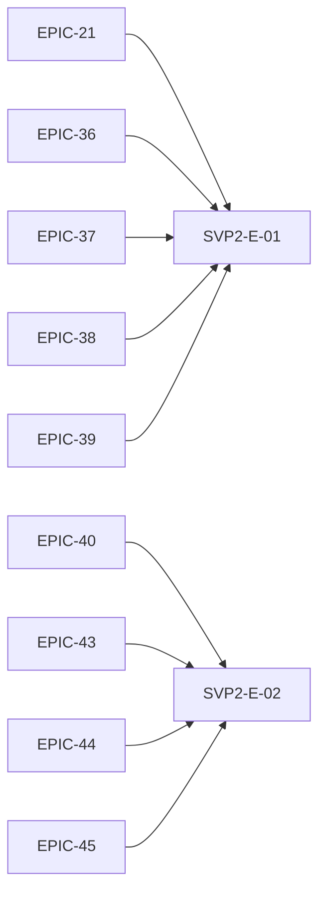

### 14.4 Pillars F–H — threat-informed and vulnerability-specific validation

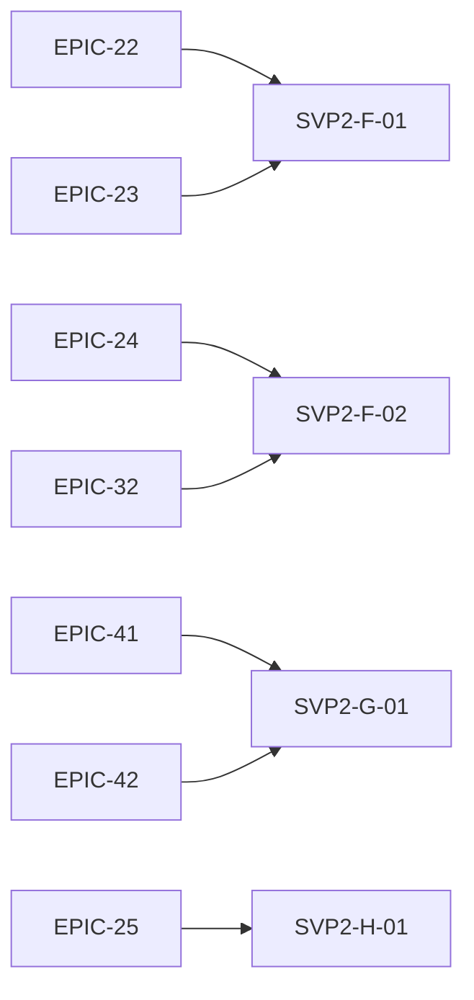

### 14.5 Pillars J–L — risk, extensibility and expansion

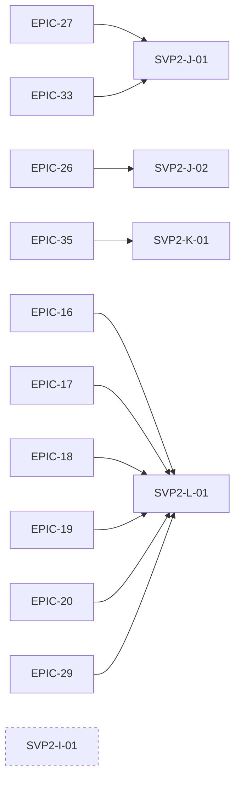

`SVP2-I-01` has no dedicated concept epic; lab factory concerns are distributed. This gap is
recorded in the [catalogue divergences](../roadmap/epic-catalogue-45.md#2-divergences-between-the-discussion-and-the-current-yaml).

## 15. Roadmap phases and dependencies

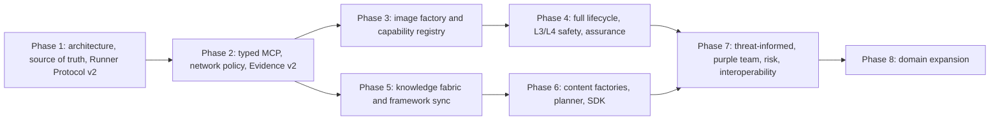

Phase 0 in the delivery backlog is a hygiene reference phase with no concept epic assigned.

## 16. Documentation lifecycle

Every concept epic document moves through four states. The contract is defined in
[architecture-documentation-lifecycle.md](architecture-documentation-lifecycle.md).

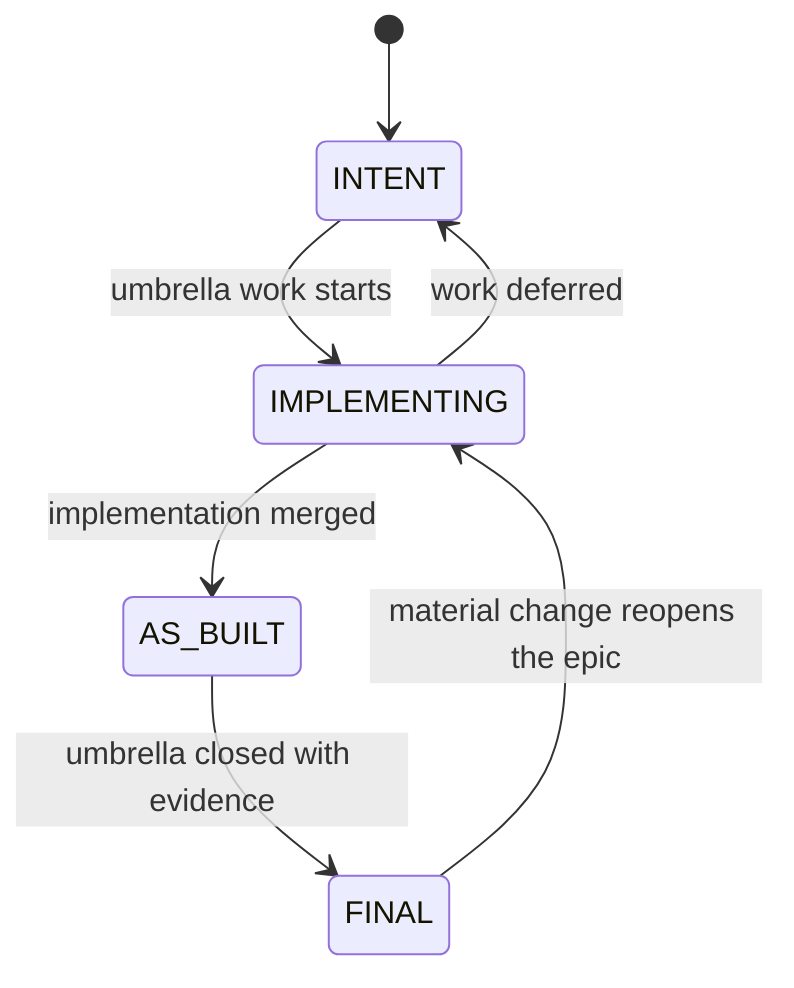

## 17. Boundaries and prohibitions

- No target outside registered laboratories.
- No offensive instruction, payload or exploit code in documentation.
- No credential, token, cookie or private key in documentation, telemetry or evidence.
- No claim of certification or formal compliance with any framework.
- No functional implementation is delivered by this document.

## 18. Related documents

- [Epic catalogue — 45 concept epics](../roadmap/epic-catalogue-45.md)
- [Architecture documentation lifecycle](architecture-documentation-lifecycle.md)
- [Roadmap SVP v2](../roadmap/security-validation-platform-v2.md)
- [Reference architecture](security-validation-reference-architecture.md)
- [Framework crosswalk](framework-crosswalk.md)
- [Security knowledge fabric](security-knowledge-fabric.md)
- [Continuous content factories](continuous-content-factories.md)
- [Backlog README](../../roadmap/README.md)
