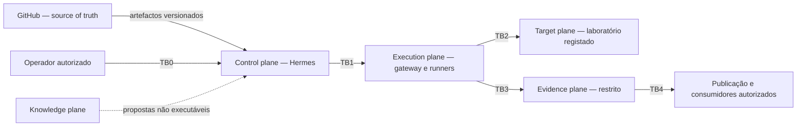
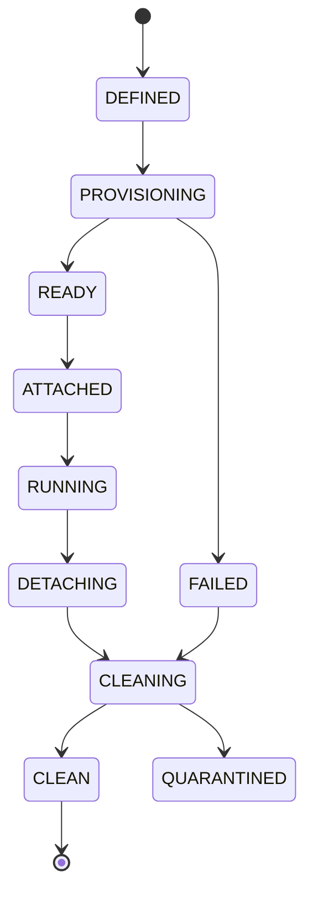
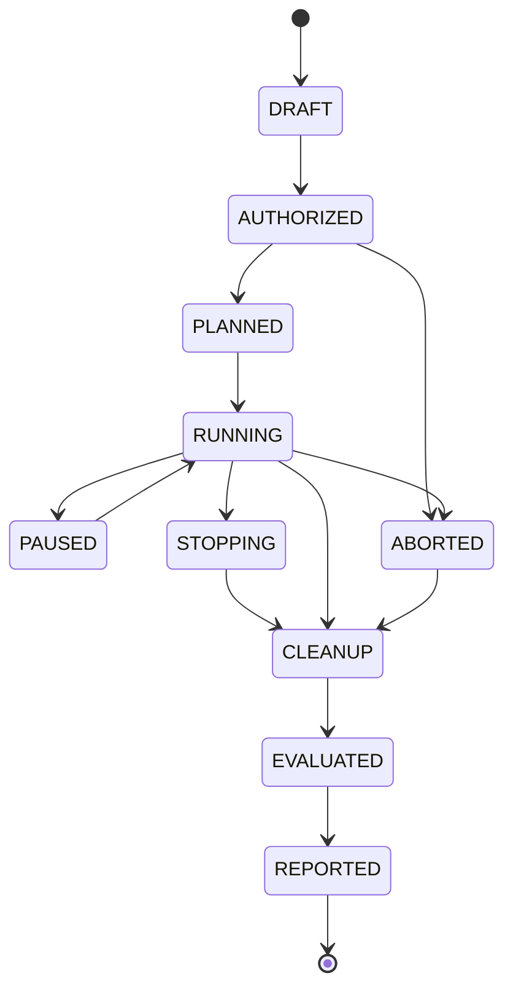

# Security Validation Reference Architecture

> Arquitetura de referência alvo para a Threat-Informed Continuous Security Validation
> Platform. Documento descritivo; não contém procedimentos ofensivos executáveis.
> Salvo indicação explícita em contrário, os contratos desta arquitetura permanecem
> **roadmap** e não constituem prova de enforcement no runtime atual.

## 1. Contextos e trust boundaries canónicas

A numeração canónica descreve **travessias entre domínios de confiança**, não nomes de
componentes. Esta decisão está registada em
[ADR-0002](adr/ADR-0002-canonical-trust-boundary-numbering.md).

GitHub é o contexto de source of truth versionado. A integridade entre GitHub e o estado
aplicado é validada por commit, deployment tracking e drift detection, mas GitHub não recebe
um identificador `TB*` porque o modelo TB0–TB4 identifica as travessias operacionais de
identidade, autoridade, execução e evidência.

### 1.1 Contrato das fronteiras

| Boundary | Entre | Responsabilidades | Proibições | Contrato de travessia | Falha segura |
| --- | --- | --- | --- | --- | --- |
| `TB0` | operador ↔ control plane | autenticar o operador, registar decisão humana, limitar âmbito, janela e nível autorizado | automação autoautorizar-se; identidade implícita; aprovação fora de validade | decisão autenticada e referência de autorização/RoE | sem identidade, aprovação ou contrato ativo, o planeamento executável é recusado |
| `TB1` | control plane ↔ execution plane | Hermes autoriza e envia pedidos tipados; o gateway valida contrato, capacidade e compatibilidade | o executor criar ou ampliar autorização; aceitar comando genérico no perfil normal; execução parcial após erro de schema | referência de autorização + pedido/resposta de execução tipados | contrato ausente, expirado, incompatível ou fora de âmbito é recusado antes do dispatch |
| `TB2` | execution plane ↔ target/laboratório | resolver o alvo para um laboratório registado, aplicar rede dedicada, limites e lifecycle | alvo externo ou não registado; host network; Docker socket; acesso a recursos não pertencentes ao laboratório | contrato de target, runtime, rede e lifecycle | alvo, rede ou estado não verificável impede a execução; cleanup sem prova bloqueia reutilização |
| `TB3` | execution plane ↔ evidence plane | emitir registos classificados, correlacionados, íntegros e ligados ao resultado observado | substituir evidência por verdict; omitir erro técnico; persistir segredo em metadata | envelope de evidência com IDs, classificação, proveniência e hash | evidência ausente, inválida ou incompleta produz resultado inconclusivo, nunca `PASS` |
| `TB4` | evidence plane ↔ publicação/consumidores | derivar conteúdo sanitizado, aplicar classificação, redaction e autorização de acesso | publicar evidência raw; remover limitações; expor tokens, cookies, chaves ou dados desnecessários | pedido de publicação + derivação sanitizada e rastreável | falha de classificação ou redaction bloqueia a publicação |

### 1.2 Invariantes transversais

- conhecimento propõe, Hermes autoriza, runtimes executam e evidência atesta;
- uma restrição downstream pode reduzir, mas nunca ampliar, a autorização ativa;
- ausência de prova, erro ou timeout nunca produz sucesso de segurança;
- contratos e decisões são versionados e têm um owner explícito;
- a publicação usa apenas derivações sanitizadas;
- nenhum caminho implícito permite alvos fora de laboratórios registados.

O inventário canónico de contratos está em
[`contracts/README.md`](contracts/README.md). O registo de decisões está em
[`adr/README.md`](adr/README.md).

## 2. Hermes como control plane

Responsabilidades: identidade e autorização, tradução de Rules of Engagement para
restrições executáveis, planeamento de campanha, máquina de estados, avaliação
fail-safe, correlação de evidência, gestão de findings e reporting.

Hermes não mantém ferramentas ofensivas, não constrói imagens e não guarda evidência
bruta fora do evidence root. Conforme
[ADR-0001](adr/ADR-0001-plane-separation-and-authorization-authority.md), é a única
autoridade que pode criar autorização de execução. Componentes downstream podem recusar ou
restringir, mas não ampliar essa autorização.

## 3. Typed Security Execution Gateway / Kali MCP

Alvo **roadmap** que substitui a superfície genérica de comando por operações tipadas:

- cada operação declara nome, versão, parâmetros validados por schema, nível de
  intrusividade, capacidades exigidas e classes de evidência produzidas;
- pedidos fora do schema são recusados com erro normalizado, sem execução parcial;
- `execute_command` deixa de existir no perfil normal; uma eventual exceção de
  diagnóstico exige perfil, política e auditoria próprios;
- o gateway valida autorização, janela temporal, âmbito de alvo e budget antes de
  encaminhar para o runner.

A decisão de contrato está em
[ADR-0003](adr/ADR-0003-typed-contracts-over-generic-execution.md). O runtime atual não
deve ser descrito como se este enforcement já estivesse implementado.

## 4. Runner Protocol v2

Protocolo comum **roadmap** a runners API, DevSecOps e AI/MCP, e a futuros domínios.

Elementos obrigatórios:

- **Identidade**: `runner_id`, versão, capacidades declaradas e compatibilidade de
  protocolo.
- **Correlation IDs**: `campaign_id`, `run_id`, `step_id`, `attempt_id` propagados em
  todos os registos e evidências.
- **Idempotency**: chave de idempotência por passo; repetição não duplica efeitos.
- **Cancellation**: cancelamento cooperativo com prazo e escalonamento determinístico.
- **Retries**: apenas em erros classificados como transitórios, com limite e backoff.
- **Timeout budgets**: orçamento por passo e por campanha, com propagação descendente.
- **Normalized errors**: taxonomia estável (`INVALID_REQUEST`, `UNAUTHORIZED`,
  `CAPABILITY_MISSING`, `TARGET_UNREACHABLE`, `TIMEOUT`, `CANCELLED`,
  `RUNTIME_ERROR`, `EVIDENCE_ERROR`), com detalhe estruturado e sem segredos.
- **Streaming de progresso** opcional, mas sempre com resultado final tipado.

## 5. Image and runtime factory

Capacidade **roadmap**:

- base runtime mínima, non-root, com paths graváveis explicitamente formalizados;
- runners persistentes instalados em `/opt/hermes/runners` com proveniência registada;
- perfis de capacidade construídos por composição, não por imagem monolítica;
- ferramentas pesadas e browser em camadas separadas;
- SBOM, assinatura, SLSA provenance e scanning como condição de promoção;
- promoção `development → candidate → stable`, com revocation e quarentena.

A proveniência e o source of truth seguem
[ADR-0006](adr/ADR-0006-versioned-source-of-truth-and-provenance.md).

## 6. Lab lifecycle

Estados alvo: `DEFINED → PROVISIONING → READY → ATTACHED → RUNNING → DETACHING → CLEANING → CLEAN`
com ramos `FAILED` e `QUARANTINED`.

Garantias alvo: transações com compensação em falha; uma única rede por laboratório;
attach/detach decididos por estado real observado e não por suposição; cleanup
idempotente com prova de zero resíduo (containers, redes, volumes, ficheiros
temporários); detetor de órfãos e reconciliação explícita.

A postura base está em
[ADR-0005](adr/ADR-0005-isolation-by-default.md). O lifecycle transacional completo
pertence a `EPIC-04` e não é declarado como entregue por este documento.

## 7. Network e egress profiles

Perfis alvo, nomeados e versionados: `isolated` (sem egress), `lab-only` (apenas rede do
laboratório), `curated-egress` (destinos permitidos explicitamente) e `external`
(apenas com autorização adicional e janela temporal). O default é `isolated`.

Uma exceção não altera o default: exige contrato explícito, justificação, duração limitada,
owner e evidência de cleanup.

## 8. Knowledge fabric (resumo)

O grafo de conhecimento fornece contexto ao planeamento e é congelado por campanha
através de snapshots versionados. Produz propostas não executáveis; não cria autorização.
Detalhe em [`security-knowledge-fabric.md`](security-knowledge-fabric.md).

## 9. Content factories (resumo)

Geração contínua de propostas de runbooks, labs, runtimes, imagens e deteções, com
promoção humana controlada. Detalhe em
[`continuous-content-factories.md`](continuous-content-factories.md) e
[ADR-0008](adr/ADR-0008-human-controlled-content-promotion.md).

## 10. Evidence, evaluation, risk e reporting

- **Evidence Plane v2 — roadmap**: raiz única, cadeia de custódia, hashes, retenção,
  deduplicação, export e replay.
- **Classificação**: `raw`, `restricted`, `sanitized` e `summary`, conforme
  [ADR-0007](adr/ADR-0007-evidence-classification-and-publication.md).
- **Evaluation**: fail-safe; qualquer ausência, erro ou incoerência resulta em
  `INCONCLUSIVE` e nunca em sucesso, conforme
  [ADR-0004](adr/ADR-0004-fail-safe-evaluation.md).
- **Risk — roadmap**: composição auditável de CVSS 4.0, EPSS, KEV, criticidade do
  ativo, alcançabilidade, importância no attack path, relevância de ameaça, controlos
  compensatórios, detetabilidade e custo de remediação, mantendo componentes separados.
- **Reporting**: derivado de evidência sanitizada, com proveniência e limitações.

## 11. Níveis de intrusividade L0-L4

Modelo **roadmap**, ainda não implementado como política executável:

| Nível | Descrição | Requisitos alvo |
| --- | --- | --- |
| L0 | passivo, apenas leitura de conhecimento e configuração | autorização base |
| L1 | observação ativa não intrusiva | âmbito e janela |
| L2 | testes ativos sem alteração persistente do alvo | âmbito, janela, budget |
| L3 | testes que alteram estado reversível | snapshot, rollback, TTL de sessão |
| L4 | ações de alto impacto ou emulação avançada | dual approval, kill switch, data budget |

## 12. Campaign state machine

Máquina de estados alvo:

Stop conditions e kill switch atuam em qualquer estado ativo e forçam `STOPPING`.

## 13. Autorização e Rules of Engagement as Code

Contrato alvo, versionado e assinado, que declara: âmbito de alvos, exclusões, janelas
temporais, nível máximo de intrusividade, limites de dados, condições de paragem,
aprovadores, kill switch e requisitos de dual approval para L4. O planeamento recusa
qualquer passo não coberto pelo contrato ativo.

A especificação e implementação pertencem a `EPIC-28` / `SVP2-A-02`; esta arquitetura
apenas fixa a autoridade e a relação contratual.

## 14. Rollback e cleanup

Rollback usa snapshots quando o nível de intrusividade os exige. Cleanup é sempre
idempotente e produz prova verificável. Falha de cleanup coloca o laboratório em
`QUARANTINED` e bloqueia reutilização até reconciliação manual.

## 15. Decision and contract traceability

| Tema | Decisão canónica | Contrato / owner futuro |
| --- | --- | --- |
| separação de responsabilidades | ADR-0001 | control plane e contratos cross-plane |
| numeração TB0–TB4 | ADR-0002 | tabela da secção 1 |
| execução tipada | ADR-0003 | `EPIC-03` |
| avaliação fail-safe | ADR-0004 | evaluators e Evidence Plane |
| isolamento | ADR-0005 | `EPIC-04`, `EPIC-08` |
| source of truth e proveniência | ADR-0006 | `EPIC-02`, image/capability factory |
| classificação/publicação de evidência | ADR-0007 | `EPIC-10`, `EPIC-12` |
| promoção de conteúdo | ADR-0008 | content factories |

Ver o [ADR index](adr/README.md) e o
[canonical contract inventory](contracts/README.md) para a rastreabilidade completa.
