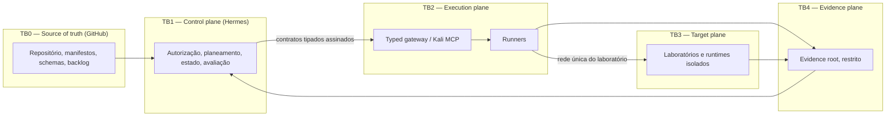
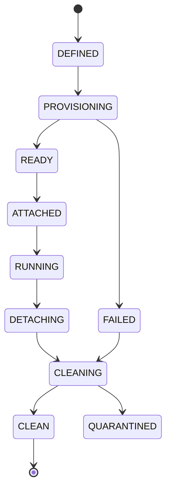
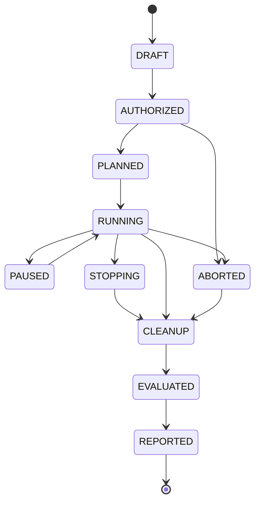

# Security Validation Reference Architecture

> Arquitetura de referência alvo para a Threat-Informed Continuous Security Validation
> Platform. Documento descritivo; não contém procedimentos ofensivos executáveis.

## 1. Trust boundaries

Regras de fronteira:

- TB1 nunca executa ferramentas ofensivas diretamente.
- TB2 nunca decide autorização; apenas valida e recusa pedidos fora de contrato.
- TB3 não tem egress por omissão e não é exposto na LAN.
- TB4 é append-only por execução; a leitura bruta é restrita e a partilha é sanitizada.

## 2. Hermes como control plane

Responsabilidades: identidade e autorização, tradução de Rules of Engagement para
restrições executáveis, planeamento de campanha, máquina de estados, avaliação
fail-safe, correlação de evidência, gestão de findings e reporting.

Hermes não mantém ferramentas ofensivas, não constrói imagens e não guarda evidência
bruta fora do evidence root.

## 3. Typed Security Execution Gateway / Kali MCP

Substitui a superfície genérica de comando por operações tipadas:

- cada operação declara nome, versão, parâmetros validados por schema, nível de
  intrusividade, capacidades exigidas e classes de evidência produzidas;
- pedidos fora do schema são recusados com erro normalizado, sem execução parcial;
- `execute_command` deixa de existir no perfil normal; quando existir num perfil de
  investigação, é restrito por política aplicada no gateway e sempre auditado;
- o gateway valida autorização, janela temporal, âmbito de alvo e budget antes de
  encaminhar para o runner.

## 4. Runner Protocol v2

Protocolo comum a runners API, DevSecOps e AI/MCP, e a futuros domínios.

Elementos obrigatórios:

- **Identidade**: `runner_id`, versão, capacidades declaradas e compatibilidade de
  protocolo.
- **Correlation IDs**: `campaign_id`, `run_id`, `step_id`, `attempt_id` propagados em
  todos os registos e evidências.
- **Idempotency**: chave de idempotência por passo; repetição não duplica efeitos.
- **Cancellation**: cancelamento cooperativo com prazo e escalonamento determinístico.
- **Retries**: apenas em erros classificados como transitórios, com limite e backoff.
- **Timeout budgets**: orçamento por passo e por campanha, com propagação descendente.
- **Normalized errors**: taxonomia estável (`INVALID_REQUEST`, `UNAUTHORIZED`,
  `CAPABILITY_MISSING`, `TARGET_UNREACHABLE`, `TIMEOUT`, `CANCELLED`,
  `RUNTIME_ERROR`, `EVIDENCE_ERROR`), com detalhe estruturado e sem segredos.
- **Streaming de progresso** opcional, mas sempre com resultado final tipado.

## 5. Image and runtime factory

- base runtime mínima, non-root, com paths graváveis explicitamente formalizados;
- runners persistentes instalados em `/opt/hermes/runners` com proveniência registada;
- perfis de capacidade construídos por composição, não por imagem monolítica;
- ferramentas pesadas e browser em camadas separadas;
- SBOM, assinatura, SLSA provenance e scanning como condição de promoção;
- promoção `development → candidate → stable`, com revocation e quarentena.

## 6. Lab lifecycle

Estados: `DEFINED → PROVISIONING → READY → ATTACHED → RUNNING → DETACHING → CLEANING → CLEAN`
com ramos `FAILED` e `QUARANTINED`.

Garantias: transações com compensação em falha; uma única rede por laboratório;
attach/detach decididos por estado real observado e não por suposição; cleanup
idempotente com prova de zero resíduo (containers, redes, volumes, ficheiros
temporários); detetor de órfãos periódico e reconciliação explícita.

## 7. Network e egress profiles

Perfis nomeados e versionados: `isolated` (sem egress), `lab-only` (apenas rede do
laboratório), `curated-egress` (destinos permitidos explicitamente) e `external`
(apenas com autorização adicional e janela temporal). O default é `isolated`.

## 8. Knowledge fabric (resumo)

O grafo de conhecimento fornece contexto ao planeamento e é congelado por campanha
através de snapshots versionados. Detalhe em
[`security-knowledge-fabric.md`](security-knowledge-fabric.md).

## 9. Content factories (resumo)

Geração contínua de propostas de runbooks, labs, runtimes, imagens e deteções, com
promoção controlada. Detalhe em
[`continuous-content-factories.md`](continuous-content-factories.md).

## 10. Evidence, evaluation, risk e reporting

- **Evidence Plane v2**: raiz única, cadeia de custódia, hashes, retenção,
  deduplicação, export e replay.
- **Evaluation**: fail-safe; qualquer ausência, erro ou incoerência resulta em
  `INCONCLUSIVE` e nunca em sucesso.
- **Risk**: composição auditável de CVSS 4.0, EPSS, KEV, criticidade do ativo,
  alcançabilidade, importância no attack path, relevância de ameaça, controlos
  compensatórios, detetabilidade e custo de remediação, com componentes separados.
- **Reporting**: derivado de evidência sanitizada, com proveniência e limitações.

## 11. Níveis de intrusividade L0-L4

| Nível | Descrição | Requisitos |
| --- | --- | --- |
| L0 | Passivo, apenas leitura de conhecimento e configuração | Autorização base |
| L1 | Observação ativa não intrusiva | Âmbito e janela |
| L2 | Testes ativos sem alteração de estado do alvo | Âmbito, janela, budget |
| L3 | Testes que alteram estado reversível | Snapshot, rollback, TTL de sessão |
| L4 | Ações de alto impacto ou emulação avançada | Dual approval, kill switch, data budget |

## 12. Campaign state machine

Stop conditions e kill switch atuam em qualquer estado ativo e forçam `STOPPING`.

## 13. Autorização e Rules of Engagement as Code

Contrato versionado e assinado que declara: âmbito de alvos, exclusões, janelas
temporais, nível máximo de intrusividade, limites de dados, condições de paragem,
aprovadores, kill switch e requisitos de dual approval para L4. O planeamento recusa
qualquer passo não coberto pelo contrato ativo.

## 14. Rollback e cleanup

Rollback usa snapshots quando o nível de intrusividade os exige. Cleanup é sempre
idempotente e produz prova verificável. Falha de cleanup coloca o laboratório em
`QUARANTINED` e bloqueia reutilização até reconciliação manual.
