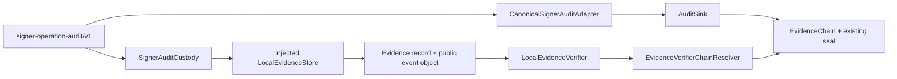

# Signer Audit EvidenceVerifier Linkage

Status: **MVP / provider-neutral**  
Change: `CHG-HSL-076`  
Tracking: issue `#410`  
Related human decision gate: issue `#403`

## Decision

Persist the already-public `signer-operation-audit/v1` event through the existing Evidence Plane store, verify its exact content with the existing `LocalEvidenceVerifier`, and bind that same content-addressed object into the existing `AuditSink` / `EvidenceChain` through a thin interface adapter.

No second datastore, verifier, evidence chain, seal or ledger is introduced.

## Known facts

- CHG-HSL-075 already produces a deterministic public signer audit event whose raw payload, raw signature/base64, private key, credentials, tokens and secrets are excluded by contract.
- `LocalEvidenceStore` is the canonical LAB_L1 content-addressed local custody implementation.
- `LocalEvidenceVerifier.verify(evidence_ref, sha256)` is the canonical LAB_L1 EvidenceVerifier contract over that store.
- `EvidenceChain.verify(resolver=...)` expects a callable resolver with `object_ref`, `object_digest_sha256` and `object_size_bytes` arguments.
- `AuditSink` reuses the existing EvidenceChain and seal primitives and does not own persistence.
- Issue #403 remains the separate human/provider custody decision gate.

## Canonical flow



## Identifier and digest binding

Three related references are deliberately kept distinct:

1. The Evidence Plane record has a canonical evidence id `ev_<32hex>` and may be addressed publicly as `evidence://ev_<32hex>`.
2. `EvidenceChain.evidence_ref` stores the raw `ev_<32hex>` id because that is the frozen chain schema.
3. The Evidence Plane `storage_ref` and the signer AuditSink `object_ref` are the same content address:

```text
evidence://signer-operation/<signer-audit-payload-sha256>
```

The chain's `object_digest_sha256` is the same SHA-256 digest stored in the Evidence Plane record. This lets the existing `LocalEvidenceVerifier` resolve the storage reference and prove that the stored object is intact and has exactly the expected digest.

## EvidenceVerifierChainResolver

`EvidenceVerifierChainResolver` is an interface adapter only. It does not implement evidence verification and does not read or write any evidence itself.

It translates:

```text
EvidenceChain resolver(object_ref, object_digest_sha256, object_size_bytes)
```

into:

```text
LocalEvidenceVerifier.verify(object_ref, object_digest_sha256)
```

`object_size_bytes` remains sealed and integrity-bound by the existing EvidenceChain contract; it is not part of the existing two-argument EvidenceVerifier contract.

Any malformed input, verifier exception, unresolved reference, digest mismatch or tamper causes fail-closed verification.

## Custody policy

The repository policy is intentionally locked to:

```text
state = DISABLED
default = deny
runtime_status = NOT_RUN
execution_authority = none
classification = restricted
include_original_signing_payload = false
include_raw_signature = false
```

Tests may create an `ENABLED` copy of the policy only against a disposable `tmp_path` store to prove the contract. That does not enable runtime custody in Hermes.

## What this proves

When the test composition verifies successfully, it proves:

- the public signer audit event is persisted content-addressably in the existing LAB_L1 Evidence Plane;
- the stored object passes `LocalEvidenceStore` integrity verification;
- `LocalEvidenceVerifier` binds the exact reference to the exact SHA-256 digest;
- the same object reference/digest is bound into the existing AuditSink/EvidenceChain;
- the existing chain/seal detects missing objects, mismatches and tampering when the resolver is supplied.

## What this does not prove

CHG-HSL-076 does **not** prove:

- real external signer/provider operation;
- non-exportable private-key custody;
- external signer authenticity;
- operational trust-store installation or SPKI trust binding;
- rotation/revocation lifecycle;
- provider durability/WORM controls;
- authenticated receipt delivery;
- complete PRE_PROMOTION evidence;
- HITL approval;
- Runner or target execution;
- LAB_L1 promotion eligibility.

The LAB_L1 seal remains an integrity/tamper-evidence control only; authenticity and durability remain separate properties.

## Authority invariants

This change preserves:

```text
human decision = NO_DECISION
supplier/provider selection = NO_SELECTION
promotion_allowed = false
runtime_status = NOT_RUN
execution_authority = NONE
trust installation = NONE
key provisioning = NONE
Runner effect = NOT_RUN
```

## Alternatives considered

### A. Reuse Evidence Plane + LocalEvidenceVerifier + thin resolver — selected

Smallest change, reuses all canonical integrity primitives, maintains one source of truth and remains provider-neutral.

### B. Teach EvidenceChain about `LocalEvidenceVerifier` directly — rejected

Would couple the generic chain to a local storage implementation and weaken its pluggable resolver boundary.

### C. Create a signer-specific verifier — rejected

Would duplicate evidence verification and create competing integrity semantics.

### D. Create a second signer custody store or ledger — rejected

Would duplicate content addressing, retention and integrity controls and introduce reconciliation risk.

## Phasing

### MVP — CHG-HSL-076

- disabled signer audit custody policy;
- exact public-event projection into injected Evidence Plane store;
- content-addressed storage reference;
- canonical `LocalEvidenceVerifier` proof;
- thin EvidenceVerifier-to-EvidenceChain resolver;
- AuditSink/EvidenceChain linkage;
- fail-closed tamper, mismatch, replay and backend tests.

### After issue #403 and separate operational approvals

- observe real provider audit records;
- bind real signer/provider evidence to the same public model;
- verify operational trust and custody evidence independently.

### Future / production

- durable/WORM custody;
- tenant/campaign persistence isolation;
- SIEM/retention export;
- provider lifecycle, rotation and revocation evidence.
