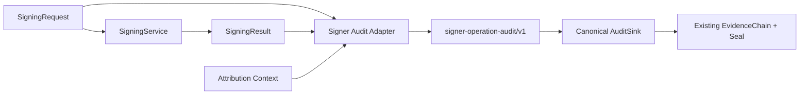

# Signer Operation Audit Attribution

Status: **MVP / provider-neutral**  
Change: `CHG-HSL-075`  
Tracking: issue `#409`  
Related decision gate: issue `#403`

## Decision

Use a dedicated signer-operation audit adapter that translates one signing operation into a closed public `signer-operation-audit/v1` record and appends that record to the existing canonical LAB_L1 `AuditSink` / evidence chain.

The adapter does **not** implement another ledger, evidence chain, seal, datastore or delivery path.

## Known facts

- `platform/assurance/signing_service.py` already defines the provider-neutral `SigningRequest` / `SigningResult` boundary.
- `platform/evidence-plane/audit_sink.py` is the canonical append-only, hash-linked LAB_L1 audit sink.
- `platform/runner-transport/audit_adapter.py` already establishes the repository pattern of translating domain-specific audit decisions into the canonical `AuditSink` without duplicating chain/seal logic.
- Issue `#403` remains the separate human/governance gate for operational custody/provider selection and evidence.

## Event boundary

`signer-operation-audit/v1` contains only public/digest metadata:

- operation `SIGN`;
- request SHA-256 digest;
- canonical purpose/domain;
- request correlation ID;
- SHA-256 of decoded public signature bytes;
- public key identifier;
- algorithm;
- public SPKI SHA-256;
- signer class;
- authority label;
- signer audit/evidence reference;
- principal;
- opaque provider reference;
- explicit `test_only` classification;
- locked no-authority fields.

The event never contains the original payload, `signature_b64`, private key material, credentials, tokens or secrets.

## Canonical flow



## Fail-closed rules

The adapter rejects:

1. invalid canonical signing requests;
2. unsupported signer classes or algorithms;
3. malformed SPKI/signature digests;
4. malformed public audit references;
5. missing/unsafe principal or provider reference;
6. TEST signer results that are not explicitly classified `test_only=true`;
7. duplicate/replayed signer-operation audit events rejected by the canonical Audit Sink.

## Authority invariants

Every signer-operation audit event locks:

```text
promotion_allowed = false
runtime_status = NOT_RUN
execution_authority = NONE
```

CHG-HSL-075 does not change:

```text
human decision = NO_DECISION
supplier/provider selection = NO_SELECTION
trust installation = NONE
key provisioning = NONE
Runner effect = NOT_RUN
```

A successful audit append proves only that the public signer-operation metadata was content-addressed and included in the existing tamper-evident Audit Sink. It does not prove external custody, provider authenticity, R1-R8 compliance, trust binding, durability or promotion eligibility.

## Alternatives considered

### A. Dedicated adapter -> canonical AuditSink — selected

Advantages: small domain boundary, reuses the existing chain/seal implementation, independently testable, provider-neutral, no generic schema pollution.

### B. Extend generic AuditSink with signer-specific fields — rejected

Would couple a cross-cutting evidence primitive to signer-domain semantics and grow the canonical sink into a monolithic event model.

### C. Put attribution inside `SignatureEnvelope` / `SigningResult` — rejected

Would mix cryptographic result metadata with governance/audit context and make the signing boundary harder to reuse across providers and workflows.

### D. Create a second signer audit ledger — rejected

Would duplicate custody/integrity primitives and create reconciliation problems between competing audit chains.

## Phasing

### MVP — CHG-HSL-075

- closed public schema;
- deterministic content addressing;
- dedicated provider-neutral adapter;
- canonical AuditSink integration;
- replay/fail-closed tests;
- static guards against provider/runtime dependencies and secret/raw-material persistence.

### After issue #403 human/provider decision

- bind real provider audit evidence to the same public event model;
- demonstrate provider-side attribution of the corresponding signing operation;
- verify custody/lifecycle/trust requirements independently.

### Future / production

- durable/WORM custody;
- retention and SIEM export;
- tenant/campaign partitioning at the persistence boundary;
- operational provider lifecycle, rotation/revocation evidence and monitoring.
