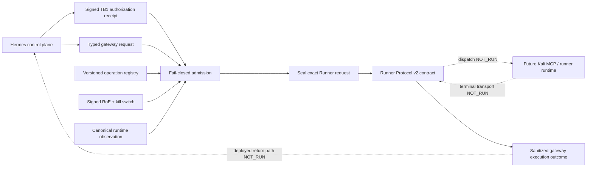

# EPIC-03 — Typed gateway contract candidate AS_BUILT

## 1. Record metadata

| Field | Value |
| --- | --- |
| Canonical concept epic | [`EPIC-03 — Typed Kali MCP`](epics/EPIC-03-typed-kali-mcp.md) |
| Delivery umbrella | `SVP2-B-01` — issue [#79](https://github.com/pestoura/hermes-security-labs/issues/79) |
| Master tracker | issue [#97](https://github.com/pestoura/hermes-security-labs/issues/97) |
| Initial typed-gateway PR | [#136](https://github.com/pestoura/hermes-security-labs/pull/136) |
| Subsequent implementation series | PRs `#160`–`#164` plus current typed-outcome block |
| Record state | `AS_BUILT — contract candidate` |
| Canonical epic lifecycle | `IMPLEMENTING` |
| FINAL | no |
| Runtime declaration | `NO_RUNTIME_CHANGE` |

This is a supplementary implementation record. The canonical concept epic is `IMPLEMENTING`; this record does not promote it to lifecycle `AS_BUILT` or `FINAL`. Those states still require deployed runtime evidence and umbrella acceptance.

## 2. Delivered repository boundary

The repository now contains a typed operation registry, versioned gateway/admission request contracts, deterministic fail-closed admission, signed authorization validation, Runner Protocol v2 request construction, UUID correlation v2 and a sanitized terminal outcome contract candidate.

The delivered repository candidates:

- declare every available operation by ID and semantic version;
- give each operation a parameter schema, intrusiveness level, required capabilities, side-effect class and production status;
- define explicit `normal` and `controlled` profiles;
- forbid generic execution and command-shaped inputs;
- revalidate signed RoE against a public-key trust store and external kill switch;
- consume a separately signed Hermes-issued TB1 authorization receipt and never mint execution authority in the gateway;
- bind authorization to campaign, run, step, RoE contract/request, operation/version, operation-parameter digest, capability, target digest and intrusiveness;
- consume the canonical runtime source of truth and refuse drift/unknown state;
- build a Runner Protocol v2 `runner.step.request` only after admission and authorization agree;
- require UUID campaign/run/step/attempt correlation at the Runner boundary and provide a versioned v2 gateway/admission contract without rewriting v1 identifiers;
- seal an exact built Runner request as immutable canonical JSON plus a full-envelope SHA-256 before terminal-outcome validation;
- validate a `runner.outcome` against the sealed request and derive a sanitized `gateway.execution.outcome` for the future gateway → Hermes TB1 path;
- exclude raw runner output, target/parameters, evidence URI and free-form error message/context from the control-plane outcome derivative;
- return stable decision/outcome codes without copying restricted payloads into log-safe metadata.

The candidates do not dispatch or execute any operation and do not prove runner identity or transport authenticity.

## 3. Current candidate architecture

## 4. Canonical components

| Component | Path | State |
| --- | --- | --- |
| Operation registry schema | [`operation-registry.schema.json`](../../platform/gateway-protocol/operation-registry.schema.json) | candidate |
| Legacy gateway request schema | [`gateway-request.schema.json`](../../platform/gateway-protocol/gateway-request.schema.json) | transitional compatibility |
| Gateway request v2 schema | [`gateway-request-v2.schema.json`](../../platform/gateway-protocol/gateway-request-v2.schema.json) | candidate |
| Admission request v2 schema | [`admission-request-v2.schema.json`](../../platform/gateway-protocol/admission-request-v2.schema.json) | candidate |
| Operation registry | [`operation-registry.yaml`](../../platform/gateway-protocol/operation-registry.yaml) | candidate |
| Decision implementation | [`gateway_protocol.py`](../../platform/gateway-protocol/gateway_protocol.py) | candidate |
| Canonical admission | [`admission.py`](../../platform/gateway-protocol/admission.py) | candidate |
| Gateway → Runner handoff | [`runner_handoff.py`](../../platform/gateway-protocol/runner_handoff.py) | candidate |
| Typed execution outcome schema | [`gateway-execution-outcome.schema.json`](../../platform/gateway-protocol/gateway-execution-outcome.schema.json) | candidate |
| Typed outcome derivation | [`outcome.py`](../../platform/gateway-protocol/outcome.py) | candidate |
| TB1 authorization contract | [`authorization-contract`](../../platform/authorization-contract/README.md) | candidate |
| Runner Protocol v2 | [`runner-protocol`](../../platform/runner-protocol/README.md) | repository contract / synthetic candidates |
| Technical boundary | [`README.md`](../../platform/gateway-protocol/README.md) | candidate documentation |
| Original gateway regression tests | [`test_gateway_protocol.py`](../../platform/tests/test_gateway_protocol.py) | validated |
| Canonical runtime root | [`platform/registry.yaml`](../../platform/registry.yaml) | reused |

## 5. Profile boundary

### Normal profile

The normal profile contains only explicit L0/L1 operations:

- `system.health.read`;
- `runtime.inventory.read`;
- `web.discovery.headers`;
- `web.discovery.tls`.

It does not expose generic command execution, shell, terminal, argv, cwd or environment fields.

### Controlled profile

The controlled profile may additionally reference candidate L2 operations, but only after schema, capability, RoE, authorization and runtime-source checks. Their handler integration and production execution remain `NOT_RUN`.

## 6. Fail-closed behaviour

A request or result is refused when, as applicable:

- the registry or request fails schema validation;
- the operation is unknown or its version differs;
- parameters do not match the operation schema;
- the profile does not allow the operation;
- required capability attestations are absent;
- signed RoE verification, validity, scope or kill-switch checks fail;
- the Hermes TB1 receipt is missing, malformed, expired, forged, wrong-purpose or mismatched;
- campaign, run, step, operation, target, parameter digest or intrusiveness bindings differ;
- runtime state is `DRIFT_DETECTED` or `UNKNOWN`;
- canonical or observed runtime digests differ;
- command, shell, argv, cwd, environment, secret or credential-shaped fields appear;
- Runner Protocol correlation is not UUID-compatible at the handoff;
- the sealed full Runner-request envelope is inconsistent with the logical handoff metadata;
- a terminal Runner Protocol result is malformed or its four-ID correlation differs from the sealed request;
- a sanitized gateway outcome would violate its strict schema.

No refusal path performs partial execution because no deployed dispatch path is part of this repository candidate.

## 7. Outcome confidentiality boundary

The future gateway → Hermes `gateway.execution.outcome` carries operational metadata only:

- campaign/run/step/attempt correlation;
- non-bearer authorization reference;
- idempotency key;
- logical request fingerprint and sealed full-request SHA-256;
- operation/capability identity;
- terminal status/timestamps;
- evidence ID/kind/classification/SHA-256;
- output-presence boolean;
- normalized error code/category/retryability.

It excludes raw `output`, target and parameters, evidence URI, error message and error safe context. The raw runner outcome is not hashed into the derivative because arbitrary output may contain sensitive low-entropy material. Raw artefact integrity and retention remain responsibilities of the future Evidence Plane.

## 8. Acceptance assessment

| Acceptance criterion | Result | Evidence |
| --- | --- | --- |
| No candidate operation is accepted without a declared schema | met in repository decision layer | registry/request tests |
| Normal profile exposes no arbitrary command | met in registry | semantic and adversarial tests |
| Canonical runtime drift blocks authorization | met in decision layer | tri-state and digest tests |
| Signed RoE/TB1 authorization mismatches fail closed | met in repository boundary | admission/authorization tests |
| Runner request preserves exact typed/correlation context | met in message-construction boundary | handoff tests |
| UUID v2 migration never manufactures identifiers | met in repository contract | correlation-v2 tests |
| Terminal result must match sealed request correlation | candidate implemented | typed-outcome tests |
| Raw Runner payload fields do not cross into Hermes derivative | candidate implemented | sanitization/adversarial tests |
| Kali MCP receives only validated typed dispatch | `NOT_RUN` | handler integration absent |
| Generic command removed from deployed normal profile | `NOT_RUN` | no deployment change made |
| Deployed runtime drift blocks actual execution | `NOT_RUN` | production observation absent |
| Real runner identity/transport is authenticated | `NOT_RUN` | deployment integration absent |

## 9. Preserved limitations

- Hermes operational receipt issuance: `NOT_IMPLEMENTED` / `NOT_RUN`;
- real runner identity/transport authentication: `NOT_IMPLEMENTED` / `NOT_RUN`;
- deployed gateway outcome reception: `NOT_RUN`;
- Kali MCP handler integration: `NOT_RUN`;
- gateway deployment: `NOT_RUN`;
- production runtime observation: `NOT_RUN`;
- actual removal of legacy generic surfaces from a deployed service: `NOT_RUN`;
- dispatch, cancellation and Evidence Plane binding: `NOT_RUN`;
- Evidence Plane runtime persistence: `NOT_RUN`;
- customer-target execution: `NOT_RUN`;
- runtime changes: `NO_RUNTIME_CHANGE`;
- umbrella #79 remains open;
- FINAL remains **no**.

## 10. Remaining work before FINAL

- map opaque handler references to reviewed Kali MCP adapters;
- enforce admission before every real dispatch;
- remove or quarantine legacy generic command surfaces in deployed profiles;
- implement authenticated runner transport/workload identity and real result reception;
- integrate Evidence Plane persistence, chain of custody and redaction;
- obtain read-only production runtime observations and prove drift blocking;
- execute positive, negative, adversarial, cancellation and rollback tests in an authorized isolated environment;
- perform controlled deployment and rollback validation.
