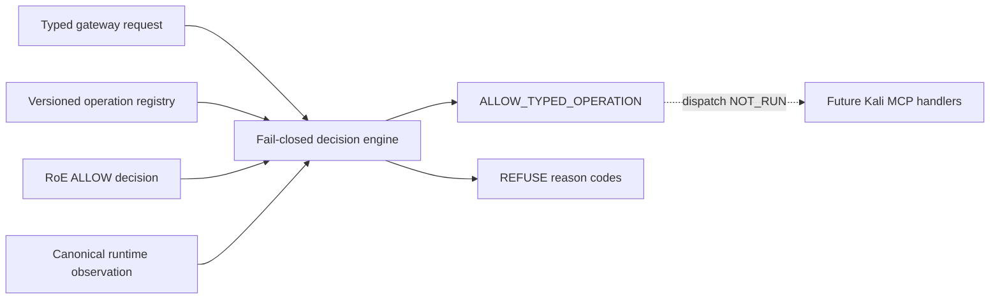

# EPIC-03 — Typed gateway contract candidate AS_BUILT

## 1. Record metadata

| Field | Value |
| --- | --- |
| Canonical concept epic | [`EPIC-03 — Typed Kali MCP`](epics/EPIC-03-typed-kali-mcp.md) |
| Delivery umbrella | `SVP2-B-01` — issue [#79](https://github.com/pestoura/hermes-security-labs/issues/79) |
| Master tracker | issue [#97](https://github.com/pestoura/hermes-security-labs/issues/97) |
| Technical PR | [#136](https://github.com/pestoura/hermes-security-labs/pull/136) |
| Technical merge | `134286ec16d3decc7505b8559fc3fa5215dae0ea` |
| Record state | `AS_BUILT — contract candidate` |
| FINAL | no |
| Runtime declaration | `NO_RUNTIME_CHANGE` |

This is a supplementary implementation record. The canonical concept epic remains an INTENT document as required by the 45-epic catalogue lifecycle.

## 2. Delivered boundary

The repository now contains a typed operation registry, a typed gateway request contract and a deterministic fail-closed decision layer.

The delivered candidate:

- declares every available operation by ID and semantic version;
- gives each operation a parameter schema, intrusiveness level, required capabilities, side-effect class and production status;
- defines explicit `normal` and `controlled` profiles;
- forbids generic execution and command-shaped inputs;
- binds an RoE ALLOW decision to campaign, operation and target digest;
- verifies capability attestations and RoE intrusiveness ceiling;
- consumes the canonical runtime source of truth;
- refuses `DRIFT_DETECTED`, `UNKNOWN`, canonical digest mismatch and observed digest mismatch;
- returns stable decision codes without copying raw targets, parameters or RoE payloads.

The candidate does not dispatch or execute any operation.

## 3. As-built architecture

## 4. Canonical components

| Component | Path | State |
| --- | --- | --- |
| Operation registry schema | [`operation-registry.schema.json`](../../platform/gateway-protocol/operation-registry.schema.json) | candidate |
| Gateway request schema | [`gateway-request.schema.json`](../../platform/gateway-protocol/gateway-request.schema.json) | candidate |
| Operation registry | [`operation-registry.yaml`](../../platform/gateway-protocol/operation-registry.yaml) | candidate |
| Decision implementation | [`gateway_protocol.py`](../../platform/gateway-protocol/gateway_protocol.py) | candidate |
| Technical boundary | [`README.md`](../../platform/gateway-protocol/README.md) | as built |
| Regression tests | [`test_gateway_protocol.py`](../../platform/tests/test_gateway_protocol.py) | validated |
| Canonical runtime root | [`platform/registry.yaml`](../../platform/registry.yaml) | reused |

## 5. Profile boundary

### Normal profile

The normal profile contains only explicit L0/L1 operations:

- `system.health.read`;
- `runtime.inventory.read`;
- `web.discovery.headers`;
- `web.discovery.tls`.

It does not expose generic command execution, shell, terminal, argv, cwd or environment fields.

### Controlled profile

The controlled profile may additionally reference candidate L2 operations, but only after schema, capability, RoE and runtime-source checks. Their handler integration and production execution remain `NOT_RUN`.

## 6. Fail-closed behaviour

A request is refused when:

- the registry or request fails schema validation;
- the operation is unknown or its version differs;
- parameters do not match the operation schema;
- the profile does not allow the operation;
- required capability attestations are absent;
- the RoE decision is not exactly ALLOW;
- campaign, operation or target digest does not match the RoE binding;
- operation intrusiveness exceeds the RoE ceiling;
- runtime state is `DRIFT_DETECTED` or `UNKNOWN`;
- canonical or observed runtime digests differ;
- command, shell, argv, cwd, environment, secret or credential-shaped fields appear.

No refusal path performs partial execution because the candidate has no dispatch path.

## 7. Acceptance assessment

| Acceptance criterion | Result | Evidence |
| --- | --- | --- |
| No candidate operation is accepted without a declared schema | met in decision layer | registry/request tests |
| Normal profile exposes no arbitrary command | met in registry | semantic and adversarial tests |
| Canonical runtime drift blocks authorization | met in decision layer | tri-state and digest tests |
| Every refusal has stable machine-readable codes | met | decision tests |
| Kali MCP receives only validated typed dispatch | `NOT_RUN` | handler integration absent |
| Generic command removed from deployed normal profile | `NOT_RUN` | no deployment change made |
| Deployed runtime drift blocks actual execution | `NOT_RUN` | production observation absent |

## 8. Evidence

| Evidence | Result |
| --- | --- |
| Local isolated gateway tests | 25 passed |
| PR #136 validate / repository | success |
| PR #136 validate / security | success |
| PR #136 security / gitleaks | success |
| Technical merge | `134286ec16d3decc7505b8559fc3fa5215dae0ea` |
| Post-merge validate `31134289659` | success |
| Post-merge security/gitleaks `31134289890` | success |

## 9. Preserved limitations

- Kali MCP handler integration: `NOT_RUN`;
- gateway deployment: `NOT_RUN`;
- production runtime observation: `NOT_RUN`;
- actual removal of legacy generic surfaces from a deployed service: `NOT_RUN`;
- dispatch, cancellation and Evidence Plane binding: `NOT_RUN`;
- customer-target execution: `NOT_RUN`;
- runtime changes: `NO_RUNTIME_CHANGE`;
- umbrella #79 remains open;
- FINAL remains **no**.

## 10. Remaining work before FINAL

- implement signed operation/capability publication and compatibility policy;
- map opaque handler references to reviewed Kali MCP adapters;
- enforce the decision before every real dispatch;
- remove or quarantine legacy generic command surfaces in deployed profiles;
- integrate Runner Protocol and Evidence Plane outputs;
- obtain read-only production runtime observations and prove drift blocking;
- execute positive, negative, adversarial, cancellation and rollback tests in an authorized isolated environment;
- perform controlled deployment and rollback validation.
