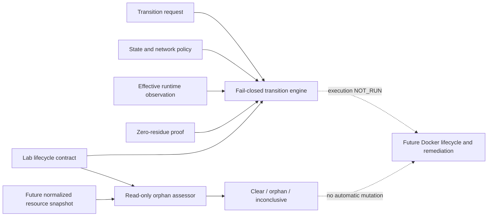

# EPIC-04 / EPIC-08 — Transactional lifecycle contract candidate AS_BUILT

## 1. Record metadata

| Field | Value |
| --- | --- |
| Canonical concept epics | [`EPIC-04 — Transactional lifecycle and isolation`](epics/EPIC-04-transactional-lifecycle-and-isolation.md); [`EPIC-08 — Network and egress policy`](epics/EPIC-08-network-and-egress-policy.md) |
| Delivery umbrella | `SVP2-B-03` — issue [#81](https://github.com/pestoura/hermes-security-labs/issues/81) |
| Master tracker | issue [#97](https://github.com/pestoura/hermes-security-labs/issues/97) |
| Initial technical PR | [#139](https://github.com/pestoura/hermes-security-labs/pull/139) |
| Initial technical merge | `591552d652fbff82d81f750535799380e9c643a9` |
| Lifecycle reconciliation | PR #166 / `da3c10311bbb094ae3d22d95f497723f2e085f52` |
| Record state | `AS_BUILT — contract candidate` |
| Canonical epic lifecycle | `IMPLEMENTING` |
| FINAL | no |
| Runtime declaration | `NO_RUNTIME_CHANGE` |

This is a supplementary implementation record. The canonical EPIC-04 and EPIC-08 documents are `IMPLEMENTING`, not lifecycle `AS_BUILT` or `FINAL`. Those states still require deployed runtime evidence and umbrella acceptance.

## 2. Delivered boundary

The repository contains a contract-only transactional lifecycle and network-policy decision layer plus a read-only orphan-resource assessment candidate. It validates:

- lab, campaign and contract identity binding;
- a declared lifecycle state machine with compensation paths;
- isolated and restricted egress profiles;
- owned, approved and time-bounded egress exceptions;
- isolation constraints prohibiting privileged mode, host networking, Docker socket, host mounts and shared networks;
- L3/L4 snapshot and rollback references;
- effective network observations before READY or RUNNING;
- a canonical zero-residue proof with digest, resource inventory and scanner completeness;
- quarantine and reuse blocking when cleanup evidence is missing, incomplete, unavailable, mismatched or non-zero;
- normalized read-only orphan observations using opaque resource references;
- fail-closed orphan classification against lifecycle state, campaign ownership, contract expiry and explicit quarantine-retention windows.

The candidates produce deterministic decisions/assessments only. They do not create, attach, start, stop, reset, quarantine, clean or destroy resources.

## 3. As-built architecture

## 4. Canonical components

| Component | Path | State |
| --- | --- | --- |
| Lifecycle contract schema | [`lab-lifecycle-contract.schema.json`](../../platform/lab-lifecycle/lab-lifecycle-contract.schema.json) | candidate |
| Transition request schema | [`lab-transition-request.schema.json`](../../platform/lab-lifecycle/lab-transition-request.schema.json) | candidate |
| Zero-residue proof schema | [`zero-residue-proof.schema.json`](../../platform/lab-lifecycle/zero-residue-proof.schema.json) | candidate |
| Lifecycle and egress policy | [`lifecycle-policy.yaml`](../../platform/lab-lifecycle/lifecycle-policy.yaml) | candidate |
| Decision implementation | [`lifecycle_protocol.py`](../../platform/lab-lifecycle/lifecycle_protocol.py) | candidate |
| Orphan observation schema | [`orphan-observation.schema.json`](../../platform/lab-lifecycle/orphan-observation.schema.json) | candidate |
| Orphan assessment schema | [`orphan-assessment.schema.json`](../../platform/lab-lifecycle/orphan-assessment.schema.json) | candidate |
| Orphan assessor | [`orphan_detector.py`](../../platform/lab-lifecycle/orphan_detector.py) | candidate |
| Technical boundary | [`README.md`](../../platform/lab-lifecycle/README.md) | candidate documentation |
| Lifecycle regression tests | [`test_lab_lifecycle_protocol.py`](../../platform/tests/test_lab_lifecycle_protocol.py) | validated |
| Orphan assessor tests | [`test_lab_orphan_detector.py`](../../platform/tests/test_lab_orphan_detector.py) | candidate validation |

## 5. State model

| State | Permitted successors |
| --- | --- |
| `DECLARED` | `PROVISIONING` |
| `PROVISIONING` | `READY`, `ROLLING_BACK` |
| `READY` | `RUNNING`, `DESTROYING` |
| `RUNNING` | `RESETTING`, `DESTROYING`, `ROLLING_BACK` |
| `RESETTING` | `READY`, `ROLLING_BACK` |
| `DESTROYING` | `VERIFYING_RESIDUE` |
| `ROLLING_BACK` | `VERIFYING_RESIDUE` |
| `VERIFYING_RESIDUE` | `VERIFIED`, `QUARANTINED` |
| `VERIFIED` | none |
| `QUARANTINED` | none |

Undefined transitions are refused. Quarantined laboratories have no reuse transition.

## 6. Network policy

### Isolated

- default profile;
- deny-all egress;
- no exceptions permitted;
- any observed destination produces refusal.

### Restricted

- explicit allowlist only;
- every exception has owner, approver, validity window and reason;
- effective destinations must be a subset of active declared exceptions;
- open egress is not represented as an allowed contract profile.

## 7. Zero-residue and orphan assessment

A transition from `VERIFYING_RESIDUE` to `VERIFIED` still requires a complete zero-residue proof. Missing, partial, unavailable, mismatched or non-zero evidence results in `QUARANTINED`, never `VERIFIED`.

The orphan assessor is a separate read-only contract. A valid normalized snapshot can produce:

- `CLEAR` only when scanner state is `COMPLETE` and no orphan is identified;
- `ORPHANS_DETECTED` when at least one definite orphan is found, including on a partial scan;
- `INCONCLUSIVE` when a partial/unavailable scan has no definite orphan and therefore cannot prove absence.

Orphan candidates include resources with unknown lab ownership, campaign mismatch, resources before provisioning, resources after `VERIFIED`, resources under expired active contracts, and quarantined residue whose retention is absent or expired. Cleanup-in-progress states are not prematurely classified as orphaned. Live quarantine retention produces `TRACKED_QUARANTINE_RESIDUE`, not reuse authorization.

`cleanup_performed` is fixed to `false`; no remediation side effect exists in the assessor.

## 8. Acceptance assessment

| Acceptance criterion | Result | Evidence |
| --- | --- | --- |
| Cleanup failure quarantines and blocks reuse | met in decision layer | residue and quarantine tests |
| No egress exists by default | met in contract/policy layer | isolated profile tests |
| Restricted egress requires explicit approval and window | met in decision layer | exception tests |
| L3/L4 require snapshot and rollback references | met in contract layer | recovery tests |
| Read-only orphan classification fails closed on incomplete evidence | candidate implemented | orphan assessor tests |
| Orphan assessment performs no cleanup | candidate implemented | schema/code/lifecycle tests |
| Real Docker cleanup produces zero residue | `NOT_RUN` | Docker integration absent |
| Actual network policy enforces deny-all | `NOT_RUN` | network enforcement absent |
| Runtime resource scanner exists | `NOT_IMPLEMENTED` / `NOT_RUN` | no runtime scanner implemented |
| Periodic orphan scan scheduler exists | `NOT_IMPLEMENTED` | no scheduler implemented |
| Orphan remediation exists | `NOT_IMPLEMENTED` / `NOT_RUN` | no cleanup action implemented |

## 9. Evidence

| Evidence | Result |
| --- | --- |
| Local isolated lifecycle tests in #139 | `35 passed` |
| PR #139 validate / repository | success |
| PR #139 validate / security | success |
| PR #139 security / gitleaks | success |
| Initial technical merge | `591552d652fbff82d81f750535799380e9c643a9` |
| Post-merge security/gitleaks `31135492162` | success |
| Post-merge validate `31135492132` | **success** |
| Lifecycle reconciliation PR #166 | integrated |
| Post-merge security #1092 | success |
| Post-merge validate #1094 | success |

Current orphan-assessor evidence remains subject to the PR and post-merge gates for this block before it is recorded as integrated.

## 10. Preserved limitations

- Docker lifecycle integration: `NOT_RUN`;
- network-policy enforcement: `NOT_RUN`;
- zero-residue observation against real resources: `NOT_RUN`;
- runtime resource scanner: `NOT_IMPLEMENTED` / `NOT_RUN`;
- periodic orphan scan scheduler: `NOT_IMPLEMENTED`;
- orphan cleanup/remediation: `NOT_IMPLEMENTED` / `NOT_RUN`;
- real snapshot and rollback execution: `NOT_RUN`;
- customer-target or laboratory execution: `NOT_RUN`;
- runtime changes: `NO_RUNTIME_CHANGE`;
- umbrella #81 remains open;
- FINAL remains **no**.

## 11. Remaining work before FINAL

- implement reviewed Docker adapters without exposing the daemon socket to workloads;
- enforce unique networks and state-based attach/detach against observed runtime state;
- implement default-deny egress and controlled exceptions;
- implement an authenticated/controlled read-only runtime resource scanner;
- schedule periodic orphan observations with durable provenance;
- implement separately authorized/audited orphan remediation and quarantine actions;
- implement idempotent cleanup and real residue scanning;
- demonstrate snapshots, rollback, TTL and data budgets for L3/L4;
- run authorized isolated positive, negative, race, failure and rollback tests;
- complete controlled deployment and rollback validation.
