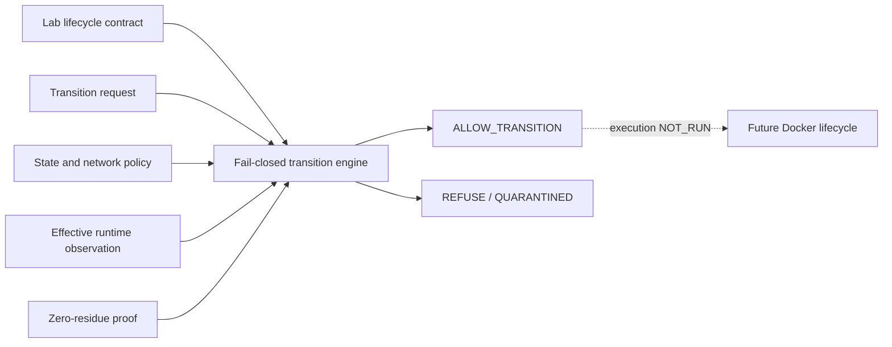

# EPIC-04 / EPIC-08 — Transactional lifecycle contract candidate AS_BUILT

## 1. Record metadata

| Field | Value |
| --- | --- |
| Canonical concept epics | [`EPIC-04 — Transactional lifecycle and isolation`](epics/EPIC-04-transactional-lifecycle-and-isolation.md); [`EPIC-08 — Network and egress policy`](epics/EPIC-08-network-and-egress-policy.md) |
| Delivery umbrella | `SVP2-B-03` — issue [#81](https://github.com/pestoura/hermes-security-labs/issues/81) |
| Master tracker | issue [#97](https://github.com/pestoura/hermes-security-labs/issues/97) |
| Technical PR | [#139](https://github.com/pestoura/hermes-security-labs/pull/139) |
| Technical merge | `591552d652fbff82d81f750535799380e9c643a9` |
| Record state | `AS_BUILT — contract candidate` |
| FINAL | no |
| Runtime declaration | `NO_RUNTIME_CHANGE` |

This supplementary record does not modify the canonical concept epics, which remain INTENT documents under the 45-epic lifecycle contract.

## 2. Delivered boundary

The repository contains a contract-only transactional lifecycle and network-policy decision layer. It validates:

- lab, campaign and contract identity binding;
- a declared lifecycle state machine with compensation paths;
- isolated and restricted egress profiles;
- owned, approved and time-bounded egress exceptions;
- isolation constraints prohibiting privileged mode, host networking, Docker socket, host mounts and shared networks;
- L3/L4 snapshot and rollback references;
- effective network observations before READY or RUNNING;
- a canonical zero-residue proof with digest, resource inventory and scanner completeness;
- quarantine and reuse blocking when cleanup evidence is missing, incomplete, unavailable, mismatched or non-zero.

The candidate produces deterministic transition decisions only. It does not create, attach, start, stop, reset or destroy resources.

## 3. As-built architecture

## 4. Canonical components

| Component | Path | State |
| --- | --- | --- |
| Lifecycle contract schema | [`lab-lifecycle-contract.schema.json`](../../platform/lab-lifecycle/lab-lifecycle-contract.schema.json) | candidate |
| Transition request schema | [`lab-transition-request.schema.json`](../../platform/lab-lifecycle/lab-transition-request.schema.json) | candidate |
| Zero-residue proof schema | [`zero-residue-proof.schema.json`](../../platform/lab-lifecycle/zero-residue-proof.schema.json) | candidate |
| Lifecycle and egress policy | [`lifecycle-policy.yaml`](../../platform/lab-lifecycle/lifecycle-policy.yaml) | candidate |
| Decision implementation | [`lifecycle_protocol.py`](../../platform/lab-lifecycle/lifecycle_protocol.py) | candidate |
| Technical boundary | [`README.md`](../../platform/lab-lifecycle/README.md) | as built |
| Regression tests | [`test_lab_lifecycle_protocol.py`](../../platform/tests/test_lab_lifecycle_protocol.py) | validated |

## 5. State model

| State | Permitted successors |
| --- | --- |
| `DECLARED` | `PROVISIONING` |
| `PROVISIONING` | `READY`, `ROLLING_BACK` |
| `READY` | `RUNNING`, `DESTROYING` |
| `RUNNING` | `RESETTING`, `DESTROYING`, `ROLLING_BACK` |
| `RESETTING` | `READY`, `ROLLING_BACK` |
| `DESTROYING` | `VERIFYING_RESIDUE` |
| `ROLLING_BACK` | `VERIFYING_RESIDUE` |
| `VERIFYING_RESIDUE` | `VERIFIED`, `QUARANTINED` |
| `VERIFIED` | none |
| `QUARANTINED` | none |

Undefined transitions are refused. Quarantined laboratories have no reuse transition.

## 6. Network policy

### Isolated

- default profile;
- deny-all egress;
- no exceptions permitted;
- any observed destination produces refusal.

### Restricted

- explicit allowlist only;
- every exception has owner, approver, validity window and reason;
- effective destinations must be a subset of active declared exceptions;
- open egress is not represented as an allowed contract profile.

## 7. Zero-residue proof

A transition from `VERIFYING_RESIDUE` to `VERIFIED` requires:

- schema-valid evidence;
- matching lab and campaign identifiers;
- a canonical digest matching the proof payload;
- `scanner_state = COMPLETE`;
- empty container, network, volume, process and mount inventories;
- empty temporary-path inventory;
- explicit confirmation that the lab network is absent.

Missing, partial, unavailable, mismatched or non-zero evidence results in `QUARANTINED`, never `VERIFIED`.

## 8. Acceptance assessment

| Acceptance criterion | Result | Evidence |
| --- | --- | --- |
| Cleanup failure quarantines and blocks reuse | met in decision layer | residue and quarantine tests |
| No egress exists by default | met in contract/policy layer | isolated profile tests |
| Restricted egress requires explicit approval and window | met in decision layer | exception tests |
| L3/L4 require snapshot and rollback references | met in contract layer | recovery tests |
| Real Docker cleanup produces zero residue | `NOT_RUN` | Docker integration absent |
| Actual network policy enforces deny-all | `NOT_RUN` | network enforcement absent |
| Periodic orphan detection exists | `NOT_IMPLEMENTED` | no scheduler or scanner implemented |

## 9. Evidence

| Evidence | Result |
| --- | --- |
| Local isolated lifecycle tests | 35 passed |
| PR #139 validate / repository | success |
| PR #139 validate / security | success |
| PR #139 security / gitleaks | success |
| Technical merge | `591552d652fbff82d81f750535799380e9c643a9` |
| Post-merge security/gitleaks `31135492162` | success |
| Post-merge validate `31135492132` | pending at record creation; must pass before this PR merges |

## 10. Preserved limitations

- Docker lifecycle integration: `NOT_RUN`;
- network-policy enforcement: `NOT_RUN`;
- zero-residue observation against real resources: `NOT_RUN`;
- periodic orphan detector: `NOT_IMPLEMENTED`;
- real snapshot and rollback execution: `NOT_RUN`;
- customer-target or laboratory execution: `NOT_RUN`;
- runtime changes: `NO_RUNTIME_CHANGE`;
- umbrella #81 remains open;
- FINAL remains **no**.

## 11. Remaining work before FINAL

- implement reviewed Docker adapters without exposing the daemon socket to workloads;
- enforce unique networks and state-based attach/detach against observed runtime state;
- implement default-deny egress and controlled exceptions;
- implement idempotent cleanup and residue scanners;
- implement periodic orphan detection and quarantine;
- demonstrate snapshots, rollback, TTL and data budgets for L3/L4;
- run authorized isolated positive, negative, race, failure and rollback tests;
- complete controlled deployment and rollback validation.
