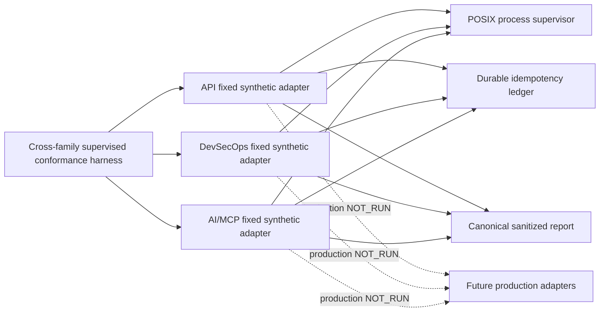

# EPIC-05 — Block 11 cross-family supervised conformance AS_BUILT

## 1. Record metadata

| Field | Value |
| --- | --- |
| Canonical epic | [`EPIC-05 — Runner Protocol v2`](epics/EPIC-05-runner-protocol-v2.md) |
| Delivery umbrella | `SVP2-B-02` — issue [#80](https://github.com/pestoura/hermes-security-labs/issues/80) |
| Master tracker | issue [#97](https://github.com/pestoura/hermes-security-labs/issues/97) |
| Block | 11 |
| Record state | `AS_BUILT` |
| Technical PR | [#129](https://github.com/pestoura/hermes-security-labs/pull/129) |
| Technical squash merge | `586802146b8e575f4f9c71fcc2bb7a0ae4134880` |
| Lifecycle PR | [#131](https://github.com/pestoura/hermes-security-labs/pull/131) |
| Lifecycle squash merge | `2b72cf729f53befdca0f111d62009ba76e180088` |
| Runtime declaration | `NO_RUNTIME_CHANGE` |
| Production execution | `NOT_RUN` |
| Sandbox | `NOT_IMPLEMENTED` |
| Promotion | blocked |

This is a supplementary block record. It is intentionally outside `docs/roadmap/epics/` so the canonical catalogue remains exactly 45 uniquely numbered EPIC documents.

## 2. Delivered scope

Block 11 provides a repository-owned cross-family conformance harness for the fixed supervised synthetic candidates of the API, DevSecOps and AI/MCP runner families.

The delivered implementation:

- fixes the candidate inventory to the three repository-owned adapters;
- emits one canonical sanitized report validated by JSON Schema;
- compares normalized message shapes, terminal states, error taxonomy, correlation fields and effect/ledger deltas;
- covers success, durable replay, idempotency conflict, controlled execution failure, hard timeout, cancellation, descendant residue, unsupported capability refusal and authorization refusal;
- verifies deterministic reports;
- rejects raw commands, executable paths, working directories, environment details, stdout, stderr and secret canaries from persisted reports.

## 3. Canonical lifecycle declaration

The canonical lifecycle declaration is stored in [`platform/runner-protocol/compatibility.yaml`](../../platform/runner-protocol/compatibility.yaml) and is enforced by [`test_cross_family_lifecycle.py`](../../platform/runner-protocol/tests/test_cross_family_lifecycle.py).

| Property | Declared value |
| --- | --- |
| Status | `PASS_SYNTHETIC_PROCESS` |
| Scope | `fixed_synthetic_workers_only` |
| Families | `api`, `devsecops`, `ai-mcp` |
| Raw output persistence | `none` |
| Sandbox status | `NOT_IMPLEMENTED` |
| Execution integration | `NOT_RUN` |
| Promotion status | `blocked` |
| Production effect claim | `none` |

## 4. Technical evidence

| Evidence | Result |
| --- | --- |
| PR #129 validated head | `5421a7652b2b1eee6a3c00fb728f8bc79ee8c453` |
| PR #129 validate / repository | success |
| PR #129 validate / security | success |
| PR #129 security / gitleaks | success |
| PR #129 post-merge validate | success — run `31129689358` |
| PR #129 post-merge security/gitleaks | success — run `31129689363` |
| PR #131 validated head | `8f5c94ab9b1a528291a2032c0f6fb701f078727c` |
| PR #131 validate / repository | success |
| PR #131 validate / security | success |
| PR #131 security / gitleaks | success |

## 5. Acceptance assessment

| Criterion | Result | Evidence |
| --- | --- | --- |
| Adapter inventory is fixed and repository-owned | met | inventory-lock and lifecycle tests |
| API, DevSecOps and AI/MCP use one normalized report contract | met | supervised conformance harness |
| Correlation fields remain equivalent | met | normalized report comparison |
| Terminal states and error taxonomy remain equivalent | met | nine-scenario matrix |
| Durable replay creates no second process effect | met | ledger/effect delta checks |
| Idempotency conflict is refused without execution | met | conflict scenario |
| Timeout and cancellation normalize safely | met | supervised process scenarios |
| Descendant residue cannot yield `PASS` | met | residue maps to non-success |
| Unsupported capability is refused before effect | met | capability refusal scenario |
| Invalid authorization is refused before effect | met | authorization refusal scenario |
| Reports are deterministic and sanitized | met | repeatability and canary rejection tests |
| Production runner integration | `NOT_RUN` | fixed synthetic workers only |
| Sandbox and resource isolation | `NOT_IMPLEMENTED` | process supervision is not a sandbox |
| Production promotion | blocked | explicit lifecycle declaration |

## 6. Preserved boundaries

- No request-controlled executable, argument vector, working directory, environment or worker mode is accepted.
- No production runtime, scanner, pipeline, repository operation, MCP provider, agent, memory/RAG adapter, network, laboratory or customer target is invoked.
- Raw process output is never persisted.
- The calibrated AI/MCP runtime remains disconnected from Runner Protocol.
- The vendor-neutral `conformance.effect.*` kit is not reinterpreted; Block 11 uses the separate supervised-process `conformance.process.*` boundary.
- This record does not claim EPIC-05 `FINAL` status.

## 7. As-built architecture

## 8. Remaining EPIC-level gaps

The following remain outside Block 11 and prevent EPIC-05 from becoming `FINAL`:

- production adapter integration for every runner family;
- live gateway-to-runner execution evidence;
- sandboxed execution and resource isolation;
- production cancellation and timeout evidence;
- production Evidence Plane integration;
- controlled promotion after production conformance.

## 9. Decision record

| Element | Value |
| --- | --- |
| Decision | Record Block 11 as supplementary AS_BUILT evidence, not as a new EPIC document. |
| Context | The roadmap contract requires exactly 45 uniquely numbered EPIC documents. |
| Rejected alternative | Add a second `EPIC-05-*` file under `docs/roadmap/epics/`. |
| Justification | The rejected alternative creates 46 EPIC files, duplicates number 05 and fails the canonical catalogue gates. |
| Risks accepted | The block record is separate from the canonical EPIC document but links back to it and to the lifecycle source of truth. |
| State | `Decision` |

## 10. References

- Canonical EPIC: [`EPIC-05 — Runner Protocol v2`](epics/EPIC-05-runner-protocol-v2.md)
- Runner Protocol package: [`platform/runner-protocol/`](../../platform/runner-protocol/README.md)
- Compatibility source of truth: [`compatibility.yaml`](../../platform/runner-protocol/compatibility.yaml)
- Technical PR: [#129](https://github.com/pestoura/hermes-security-labs/pull/129)
- Lifecycle PR: [#131](https://github.com/pestoura/hermes-security-labs/pull/131)
