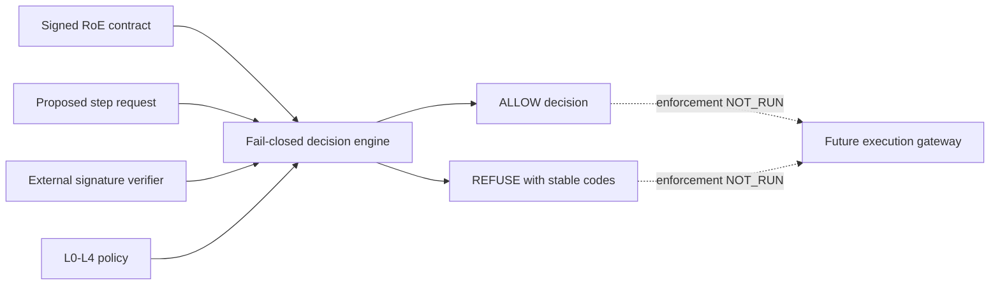

# EPIC-28 — Rules of Engagement contract candidate AS_BUILT

## 1. Record metadata

| Field | Value |
| --- | --- |
| Canonical concept epic | [`EPIC-28 — Rules of Engagement as Code`](epics/EPIC-28-rules-of-engagement-as-code.md) |
| Delivery umbrella | `SVP2-A-02` — issue [#77](https://github.com/pestoura/hermes-security-labs/issues/77) |
| Master tracker | issue [#97](https://github.com/pestoura/hermes-security-labs/issues/97) |
| Technical PR | [#133](https://github.com/pestoura/hermes-security-labs/pull/133) |
| Technical merge | `4c85529f3fe325d97ef7795e4fac7ea1512a3ec2` |
| Record state | `AS_BUILT — contract candidate` |
| FINAL | no |
| Runtime declaration | `NO_RUNTIME_CHANGE` |

This is a supplementary implementation record. The canonical concept document remains an INTENT document with its reserved lifecycle sections, as required by the 45-epic catalogue contract.

## 2. Delivered boundary

The repository contains a validated, fail-closed Rules of Engagement (RoE) contract and deterministic decision layer for proposed steps. The block delivers:

- a versioned RoE contract schema;
- a versioned proposed-step request schema;
- a canonical L0–L4 intrusiveness policy;
- deterministic allow/refuse decisions with stable codes;
- structural, semantic and signature-boundary validation;
- explicit scope, exclusions, windows, limits, approvers, emergency contacts and stop conditions;
- explicit controls for credential use, lateral movement, persistence, evasion, destructive actions, data exfiltration, denial of service and mass data access;
- 37 dedicated positive, negative and adversarial tests.

The implementation does not dispatch, execute, schedule or cancel any runtime operation.

## 3. As-built architecture

## 4. Canonical components

| Component | Path | State |
| --- | --- | --- |
| RoE contract schema | [`roe-contract.schema.json`](../../platform/roe-contract/roe-contract.schema.json) | candidate |
| Step request schema | [`roe-step-request.schema.json`](../../platform/roe-contract/roe-step-request.schema.json) | candidate |
| L0–L4 policy | [`intrusiveness-policy.yaml`](../../platform/roe-contract/intrusiveness-policy.yaml) | candidate |
| Decision implementation | [`roe_contract.py`](../../platform/roe-contract/roe_contract.py) | candidate |
| Technical boundary | [`README.md`](../../platform/roe-contract/README.md) | as built |
| Contract tests | [`test_roe_contract.py`](../../platform/tests/test_roe_contract.py) | validated |

## 5. Intrusiveness policy

| Level | Meaning | Required approvals | Distinct sides | Rollback plan |
| --- | --- | ---: | ---: | --- |
| L0 | Passive | 0 | 0 | no |
| L1 | Safe active | 0 | 0 | no |
| L2 | Intrusive validation | 1 | 1 | no |
| L3 | Controlled exploitation | 1 | 1 | yes |
| L4 | High impact | 2 | 2 | yes |

A contract can lower the intrusiveness ceiling but cannot relax these requirements.

## 6. Fail-closed behaviour

A proposed step is refused when any of the following applies:

- the contract is missing, malformed, inactive, expired or revoked;
- the canonical digest does not match the signed payload;
- no external signature verifier is available or verification fails;
- the campaign identifier differs or the campaign is not `RUNNING`;
- the kill switch or any stop condition is active;
- the target is excluded or outside the allowlist;
- the capability is prohibited or not allowed;
- the requested level exceeds the contract ceiling;
- the request is outside an execution window;
- approvals, approval separation or rollback evidence are missing;
- a high-risk action is denied or below its minimum level;
- estimated rate, concurrency, data or duration exceeds the contract;
- unknown or secret-bearing fields are present.

Exclusions and prohibitions always take precedence over broader allow rules.

## 7. Decisions

| Decision | Justification |
| --- | --- |
| External verifier is mandatory | The repository must not embed keys or silently substitute test cryptography. |
| Test verifier is scaffolding only | Deterministic tests are not production signature evidence. |
| Emergency stop does not require the original approver | A configured emergency contact with pause, stop or revoke authority must be able to fail safe. |
| L4 requires two distinct sides | A single actor or organizational side cannot authorize high-impact work alone. |
| Production enforcement remains blocked | Contract evidence alone does not prove gateway or runtime behaviour. |

## 8. Acceptance assessment

| Criterion | Result | Evidence |
| --- | --- | --- |
| Out-of-scope steps are refused deterministically | met in decision layer | target, capability and window tests |
| Expired and revoked contracts refuse decisions | met in decision layer | lifecycle tests |
| L0–L4 requirements are explicit | met | policy and regression tests |
| Kill switch blocks new step decisions | met in decision layer | kill-switch test |
| L4 dual approval and rollback are enforced | met | separation and rollback tests |
| Production signature and revocation trust | `NOT_RUN` | trust store not implemented |
| Gateway refuses before dispatch | `NOT_RUN` | gateway integration not delivered |
| Runtime kill switch stops in-flight work | `NOT_RUN` | execution proof not delivered |

## 9. Evidence

| Evidence | Result |
| --- | --- |
| Local isolated RoE tests | 37 passed |
| PR #133 validate / repository | success |
| PR #133 validate / security | success |
| PR #133 security / gitleaks | success |
| Technical merge | `4c85529f3fe325d97ef7795e4fac7ea1512a3ec2` |
| Post-merge validate `31132711641` | success |
| Post-merge security/gitleaks `31132711788` | success |

## 10. Preserved limitations

- production signature verification: `NOT_RUN`;
- production trust-store integration: `NOT_IMPLEMENTED`;
- gateway enforcement: `NOT_RUN`;
- Hermes integration: `NOT_RUN`;
- runtime kill-switch and cancellation proof: `NOT_RUN`;
- customer-target execution: `NOT_RUN`;
- runtime changes: `NO_RUNTIME_CHANGE`;
- umbrella #77 remains open;
- FINAL remains **no**.

## 11. Remaining work before FINAL

- select and integrate a production trust store and revocation mechanism;
- bind verified contract digests to campaign evidence;
- integrate the decision layer into the typed gateway before dispatch;
- prove cache invalidation and revocation freshness;
- prove kill-switch behaviour against in-flight runtime work;
- validate production signing, rotation and emergency revocation procedures;
- complete post-integration positive, negative, adversarial and rollback tests.
