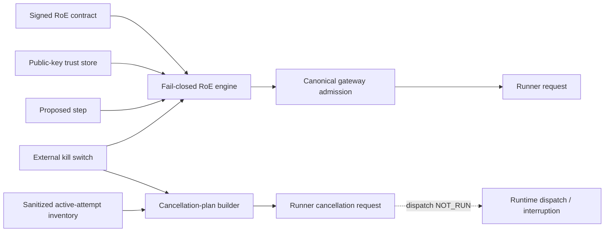

# EPIC-28 — Rules of Engagement contract candidate AS_BUILT

## 1. Record metadata

| Field | Value |
| --- | --- |
| Canonical concept epic | [`EPIC-28 — Rules of Engagement as Code`](epics/EPIC-28-rules-of-engagement-as-code.md) |
| Delivery umbrella | `SVP2-A-02` — issue [#77](https://github.com/pestoura/hermes-security-labs/issues/77) |
| Master tracker | issue [#97](https://github.com/pestoura/hermes-security-labs/issues/97) |
| Foundation technical PR | [#133](https://github.com/pestoura/hermes-security-labs/pull/133) |
| Latest safety increment | [#198](https://github.com/pestoura/hermes-security-labs/pull/198) |
| Record state | `AS_BUILT — contract candidate` |
| FINAL | no |
| Runtime declaration | `NO_RUNTIME_CHANGE` |

This supplementary record describes the repository-level RoE/safety enforcement contract. It does not claim production deployment or operational execution evidence.

## 2. Delivered boundary

The repository now contains a fail-closed RoE decision/admission chain and a repository-only in-flight cancellation-message fan-out contract:

- versioned RoE and proposed-step schemas;
- canonical L0–L4 intrusiveness policy;
- deterministic allow/refuse decisions with stable codes;
- scope, exclusions, execution windows, limits, approvals, emergency contacts and stop conditions;
- high-risk action controls and L4 dual approval/rollback;
- file-backed public-key trust-store verification;
- external global/campaign kill-switch state;
- canonical gateway admission before Runner request construction;
- sanitized active-attempt inventory;
- deterministic construction of Runner Protocol v2 `runner.cancellation.request` messages for already-active attempts.

The repository still does not dispatch cancellation messages, terminate runtime processes, operate a production Runner or execute against a target.

## 3. As-built architecture

## 4. Canonical components

| Component | Path | State |
| --- | --- | --- |
| RoE contract schema | `platform/roe-contract/roe-contract.schema.json` | as built |
| Step request schema | `platform/roe-contract/roe-step-request.schema.json` | as built |
| L0–L4 policy | `platform/roe-contract/intrusiveness-policy.yaml` | as built |
| RoE decision implementation | `platform/roe-contract/roe_contract.py` | as built |
| RoE decision tests | `platform/tests/test_roe_contract.py` | as built |
| Public-key trust store | `platform/roe-contract/trust_store.py` | as built |
| External kill switch | `platform/roe-contract/kill_switch.py` | as built |
| Canonical gateway admission | `platform/gateway-protocol/admission.py` | as built |
| Runner handoff | `platform/gateway-protocol/runner_handoff.py` | as built contract |
| Active-attempt cancellation planning | `platform/gateway-protocol/kill_switch_cancellation.py` | as built contract |
| Active-attempt inventory schema | `platform/gateway-protocol/active-attempt-inventory.schema.json` | as built contract |
| Cancellation-plan schema | `platform/gateway-protocol/kill-switch-cancellation-plan.schema.json` | as built contract |

## 5. Intrusiveness policy

| Level | Meaning | Required approvals | Distinct sides | Rollback plan |
| --- | --- | ---: | ---: | --- |
| L0 | Passive | 0 | 0 | no |
| L1 | Safe active | 0 | 0 | no |
| L2 | Intrusive validation | 1 | 1 | no |
| L3 | Controlled exploitation | 1 | 1 | yes |
| L4 | High impact | 2 | 2 | yes |

A contract can lower the ceiling but cannot relax canonical safety requirements.

## 6. Fail-closed behaviour

Admission is refused when, among other causes:

- contract/signature/trust validation is unavailable or invalid;
- campaign state, scope, target, capability, window or resource limits do not match;
- requested intrusiveness exceeds the contract;
- required approvals/rollback are missing;
- stop conditions or external kill switch are active;
- caller attempts to supply its own authorization/RoE decision.

For already-active attempts, PR #198 adds restrictive cancellation planning:

- global engaged switch → cancellation requests for all supplied cancellable attempts;
- campaign engaged switch → cancellation requests only for matching Runner campaign UUID;
- non-correlatable campaign identifier → global fail-closed cancellation planning;
- already-cancelling attempt → no duplicate request;
- missing/unreadable/invalid switch source → fail closed;
- released switch requires a recent timestamp under explicit freshness policy;
- missing, stale or future release timestamp → fail closed.

## 7. Decisions

| Decision | Justification |
| --- | --- |
| External signature/trust verification is mandatory | No embedded private key or implicit trust fallback. |
| RoE and kill switch only restrict | They never create/expand execution authorization. |
| Hermes / Control Plane remains sole execution-authorization authority | Separation between policy safety and authorization is explicit. |
| Kill-switch source defects fail closed | Safety must not depend on an unreadable control state. |
| Campaign correlation mismatch fails globally closed | Prevent silent continuation caused by identifier mismatch. |
| Cancellation fan-out is message construction only | No operational cancellation claim without transport/process evidence. |

## 8. Acceptance assessment

| Criterion | Repository result | Operational boundary |
| --- | --- | --- |
| Out-of-scope steps refused | `MET` | deployed gateway evidence remains `NOT_RUN` |
| L0–L4 explicit/enforced | `MET` | real intrusive execution remains `NOT_RUN` |
| Kill switch blocks new admissions | `MET` | deployed runtime drill remains `NOT_RUN` |
| L4 dual approval/rollback | `MET` | production approval workflow evidence remains incomplete |
| Public-key trust verification | `MET` repository | production key distribution/rotation/revocation freshness remains incomplete/`NOT_RUN` |
| Gateway refuses before Runner request construction | `MET` repository | deployed gateway remains `NOT_RUN` |
| Kill switch addresses active attempts | `MET` for cancellation-message planning — PR #198 | dispatch/process interruption remains `NOT_IMPLEMENTED` / `NOT_RUN` |

## 9. Evidence

Latest cancellation increment:

| Evidence | Result |
| --- | --- |
| PR #198 head `7d053740d829ca72958ffb2675a5a65674f15074` | validated |
| Pre-merge security `31234488135` | PASS |
| Pre-merge validate `31234488148` | PASS |
| Main `c4b4f161ef34a4a1df1e67bb4213de42a7d681b6` | integrated |
| Post-merge security `31234563241` | PASS |
| Post-merge validate `31234563147` | PASS |

Earlier repository evidence remains represented by PRs #133, #159 and #160.

## 10. Preserved limitations

- production/deployed trust-store and signing operations: `NOT_RUN`;
- production key rotation/revocation freshness: incomplete / `NOT_RUN`;
- deployed gateway enforcement: `NOT_RUN`;
- Hermes operational trust-store/kill-switch integration: incomplete / `NOT_RUN`;
- runtime active-attempt inventory authenticity/integration: `NOT_IMPLEMENTED` / `NOT_RUN`;
- cancellation request transport/dispatch: `NOT_IMPLEMENTED` / `NOT_RUN`;
- cooperative runtime process interruption: `NOT_IMPLEMENTED` / `NOT_RUN`;
- force-after-grace: `NOT_IMPLEMENTED` / `NOT_RUN`;
- runtime kill-switch drills: `NOT_RUN`;
- customer-target execution: `NOT_RUN`;
- runtime changes: `NO_RUNTIME_CHANGE`;
- umbrella #77 remains open;
- `FINAL = no`.

## 11. Remaining work before FINAL

- define/prove production key rotation and revocation freshness;
- deploy trust-store/kill-switch/gateway enforcement in a controlled non-production runtime;
- integrate an authenticated/current active-attempt inventory source;
- dispatch cancellation requests through the real Runner transport;
- prove cooperative cancellation and terminal-state transition;
- prove controlled force-after-grace where explicitly authorized;
- execute global/campaign kill-switch drills and preserve evidence;
- validate rollback/recovery and emergency procedures end-to-end.
