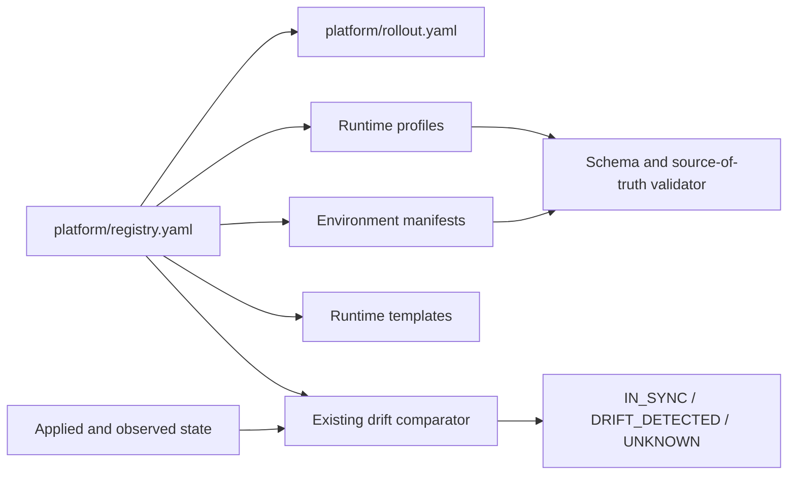

# EPIC-02 — Single source of truth for runtime

## 1. Metadata

| Field | Value |
| --- | --- |
| Concept epic ID | `EPIC-02` |
| Slug | `single-source-of-truth-for-runtime` |
| Pillar | `A` — Governance and Architecture |
| Phase | 1 |
| Priority | P0 |
| Delivery umbrella | `SVP2-A-01` (issue [#76](https://github.com/pestoura/hermes-security-labs/issues/76)) |
| Document version | 1.2.0 |
| Document date | 2026-08-06 |
| Catalogue | [Epic catalogue 45](../epic-catalogue-45.md) |
| Lifecycle contract | [Architecture documentation lifecycle](../../architecture/architecture-documentation-lifecycle.md) |

## 2. Current status

**AS_BUILT** — the source-of-truth implementation was integrated through pull request
[#102](https://github.com/pestoura/hermes-security-labs/pull/102) and validated again on
`main`. `FINAL` remains pending until umbrella #76 completes its catalogue and lifecycle
closure.

| Lifecycle state | Reached |
| --- | --- |
| INTENT | yes |
| IMPLEMENTING | yes |
| AS_BUILT | yes |
| FINAL | no |

## 3. Problem and motivation

Runtime facts (labs, runners, images, bindings, capabilities) are declared in several places, so drift between Git, deployed state and documentation is possible and undetected.

## 4. Intended outcome

One versioned declarative source describes runtime intent; deployed state is compared against it and divergence is reported, never silently reconciled.

## 5. Scope and non-goals

### In scope

- Declarative runtime manifest inventory in Git
- Drift semantics IN_SYNC / DRIFT_DETECTED / UNKNOWN as a documented contract
- Rules for what may never be authoritative outside Git

### Non-goals

- Changing the existing deployment tracking implementation
- Automatic remediation of drift

## 6. Intent architecture

Git holds intent. A read-only comparator derives observed state and emits a tri-state verdict. Absence of evidence maps to UNKNOWN, never to IN_SYNC.

## 7. Contracts, data and capabilities

- Runtime manifest schema
- Drift verdict record with commit, inventory hashes and counters

Contracts are canonical in Git. The runtime-specific contract is defined by:

- [`platform/registry.yaml`](../../../platform/registry.yaml);
- [`platform/schemas/runtime-profile.schema.json`](../../../platform/schemas/runtime-profile.schema.json);
- [runtime source-of-truth policy](../../architecture/runtime-source-of-truth.md);
- [ADR-0009](../../architecture/adr/ADR-0009-runtime-source-of-truth-and-drift-semantics.md).

The reference architecture and [EPIC-01](EPIC-01-architecture-and-canonical-contracts.md)
remain the platform-wide authority model.

## 8. Dependencies and sequencing

- [EPIC-01 — Architecture and canonical contracts](EPIC-01-architecture-and-canonical-contracts.md) — `AS_BUILT` on `main` before this implementation began.

Sequencing follows the phase model in the
[intent document](../../architecture/security-validation-platform-v2-intent.md).
This epic is planned for phase 1.

## 9. Security, risks and failure modes

- Manifest divergence from actual container state
- Tri-state collapsing into boolean under pressure
- Generated applied state becoming an undocumented source of truth
- Orphan or duplicate runtime profiles
- Environment-level digest overrides diverging from a shared runtime release

Platform-wide invariants that this epic must not weaken:

- absence of evidence never produces a `PASS` verdict;
- no execution outside an active authorization contract;
- no secrets, tokens, cookies or raw credential material in documentation, telemetry
  or persisted evidence;
- no target outside registered laboratories.

## 10. Deliverables

- Documented source-of-truth policy
- Drift contract specification
- Schema-backed runtime profile inventory
- Read-only repository validator and positive/negative tests
- CI integration for source-of-truth validation

## 11. Acceptance criteria

- Every runtime asset has exactly one authoritative declaration
- UNKNOWN is produced whenever evidence is missing or unparsable

## 12. Evidence and validation plan

- Validate every registered runtime profile against the schema
- Reject duplicate IDs, duplicate manifest paths, ID mismatches and orphan profiles
- Reject environment references to undeclared runtimes
- Validate fail-safe drift and release identity rules
- Run repository, catalogue, security and gitleaks workflows
- Record runtime gates as `NOT_APPLICABLE` for this no-runtime-change block

Evidence is recorded in section 15 and in delivery umbrella issue #76.

## 13. Decisions and open questions

### Decisions taken at intent time

- Git is authoritative; GitHub issues are a working view.

### Decisions taken during implementation

- `platform/registry.yaml` is the canonical catalogue root; it references authoritative
  artefacts instead of duplicating their contents.
- Applied deployment state, host observations, issues/comments and generated output are
  explicitly non-authoritative.
- Drift is strictly tri-state and missing, unparsable or unverifiable observation maps to
  `UNKNOWN`.
- Automatic reconciliation is forbidden.
- Image digest identity is pinned per immutable runtime release, not per environment.
- Host runtime profiles that do not identify an image use `NOT_APPLICABLE`; this does not
  waive digest requirements for later runner or laboratory image releases.

### Open questions

- None for this block. Runtime release manifests remain a later implementation capability
  governed by ADR-0009.

## 14. Implementation notes

### Block 1 — canonical runtime source of truth

- Branch: `feat/epic-02-runtime-source-of-truth`
- Umbrella issue: [#76](https://github.com/pestoura/hermes-security-labs/issues/76)
- Pull request: [#102](https://github.com/pestoura/hermes-security-labs/pull/102)
- Validated head: `5a4eb63ffc00ed785bd52a3740a7d004ef4eb79f`
- Squash merge: `122c567f862ab4576cb26c961125586679082bfc`
- Runtime declaration: `NO_RUNTIME_CHANGE`
- Normalized the five existing runtime profiles instead of creating duplicate declarations.
- Added a runtime-profile JSON Schema and a read-only source-of-truth validator.
- Added positive and negative tests and wired them into repository CI.
- Preserved `deployment/deployment_tracking.py` unchanged.

### Reconciled existing state

| Existing artefact | Classification after this block |
| --- | --- |
| `platform/registry.yaml` | canonical catalogue root |
| `platform/rollout.yaml` | authoritative rollout declaration referenced by registry |
| `platform/runtimes/*.yaml` | authoritative runtime profiles referenced one-to-one by registry |
| `platform/environments/**` | authoritative laboratory declarations for their own scope |
| `.deployment.json` | non-authoritative applied-state evidence |
| live host/container/network state | non-authoritative observation |
| GitHub issues/comments | work tracking, not configuration authority |

### CI corrections before merge

- A negative fixture exposed that diagnostic paths assumed all test files were inside the repository; diagnostics were made fixture-safe.
- Ruff detected an unused import in the validator; it was removed.
- Both corrections were revalidated on the final head without weakening the contract.

## 15. As-built / final architecture

### Delivered architecture

The implementation delivered repository-owned declarations and CI enforcement. It did not
change live runtime state or the existing operational drift comparator.

### Evidence

| Evidence | Result |
| --- | --- |
| PR #102 validated head | `5a4eb63ffc00ed785bd52a3740a7d004ef4eb79f` |
| Merge SHA | `122c567f862ab4576cb26c961125586679082bfc` |
| PR validate workflow | success — run `31065385239` |
| PR security/gitleaks workflow | success — run `31065385238` |
| Post-merge main validate workflow | success — run `31065443977` |
| Post-merge main security/gitleaks workflow | success — run `31065444012` |
| Runtime validation | `NOT_APPLICABLE` — no runtime change |

### Acceptance assessment

| Criterion | Result | Evidence |
| --- | --- | --- |
| Every registered runtime has one authoritative declaration | met | one-to-one registry references, orphan/duplicate tests |
| Missing or unparsable evidence maps to `UNKNOWN` | met | machine-readable policy and tests |
| Runtime profiles validate against one schema | met | runtime-profile schema and CI validator |
| Observed state remains non-authoritative | met | registry policy, ADR-0009 and documentation |
| Existing comparator remains unchanged | met | no diff to `deployment/deployment_tracking.py` |

### Differences from intent

- The existing `platform/registry.yaml`, rollout and runtime profiles were strengthened
  rather than replaced by a new inventory.
- Image identity was resolved at runtime-release scope. Concrete release manifests remain
  future work; host-driver profiles use `NOT_APPLICABLE` where no image is identified.
- The epic reused the existing tri-state comparator rather than implementing a duplicate.

### Limitations and residual risk

- Repository validation proves declaration integrity, not live runtime synchronization.
- Runtime release manifests and immutable image promotion are not yet implemented.
- Valid runtime observation may still produce `UNKNOWN` when evidence is incomplete or stale;
  this is deliberate fail-safe behaviour.
- Automatic drift remediation remains forbidden.

## 16. Document change log

| Date | Version | Change |
| --- | --- | --- |
| 2026-08-06 | 1.0.0 | Initial intent document created from the concept epic catalogue. |
| 2026-08-06 | 1.1.0 | Set IMPLEMENTING; record canonical registry, tri-state drift, release identity decision, validator and CI plan. |
| 2026-08-06 | 1.1.1 | Link implementation pull request #102. |
| 2026-08-06 | 1.2.0 | Record AS_BUILT architecture, CI evidence, acceptance results, corrections and limitations. |
