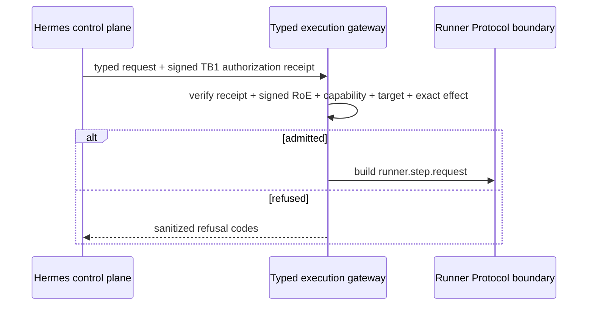

# EPIC-03 — Typed Kali MCP

## 1. Metadata

| Field | Value |
| --- | --- |
| Concept epic ID | `EPIC-03` |
| Slug | `typed-kali-mcp` |
| Pillar | `B` — Runtime Foundation |
| Phase | 2 |
| Priority | P0 |
| Delivery umbrella | `SVP2-B-01` (issue [#79](https://github.com/pestoura/hermes-security-labs/issues/79)) |
| Document version | 1.1.0 |
| Document date | 2026-08-07 |
| Catalogue | [Epic catalogue 45](../epic-catalogue-45.md) |
| Lifecycle contract | [Architecture documentation lifecycle](../../architecture/architecture-documentation-lifecycle.md) |

## 2. Current status

**IMPLEMENTING** — the repository now contains the typed gateway contract, canonical RoE admission boundary, TB1 authorization validation and gateway-to-Runner Protocol v2 message-construction boundary. Kali MCP handler integration, deployed gateway enforcement and production execution remain `NOT_RUN`.

| Lifecycle state | Reached |
| --- | --- |
| INTENT | yes |
| IMPLEMENTING | yes |
| AS_BUILT | no |
| FINAL | no |

## 3. Problem and motivation

The current Kali MCP generic command surface cannot be treated as the production execution boundary. Arbitrary command execution cannot be authorized, audited or bounded per capability with the guarantees required by the Security Validation Platform v2.

## 4. Intended outcome

A typed Security Execution Gateway where every operation is declared, schema-validated, capability-bound, authorization-bound and fail-closed before any future dispatch to a runner.

## 5. Scope and non-goals

### In scope

- versioned typed operation registry and strict request schemas;
- explicit operation/capability and intrusiveness bindings;
- deterministic refusal for undeclared, incompatible or unauthorized operations;
- canonical signed RoE admission boundary;
- validation of Hermes-issued TB1 authorization receipts;
- Runner Protocol v2 request construction after successful admission;
- normal-profile prohibition of arbitrary command execution.

### Non-goals

- rewriting Kali tooling;
- adding offensive tooling;
- claiming deployed Kali MCP handlers, real runner execution or target interaction;
- allowing the execution plane to create or expand authorization.

## 6. Intent architecture

Hermes/control plane is the sole authorization authority. It provides a typed request plus a signed short-lived TB1 authorization receipt. The gateway validates the receipt, independently revalidates the signed RoE contract, capability, target, runtime and exact typed effect, and either refuses or constructs a Runner Protocol v2 request. Repository-level construction is not dispatch.

Actual runtime dispatch is deliberately absent from this diagram because it remains `NOT_RUN`.

## 7. Contracts, data and capabilities

Canonical repository components include:

- `platform/gateway-protocol/operation-registry.schema.json`;
- `platform/gateway-protocol/gateway-request.schema.json`;
- `platform/gateway-protocol/admission-request.schema.json`;
- `platform/gateway-protocol/operation-registry.yaml`;
- `platform/gateway-protocol/gateway_protocol.py`;
- `platform/gateway-protocol/admission.py`;
- `platform/gateway-protocol/runner_handoff.py`;
- `platform/authorization-contract/authorization-receipt.schema.json`;
- `platform/authorization-contract/authorization_receipt.py`;
- Runner Protocol v2 SDK/contract under `platform/runner-protocol/`.

Cross-plane ownership remains governed by the [reference architecture](../../architecture/security-validation-reference-architecture.md), [ADR-0001](../../architecture/adr/ADR-0001-plane-separation-and-authorization-authority.md), [ADR-0003](../../architecture/adr/ADR-0003-typed-contracts-over-generic-execution.md) and the [canonical contract inventory](../../architecture/contracts/README.md).

## 8. Dependencies and sequencing

- [EPIC-01 — Architecture and canonical contracts](EPIC-01-architecture-and-canonical-contracts.md)
- [EPIC-02 — Single source of truth for runtime](EPIC-02-single-source-of-truth-for-runtime.md)
- [EPIC-05 — Runner Protocol v2](EPIC-05-runner-protocol-v2.md)
- [EPIC-28 — Rules of Engagement as Code](EPIC-28-rules-of-engagement-as-code.md)

Repository-level contract/admission work precedes any real Kali MCP handler or production runner integration.

## 9. Security, risks and failure modes

- typed surface lagging behind operational needs and prompting bypass;
- overly broad capabilities recreating generic execution;
- treating message construction as evidence of dispatch or execution;
- accepting caller-supplied `ALLOW`, naked authorization references or embedded authorization artifacts;
- execution plane creating or amplifying authorization contrary to ADR-0001;
- changed operation parameters reusing stale authority;
- non-UUID correlation silently normalized before Runner Protocol.

Current invariants:

- Hermes/control plane is the only execution authorization authority;
- generic shell/command/argv/cwd/environment execution is forbidden in the normal profile;
- signed RoE and signed TB1 authorization are independently verified;
- the TB1 receipt binds the exact typed effect, including canonical operation-parameters SHA-256;
- any refusal produces no Runner Protocol request;
- `request_built` means construction only;
- no secrets or restricted runner payload appear in log-safe decision metadata;
- no external/customer target execution is claimed.

## 10. Deliverables

Repository-level candidates currently delivered:

- typed operation registry and request schemas;
- deterministic gateway validation/refusal logic;
- canonical signed RoE admission API;
- TB1 authorization-receipt verification at the execution boundary;
- canonical gateway-to-Runner Protocol v2 message-construction path;
- adversarial and lifecycle regression tests.

Still pending:

- actual Kali MCP typed handlers;
- deployed gateway service and runtime configuration;
- real authorization receipt issuance integration from Hermes;
- real runner dispatch/result path and Evidence Plane integration;
- proof that generic runtime surfaces are absent from the deployed normal profile.

## 11. Acceptance criteria

Repository-level criteria already demonstrated:

- undeclared/generic execution inputs are refused deterministically;
- caller-supplied authorization cannot create an allow decision;
- signed RoE and TB1 authorization mismatches fail closed;
- exact operation-effect changes require new authorization;
- Runner Protocol request construction happens only after successful checks.

Umbrella completion still requires deployed evidence showing:

- no operation reaches runtime without a matching typed declaration and active authorization;
- deployed normal profile exposes no generic execution path;
- real handlers preserve the same refusal, correlation, timeout and evidence contracts;
- runtime state and target constraints are enforced before dispatch.

## 12. Evidence and validation plan

Current evidence is repository/CI only:

- gateway protocol and adversarial platform tests;
- RoE/TB1 authorization tests;
- Runner Protocol v2 conformance;
- lifecycle and source-of-truth regression tests;
- GitHub `security` and `validate` gates on PR and post-merge `main`.

Deployment/runtime evidence remains `NOT_RUN` and must be recorded in issue #79 before the umbrella can close.

## 13. Decisions and open questions

### Decisions

- Generic shell passthrough is not part of the normal typed gateway profile.
- Hermes/control plane remains the sole execution-authorization authority.
- The gateway may validate, restrict and refuse; it may not create or expand authority.
- A Runner Protocol message is produced only after signed authorization and fresh gateway admission agree on the exact typed effect.
- Non-UUID Runner correlation remains fail-closed rather than silently transformed.

### Open questions

- final packaging/service boundary for the deployed typed Kali MCP gateway;
- migration/versioning strategy for gateway correlation IDs to make UUID requirements canonical earlier in the request lifecycle;
- exact production handler set for the first normal-profile rollout;
- operational Hermes issuance/signing-key custody and deployed authorization trust-store lifecycle.

## 14. Implementation notes

> Reserved lifecycle section. It is populated progressively while the epic is `IMPLEMENTING`; retaining the `Reserved` marker is required by the architecture documentation lifecycle contract.

Integrated repository-level progression:

- typed gateway contract candidate and normal-profile registry were implemented before the current lifecycle reconciliation;
- PR #160 established the canonical admission boundary that revalidates signed RoE rather than trusting caller-supplied decisions;
- PR #161 connected admitted typed operations to Runner Protocol v2 message construction while keeping dispatch `NOT_RUN`;
- PR #162 corrected TB1 authority ownership so Hermes issues the signed authorization receipt/reference and the gateway only verifies/consumes it, including exact operation-parameter digest binding.

All of these blocks remained repository-level and non-executing.

## 15. As-built / final architecture

> Reserved lifecycle section. This section records current implementation limits but remains non-final until deployed runtime evidence satisfies the umbrella acceptance criteria.

Current factual boundary:

- typed contract/registry/decision logic: `CANDIDATE`;
- canonical signed RoE admission: `CANDIDATE`;
- TB1 signed authorization receipt verification: `CANDIDATE`;
- gateway-to-Runner Protocol v2 message construction: `CANDIDATE`;
- Hermes operational receipt issuance: `NOT_IMPLEMENTED` / `NOT_RUN`;
- Kali MCP handler integration: `NOT_RUN`;
- gateway deployment: `NOT_RUN`;
- production runtime observation: `NOT_RUN`;
- real Runner Protocol dispatch/capability execution: `NOT_RUN`;
- Evidence Plane runtime integration: `NOT_RUN`;
- runtime changes: `NO_RUNTIME_CHANGE`.

`AS_BUILT` and `FINAL` remain false.

## 16. Document change log

| Date | Version | Change |
| --- | --- | --- |
| 2026-08-06 | 1.0.0 | Initial intent document created from the concept epic catalogue. |
| 2026-08-07 | 1.1.0 | Reconciled lifecycle to `IMPLEMENTING` and recorded the typed gateway, signed admission, TB1 authority and Runner handoff repository-level implementation without claiming runtime deployment. |
