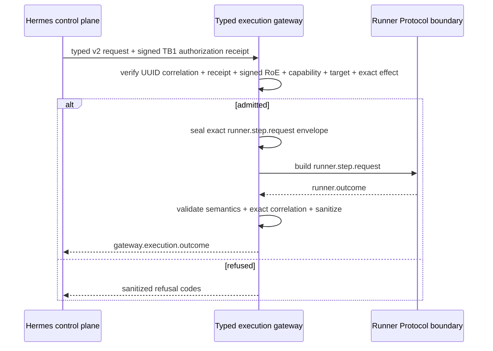

# EPIC-03 — Typed Kali MCP

## 1. Metadata

| Field | Value |
| --- | --- |
| Concept epic ID | `EPIC-03` |
| Slug | `typed-kali-mcp` |
| Pillar | `B` — Runtime Foundation |
| Phase | 2 |
| Priority | P0 |
| Delivery umbrella | `SVP2-B-01` (issue [#79](https://github.com/pestoura/hermes-security-labs/issues/79)) |
| Document version | 1.3.0 |
| Document date | 2026-08-07 |
| Catalogue | [Epic catalogue 45](../epic-catalogue-45.md) |
| Lifecycle contract | [Architecture documentation lifecycle](../../architecture/architecture-documentation-lifecycle.md) |

## 2. Current status

**IMPLEMENTING** — the repository contains the typed gateway contract, canonical RoE admission boundary, TB1 authorization validation, gateway-to-Runner Protocol v2 message-construction boundary, canonical UUID correlation contract v2 and a sanitized typed execution-outcome candidate. Kali MCP handler integration, runner authentication, deployed gateway enforcement and production execution remain `NOT_RUN` / `NOT_IMPLEMENTED` as applicable.

| Lifecycle state | Reached |
| --- | --- |
| INTENT | yes |
| IMPLEMENTING | yes |
| AS_BUILT | no |
| FINAL | no |

## 3. Problem and motivation

The current Kali MCP generic command surface cannot be treated as the production execution boundary. Arbitrary command execution cannot be authorized, audited or bounded per capability with the guarantees required by the Security Validation Platform v2.

Additional repository contract gaps have been closed incrementally:

- legacy gateway correlation accepted arbitrary bounded strings while TB1 authorization and Runner Protocol v2 require UUID correlation;
- Runner Protocol v2 terminal outcomes can contain raw `output`, evidence URIs and free-form error text that must not be forwarded directly into the control plane;
- the logical Runner request fingerprint deliberately excludes retry-specific fields, so an outcome verifier needs a separately sealed full request envelope to bind an exact `attempt_id` without breaking idempotency semantics.

## 4. Intended outcome

A typed Security Execution Gateway where every operation is declared, schema-validated, capability-bound, authorization-bound and fail-closed before any future dispatch to a runner, and where terminal runner results cross back to Hermes only through a correlation-bound sanitized outcome contract.

## 5. Scope and non-goals

### In scope

- versioned typed operation registry and strict request schemas;
- explicit operation/capability and intrusiveness bindings;
- deterministic refusal for undeclared, incompatible or unauthorized operations;
- canonical signed RoE admission boundary;
- validation of Hermes-issued TB1 authorization receipts;
- Runner Protocol v2 request construction after successful admission;
- canonical v2 UUID correlation for campaign/run/step/attempt;
- explicit no-rewrite v1→v2 migration;
- sealed full-request integrity context for future outcome correlation;
- sanitized typed terminal outcome derivation from Runner Protocol v2;
- normal-profile prohibition of arbitrary command execution.

### Non-goals

- rewriting Kali tooling;
- adding offensive tooling;
- claiming deployed Kali MCP handlers, real runner execution or target interaction;
- allowing the execution plane to create or expand authorization;
- generating or silently normalizing correlation identifiers for legacy callers;
- forwarding raw runner output, evidence URIs or free-form error details into Hermes;
- claiming runner identity/transport authentication or Evidence Plane persistence before runtime evidence exists.

## 6. Intent architecture

Hermes/control plane is the sole authorization authority. It provides a typed request plus a signed short-lived TB1 authorization receipt. The gateway validates the receipt, independently revalidates the signed RoE contract, capability, target, runtime and exact typed effect, and either refuses or constructs a Runner Protocol v2 request. Repository-level construction is not dispatch.

For new integrations, the admission request uses schema `2.0.0` and UUID `campaign_id`, `run_id`, `step_id` and `attempt_id`. Legacy v1 remains transitional compatibility and is never rewritten to manufacture v2-compatible identity.

After a valid Runner request is built, the gateway can seal the exact message as canonical JSON plus a SHA-256 covering the complete envelope. A future terminal Runner Protocol outcome must match the sealed four-ID correlation before the gateway can derive a sanitized `gateway.execution.outcome` for Hermes.

Actual runtime dispatch and transport are deliberately absent from the implementation claim because they remain `NOT_RUN`.

## 7. Contracts, data and capabilities

Canonical repository components include:

- `platform/gateway-protocol/operation-registry.schema.json`;
- `platform/gateway-protocol/gateway-request.schema.json` — legacy v1 internal request;
- `platform/gateway-protocol/gateway-request-v2.schema.json` — canonical v2 internal request;
- `platform/gateway-protocol/admission-request.schema.json` — legacy v1 external request;
- `platform/gateway-protocol/admission-request-v2.schema.json` — canonical v2 external request;
- `platform/gateway-protocol/gateway-execution-outcome.schema.json` — sanitized gateway → Hermes terminal result candidate;
- `platform/gateway-protocol/operation-registry.yaml`;
- `platform/gateway-protocol/gateway_protocol.py`;
- `platform/gateway-protocol/admission.py`;
- `platform/gateway-protocol/runner_handoff.py`;
- `platform/gateway-protocol/outcome.py`;
- `platform/authorization-contract/authorization-receipt.schema.json`;
- `platform/authorization-contract/authorization_receipt.py`;
- Runner Protocol v2 SDK/contract under `platform/runner-protocol/`.

Cross-plane ownership remains governed by the [reference architecture](../../architecture/security-validation-reference-architecture.md), [ADR-0001](../../architecture/adr/ADR-0001-plane-separation-and-authorization-authority.md), [ADR-0003](../../architecture/adr/ADR-0003-typed-contracts-over-generic-execution.md), [ADR-0010](../../architecture/adr/ADR-0010-versioned-uuid-correlation-contract.md) and the [canonical contract inventory](../../architecture/contracts/README.md).

## 8. Dependencies and sequencing

- [EPIC-01 — Architecture and canonical contracts](EPIC-01-architecture-and-canonical-contracts.md)
- [EPIC-02 — Single source of truth for runtime](EPIC-02-single-source-of-truth-for-runtime.md)
- [EPIC-05 — Runner Protocol v2](EPIC-05-runner-protocol-v2.md)
- [EPIC-28 — Rules of Engagement as Code](EPIC-28-rules-of-engagement-as-code.md)

Repository-level contract/admission/outcome work precedes any real Kali MCP handler or production runner integration.

## 9. Security, risks and failure modes

- typed surface lagging behind operational needs and prompting bypass;
- overly broad capabilities recreating generic execution;
- treating message construction as evidence of dispatch or execution;
- accepting caller-supplied `ALLOW`, naked authorization references or embedded authorization artifacts;
- execution plane creating or amplifying authorization contrary to ADR-0001;
- changed operation parameters reusing stale authority;
- non-UUID correlation silently normalized before Runner Protocol;
- unknown schema versions being interpreted as supported contracts;
- mutating a built Runner request after its logical fingerprint is created, especially `attempt_id` which is intentionally excluded from replay fingerprint semantics;
- forwarding raw runner output, evidence location or verbose error context into the control plane;
- treating a structurally valid outcome as proof of runner identity before transport authentication exists.

Current invariants:

- Hermes/control plane is the only execution authorization authority;
- generic shell/command/argv/cwd/environment execution is forbidden in the normal profile;
- signed RoE and signed TB1 authorization are independently verified;
- the TB1 receipt binds the exact typed effect, including canonical operation-parameters SHA-256;
- v2 requires UUID correlation at schema-validation time;
- v1 remains unchanged as transitional compatibility;
- migration never generates, maps or normalizes IDs;
- any admission/handoff refusal produces no Runner Protocol request;
- `request_built` means construction only;
- the complete built Runner request is sealed separately from the logical retry fingerprint before outcome validation;
- a typed execution outcome requires exact correlation with that sealed request;
- raw runner `output`, evidence `uri`, error `message` and `safe_context` never cross the gateway → Hermes outcome contract;
- evidence references are descriptive and never authorize execution;
- no secrets or restricted runner payload appear in log-safe decision metadata;
- no external/customer target execution is claimed.

## 10. Deliverables

Repository-level candidates currently delivered:

- typed operation registry and request schemas;
- deterministic gateway validation/refusal logic;
- canonical signed RoE admission API;
- TB1 authorization-receipt verification at the execution boundary;
- canonical gateway-to-Runner Protocol v2 message-construction path;
- canonical UUID correlation v2 schemas and no-rewrite migration helper;
- exact Runner-request sealing contract for terminal outcome correlation;
- strict sanitized `gateway.execution.outcome` schema and derivation logic;
- adversarial and lifecycle regression tests.

Still pending:

- actual Kali MCP typed handlers;
- deployed gateway service and runtime configuration;
- real authorization receipt issuance integration from Hermes;
- real runner dispatch/result transport and runner authentication;
- Evidence Plane persistence/chain-of-custody integration;
- proof that generic runtime surfaces are absent from the deployed normal profile;
- explicit retirement criteria for v1 compatibility.

## 11. Acceptance criteria

Repository-level criteria already demonstrated or covered by the current block:

- undeclared/generic execution inputs are refused deterministically;
- caller-supplied authorization cannot create an allow decision;
- signed RoE and TB1 authorization mismatches fail closed;
- exact operation-effect changes require new authorization;
- v2 rejects non-UUID campaign/run/step/attempt identifiers;
- unknown schema versions fail closed;
- v1→v2 promotion never rewrites correlation identifiers;
- Runner Protocol request construction happens only after successful checks;
- a terminal outcome cannot be derived without a previously sealed built request;
- exact four-ID correlation is checked against the sealed request, including `attempt_id`;
- raw output, evidence URI and free-form runner error text are not present in the gateway → Hermes derivative;
- malformed Runner Protocol outcomes or tampered sealed contexts fail closed.

Umbrella completion still requires deployed evidence showing:

- no operation reaches runtime without a matching typed declaration and active authorization;
- deployed normal profile exposes no generic execution path;
- real handlers preserve the same refusal, correlation, timeout and evidence contracts;
- runtime state and target constraints are enforced before dispatch;
- runner identity and transport authenticity are verified before outcomes are accepted;
- real outcome/evidence persistence preserves chain of custody.

## 12. Evidence and validation plan

Current evidence is repository/CI only:

- gateway protocol and adversarial platform tests;
- UUID correlation v2/migration tests;
- RoE/TB1 authorization tests;
- Runner request sealing and sanitized outcome tests;
- Runner Protocol v2 conformance;
- lifecycle and source-of-truth regression tests;
- GitHub `security` and `validate` gates on PR and post-merge `main`.

Deployment/runtime evidence remains `NOT_RUN` and must be recorded in issue #79 before the umbrella can close.

## 13. Decisions and open questions

### Decisions

- Generic shell passthrough is not part of the normal typed gateway profile.
- Hermes/control plane remains the sole execution-authorization authority.
- The gateway may validate, restrict and refuse; it may not create or expand authority.
- A Runner Protocol message is produced only after signed authorization and fresh gateway admission agree on the exact typed effect.
- Correlation schema `2.0.0` is canonical for new gateway/admission integrations and requires UUID campaign/run/step/attempt IDs.
- Schema `1.0.0` remains transitional compatibility and is not silently tightened in place.
- No component generates, maps or normalizes correlation IDs as part of the v1→v2 migration.
- The logical Runner request fingerprint retains its retry semantics; exact attempt binding for outcomes is provided by a separate full-envelope SHA-256 over a canonical sealed request snapshot.
- The gateway → Hermes result is a sanitized derivative rather than the raw `runner.outcome`.
- No hash of arbitrary raw runner output is forwarded to Hermes; raw integrity is represented by evidence-reference digests and belongs to the future Evidence Plane.

### Open questions

- final packaging/service boundary for the deployed typed Kali MCP gateway;
- retirement criteria/date for gateway/admission schema v1;
- exact production handler set for the first normal-profile rollout;
- operational Hermes issuance/signing-key custody and deployed authorization trust-store lifecycle;
- runner workload identity, mutual authentication and transport mechanism for the deployed outcome path;
- Evidence Plane storage and retention integration for raw outcomes/artifacts.

## 14. Implementation notes

> Reserved lifecycle section. It is populated progressively while the epic is `IMPLEMENTING`; retaining the `Reserved` marker is required by the architecture documentation lifecycle contract.

Integrated repository-level progression:

- typed gateway contract candidate and normal-profile registry were implemented before the current lifecycle reconciliation;
- PR #160 established the canonical admission boundary that revalidates signed RoE rather than trusting caller-supplied decisions;
- PR #161 connected admitted typed operations to Runner Protocol v2 message construction while keeping dispatch `NOT_RUN`;
- PR #162 corrected TB1 authority ownership so Hermes issues the signed authorization receipt/reference and the gateway only verifies/consumes it, including exact operation-parameter digest binding;
- PR #163 reconciled EPIC-03 lifecycle/source-of-truth to `IMPLEMENTING`;
- PR #164 added versioned UUID request contracts and ADR-0010 while preserving v1 compatibility and `NO_RUNTIME_CHANGE`;
- the current typed-outcome block implements the repository candidate for sealed request integrity plus a sanitized gateway → Hermes terminal outcome, without runner transport or Evidence Plane execution.

All of these blocks remain repository-level and non-executing.

## 15. As-built / final architecture

> Reserved lifecycle section. This section records current implementation limits but remains non-final until deployed runtime evidence satisfies the umbrella acceptance criteria.

Current factual boundary:

- typed contract/registry/decision logic: `CANDIDATE`;
- canonical signed RoE admission: `CANDIDATE`;
- TB1 signed authorization receipt verification: `CANDIDATE`;
- gateway/admission UUID correlation v2: `CANDIDATE`;
- legacy correlation v1: `TRANSITIONAL_COMPATIBILITY`;
- gateway-to-Runner Protocol v2 message construction: `CANDIDATE`;
- sanitized typed execution outcome derivation: `CANDIDATE`;
- exact sealed-request integrity context: `CANDIDATE`;
- Hermes operational receipt issuance: `NOT_IMPLEMENTED` / `NOT_RUN`;
- real runner identity/transport authentication: `NOT_IMPLEMENTED` / `NOT_RUN`;
- deployed gateway outcome reception: `NOT_RUN`;
- Kali MCP handler integration: `NOT_RUN`;
- gateway deployment: `NOT_RUN`;
- production runtime observation: `NOT_RUN`;
- real Runner Protocol dispatch/capability execution: `NOT_RUN`;
- Evidence Plane runtime integration: `NOT_RUN`;
- runtime changes: `NO_RUNTIME_CHANGE`.

`AS_BUILT` and `FINAL` remain false.

_Lifecycle unchanged: EPIC-03 is `IMPLEMENTING`; `AS_BUILT` and `FINAL` remain no. The record below states exactly what was merged and where the evidence lives, so that a future promotion decision is not made from memory or by association._
### Exact evidence

| Evidence | Value |
| --- | --- |
| Technical pull request | [#164](https://github.com/pestoura/hermes-security-labs/pull/164) |
| Validated PR head | `53b0495ed86383f3e9e1132b868c67936a92b9d3` |
| Integrated `main` merge commit | `90b3bb3a99ac5b859528c2587b3347b3571bc154` |
| Pre-merge `validate` | success — run `31202197202` |
| Pre-merge `security` | success — run `31202198038` |
| Post-merge `main` `validate` | success — run `31202695801` |
| Post-merge `main` `security` | success — run `31202694101` |

The merge commit is an ancestor of `main`.

### Evidence that is missing for promotion

`AS_BUILT` is withheld because the epic's target state is not satisfied by repository-level contract integration alone:

- deployed gateway enforcement, Kali MCP handler integration and Hermes operational receipt issuance: NOT_IMPLEMENTED / NOT_RUN;
- production execution and runtime dispatch: NOT_RUN.

`NO_RUNTIME_CHANGE`.

## 16. Document change log

| Date | Version | Change |
| --- | --- | --- |
| 2026-08-06 | 1.0.0 | Initial intent document created from the concept epic catalogue. |
| 2026-08-07 | 1.1.0 | Reconciled lifecycle to `IMPLEMENTING` and recorded the typed gateway, signed admission, TB1 authority and Runner handoff repository-level implementation without claiming runtime deployment. |
| 2026-08-07 | 1.2.0 | Added the canonical UUID correlation contract v2 and ADR-0010 with explicit no-rewrite v1 migration; runtime remains unchanged. |
| 2026-08-07 | 1.3.0 | Added the sealed request context and sanitized typed execution-outcome repository candidate; runner authentication, transport, persistence and runtime remain `NOT_RUN`. |
