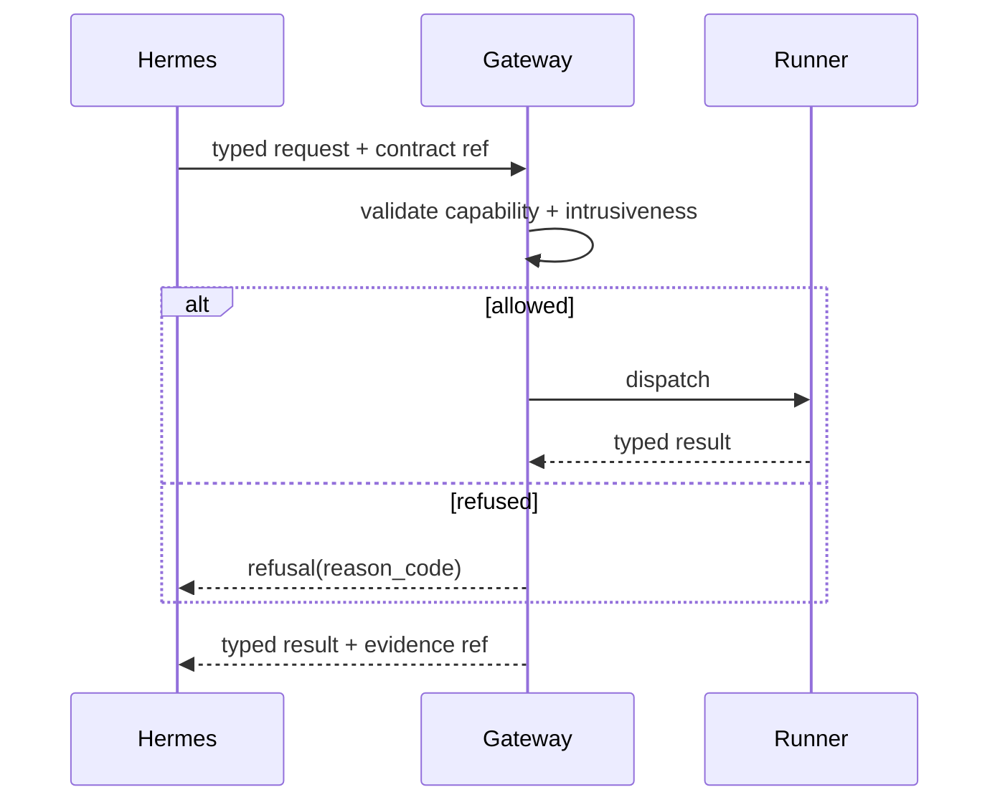

# EPIC-03 — Typed Kali MCP

## 1. Metadata

| Field | Value |
| --- | --- |
| Concept epic ID | `EPIC-03` |
| Slug | `typed-kali-mcp` |
| Pillar | `B` — Runtime Foundation |
| Phase | 2 |
| Priority | P0 |
| Delivery umbrella | `SVP2-B-01` (issue [#79](https://github.com/pestoura/hermes-security-labs/issues/79)) |
| Document version | 1.0.0 |
| Document date | 2026-08-06 |
| Catalogue | [Epic catalogue 45](../epic-catalogue-45.md) |
| Lifecycle contract | [Architecture documentation lifecycle](../../architecture/architecture-documentation-lifecycle.md) |

## 2. Current status

**INTENT** — nothing described in this document is implemented. Sections 14 and 15
are reserved and must be filled during and after implementation, as required by the
[documentation lifecycle contract](../../architecture/architecture-documentation-lifecycle.md).

| Lifecycle state | Reached |
| --- | --- |
| INTENT | yes |
| IMPLEMENTING | no |
| AS_BUILT | no |
| FINAL | no |

## 3. Problem and motivation

The current Kali MCP exposes a generic command surface. Arbitrary command execution cannot be authorized, audited or bounded per capability.

## 4. Intended outcome

A typed Security Execution Gateway protocol where each operation is a declared capability with typed inputs, typed outputs, declared intrusiveness and declared side effects.

## 5. Scope and non-goals

### In scope

- Kali MCP Protocol v2 typed operation catalogue
- Per-operation intrusiveness level L0-L4
- Deterministic refusal for undeclared operations
- Normalized error taxonomy

### Non-goals

- Rewriting Kali tooling
- Adding new offensive tooling

## 6. Intent architecture

Gateway validates request against the capability registry and the active authorization contract before dispatch; unknown or out-of-contract operations are refused before reaching a runner.

### Intent diagram

## 7. Contracts, data and capabilities

- Typed operation schema: id, inputs, outputs, intrusiveness, side effects
- Refusal record with reason code

Contracts are canonical in Git. Where this epic reuses a platform-wide contract, the
canonical definition lives in the
[reference architecture](../../architecture/security-validation-reference-architecture.md)
and in [EPIC-01](EPIC-01-architecture-and-canonical-contracts.md); this document
references it instead of restating it.

## 8. Dependencies and sequencing

- [EPIC-01 — Architecture and canonical contracts](EPIC-01-architecture-and-canonical-contracts.md)
- [EPIC-02 — Single source of truth for runtime](EPIC-02-single-source-of-truth-for-runtime.md)

Sequencing follows the phase model in the
[intent document](../../architecture/security-validation-platform-v2-intent.md).
This epic is planned for phase 2.

## 9. Security, risks and failure modes

- Typed surface lagging behind operational needs and prompting bypass
- Overly wide capability definitions re-creating generic execution

Platform-wide invariants that this epic must not weaken:

- absence of evidence never produces a `PASS` verdict;
- no execution outside an active authorization contract;
- no secrets, tokens, cookies or raw credential material in documentation, telemetry
  or persisted evidence;
- no target outside registered laboratories.

## 10. Deliverables

- Protocol v2 specification
- Capability declaration format

## 11. Acceptance criteria

- No operation executes without a matching typed declaration
- Every refusal carries a machine-readable reason code

## 12. Evidence and validation plan

- Protocol conformance test plan

Evidence must be referenced from the delivery umbrella issue before the umbrella can
be closed, and this document must record the references in section 15.

## 13. Decisions and open questions

### Decisions taken at intent time

- Generic shell passthrough is not part of Protocol v2

### Open questions

- How experimental capabilities are staged without weakening the gate

## 14. Implementation notes

> Reserved. Populate during implementation with pull request references, deviations
> from intent, and decisions taken while building. Do not delete this heading.

_Not started._

## 15. As-built / final architecture

> Reserved. Populate when the delivery umbrella reaches completion. Must record what
> was actually built, evidence links, and every divergence from sections 6 to 11.
> No umbrella may be closed while this section is empty.

_Not started._

## 16. Document change log

| Date | Version | Change |
| --- | --- | --- |
| 2026-08-06 | 1.0.0 | Initial intent document created from the concept epic catalogue. |
