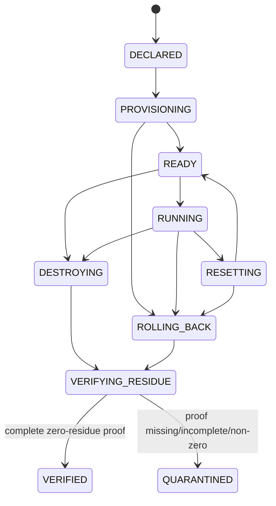
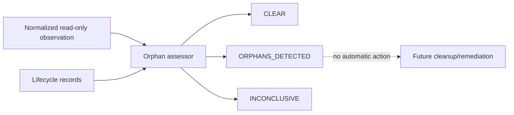

# EPIC-04 — Transactional lifecycle and isolation

## 1. Metadata

| Field | Value |
| --- | --- |
| Concept epic ID | `EPIC-04` |
| Slug | `transactional-lifecycle-and-isolation` |
| Pillar | `B` — Runtime Foundation |
| Phase | 2 |
| Priority | P0 |
| Delivery umbrella | `SVP2-B-03` (issue [#81](https://github.com/pestoura/hermes-security-labs/issues/81)) |
| Document version | 1.2.0 |
| Document date | 2026-08-07 |
| Catalogue | [Epic catalogue 45](../epic-catalogue-45.md) |
| Lifecycle contract | [Architecture documentation lifecycle](../../architecture/architecture-documentation-lifecycle.md) |

## 2. Current status

**IMPLEMENTING** — PR #139 integrated the repository-level transactional lifecycle, isolation, zero-residue and quarantine contract candidate. The current block adds a read-only orphan observation/assessment candidate. Real Docker lifecycle operations, runtime resource scanning, periodic scheduling, cleanup/remediation and residue observation against real resources remain `NOT_RUN` / `NOT_IMPLEMENTED` as applicable.

| Lifecycle state | Reached |
| --- | --- |
| INTENT | yes |
| IMPLEMENTING | yes |
| AS_BUILT | no |
| FINAL | no |

## 3. Problem and motivation

Laboratory lifecycle operations can partially fail and leave residual containers, networks, volumes, processes, mounts or temporary paths, which breaks determinism, isolation and safe laboratory reuse. A runtime may also accumulate resources that no longer have a legitimate active lifecycle owner, so the platform needs a fail-closed way to classify observed residue without coupling detection to destructive cleanup.

## 4. Intended outcome

Lab lifecycle is transactional: the repository contract defines declared transitions, compensating paths and fail-closed residue verification. A laboratory can become reusable only after the required state and evidence checks succeed; absence or inconsistency of cleanup evidence leads to quarantine rather than an optimistic success state.

A separate orphan-assessment contract classifies normalized read-only observations as `CLEAR`, `ORPHANS_DETECTED` or `INCONCLUSIVE`. Detection is descriptive only; cleanup remains an explicitly separate future operation.

## 5. Scope and non-goals

### In scope

- Transactional lifecycle state machine with compensation paths
- Zero-residue proof for containers, networks, volumes, processes, mounts and temporary paths
- One declared network per laboratory and default isolated/deny-all egress
- Effective-network observation before READY/RUNNING
- Deterministic reset/rollback contract
- Quarantine and reuse blocking when cleanup cannot be proven
- Snapshot and rollback references for L3/L4 contracts
- Strict normalized orphan-observation contract
- Read-only orphan assessment with stable fail-closed result codes
- Explicit quarantine-retention handling for observed residue

### Non-goals

- Introducing privileged containers, host networking, Docker socket or host mounts
- Executing Docker lifecycle operations in this repository block
- Enumerating real Docker/Kubernetes/process/network resources in the assessor
- Automatically deleting, stopping or quarantining observed resources
- Claiming real cleanup, rollback, orphan detection cadence or residue observation without runtime evidence

## 6. Intent architecture

The implemented repository candidate uses an explicit lifecycle state machine with compensating transitions and a separate verification stage before cleanup may be considered successful.

`QUARANTINED` has no reuse transition in the repository policy.

The orphan assessor is deliberately separate from this transition engine:

No runtime cleanup path exists in the current candidate.

## 7. Contracts, data and capabilities

Canonical repository candidates:

- `platform/lab-lifecycle/lab-lifecycle-contract.schema.json`;
- `platform/lab-lifecycle/lab-transition-request.schema.json`;
- `platform/lab-lifecycle/zero-residue-proof.schema.json`;
- `platform/lab-lifecycle/lifecycle-policy.yaml`;
- `platform/lab-lifecycle/lifecycle_protocol.py`;
- `platform/lab-lifecycle/orphan-observation.schema.json`;
- `platform/lab-lifecycle/orphan-assessment.schema.json`;
- `platform/lab-lifecycle/orphan_detector.py`.

The lifecycle contracts bind lab/campaign/contract identity, lifecycle state, network posture, isolation controls, limits, recovery references and cleanup evidence. The orphan contract carries only normalized lifecycle records and opaque resource references; raw paths, targets, commands, sockets and credentials are outside the schema.

## 8. Dependencies and sequencing

- [EPIC-03 — Typed Kali MCP](EPIC-03-typed-kali-mcp.md)
- [EPIC-08 — Network and egress policy](EPIC-08-network-and-egress-policy.md)
- Runner Protocol / B-02 precedes deployed lifecycle integration.

Repository contract validation can proceed before real runtime integration. A future read-only scanner must precede periodic orphan detection, and any cleanup/remediation capability must remain separate from observation/assessment.

## 9. Security, risks and failure modes

- Orphaned resources after abrupt termination
- Incomplete compensation leaving mixed state
- Cleanup evidence being treated as optional
- Reuse after partial cleanup
- Shared or wider-than-declared networks weakening customer/lab separation
- L3/L4 activity without recovery references
- Partial/unavailable orphan scans being mistaken for proof of absence
- Detection logic automatically mutating runtime state
- Raw paths or sensitive runtime identifiers leaking into observations/logs
- Quarantined residue being retained indefinitely without an explicit retention deadline

Current repository invariants:

- missing, partial, unavailable, mismatched or non-zero residue evidence never produces `VERIFIED`;
- such cleanup failures result in `QUARANTINED` and block reuse;
- isolation forbids privileged mode, host networking, Docker socket, host mounts and shared networks;
- READY/RUNNING requires an effective network observation;
- L3/L4 requires snapshot and rollback references;
- a partial or unavailable orphan scan cannot produce `CLEAR`;
- definite orphan evidence remains `ORPHANS_DETECTED` even in a partial scan;
- resources after `VERIFIED`, under unknown labs, mismatched campaigns or expired active contracts are orphan candidates;
- quarantine residue is tracked only until its explicit retention deadline; absence/expiry of that deadline is an orphan condition;
- cleanup-in-progress states are not prematurely classified as orphaned;
- orphan assessment always records `cleanup_performed: false`;
- runtime status remains `NOT_RUN`;
- no execution outside an active authorization contract;
- no secrets, tokens, cookies or raw credential material in decision records;
- no target outside registered laboratories.

## 10. Deliverables

Repository candidates already delivered:

- lifecycle contract and transition-request schemas;
- transactional state/compensation policy;
- zero-residue proof schema and canonical digest validation;
- deterministic fail-closed transition engine;
- quarantine/reuse blocking semantics;
- isolation and recovery constraints;
- normalized orphan observation and assessment schemas;
- non-destructive orphan classification logic;
- regression and adversarial tests.

Still pending:

- reviewed Docker lifecycle adapters;
- real state-based attach/detach and cleanup;
- real zero-residue scanner/proof production;
- runtime resource scanner producing normalized orphan observations;
- periodic orphan scan scheduler/cadence;
- cleanup/remediation action after human/policy decision;
- deployed rollback/snapshot execution;
- controlled runtime acceptance and rollback validation.

## 11. Acceptance criteria

Repository-level criteria implemented by #139 and the current orphan-assessment block:

- undefined transitions are refused;
- cleanup proof failure quarantines and blocks reuse;
- no repository contract permits privileged, host-network, Docker-socket, host-mount or shared-network laboratory operation;
- L3/L4 contracts require recovery references;
- `VERIFIED` requires a complete zero-residue proof;
- incomplete orphan scans never produce a false `CLEAR`;
- structurally invalid/duplicated observations fail closed;
- orphan assessment does not execute cleanup or runtime mutations;
- opaque resource references prevent raw path input in this contract.

Umbrella completion still requires runtime evidence that:

- real Docker cleanup produces zero residue;
- state-based attach/detach behaves transactionally under failures/races;
- a real authenticated/controlled scanner observes runtime resources correctly;
- periodic orphan detection identifies leftover resources in the real runtime;
- orphan cleanup/quarantine actions are separately controlled and auditable;
- real snapshot/rollback, TTL and data budgets are enforced.

## 12. Evidence and validation plan

Existing repository evidence:

- PR #139 merged as `591552d652fbff82d81f750535799380e9c643a9`;
- post-merge `security` run `31135492162`: success;
- post-merge `validate` run `31135492132`: success;
- PR #166 reconciled EPIC-04/08 lifecycle/source-of-truth and post-merge `security #1092` + `validate #1094` passed.

Current block adds schema/adversarial tests for orphan classification, partial/unavailable scans, lifecycle/campaign mismatch, contract expiry, quarantine retention, duplicate observations and non-destructive summaries.

Deployment/runtime evidence remains `NOT_RUN` and must be referenced from issue #81 before the umbrella may close.

## 13. Decisions and open questions

### Decisions

- Failure to prove zero residue is failure, not warning.
- Cleanup uncertainty leads to quarantine and reuse blocking.
- Isolation prohibits Docker-socket/host-level escape surfaces in the lab contract.
- Repository contract implementation does not constitute proof of Docker cleanup.
- Orphan observation, assessment and cleanup are separate capabilities.
- A partial/unavailable scan cannot attest absence of orphans.
- Definite orphan findings are preserved even when scan completeness is partial.
- Quarantine retention is explicit and independent of the authorization contract expiry; the assessment only evaluates whether retention is declared and still active at observation time.

### Open questions

- Exact runtime scanner/workload identity and observation authenticity mechanism
- Exact adapter/service boundary for Docker lifecycle operations
- Periodic orphan-detector cadence and durable observation ownership
- Human/policy approval model for orphan remediation and forensic retention

## 14. Implementation notes

> Reserved lifecycle section. It is populated progressively while the epic is `IMPLEMENTING`; retaining the `Reserved` marker is required by the architecture documentation lifecycle contract.

- PR #139 implemented the contract-only transactional lifecycle, isolation and zero-residue decision candidate.
- Technical merge: `591552d652fbff82d81f750535799380e9c643a9`.
- PR #166 reconciled EPIC-04/08 lifecycle/source-of-truth to factual `IMPLEMENTING` with green post-merge validation.
- The current block adds the repository-only orphan observation/assessment contract and decision logic.
- No Docker, scanner, network, laboratory, target or cleanup operation is executed by the assessor.

## 15. As-built / final architecture

> Reserved lifecycle section. This records current implementation limits but remains non-final until deployed runtime evidence satisfies issue #81 acceptance criteria.

Current factual boundary:

- lifecycle contract and decision logic: `CANDIDATE`;
- zero-residue proof contract/validation: `CANDIDATE`;
- quarantine/reuse blocking: `CANDIDATE`;
- orphan observation/assessment contract and decision logic: `CANDIDATE`;
- runtime resource scanner: `NOT_IMPLEMENTED` / `NOT_RUN`;
- periodic orphan scan scheduler: `NOT_IMPLEMENTED`;
- orphan cleanup/remediation: `NOT_IMPLEMENTED` / `NOT_RUN`;
- Docker lifecycle integration: `NOT_RUN`;
- zero-residue observation against real resources: `NOT_RUN`;
- real snapshot/rollback execution: `NOT_RUN`;
- runtime changes: `NO_RUNTIME_CHANGE`.

`AS_BUILT` and `FINAL` remain false.

## 16. Document change log

| Date | Version | Change |
| --- | --- | --- |
| 2026-08-06 | 1.0.0 | Initial intent document created from the concept epic catalogue. |
| 2026-08-07 | 1.1.0 | Reconciled lifecycle to `IMPLEMENTING` using PR #139 and post-merge evidence; preserved all runtime limitations. |
| 2026-08-07 | 1.2.0 | Added read-only orphan observation/assessment contract candidate while keeping scanner, scheduler and remediation runtime capabilities unimplemented. |
