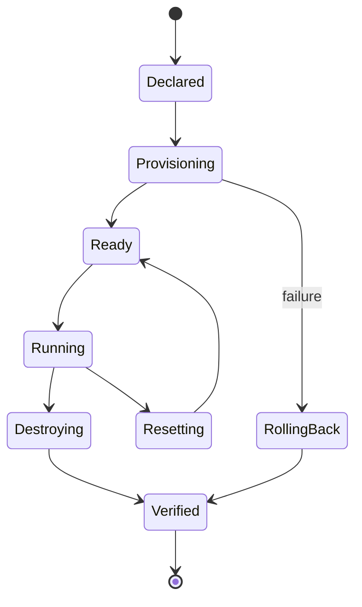

# EPIC-04 — Transactional lifecycle and isolation

## 1. Metadata

| Field | Value |
| --- | --- |
| Concept epic ID | `EPIC-04` |
| Slug | `transactional-lifecycle-and-isolation` |
| Pillar | `B` — Runtime Foundation |
| Phase | 2 |
| Priority | P0 |
| Delivery umbrella | `SVP2-B-03` (issue [#81](https://github.com/pestoura/hermes-security-labs/issues/81)) |
| Document version | 1.0.0 |
| Document date | 2026-08-06 |
| Catalogue | [Epic catalogue 45](../epic-catalogue-45.md) |
| Lifecycle contract | [Architecture documentation lifecycle](../../architecture/architecture-documentation-lifecycle.md) |

## 2. Current status

**INTENT** — nothing described in this document is implemented. Sections 14 and 15
are reserved and must be filled during and after implementation, as required by the
[documentation lifecycle contract](../../architecture/architecture-documentation-lifecycle.md).

| Lifecycle state | Reached |
| --- | --- |
| INTENT | yes |
| IMPLEMENTING | no |
| AS_BUILT | no |
| FINAL | no |

## 3. Problem and motivation

Laboratory lifecycle operations can partially fail and leave residual containers, networks or volumes, which breaks determinism and isolation guarantees.

## 4. Intended outcome

Lab lifecycle is transactional: either the environment reaches the declared state, or it is rolled back with proof of zero residue.

## 5. Scope and non-goals

### In scope

- Transactional create/reset/destroy with compensation
- Zero-residue proof: containers, networks, volumes, temp files
- One network per laboratory, default-deny egress
- Deterministic reset

### Non-goals

- Introducing privileged containers or host networking

## 6. Intent architecture

Lifecycle state machine with explicit states and compensating transitions; residue verification runs after every terminal transition.

### Intent diagram

## 7. Contracts, data and capabilities

- Lifecycle state machine states and transitions
- Residue proof record

Contracts are canonical in Git. Where this epic reuses a platform-wide contract, the
canonical definition lives in the
[reference architecture](../../architecture/security-validation-reference-architecture.md)
and in [EPIC-01](EPIC-01-architecture-and-canonical-contracts.md); this document
references it instead of restating it.

## 8. Dependencies and sequencing

- [EPIC-03 — Typed Kali MCP](EPIC-03-typed-kali-mcp.md)

Sequencing follows the phase model in the
[intent document](../../architecture/security-validation-platform-v2-intent.md).
This epic is planned for phase 2.

## 9. Security, risks and failure modes

- Orphaned resources after abrupt termination
- Reset that is not byte-deterministic

Platform-wide invariants that this epic must not weaken:

- absence of evidence never produces a `PASS` verdict;
- no execution outside an active authorization contract;
- no secrets, tokens, cookies or raw credential material in documentation, telemetry
  or persisted evidence;
- no target outside registered laboratories.

## 10. Deliverables

- Lifecycle state machine specification
- Isolation policy per lab family

## 11. Acceptance criteria

- Every terminal transition emits a residue proof
- No lab runs with privileged, host network or Docker socket

## 12. Evidence and validation plan

- Residue proof samples
- Lifecycle self-test plan

Evidence must be referenced from the delivery umbrella issue before the umbrella can
be closed, and this document must record the references in section 15.

## 13. Decisions and open questions

### Decisions taken at intent time

- Failure to prove zero residue is treated as failure, not warning

### Open questions

- Retention window for forensic residue before cleanup

## 14. Implementation notes

> Reserved. Populate during implementation with pull request references, deviations
> from intent, and decisions taken while building. Do not delete this heading.

_Not started._

## 15. As-built / final architecture

> Reserved. Populate when the delivery umbrella reaches completion. Must record what
> was actually built, evidence links, and every divergence from sections 6 to 11.
> No umbrella may be closed while this section is empty.

_Not started._

## 16. Document change log

| Date | Version | Change |
| --- | --- | --- |
| 2026-08-06 | 1.0.0 | Initial intent document created from the concept epic catalogue. |
