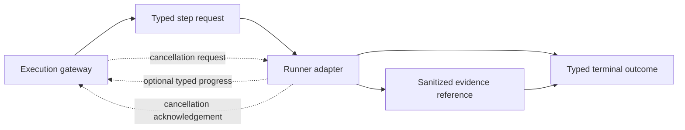
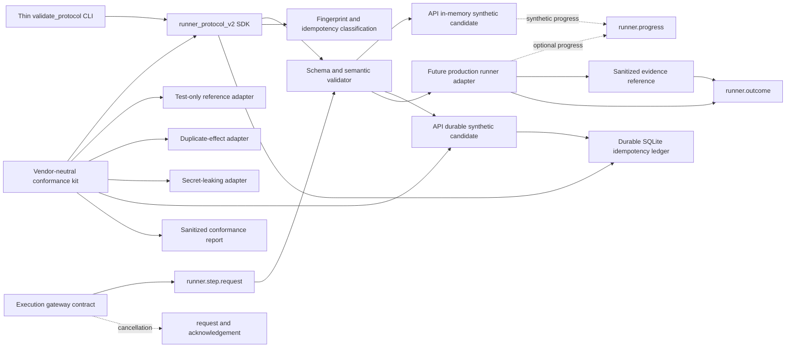

# EPIC-05 — Runner Protocol v2

## 1. Metadata

| Field | Value |
| --- | --- |
| Concept epic ID | `EPIC-05` |
| Slug | `runner-protocol-v2` |
| Pillar | `B` — Runtime Foundation |
| Phase | 1 |
| Priority | P0 |
| Delivery umbrella | `SVP2-B-02` (issue [#80](https://github.com/pestoura/hermes-security-labs/issues/80)) |
| Document version | 1.7.0 |
| Document date | 2026-08-06 |
| Catalogue | [Epic catalogue 45](../epic-catalogue-45.md) |
| Lifecycle contract | [Architecture documentation lifecycle](../../architecture/architecture-documentation-lifecycle.md) |

## 2. Current status

**AS_BUILT** — the contract-only Runner Protocol v2 block was integrated through pull
request [#105](https://github.com/pestoura/hermes-security-labs/pull/105) and validated
again on `main`. The vendor-neutral conformance kit was subsequently integrated through
pull request [#107](https://github.com/pestoura/hermes-security-labs/pull/107) and also
validated on `main`. The repository-local SDK was then integrated through pull request
[#109](https://github.com/pestoura/hermes-security-labs/pull/109) and validated again on
`main`. The API-family synthetic-only candidate was subsequently integrated through pull
request [#111](https://github.com/pestoura/hermes-security-labs/pull/111) and validated
again on `main`. A reusable durable SQLite idempotency ledger was then integrated through
pull request [#113](https://github.com/pestoura/hermes-security-labs/pull/113) and validated
again on `main`. A separate API-family durable synthetic candidate was then integrated
through pull request [#115](https://github.com/pestoura/hermes-security-labs/pull/115) and
validated again on `main`. It uses the durable ledger for restart replay without connecting to
real capabilities or the legacy executor. `FINAL` remains false: production execution integration
is `NOT_RUN`, promotion is blocked, DevSecOps and AI/MCP remain `NOT_RUN`, and bounded live
cancellation has not been demonstrated against real execution.

| Lifecycle state | Reached |
| --- | --- |
| INTENT | yes |
| IMPLEMENTING | yes |
| AS_BUILT | yes |
| FINAL | no |

## 3. Problem and motivation

Runners differ in invocation, correlation, cancellation and error reporting, which prevents
uniform orchestration, deterministic replay decisions and uniform evidence.

## 4. Intended outcome

A single Runner Protocol covering correlation identifiers, cancellation, timeouts, progress,
idempotency, normalized errors and evidence emission.

## 5. Scope and non-goals

### In scope for the epic

- Correlation ID propagation across campaign, run, step and attempt
- Idempotency and deterministic replay/conflict classification
- Cooperative cancellation and bounded hard timeout
- Normalized error taxonomy shared with the gateway
- Mandatory evidence reference per terminal outcome
- Compatibility and migration gates for API, DevSecOps and AI/MCP runners

### In scope for implementation block 1

- Versioned JSON Schema contract bundle
- Semantic validator for timeout, retry, idempotency, progress and secret-safety invariants
- Contract-only compatibility matrix
- Positive and negative conformance tests
- CI integration

### Non-goals for implementation block 1

- Changing runbook semantics of existing packs
- Implementing runner adapters or gateway enforcement
- Starting, cancelling or terminating processes
- Implementing a persistent idempotency ledger or Evidence Plane
- Changing deployment, laboratories, Hermes or Kali MCP

## 6. Intent architecture

The execution gateway sends a typed step request to a runner. Progress is optional but typed
when emitted. Cancellation has a typed request and acknowledgement. Every terminal outcome
contains the same four correlation IDs and at least one sanitized evidence reference. Failure
modes use stable codes rather than raw exceptions or free-text-only status.

The contract does not grant authorization. Hermes remains the authorization authority and a
runner may only restrict, never expand, the active authorization reference.

## 7. Contracts, data and capabilities

The canonical implementation location for this epic is
[`platform/runner-protocol/`](../../../platform/runner-protocol/).

The first block defines:

- `runner.step.request`;
- `runner.progress`;
- `runner.cancellation.request`;
- `runner.cancellation.ack`;
- `runner.outcome`;
- normalized error and evidence-reference definitions;
- compatibility declarations for API, DevSecOps and AI/MCP runner families.

All execution messages carry:

- `campaign_id`;
- `run_id`;
- `step_id`;
- `attempt_id`.

Contracts are canonical in Git. Platform-wide authority and trust-boundary rules remain in the
[reference architecture](../../architecture/security-validation-reference-architecture.md),
[contract inventory](../../architecture/contracts/README.md) and
[EPIC-01](EPIC-01-architecture-and-canonical-contracts.md).

## 8. Dependencies and sequencing

- [EPIC-01 — Architecture and canonical contracts](EPIC-01-architecture-and-canonical-contracts.md) — `FINAL` before this branch was created.

This contract enables later implementation work in:

- EPIC-03 — Typed Kali MCP;
- EPIC-04 — Transactional lifecycle and isolation;
- EPIC-10 — Evidence Plane;
- EPIC-35 — SDK, plugins and runtime certification.

## 9. Security, risks and failure modes

- Legacy runners may partially migrate and diverge from the canonical contract.
- Cancellation may not be honoured by long-running tools until runtime enforcement exists.
- A replay cache may return stale or mismatched outcomes if fingerprint semantics are weakened.
- Retrying an uncertain effect may duplicate impact.
- Raw exception context may expose credentials unless adapters normalize and sanitize errors.
- A protocol-valid request may still be unauthorized; schema validity is never authorization.

Platform-wide invariants that this epic must not weaken:

- absence of evidence never produces a `PASS` verdict;
- no execution outside an active authorization contract;
- no secrets, tokens, cookies or raw credential material in documentation, telemetry
  or persisted evidence;
- no target outside registered laboratories;
- unknown protocol versions and invalid messages fail closed before execution.

## 10. Deliverables

- Runner Protocol v2 specification
- Versioned schema bundle and semantic validator
- Stable normalized error taxonomy
- Compatibility matrix and migration gates
- Contract conformance tests integrated into repository CI
- Migration notes and adapters for existing runners in later blocks

## 11. Acceptance criteria

### Block 1 contract criteria

- Every protocol message requires the four correlation IDs.
- Every terminal outcome requires at least one sanitized evidence reference.
- `PASS` without evidence is schema-invalid.
- Reusing one idempotency key with a different canonical fingerprint is classified as
  `IDEMPOTENCY_CONFLICT` without execution.
- Timeout and cancellation budgets are bounded and semantically ordered.
- Automatic retries are limited to declared transient error codes.
- Raw secret fields are rejected by semantic validation.
- The compatibility matrix makes no false implementation or conformance claim.

### Epic completion criteria

- Every runner adapter carries the four correlation IDs through logs and evidence.
- Repetition with the same idempotency key cannot duplicate effects.
- Cancellation is observable and bounded in live conformance tests.
- Errors are normalized, stable and sanitized across all runner families.

The epic completion criteria are not claimed by the contract-only block.

## 12. Evidence and validation plan

- Validate the JSON Schema as Draft 2020-12.
- Validate representative request, progress, cancellation and terminal outcome messages.
- Reject missing correlation, unknown versions and missing terminal evidence.
- Reject unordered timeout budgets and cancellation grace outside the hard budget.
- Verify identical logical retries have an identical fingerprint despite a new attempt ID.
- Verify changed effects under the same idempotency key become conflicts.
- Verify progress sequence and percentage monotonicity.
- Reject raw secret fields and retryability inconsistent with the stable taxonomy.
- Validate the compatibility matrix remains `contract_only` / `NOT_RUN`.
- Run repository, security, integration, Ruff and gitleaks workflows.
- Record runtime/deployment/Hermes gates as `NOT_APPLICABLE` for this block.

Evidence must be referenced from issue #80 and section 15 before the umbrella can close.

## 13. Decisions and open questions

### Decisions taken at intent time

- No `PASS` may be produced without an evidence reference.

### Decisions taken during implementation

- Protocol version `2.0.0` is one canonical message bundle with typed message variants.
- Progress is optional by default. If emitted, its sequence is strictly monotonic and its
  percentage cannot decrease.
- Absence of progress is not a failure; timeout budgets remain the temporal authority.
- All terminal outcomes, including refusal and timeout, require evidence. Pre-execution
  outcomes use decision/protocol evidence rather than claiming execution evidence.
- Retries retain campaign/run/step IDs and idempotency key but use a new attempt ID.
- `attempt_id` and timestamps are excluded from the canonical effect fingerprint.
- An uncertain result after a possible effect is `INCONCLUSIVE` and is not automatically retried.
- Only transient dependency, runner unavailable and eligible soft-timeout errors may be
  automatically retryable.
- The first block remains contract-only; no existing runner is marked conformant.

### Open questions

- Adapter-specific transport and streaming mechanisms remain for later implementation blocks.
- Ledger retention, abandoned-claim reconciliation and adapter integration remain for later blocks.
- Force-termination implementation belongs to the transactional runtime lifecycle.

## 14. Implementation notes

> Reserved lifecycle section. This section records the contract implementation integrated in
> `main`. It does not claim live runner conformance or runtime enforcement.

### Block 1 — typed contract and semantic validation

- Branch: `feat/epic-05-runner-protocol-v2`
- Umbrella issue: [#80](https://github.com/pestoura/hermes-security-labs/issues/80)
- Pull request: [#105](https://github.com/pestoura/hermes-security-labs/pull/105)
- Validated head: `bd8d44bd3bd8b00e8da39665bcb80489486d1276`
- Squash merge: `3f9753ea2e1db5750f971f01bb1dbfea558723fb`
- Runtime declaration: `NO_RUNTIME_CHANGE`
- Canonical location: `platform/runner-protocol/`
- Existing runner, gateway and pack execution code remained unchanged.

### Corrections made before merge

- The initial negative test correctly rejected a request missing `attempt_id`, but the JSON
  Schema `oneOf` diagnostic hid the actionable leaf error. The validator was improved to
  report nested leaf diagnostics without weakening schema enforcement.
- A branch-local workflow could not publish the CI workflow update because its token lacked
  workflow-write permission. Contract changes were published separately and the permanent CI
  gate was applied through the GitHub connector. No permission was broadened.
- Temporary branch-local workflows were removed before the PR diff and merge.

### Block 2 — vendor-neutral conformance kit (`AS_BUILT`)

- Branch: `feat/epic-05-conformance-kit`
- Pull request: [#107](https://github.com/pestoura/hermes-security-labs/pull/107)
- Validated head: `61fae45bcc096d8fe71464b5c19dec7146447906`
- Squash merge: `944d198a106ebf106631fd18b9c5c5b9aef63942`
- Candidate transport: isolated JSON-lines process
- Test capabilities: synthetic `conformance.*` only
- Report: schema-backed, sanitized and command-hashed
- Promotion effect: none; human review mandatory
- Real API, DevSecOps and AI/MCP adapters: `NOT_RUN`
- Runtime declaration: `NO_RUNTIME_CHANGE`

The merged self-test accepts the deterministic test-only reference adapter and rejects
controlled duplicate-effect and secret-leaking adapters. This is evidence about the kit,
not production conformance evidence for any real runner family.

### Block 3 — repository-local importable SDK (`AS_BUILT`)

- Branch: `refactor/epic-05-runner-protocol-sdk`
- Pull request: [#109](https://github.com/pestoura/hermes-security-labs/pull/109)
- Validated head: `8216e733bf87ab89e41fd470e15653ae0c8e1b91`
- Squash merge: `dd742e41787bfcaec1feac347abf94c73d5b59fd`
- Package: `runner_protocol_v2`
- Source: `platform/runner-protocol/src/runner_protocol_v2/`
- Canonical schemas: retained once under `platform/runner-protocol/schemas/`
- CLI: thin wrapper over the SDK
- Contract resolution: editable repository root or explicit `RUNNER_PROTOCOL_CONTRACT_ROOT`
- Missing contract artefacts: fail closed
- Existing API, DevSecOps and AI/MCP adapters: `NOT_RUN`
- Runtime declaration: `NO_RUNTIME_CHANGE`

The merged implementation demonstrates editable installation, direct import in a clean process,
canonical contract resolution, rejection of an incomplete explicit contract root and a guard
against reintroducing validation logic into the CLI wrapper.

### Block 4 — API-family conformance candidate (`AS_BUILT`)

- Branch: `feat/epic-05-api-adapter-candidate`
- Pull request: [#111](https://github.com/pestoura/hermes-security-labs/pull/111)
- Validated head: `7227cd52eafef7a7f3042a3a088c24e907447758`
- Squash merge: `be74ee87c30620ec811b062d3a85e216d7751b50`
- Adapter path: `security/packs/api/src/api_pentest_runbooks/runner_protocol_adapter.py`
- Activation: explicit `--conformance-only`
- Supported scope: synthetic `conformance.*` capabilities only
- Authorization: synthetic `authz/conformance/active` only
- State: in-memory test ledger only
- Vendor-neutral conformance: `PASS_SYNTHETIC`
- Execution integration: `NOT_RUN`
- Promotion status: blocked
- Legacy `execute_runbook` / bridge path: unchanged and disconnected
- Runtime declaration: `NO_RUNTIME_CHANGE`

The merged candidate passes the vendor-neutral protocol kit, refuses real capabilities and
authorization references without effect, and is structurally disconnected from persistence,
network, subprocess and legacy execution paths. This remains synthetic conformance only.

### Block 5 — durable transactional idempotency ledger (`AS_BUILT`)

- Branch: `feat/epic-05-durable-idempotency-ledger`
- Pull request: [#113](https://github.com/pestoura/hermes-security-labs/pull/113)
- Validated head: `a9cafcba164dbf37dfd6a81e92b1be51d4e8ad51`
- Squash merge: `cc879b9fc5e20afcb8052c0f7197457c0ebcc86d`
- SDK class: `runner_protocol_v2.SQLiteIdempotencyLedger`
- Storage: caller-supplied SQLite database outside the repository
- Atomicity: `BEGIN IMMEDIATE`, unique idempotency key and immutable completion
- Durability: WAL, `synchronous=FULL`, schema version and integrity check
- Classifications: `NEW`, `IN_PROGRESS`, `REPLAY_SAME`, `IDEMPOTENCY_CONFLICT`
- Abandoned `IN_PROGRESS` reclaim: disabled; reconciliation required
- Runner adapter integration: `NOT_RUN`
- Runtime declaration: `NO_RUNTIME_CHANGE`

The merged ledger proves a single winning concurrent claim, persistence across reopen,
terminal replay without a second effect decision, immutable fingerprint/outcome handling and
fail-closed corrupt or unknown state. It is an enforcement component, not authorization and
not evidence that any real runner is idempotent.

### Block 6 — API durable synthetic integration (`AS_BUILT`)

- Branch: `feat/epic-05-api-durable-ledger-integration`
- Pull request: [#115](https://github.com/pestoura/hermes-security-labs/pull/115)
- Validated head: `dc08ff3779ef47fd48846efc6149b022617b107e`
- Squash merge: `3ff427e4c5122f0733bc04c9291acfdfc28b1448`
- Candidate path: `security/packs/api/src/api_pentest_runbooks/durable_runner_protocol_adapter.py`
- Activation: `--conformance-only --durable-ledger <absolute-path>`
- Scope: synthetic `conformance.*` only
- Authorization: synthetic `authz/conformance/active` only
- Durable claim: before the synthetic effect path
- Restart replay: validated with a new candidate instance over the same database
- Uncertain `IN_PROGRESS`: refused; automatic reclaim blocked
- Real API execution: `NOT_RUN`
- Legacy executor and bridge: unchanged and disconnected
- Promotion status: blocked
- Runtime declaration: `NO_RUNTIME_CHANGE`

The merged block passes the vendor-neutral conformance kit with disposable durable state and
proves that restart replay does not increase the synthetic effect counter. It also persists and
replays cancellation outcomes, refuses changed or uncertain effects, and fails closed when the
terminal outcome cannot be committed. This remains synthetic effect-level evidence only.

## 15. As-built / final architecture

> Reserved lifecycle section. This is the AS_BUILT record for the contract-only block. The
> umbrella may not be closed until the runner adapters and epic-level acceptance criteria are
> implemented and this section is updated to `FINAL`.

### Delivered contract, SDK and conformance architecture

The delivered implementation is a repository-owned protocol contract and validation library.
It does not dispatch work and it has no process, network, container or laboratory side effects.

### Evidence

| Evidence | Result |
| --- | --- |
| PR #105 validated head | `bd8d44bd3bd8b00e8da39665bcb80489486d1276` |
| Merge SHA | `3f9753ea2e1db5750f971f01bb1dbfea558723fb` |
| PR validate workflow | success — run `31076832508` |
| PR security/gitleaks workflow | success — run `31076832409` |
| Post-merge main validate workflow | success — run `31076955536` |
| Post-merge main security/gitleaks workflow | success — run `31076955527` |
| Runner Protocol tests | 17 passed |
| Roadmap/document lifecycle directed tests | 751 passed before PR |
| Runtime validation | `NOT_APPLICABLE` — `NO_RUNTIME_CHANGE` |
| PR #107 validated head | `61fae45bcc096d8fe71464b5c19dec7146447906` |
| Conformance-kit merge SHA | `944d198a106ebf106631fd18b9c5c5b9aef63942` |
| PR #107 validate workflow | success — run `31078067384` |
| PR #107 security/gitleaks workflow | success — run `31078067277` |
| Post-merge conformance validate workflow | success — run `31078149317` |
| Post-merge conformance security/gitleaks workflow | success — run `31078149409` |
| Reference adapter | accepted by self-test |
| Duplicate-effect adapter | rejected by self-test |
| Secret-leaking adapter | rejected by self-test |
| PR #109 validated head | `8216e733bf87ab89e41fd470e15653ae0c8e1b91` |
| SDK merge SHA | `dd742e41787bfcaec1feac347abf94c73d5b59fd` |
| PR #109 validate workflow | success — run `31079273259` |
| PR #109 security/gitleaks workflow | success — run `31079273280` |
| Post-merge SDK validate workflow | success — run `31079378064` |
| Post-merge SDK security/gitleaks workflow | success — run `31079378148` |
| Editable install and direct import | passed |
| Incomplete explicit contract root | rejected fail-closed |
| Generated package metadata | removed and ignored |
| PR #111 validated head | `7227cd52eafef7a7f3042a3a088c24e907447758` |
| API candidate merge SHA | `be74ee87c30620ec811b062d3a85e216d7751b50` |
| PR #111 validate workflow | success — run `31080984814` |
| PR #111 security/gitleaks workflow | success — run `31080984997` |
| Post-merge API candidate validate workflow | success — run `31081085159` |
| Post-merge API candidate security/gitleaks workflow | success — run `31081085183` |
| API candidate conformance | `PASS_SYNTHETIC` |
| API execution integration | `NOT_RUN` |
| API promotion status | blocked |
| PR #113 validated head | `a9cafcba164dbf37dfd6a81e92b1be51d4e8ad51` |
| Durable-ledger merge SHA | `cc879b9fc5e20afcb8052c0f7197457c0ebcc86d` |
| PR #113 validate workflow | success — run `31088913223` |
| PR #113 security/gitleaks workflow | success — run `31088912202` |
| Post-merge ledger validate workflow | success — run `31089022988` |
| Post-merge ledger security/gitleaks workflow | success — run `31089022565` |
| Runner Protocol tests with ledger | 36 passed |
| Concurrent claim winners | exactly one `NEW` |
| Adapter integration with durable ledger | synthetic API integration `AS_BUILT`; production `NOT_RUN` |
| PR #115 validated head | `dc08ff3779ef47fd48846efc6149b022617b107e` |
| API durable synthetic merge SHA | `3ff427e4c5122f0733bc04c9291acfdfc28b1448` |
| PR #115 validate workflow | success — run `31090758807` |
| PR #115 security/gitleaks workflow | success — run `31090759705` |
| Post-merge durable API validate workflow | success — run `31090875891` |
| Post-merge durable API security/gitleaks workflow | success — run `31090875979` |
| Directed protocol/API/roadmap/docs tests | 929 passed |
| Durable restart replay | `PASS_SYNTHETIC`; no second synthetic effect |
| Production API execution integration | `NOT_RUN` |

### Block 1 acceptance assessment

| Criterion | Result | Evidence |
| --- | --- | --- |
| Four correlation IDs required | met | schema and negative test |
| Terminal evidence reference required | met | schema and `PASS`/empty-evidence tests |
| Same effect has stable fingerprint across attempts | met | semantic validator and replay test |
| Changed effect under same key is conflict | met | `IDEMPOTENCY_CONFLICT` test |
| Timeout/cancellation budgets ordered and bounded | met | semantic validation and negative tests |
| Retries limited to transient taxonomy | met | stable retryability validation |
| Raw secret fields rejected | met | recursive semantic check and test |
| No false runner conformance claim | met | compatibility matrix remains `contract_only` / `NOT_RUN` |

### Block 2 acceptance assessment

| Criterion | Result | Evidence |
| --- | --- | --- |
| Language-neutral isolated candidate transport | met | JSON-lines process harness |
| Correlation and terminal evidence checked | met | conformance case and protocol validator |
| Replay proves no duplicate effect | met for kit/reference adapter | effect-counter case |
| Changed effect under same key refused | met for kit/reference adapter | conflict case |
| Hard timeout and cooperative cancellation normalized | met for kit/reference adapter | timeout/cancellation cases |
| Controlled secret leak detected | met | canary and broken-adapter self-test |
| Report sanitized and schema-backed | met | report schema and tests |
| Automatic promotion prevented | met | compatibility declaration `promotion_effect: none` |
| Real runner conformance | `NOT_RUN` | API, DevSecOps and AI/MCP remain unchanged |

### Block 3 acceptance assessment

| Criterion | Result | Evidence |
| --- | --- | --- |
| One importable canonical SDK | met | `runner_protocol_v2` public package |
| CLI contains no duplicate validation logic | met | source guard in SDK tests |
| Editable installation and clean-process import | met | CI install/import gates |
| Canonical artefacts remain single-source | met | schemas and compatibility remain outside package copies |
| Missing explicit contract root fails closed | met | negative SDK test |
| Standard-library `platform` collision avoided | met | explicit package namespace |
| Real runner conformance | `NOT_RUN` | API, DevSecOps and AI/MCP unchanged |

### Block 4 acceptance assessment

| Criterion | Result | Evidence |
| --- | --- | --- |
| Explicit conformance-only activation | met | CLI negative/positive tests |
| Synthetic protocol conformance | `PASS_SYNTHETIC` | canonical conformance kit in CI |
| Real capabilities refused without effect | met | candidate tests and zero effect/ledger checks |
| Real authorization reference refused | met | authorization negative test |
| Legacy executor and bridge disconnected | met | AST structural guard and unchanged legacy files |
| Network/subprocess/file/database effects absent | met | AST guard and candidate implementation |
| Production execution integration | `NOT_RUN` | no real capability mapping or execution path |
| Production promotion | blocked | compatibility catalogue and no automatic promotion |

### Block 5 acceptance assessment

| Criterion | Result | Evidence |
| --- | --- | --- |
| Atomic claim under concurrency | met | 16 concurrent claims yield one `NEW` |
| Same fingerprint during active claim | met | classified `IN_PROGRESS`; no second dispatch decision |
| Changed fingerprint under same key | met | `IDEMPOTENCY_CONFLICT` |
| Terminal outcome survives reopen | met | SQLite close/reopen and `REPLAY_SAME` test |
| Completed identity and outcome immutable | met | conflicting completion tests |
| Invalid/corrupt/unknown state fails closed | met | negative database and schema-version tests |
| Automatic reclaim of uncertain effects | deliberately absent | abandoned `IN_PROGRESS` requires reconciliation |
| Real runner effect deduplication | `NOT_RUN` | no adapter consumes the ledger |

### Block 6 acceptance assessment

| Criterion | Result | Evidence |
| --- | --- | --- |
| Durable claim precedes synthetic effect | met | candidate control flow and tests |
| Restart replay avoids second synthetic effect | met | new candidate instance; effect counter remains zero |
| Retry correlation is reconstructed | met | replay carries current `attempt_id` |
| Changed effect under the same key is refused | met | restart conflict test |
| Uncertain `IN_PROGRESS` is not reclaimed | met | restart refusal and persisted active state |
| Cancellation outcome persists and replays | met | same-process cancellation plus restart replay |
| Completion failure fails closed | met | non-retryable `INCONCLUSIVE` test |
| Real capability and authorization create no claim | met | negative ledger-record tests |
| Production API effect deduplication | `NOT_RUN` | no real capability mapping or executor integration |
| Live bounded process cancellation | `NOT_RUN` | synthetic protocol cancellation only |

### Epic-level criteria not yet met

| Criterion | State | Required next evidence |
| --- | --- | --- |
| Correlation propagated by every adapter | `NOT_RUN` | API, DevSecOps and AI/MCP adapter conformance |
| Same idempotency key never duplicates effects | `PARTIAL` | synthetic API restart replay is AS_BUILT; production adapter effect-level integration remains `NOT_RUN` |
| Cancellation observable and bounded live | `NOT_RUN` | supervised process/cancellation integration tests |
| Error taxonomy normalized end to end | `NOT_RUN` | adapter and gateway integration tests |

### Differences from intent

- The contract is a single versioned schema bundle with message variants rather than separate
  top-level schemas. This keeps one protocol version and one compatibility boundary.
- Progress is optional by default. Required progress can be selected per capability later.
- Every terminal outcome requires evidence, including pre-execution refusal and timeout. These
  use decision/protocol evidence and do not falsely claim execution evidence.
- Deterministic fingerprint classification was delivered first; block 5 subsequently added
  a durable transactional ledger without connecting it to any execution adapter.
- The conformance kit uses a language-neutral JSON-lines control protocol so adapters can
  be tested without importing repository-specific Python modules.
- The kit validates synthetic effects and adapter behaviour; it does not invoke real
  security tools or authorize production execution.
- The SDK uses an explicit package namespace rather than `platform.*` to avoid collision
  with Python's standard-library `platform` module.
- The SDK deliberately does not package duplicate schemas; non-editable consumers must
  provide the canonical contract root explicitly.
- The first family-specific candidates are deliberately separate from the legacy API executor;
  the durable variant proves restart replay only for synthetic effects. Production integration
  requires a later capability-mapping and supervised execution block.

### Limitations and residual risk

- No production runner adapter consumes or emits Runner Protocol v2 messages; the API
  candidate is limited to synthetic conformance and cannot execute real capabilities.
- Schema-valid requests may still be unauthorized; Hermes authorization remains mandatory.
- Cancellation and hard timeout are contract semantics only until supervised runtime support
  is implemented.
- The API durable synthetic candidate now consumes the atomic ledger, but duplicate real effects
  remain possible until production adapters claim before execution and persist the terminal outcome.
- Evidence references are structurally validated but the Evidence Plane and chain-of-custody
  implementation remain later work.
- A conformance-kit `PASS` is necessary but not sufficient for promotion and requires human
  review plus adapter-specific integration evidence.
- External candidates require an additional sandbox boundary; the harness process boundary
  alone is not a complete containment mechanism.
- The umbrella #80 remains `IMPLEMENTING`; these blocks must not be treated as `FINAL`.

## 16. Document change log

| Date | Version | Change |
| --- | --- | --- |
| 2026-08-06 | 1.0.0 | Initial intent document created from the concept epic catalogue. |
| 2026-08-06 | 1.1.0 | Set IMPLEMENTING; define block 1 contract scope, decisions, validation plan and limits. |
| 2026-08-06 | 1.2.0 | Record contract block AS_BUILT, merge/CI evidence, acceptance assessment and residual limitations. |
| 2026-08-06 | 1.2.1 | Start block 2 vendor-neutral conformance kit while preserving all real adapters as NOT_RUN. |
| 2026-08-06 | 1.3.0 | Record conformance kit AS_BUILT, merge/CI evidence, controlled rejection proofs and residual limitations. |
| 2026-08-06 | 1.3.1 | Start block 3 repository-local SDK extraction before implementing real adapters. |
| 2026-08-06 | 1.4.0 | Record repository-local SDK AS_BUILT, merge/CI evidence and fail-closed contract resolution. |
| 2026-08-06 | 1.4.1 | Start block 4 API-family candidate in synthetic-only conformance mode with production promotion blocked. |
| 2026-08-06 | 1.5.0 | Record API synthetic candidate AS_BUILT with PASS_SYNTHETIC evidence, execution NOT_RUN and promotion blocked. |
| 2026-08-06 | 1.6.0 | Record durable transactional idempotency ledger AS_BUILT with adapter integration NOT_RUN. |
| 2026-08-06 | 1.6.1 | Start API durable synthetic integration with restart replay and production execution blocked. |
| 2026-08-06 | 1.7.0 | Record API durable synthetic restart replay AS_BUILT with production execution NOT_RUN and promotion blocked. |
