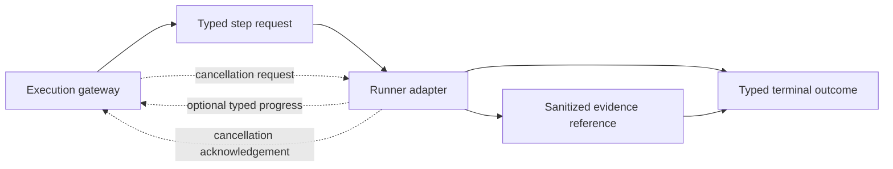
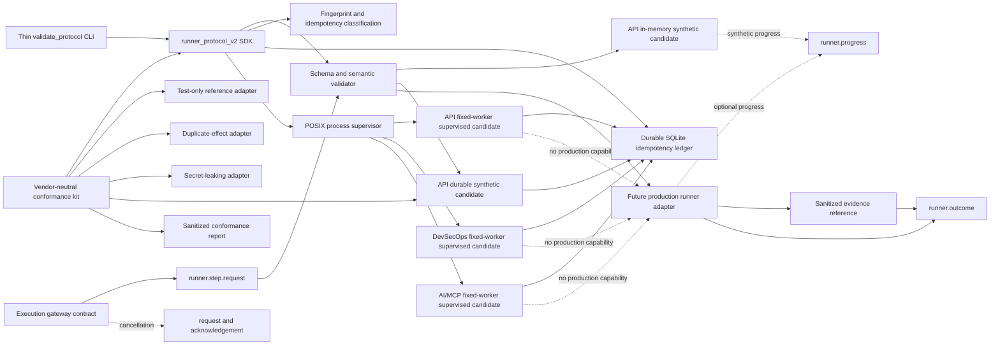

# EPIC-05 — Runner Protocol v2

## 1. Metadata

| Field | Value |
| --- | --- |
| Concept epic ID | `EPIC-05` |
| Slug | `runner-protocol-v2` |
| Pillar | `B` — Runtime Foundation |
| Phase | 1 |
| Priority | P0 |
| Delivery umbrella | `SVP2-B-02` (issue [#80](https://github.com/pestoura/hermes-security-labs/issues/80)) |
| Document version | 2.1.0 |
| Document date | 2026-08-06 |
| Catalogue | [Epic catalogue 45](../epic-catalogue-45.md) |
| Lifecycle contract | [Architecture documentation lifecycle](../../architecture/architecture-documentation-lifecycle.md) |

## 2. Current status

**AS_BUILT** — the contract-only Runner Protocol v2 block was integrated through pull
request [#105](https://github.com/pestoura/hermes-security-labs/pull/105) and validated
again on `main`. The vendor-neutral conformance kit was subsequently integrated through
pull request [#107](https://github.com/pestoura/hermes-security-labs/pull/107) and also
validated on `main`. The repository-local SDK was then integrated through pull request
[#109](https://github.com/pestoura/hermes-security-labs/pull/109) and validated again on
`main`. The API-family synthetic-only candidate was subsequently integrated through pull
request [#111](https://github.com/pestoura/hermes-security-labs/pull/111) and validated
again on `main`. A reusable durable SQLite idempotency ledger was then integrated through
pull request [#113](https://github.com/pestoura/hermes-security-labs/pull/113) and validated
again on `main`. A separate API-family durable synthetic candidate was then integrated
through pull request [#115](https://github.com/pestoura/hermes-security-labs/pull/115) and
validated again on `main`. It uses the durable ledger for restart replay without connecting to
real capabilities or the legacy executor. The repository-local POSIX process supervisor was then
integrated through pull request [#117](https://github.com/pestoura/hermes-security-labs/pull/117)
and validated again on `main`. It owns bounded process-group timeout, cancellation and residue
cleanup. The API-family fixed-worker synthetic candidate was then integrated through pull
request [#119](https://github.com/pestoura/hermes-security-labs/pull/119) and validated again on
`main`. It consumes the ledger and supervisor, proving claim-before-spawn, timeout, asynchronous
cancellation and fail-closed residue handling without real capabilities. The shared supervised
synthetic engine was subsequently reused by an isolated DevSecOps candidate through pull request
[#121](https://github.com/pestoura/hermes-security-labs/pull/121), with its canonical compatibility
declaration promoted atomically through pull request
[#122](https://github.com/pestoura/hermes-security-labs/pull/122). API and DevSecOps now have
fixed-worker synthetic process evidence only. The same shared supervised engine was then reused
by an isolated AI/MCP candidate through pull request
[#124](https://github.com/pestoura/hermes-security-labs/pull/124), with its canonical compatibility
declaration promoted through pull request
[#125](https://github.com/pestoura/hermes-security-labs/pull/125). All three runner families now
have fixed-worker synthetic process evidence only. The calibrated AI/MCP runtime, handlers,
providers, agents, memory/RAG adapters and campaigns remain separate and disconnected from Runner
Protocol. `FINAL` remains false: production execution integration is `NOT_RUN`, promotion is
blocked, and no sandboxed real capability has been demonstrated.

| Lifecycle state | Reached |
| --- | --- |
| INTENT | yes |
| IMPLEMENTING | yes |
| AS_BUILT | yes |
| FINAL | no |

## 3. Problem and motivation

Runners differ in invocation, correlation, cancellation and error reporting, which prevents
uniform orchestration, deterministic replay decisions and uniform evidence.

## 4. Intended outcome

A single Runner Protocol covering correlation identifiers, cancellation, timeouts, progress,
idempotency, normalized errors and evidence emission.

## 5. Scope and non-goals

### In scope for the epic

- Correlation ID propagation across campaign, run, step and attempt
- Idempotency and deterministic replay/conflict classification
- Cooperative cancellation and bounded hard timeout
- Normalized error taxonomy shared with the gateway
- Mandatory evidence reference per terminal outcome
- Compatibility and migration gates for API, DevSecOps and AI/MCP runners

### In scope for implementation block 1

- Versioned JSON Schema contract bundle
- Semantic validator for timeout, retry, idempotency, progress and secret-safety invariants
- Contract-only compatibility matrix
- Positive and negative conformance tests
- CI integration

### Non-goals for implementation block 1

- Changing runbook semantics of existing packs
- Implementing runner adapters or gateway enforcement
- Starting, cancelling or terminating processes
- Implementing a persistent idempotency ledger or Evidence Plane
- Changing deployment, laboratories, Hermes or Kali MCP

## 6. Intent architecture

The execution gateway sends a typed step request to a runner. Progress is optional but typed
when emitted. Cancellation has a typed request and acknowledgement. Every terminal outcome
contains the same four correlation IDs and at least one sanitized evidence reference. Failure
modes use stable codes rather than raw exceptions or free-text-only status.

The contract does not grant authorization. Hermes remains the authorization authority and a
runner may only restrict, never expand, the active authorization reference.

## 7. Contracts, data and capabilities

The canonical implementation location for this epic is
[`platform/runner-protocol/`](../../../platform/runner-protocol/).

The first block defines:

- `runner.step.request`;
- `runner.progress`;
- `runner.cancellation.request`;
- `runner.cancellation.ack`;
- `runner.outcome`;
- normalized error and evidence-reference definitions;
- compatibility declarations for API, DevSecOps and AI/MCP runner families.

All execution messages carry:

- `campaign_id`;
- `run_id`;
- `step_id`;
- `attempt_id`.

Contracts are canonical in Git. Platform-wide authority and trust-boundary rules remain in the
[reference architecture](../../architecture/security-validation-reference-architecture.md),
[contract inventory](../../architecture/contracts/README.md) and
[EPIC-01](EPIC-01-architecture-and-canonical-contracts.md).

## 8. Dependencies and sequencing

- [EPIC-01 — Architecture and canonical contracts](EPIC-01-architecture-and-canonical-contracts.md) — `FINAL` before this branch was created.

This contract enables later implementation work in:

- EPIC-03 — Typed Kali MCP;
- EPIC-04 — Transactional lifecycle and isolation;
- EPIC-10 — Evidence Plane;
- EPIC-35 — SDK, plugins and runtime certification.

## 9. Security, risks and failure modes

- Legacy runners may partially migrate and diverge from the canonical contract.
- Cancellation may not be honoured by long-running tools until runtime enforcement exists.
- A replay cache may return stale or mismatched outcomes if fingerprint semantics are weakened.
- Retrying an uncertain effect may duplicate impact.
- Raw exception context may expose credentials unless adapters normalize and sanitize errors.
- A protocol-valid request may still be unauthorized; schema validity is never authorization.

Platform-wide invariants that this epic must not weaken:

- absence of evidence never produces a `PASS` verdict;
- no execution outside an active authorization contract;
- no secrets, tokens, cookies or raw credential material in documentation, telemetry
  or persisted evidence;
- no target outside registered laboratories;
- unknown protocol versions and invalid messages fail closed before execution.

## 10. Deliverables

- Runner Protocol v2 specification
- Versioned schema bundle and semantic validator
- Stable normalized error taxonomy
- Compatibility matrix and migration gates
- Contract conformance tests integrated into repository CI
- Migration notes and adapters for existing runners in later blocks

## 11. Acceptance criteria

### Block 1 contract criteria

- Every protocol message requires the four correlation IDs.
- Every terminal outcome requires at least one sanitized evidence reference.
- `PASS` without evidence is schema-invalid.
- Reusing one idempotency key with a different canonical fingerprint is classified as
  `IDEMPOTENCY_CONFLICT` without execution.
- Timeout and cancellation budgets are bounded and semantically ordered.
- Automatic retries are limited to declared transient error codes.
- Raw secret fields are rejected by semantic validation.
- The compatibility matrix makes no false implementation or conformance claim.

### Epic completion criteria

- Every runner adapter carries the four correlation IDs through logs and evidence.
- Repetition with the same idempotency key cannot duplicate effects.
- Cancellation is observable and bounded in live conformance tests.
- Errors are normalized, stable and sanitized across all runner families.

The epic completion criteria are not claimed by the contract-only block.

## 12. Evidence and validation plan

- Validate the JSON Schema as Draft 2020-12.
- Validate representative request, progress, cancellation and terminal outcome messages.
- Reject missing correlation, unknown versions and missing terminal evidence.
- Reject unordered timeout budgets and cancellation grace outside the hard budget.
- Verify identical logical retries have an identical fingerprint despite a new attempt ID.
- Verify changed effects under the same idempotency key become conflicts.
- Verify progress sequence and percentage monotonicity.
- Reject raw secret fields and retryability inconsistent with the stable taxonomy.
- Validate the compatibility matrix remains `contract_only` / `NOT_RUN`.
- Run repository, security, integration, Ruff and gitleaks workflows.
- Record runtime/deployment/Hermes gates as `NOT_APPLICABLE` for this block.

Evidence must be referenced from issue #80 and section 15 before the umbrella can close.

## 13. Decisions and open questions

### Decisions taken at intent time

- No `PASS` may be produced without an evidence reference.

### Decisions taken during implementation

- Protocol version `2.0.0` is one canonical message bundle with typed message variants.
- Progress is optional by default. If emitted, its sequence is strictly monotonic and its
  percentage cannot decrease.
- Absence of progress is not a failure; timeout budgets remain the temporal authority.
- All terminal outcomes, including refusal and timeout, require evidence. Pre-execution
  outcomes use decision/protocol evidence rather than claiming execution evidence.
- Retries retain campaign/run/step IDs and idempotency key but use a new attempt ID.
- `attempt_id` and timestamps are excluded from the canonical effect fingerprint.
- An uncertain result after a possible effect is `INCONCLUSIVE` and is not automatically retried.
- Only transient dependency, runner unavailable and eligible soft-timeout errors may be
  automatically retryable.
- The first block remains contract-only; no existing runner is marked conformant.

### Open questions

- Adapter-specific transport and streaming mechanisms remain for later implementation blocks.
- Ledger retention, abandoned-claim reconciliation and adapter integration remain for later blocks.
- Force-termination implementation belongs to the transactional runtime lifecycle.

## 14. Implementation notes

> Reserved lifecycle section. This section records the contract implementation integrated in
> `main`. It does not claim live runner conformance or runtime enforcement.

### Block 1 — typed contract and semantic validation

- Branch: `feat/epic-05-runner-protocol-v2`
- Umbrella issue: [#80](https://github.com/pestoura/hermes-security-labs/issues/80)
- Pull request: [#105](https://github.com/pestoura/hermes-security-labs/pull/105)
- Validated head: `bd8d44bd3bd8b00e8da39665bcb80489486d1276`
- Squash merge: `3f9753ea2e1db5750f971f01bb1dbfea558723fb`
- Runtime declaration: `NO_RUNTIME_CHANGE`
- Canonical location: `platform/runner-protocol/`
- Existing runner, gateway and pack execution code remained unchanged.

### Corrections made before merge

- The initial negative test correctly rejected a request missing `attempt_id`, but the JSON
  Schema `oneOf` diagnostic hid the actionable leaf error. The validator was improved to
  report nested leaf diagnostics without weakening schema enforcement.
- A branch-local workflow could not publish the CI workflow update because its token lacked
  workflow-write permission. Contract changes were published separately and the permanent CI
  gate was applied through the GitHub connector. No permission was broadened.
- Temporary branch-local workflows were removed before the PR diff and merge.

### Block 2 — vendor-neutral conformance kit (`AS_BUILT`)

- Branch: `feat/epic-05-conformance-kit`
- Pull request: [#107](https://github.com/pestoura/hermes-security-labs/pull/107)
- Validated head: `61fae45bcc096d8fe71464b5c19dec7146447906`
- Squash merge: `944d198a106ebf106631fd18b9c5c5b9aef63942`
- Candidate transport: isolated JSON-lines process
- Test capabilities: synthetic `conformance.*` only
- Report: schema-backed, sanitized and command-hashed
- Promotion effect: none; human review mandatory
- Real API, DevSecOps and AI/MCP adapters: `NOT_RUN`
- Runtime declaration: `NO_RUNTIME_CHANGE`

The merged self-test accepts the deterministic test-only reference adapter and rejects
controlled duplicate-effect and secret-leaking adapters. This is evidence about the kit,
not production conformance evidence for any real runner family.

### Block 3 — repository-local importable SDK (`AS_BUILT`)

- Branch: `refactor/epic-05-runner-protocol-sdk`
- Pull request: [#109](https://github.com/pestoura/hermes-security-labs/pull/109)
- Validated head: `8216e733bf87ab89e41fd470e15653ae0c8e1b91`
- Squash merge: `dd742e41787bfcaec1feac347abf94c73d5b59fd`
- Package: `runner_protocol_v2`
- Source: `platform/runner-protocol/src/runner_protocol_v2/`
- Canonical schemas: retained once under `platform/runner-protocol/schemas/`
- CLI: thin wrapper over the SDK
- Contract resolution: editable repository root or explicit `RUNNER_PROTOCOL_CONTRACT_ROOT`
- Missing contract artefacts: fail closed
- Existing API, DevSecOps and AI/MCP adapters: `NOT_RUN`
- Runtime declaration: `NO_RUNTIME_CHANGE`

The merged implementation demonstrates editable installation, direct import in a clean process,
canonical contract resolution, rejection of an incomplete explicit contract root and a guard
against reintroducing validation logic into the CLI wrapper.

### Block 4 — API-family conformance candidate (`AS_BUILT`)

- Branch: `feat/epic-05-api-adapter-candidate`
- Pull request: [#111](https://github.com/pestoura/hermes-security-labs/pull/111)
- Validated head: `7227cd52eafef7a7f3042a3a088c24e907447758`
- Squash merge: `be74ee87c30620ec811b062d3a85e216d7751b50`
- Adapter path: `security/packs/api/src/api_pentest_runbooks/runner_protocol_adapter.py`
- Activation: explicit `--conformance-only`
- Supported scope: synthetic `conformance.*` capabilities only
- Authorization: synthetic `authz/conformance/active` only
- State: in-memory test ledger only
- Vendor-neutral conformance: `PASS_SYNTHETIC`
- Execution integration: `NOT_RUN`
- Promotion status: blocked
- Legacy `execute_runbook` / bridge path: unchanged and disconnected
- Runtime declaration: `NO_RUNTIME_CHANGE`

The merged candidate passes the vendor-neutral protocol kit, refuses real capabilities and
authorization references without effect, and is structurally disconnected from persistence,
network, subprocess and legacy execution paths. This remains synthetic conformance only.

### Block 5 — durable transactional idempotency ledger (`AS_BUILT`)

- Branch: `feat/epic-05-durable-idempotency-ledger`
- Pull request: [#113](https://github.com/pestoura/hermes-security-labs/pull/113)
- Validated head: `a9cafcba164dbf37dfd6a81e92b1be51d4e8ad51`
- Squash merge: `cc879b9fc5e20afcb8052c0f7197457c0ebcc86d`
- SDK class: `runner_protocol_v2.SQLiteIdempotencyLedger`
- Storage: caller-supplied SQLite database outside the repository
- Atomicity: `BEGIN IMMEDIATE`, unique idempotency key and immutable completion
- Durability: WAL, `synchronous=FULL`, schema version and integrity check
- Classifications: `NEW`, `IN_PROGRESS`, `REPLAY_SAME`, `IDEMPOTENCY_CONFLICT`
- Abandoned `IN_PROGRESS` reclaim: disabled; reconciliation required
- Runner adapter integration: `NOT_RUN`
- Runtime declaration: `NO_RUNTIME_CHANGE`

The merged ledger proves a single winning concurrent claim, persistence across reopen,
terminal replay without a second effect decision, immutable fingerprint/outcome handling and
fail-closed corrupt or unknown state. It is an enforcement component, not authorization and
not evidence that any real runner is idempotent.

### Block 6 — API durable synthetic integration (`AS_BUILT`)

- Branch: `feat/epic-05-api-durable-ledger-integration`
- Pull request: [#115](https://github.com/pestoura/hermes-security-labs/pull/115)
- Validated head: `dc08ff3779ef47fd48846efc6149b022617b107e`
- Squash merge: `3ff427e4c5122f0733bc04c9291acfdfc28b1448`
- Candidate path: `security/packs/api/src/api_pentest_runbooks/durable_runner_protocol_adapter.py`
- Activation: `--conformance-only --durable-ledger <absolute-path>`
- Scope: synthetic `conformance.*` only
- Authorization: synthetic `authz/conformance/active` only
- Durable claim: before the synthetic effect path
- Restart replay: validated with a new candidate instance over the same database
- Uncertain `IN_PROGRESS`: refused; automatic reclaim blocked
- Real API execution: `NOT_RUN`
- Legacy executor and bridge: unchanged and disconnected
- Promotion status: blocked
- Runtime declaration: `NO_RUNTIME_CHANGE`

The merged block passes the vendor-neutral conformance kit with disposable durable state and
proves that restart replay does not increase the synthetic effect counter. It also persists and
replays cancellation outcomes, refuses changed or uncertain effects, and fails closed when the
terminal outcome cannot be committed. This remains synthetic effect-level evidence only.

### Block 7 — supervised process boundary (`AS_BUILT`)

- Branch: `feat/epic-05-supervised-process-boundary`
- Pull request: [#117](https://github.com/pestoura/hermes-security-labs/pull/117)
- Validated head: `daeaeb02c194fec776c981e8f0f6298fe3a03c1d`
- Squash merge: `bf71fd7c6da2dcd2e179462677341a90f4f22b7a`
- SDK path: `platform/runner-protocol/src/runner_protocol_v2/supervision.py`
- Documentation: `platform/runner-protocol/supervised-process-boundary.md`
- Platform: POSIX process groups only
- Invocation: absolute executable vector, `shell=False`, isolated standard input
- Lifecycle: new session/process group, bounded output, `SIGTERM` then `SIGKILL`
- Residue rule: surviving descendants prevent success and are actively cleaned
- Cleanup failure: explicit `CLEANUP_FAILED`, never eligible for `PASS`
- Runner Protocol tests: 43 passed
- Adapter integration: `NOT_RUN`
- Real capability execution: `NOT_RUN`
- Runtime declaration: `NO_RUNTIME_CHANGE`

The merged block proves clean exit, hard timeout, external cancellation, forced termination,
descendant cleanup, output truncation and unsafe-specification refusal. It remains an execution
primitive rather than authorization, sandboxing, capability mapping or evidence handling.

### Block 8 — API supervised synthetic-process integration (`AS_BUILT`)

- Branch: `feat/epic-05-api-supervised-synthetic-adapter`
- Pull request: [#119](https://github.com/pestoura/hermes-security-labs/pull/119)
- Validated head: `0c73ae7cb63ac8a5545c8d4ddc55b00d1543fba2`
- Squash merge: `bc7e301baf977e041ff267a045bbb8ee592c6455`
- Adapter: `security/packs/api/src/api_pentest_runbooks/supervised_runner_protocol_adapter.py`
- Worker: `security/packs/api/src/api_pentest_runbooks/synthetic_supervised_worker.py`
- Activation: `--conformance-only --synthetic-process-only --durable-ledger <absolute-path>`
- Scope: fixed synthetic worker modes only
- Durable claim: before process creation
- Cancellation: asynchronous progress then bounded process-group cleanup
- Timeout: hard timeout enforced by the POSIX supervisor
- Residue: `INCONCLUSIVE`, never `PASS`
- Output: stream hashes, lengths and supervision metadata; no raw stdout/stderr
- Compatibility status: `PASS_SYNTHETIC_PROCESS`
- Sandbox status: `NOT_IMPLEMENTED`
- Production API execution: `NOT_RUN`
- Promotion status: blocked
- Runtime declaration: `NO_RUNTIME_CHANGE`

The merged block proves that request input cannot form a command, completed outcomes replay
without a second process, cancellation persists across restart, and cleanup uncertainty cannot
become success. It remains synthetic process-level evidence only.

### Block 9 — shared supervised engine and DevSecOps synthetic portability (`AS_BUILT`)

- Technical branch: `feat/epic-05-devsecops-supervised-synthetic`
- Technical pull request: [#121](https://github.com/pestoura/hermes-security-labs/pull/121)
- Technical squash merge: `16384cdb4223b78da8ed26f8f2ad61038e7e5636`
- Lifecycle branch: `chore/epic-05-devsecops-lifecycle`
- Lifecycle pull request: [#122](https://github.com/pestoura/hermes-security-labs/pull/122)
- Lifecycle validated head: `057ae3041989a6f57f9f4cc5d7f505042d7f9a30`
- Lifecycle squash merge: `f2be46da70601aafe92a436636d8c09201a1b259`
- Shared engine: `platform/runner-protocol/src/runner_protocol_v2/synthetic_supervised.py`
- DevSecOps adapter: `security/packs/devsecops/src/devsecops_runbooks/supervised_runner_protocol_adapter.py`
- DevSecOps worker: `security/packs/devsecops/src/devsecops_runbooks/synthetic_supervised_worker.py`
- Activation: `--conformance-only --synthetic-process-only --durable-ledger <absolute-path>`
- Scope: fixed synthetic worker modes only
- Durable replay: completed outcomes do not start a second process
- Cancellation and timeout: shared POSIX supervisor with bounded cleanup
- Residue: fail-closed `INCONCLUSIVE`, never `PASS`
- Output: hashes, lengths and bounded supervision metadata; no raw stdout/stderr
- Compatibility status: `PASS_SYNTHETIC_PROCESS`
- Sandbox status: `NOT_IMPLEMENTED`
- Production DevSecOps execution: `NOT_RUN`
- Promotion status: blocked
- Runtime declaration: `NO_RUNTIME_CHANGE`

The merged block proves that the repository-owned supervisor and durable lifecycle can be reused
across runner families without creating an API-to-DevSecOps dependency or copying the engine. It
does not run scanners, pipelines, repositories, networks, customer targets or commands supplied by
requests. The lifecycle declaration remains constrained to the fixed synthetic worker boundary.

### Block 10 — AI/MCP supervised synthetic portability (`AS_BUILT`)

- Technical branch: `feat/epic-05-ai-mcp-supervised-synthetic`
- Technical pull request: [#124](https://github.com/pestoura/hermes-security-labs/pull/124)
- Technical squash merge: `128371b9c53f4128c3747c32eb03951a21f4cab5`
- Lifecycle branch: `chore/epic-05-ai-mcp-lifecycle`
- Lifecycle pull request: [#125](https://github.com/pestoura/hermes-security-labs/pull/125)
- Lifecycle validated head: `b716de04a0a722d46f571dccb724d65302c02bd8`
- Lifecycle squash merge: `40b0e60bbf0fecf0f76da648ab3b3560e02cb41c`
- Shared engine: `platform/runner-protocol/src/runner_protocol_v2/synthetic_supervised.py`
- AI/MCP adapter: `security/packs/ai-mcp/src/ai_mcp_runbooks/supervised_runner_protocol_adapter.py`
- AI/MCP worker: `security/packs/ai-mcp/src/ai_mcp_runbooks/synthetic_supervised_worker.py`
- Activation: `--conformance-only --synthetic-process-only --durable-ledger <absolute-path>`
- Scope: fixed synthetic worker modes only
- Durable replay: completed outcomes do not start a second process
- Cancellation and timeout: shared POSIX supervisor with bounded cleanup
- Residue: fail-closed `INCONCLUSIVE`, never `PASS`
- Output: hashes, lengths and bounded supervision metadata; no raw stdout/stderr
- Compatibility status: `PASS_SYNTHETIC_PROCESS`
- Calibrated AI/MCP runtime linkage: not connected
- Sandbox status: `NOT_IMPLEMENTED`
- Production AI/MCP Runner Protocol execution: `NOT_RUN`
- Promotion status: blocked
- Runtime declaration: `NO_RUNTIME_CHANGE`

The merged block proves that the shared lifecycle can be reused by the AI/MCP family without
importing API or DevSecOps implementations and without invoking the existing calibrated AI/MCP
runtime. It does not execute handlers, providers, agents, memory/RAG adapters, campaigns, Docker,
networks, customer targets or commands supplied by requests. The lifecycle declaration remains
constrained to the fixed synthetic worker boundary.

## 15. As-built / final architecture

> Reserved lifecycle section. This is the AS_BUILT record for the contract-only block. The
> umbrella may not be closed until the runner adapters and epic-level acceptance criteria are
> implemented and this section is updated to `FINAL`.

### Delivered contract, SDK and conformance architecture

The delivered implementation is a repository-owned protocol contract, validation library and
optional local enforcement primitives for durable idempotency and POSIX process supervision. The
fixed-worker synthetic API, DevSecOps and AI/MCP candidates dispatch controlled repository test
processes through the shared supervisor. The calibrated AI/MCP runtime remains disconnected. No
production adapter, network, container, laboratory or customer target is used.

### Evidence

| Evidence | Result |
| --- | --- |
| PR #105 validated head | `bd8d44bd3bd8b00e8da39665bcb80489486d1276` |
| Merge SHA | `3f9753ea2e1db5750f971f01bb1dbfea558723fb` |
| PR validate workflow | success — run `31076832508` |
| PR security/gitleaks workflow | success — run `31076832409` |
| Post-merge main validate workflow | success — run `31076955536` |
| Post-merge main security/gitleaks workflow | success — run `31076955527` |
| Runner Protocol tests | 17 passed |
| Roadmap/document lifecycle directed tests | 751 passed before PR |
| Runtime validation | `NOT_APPLICABLE` — `NO_RUNTIME_CHANGE` |
| PR #107 validated head | `61fae45bcc096d8fe71464b5c19dec7146447906` |
| Conformance-kit merge SHA | `944d198a106ebf106631fd18b9c5c5b9aef63942` |
| PR #107 validate workflow | success — run `31078067384` |
| PR #107 security/gitleaks workflow | success — run `31078067277` |
| Post-merge conformance validate workflow | success — run `31078149317` |
| Post-merge conformance security/gitleaks workflow | success — run `31078149409` |
| Reference adapter | accepted by self-test |
| Duplicate-effect adapter | rejected by self-test |
| Secret-leaking adapter | rejected by self-test |
| PR #109 validated head | `8216e733bf87ab89e41fd470e15653ae0c8e1b91` |
| SDK merge SHA | `dd742e41787bfcaec1feac347abf94c73d5b59fd` |
| PR #109 validate workflow | success — run `31079273259` |
| PR #109 security/gitleaks workflow | success — run `31079273280` |
| Post-merge SDK validate workflow | success — run `31079378064` |
| Post-merge SDK security/gitleaks workflow | success — run `31079378148` |
| Editable install and direct import | passed |
| Incomplete explicit contract root | rejected fail-closed |
| Generated package metadata | removed and ignored |
| PR #111 validated head | `7227cd52eafef7a7f3042a3a088c24e907447758` |
| API candidate merge SHA | `be74ee87c30620ec811b062d3a85e216d7751b50` |
| PR #111 validate workflow | success — run `31080984814` |
| PR #111 security/gitleaks workflow | success — run `31080984997` |
| Post-merge API candidate validate workflow | success — run `31081085159` |
| Post-merge API candidate security/gitleaks workflow | success — run `31081085183` |
| API candidate conformance | `PASS_SYNTHETIC` |
| API execution integration | `NOT_RUN` |
| API promotion status | blocked |
| PR #113 validated head | `a9cafcba164dbf37dfd6a81e92b1be51d4e8ad51` |
| Durable-ledger merge SHA | `cc879b9fc5e20afcb8052c0f7197457c0ebcc86d` |
| PR #113 validate workflow | success — run `31088913223` |
| PR #113 security/gitleaks workflow | success — run `31088912202` |
| Post-merge ledger validate workflow | success — run `31089022988` |
| Post-merge ledger security/gitleaks workflow | success — run `31089022565` |
| Runner Protocol tests with ledger | 36 passed |
| Concurrent claim winners | exactly one `NEW` |
| Adapter integration with durable ledger | synthetic API integration `AS_BUILT`; production `NOT_RUN` |
| PR #115 validated head | `dc08ff3779ef47fd48846efc6149b022617b107e` |
| API durable synthetic merge SHA | `3ff427e4c5122f0733bc04c9291acfdfc28b1448` |
| PR #115 validate workflow | success — run `31090758807` |
| PR #115 security/gitleaks workflow | success — run `31090759705` |
| Post-merge durable API validate workflow | success — run `31090875891` |
| Post-merge durable API security/gitleaks workflow | success — run `31090875979` |
| Directed protocol/API/roadmap/docs tests | 929 passed |
| Durable restart replay | `PASS_SYNTHETIC`; no second synthetic effect |
| Production API execution integration | `NOT_RUN` |
| PR #117 validated head | `daeaeb02c194fec776c981e8f0f6298fe3a03c1d` |
| Supervised-process merge SHA | `bf71fd7c6da2dcd2e179462677341a90f4f22b7a` |
| PR #117 validate workflow | success — run `31093149197` |
| PR #117 security/gitleaks workflow | success — run `31093149060` |
| Post-merge supervisor validate workflow | success — run `31093252331` |
| Post-merge supervisor security/gitleaks workflow | success — run `31093252418` |
| Runner Protocol tests with supervisor | 43 passed |
| Adapter consumption of supervisor | fixed synthetic API candidate `AS_BUILT`; production `NOT_RUN` |
| PR #119 validated head | `0c73ae7cb63ac8a5545c8d4ddc55b00d1543fba2` |
| Supervised API synthetic merge SHA | `bc7e301baf977e041ff267a045bbb8ee592c6455` |
| PR #119 validate workflow | success — run `31094891644` |
| PR #119 security/gitleaks workflow | success — run `31094891414` |
| Post-merge supervised API validate workflow | success — run `31095007408` |
| Post-merge supervised API security/gitleaks workflow | success — run `31095007428` |
| Compatibility state | `PASS_SYNTHETIC_PROCESS` |
| Production API execution integration | `NOT_RUN` |
| Sandbox status | `NOT_IMPLEMENTED` |
| PR #121 technical squash merge | `16384cdb4223b78da8ed26f8f2ad61038e7e5636` |
| PR #122 lifecycle validated head | `057ae3041989a6f57f9f4cc5d7f505042d7f9a30` |
| PR #122 lifecycle squash merge | `f2be46da70601aafe92a436636d8c09201a1b259` |
| PR #122 validate workflow | success — run `31110205273` |
| PR #122 security/gitleaks workflow | success — run `31110206988` |
| Post-merge DevSecOps lifecycle validate workflow | success — run `31110364765` |
| Post-merge DevSecOps lifecycle security/gitleaks workflow | success — run `31110364958` |
| DevSecOps compatibility state | `PASS_SYNTHETIC_PROCESS` |
| Production DevSecOps execution integration | `NOT_RUN` |
| AI/MCP execution integration | `NOT_RUN` |
| PR #124 technical squash merge | `128371b9c53f4128c3747c32eb03951a21f4cab5` |
| PR #125 lifecycle validated head | `b716de04a0a722d46f571dccb724d65302c02bd8` |
| PR #125 lifecycle squash merge | `40b0e60bbf0fecf0f76da648ab3b3560e02cb41c` |
| PR #125 validate workflow | success — run `31114183976` |
| PR #125 security/gitleaks workflow | success — run `31114182111` |
| Post-merge AI/MCP lifecycle validate workflow | success — run `31114427115` |
| Post-merge AI/MCP lifecycle security/gitleaks workflow | success — run `31114427152` |
| AI/MCP compatibility state | `PASS_SYNTHETIC_PROCESS` |
| Calibrated AI/MCP runtime linkage | not connected to Runner Protocol |
| Production AI/MCP Runner Protocol execution integration | `NOT_RUN` |

### Block 1 acceptance assessment

| Criterion | Result | Evidence |
| --- | --- | --- |
| Four correlation IDs required | met | schema and negative test |
| Terminal evidence reference required | met | schema and `PASS`/empty-evidence tests |
| Same effect has stable fingerprint across attempts | met | semantic validator and replay test |
| Changed effect under same key is conflict | met | `IDEMPOTENCY_CONFLICT` test |
| Timeout/cancellation budgets ordered and bounded | met | semantic validation and negative tests |
| Retries limited to transient taxonomy | met | stable retryability validation |
| Raw secret fields rejected | met | recursive semantic check and test |
| No false runner conformance claim | met | compatibility matrix remains `contract_only` / `NOT_RUN` |

### Block 2 acceptance assessment

| Criterion | Result | Evidence |
| --- | --- | --- |
| Language-neutral isolated candidate transport | met | JSON-lines process harness |
| Correlation and terminal evidence checked | met | conformance case and protocol validator |
| Replay proves no duplicate effect | met for kit/reference adapter | effect-counter case |
| Changed effect under same key refused | met for kit/reference adapter | conflict case |
| Hard timeout and cooperative cancellation normalized | met for kit/reference adapter | timeout/cancellation cases |
| Controlled secret leak detected | met | canary and broken-adapter self-test |
| Report sanitized and schema-backed | met | report schema and tests |
| Automatic promotion prevented | met | compatibility declaration `promotion_effect: none` |
| Real runner conformance | `NOT_RUN` | API, DevSecOps and AI/MCP have synthetic candidates only; production adapters remain unimplemented |

### Block 3 acceptance assessment

| Criterion | Result | Evidence |
| --- | --- | --- |
| One importable canonical SDK | met | `runner_protocol_v2` public package |
| CLI contains no duplicate validation logic | met | source guard in SDK tests |
| Editable installation and clean-process import | met | CI install/import gates |
| Canonical artefacts remain single-source | met | schemas and compatibility remain outside package copies |
| Missing explicit contract root fails closed | met | negative SDK test |
| Standard-library `platform` collision avoided | met | explicit package namespace |
| Real runner conformance | `NOT_RUN` | API, DevSecOps and AI/MCP have synthetic candidates only; production adapters remain unimplemented |

### Block 4 acceptance assessment

| Criterion | Result | Evidence |
| --- | --- | --- |
| Explicit conformance-only activation | met | CLI negative/positive tests |
| Synthetic protocol conformance | `PASS_SYNTHETIC` | canonical conformance kit in CI |
| Real capabilities refused without effect | met | candidate tests and zero effect/ledger checks |
| Real authorization reference refused | met | authorization negative test |
| Legacy executor and bridge disconnected | met | AST structural guard and unchanged legacy files |
| Network/subprocess/file/database effects absent | met | AST guard and candidate implementation |
| Production execution integration | `NOT_RUN` | no real capability mapping or execution path |
| Production promotion | blocked | compatibility catalogue and no automatic promotion |

### Block 5 acceptance assessment

| Criterion | Result | Evidence |
| --- | --- | --- |
| Atomic claim under concurrency | met | 16 concurrent claims yield one `NEW` |
| Same fingerprint during active claim | met | classified `IN_PROGRESS`; no second dispatch decision |
| Changed fingerprint under same key | met | `IDEMPOTENCY_CONFLICT` |
| Terminal outcome survives reopen | met | SQLite close/reopen and `REPLAY_SAME` test |
| Completed identity and outcome immutable | met | conflicting completion tests |
| Invalid/corrupt/unknown state fails closed | met | negative database and schema-version tests |
| Automatic reclaim of uncertain effects | deliberately absent | abandoned `IN_PROGRESS` requires reconciliation |
| Real runner effect deduplication | `NOT_RUN` | no adapter consumes the ledger |

### Block 6 acceptance assessment

| Criterion | Result | Evidence |
| --- | --- | --- |
| Durable claim precedes synthetic effect | met | candidate control flow and tests |
| Restart replay avoids second synthetic effect | met | new candidate instance; effect counter remains zero |
| Retry correlation is reconstructed | met | replay carries current `attempt_id` |
| Changed effect under the same key is refused | met | restart conflict test |
| Uncertain `IN_PROGRESS` is not reclaimed | met | restart refusal and persisted active state |
| Cancellation outcome persists and replays | met | same-process cancellation plus restart replay |
| Completion failure fails closed | met | non-retryable `INCONCLUSIVE` test |
| Real capability and authorization create no claim | met | negative ledger-record tests |
| Production API effect deduplication | `NOT_RUN` | no real capability mapping or executor integration |
| Live bounded process cancellation | `NOT_RUN` | synthetic protocol cancellation only |

### Block 7 acceptance assessment

| Criterion | Result | Evidence |
| --- | --- | --- |
| Absolute executable and working directory | met | negative specification tests |
| Shell and pre-execution hooks absent | met | source/AST guard |
| Process-group ownership | met | new-session implementation and descendant tests |
| Hard timeout bounded and enforced | met | stubborn root/descendant timeout test |
| External cancellation bounded and enforced | met | cancellation with `SIGTERM` to `SIGKILL` escalation |
| Root exit with live descendant cannot pass | met | `RESIDUE_CLEANED` test |
| Descendant residue removed before return | met | PID absence assertion |
| Standard output and error bounded | met | independent truncation test |
| Cleanup uncertainty fails closed | met by contract | `CLEANUP_FAILED` is never successful |
| Runner Protocol adapter integration | met for fixed synthetic candidate | block 8 imports and consumes the supervisor |
| Sandbox and resource isolation | `NOT_RUN` | process groups do not provide containment |
| Real capability execution | `NOT_RUN` | fixed synthetic test worker only |

### Block 8 acceptance assessment

| Criterion | Result | Evidence |
| --- | --- | --- |
| Request input cannot form process specification | met | caller-shaped `argv`, `cwd` and environment test plus source guard |
| Durable claim precedes process creation | met | adapter control flow and no-claim refusal tests |
| Successful process replays without second spawn | met | restarted candidate with zero effect count |
| Non-zero exit normalized without raw stderr | met | `EXECUTION_FAILED` and sanitized stream metadata test |
| Hard timeout maps to terminal timeout | met | stubborn fixed worker and `TIMEOUT_HARD` test |
| Cancellation is asynchronous and bounded | met for fixed synthetic worker | progress, acknowledgement, forced cleanup and terminal replay |
| Descendant residue cannot pass | met | `RESIDUE_CLEANED` maps to non-retryable `INCONCLUSIVE` |
| Internal readiness and PID files removed | met | post-terminal filesystem assertions |
| Real capability and authorization create no claim | met | negative durable-record tests |
| Shutdown cleans active tracked processes | met | synthetic shutdown integration test |
| Raw process output not persisted | met | hashes/lengths only and raw-string absence tests |
| Sandbox and resource isolation | `NOT_RUN` | process groups do not provide containment |
| Production API capability execution | `NOT_RUN` | fixed synthetic worker only |
| Production promotion | blocked | compatibility 1.3 and explicit no-promotion status |

### Block 9 acceptance assessment

| Criterion | Result | Evidence |
| --- | --- | --- |
| Shared engine has no family-specific imports | met | source boundary and monorepo tests |
| DevSecOps does not depend on API implementation | met | isolated wrapper and import guards |
| Request input cannot form process specification | met | caller-shaped input and source tests |
| Durable claim precedes fixed-worker process creation | met | shared lifecycle tests |
| Completed request replays without a second process | met | reopen/replay tests and zero effect count |
| Non-zero exit, timeout and cancellation normalize safely | met | DevSecOps pack tests |
| Descendant residue cannot yield `PASS` | met | residue maps to non-retryable `INCONCLUSIVE` |
| Raw worker streams are not persisted | met | hashes and bounded metadata only |
| Real scanners, pipelines and repositories are refused | met | refusal-before-claim tests |
| Canonical matrix and validator agree atomically | met | PR #122 compatibility validation |
| Sandbox and resource isolation | `NOT_RUN` | process groups are not a sandbox |
| Production DevSecOps capability execution | `NOT_RUN` | fixed synthetic worker only |
| Production promotion | blocked | explicit compatibility declaration |

### Block 10 acceptance assessment

| Criterion | Result | Evidence |
| --- | --- | --- |
| Shared engine has no family-specific imports | met | source boundary and monorepo tests |
| AI/MCP does not depend on API or DevSecOps implementation | met | isolated wrapper and import guards |
| Calibrated AI/MCP runtime remains disconnected | met | import guards and unchanged runtime modules |
| Request input cannot form process specification | met | caller-shaped input and source tests |
| Durable claim precedes fixed-worker process creation | met | shared lifecycle tests |
| Completed request replays without a second process | met | reopen/replay tests and zero effect count |
| Non-zero exit, timeout and cancellation normalize safely | met | AI/MCP pack tests |
| Descendant residue cannot yield `PASS` | met | residue maps to non-retryable `INCONCLUSIVE` |
| Raw worker streams are not persisted | met | hashes and bounded metadata only |
| Real handlers, providers, agents and MCP operations are refused | met | refusal-before-claim and isolation tests |
| Canonical matrix and validator agree atomically | met | PR #125 compatibility validation |
| Sandbox and resource isolation | `NOT_RUN` | process groups are not a sandbox |
| Production AI/MCP Runner Protocol execution | `NOT_RUN` | fixed synthetic worker only |
| Production promotion | blocked | explicit compatibility declaration |

### Epic-level criteria not yet met

| Criterion | State | Required next evidence |
| --- | --- | --- |
| Correlation propagated by every adapter | `PARTIAL` | all three synthetic candidates preserve correlation; production adapters remain `NOT_RUN` |
| Same idempotency key never duplicates effects | `PARTIAL` | synthetic effect and fixed-process replay are AS_BUILT; production effect integration remains `NOT_RUN` |
| Cancellation observable and bounded live | `PARTIAL` | fixed synthetic API, DevSecOps and AI/MCP processes are AS_BUILT; production adapter cancellation remains `NOT_RUN` |
| Error taxonomy normalized end to end | `PARTIAL` | all three synthetic process states are normalized; gateway and production adapters remain `NOT_RUN` |

### Differences from intent

- The AI/MCP pack already contains a calibrated runtime, handlers, providers and campaign
  infrastructure, but Block 10 deliberately does not connect those components to Runner Protocol.
  The candidate is a separate fixed synthetic conformance boundary only.
- The contract is a single versioned schema bundle with message variants rather than separate
  top-level schemas. This keeps one protocol version and one compatibility boundary.
- Progress is optional by default. Required progress can be selected per capability later.
- Every terminal outcome requires evidence, including pre-execution refusal and timeout. These
  use decision/protocol evidence and do not falsely claim execution evidence.
- Deterministic fingerprint classification was delivered first; block 5 subsequently added
  a durable transactional ledger without connecting it to any execution adapter.
- The conformance kit uses a language-neutral JSON-lines control protocol so adapters can
  be tested without importing repository-specific Python modules.
- The kit validates synthetic effects and adapter behaviour; it does not invoke real
  security tools or authorize production execution.
- The SDK uses an explicit package namespace rather than `platform.*` to avoid collision
  with Python's standard-library `platform` module.
- The SDK deliberately does not package duplicate schemas; non-editable consumers must
  provide the canonical contract root explicitly.
- The first family-specific candidates are deliberately separate from the legacy API executor;
  the durable variant proves restart replay only for synthetic effects.
- The process supervisor was delivered as a reusable SDK primitive before adapter integration so
  timeout and cancellation behaviour could be reviewed independently from capability mapping.
  Block 8 then connected only a fixed API synthetic worker. Block 9 extracted the common lifecycle
  and reused it through an isolated DevSecOps wrapper; real capability mapping still requires stronger
  sandbox, authorization, target and evidence controls.

### Limitations and residual risk

- No production runner adapter consumes or emits Runner Protocol v2 messages; the API and
  DevSecOps candidates are limited to synthetic conformance and cannot execute real capabilities.
- Schema-valid requests may still be unauthorized; Hermes authorization remains mandatory.
- Local cancellation, hard timeout and process-group cleanup are integrated with the fixed
  synthetic API and DevSecOps candidates, but no production Runner Protocol adapter invokes the
  supervisor or executes a real capability.
- The API durable synthetic candidate now consumes the atomic ledger, but duplicate real effects
  remain possible until production adapters claim before execution and persist the terminal outcome.
- Evidence references are structurally validated but the Evidence Plane and chain-of-custody
  implementation remain later work.
- A conformance-kit `PASS` is necessary but not sufficient for promotion and requires human
  review plus adapter-specific integration evidence.
- Process groups and the conformance harness require an additional sandbox boundary; neither
  prevents session escape nor provides namespaces, cgroups, seccomp, network policy, privilege
  separation or resource quotas.
- The umbrella #80 remains `IMPLEMENTING`; these blocks must not be treated as `FINAL`.

## 16. Document change log

| Date | Version | Change |
| --- | --- | --- |
| 2026-08-06 | 1.0.0 | Initial intent document created from the concept epic catalogue. |
| 2026-08-06 | 1.1.0 | Set IMPLEMENTING; define block 1 contract scope, decisions, validation plan and limits. |
| 2026-08-06 | 1.2.0 | Record contract block AS_BUILT, merge/CI evidence, acceptance assessment and residual limitations. |
| 2026-08-06 | 1.2.1 | Start block 2 vendor-neutral conformance kit while preserving all real adapters as NOT_RUN. |
| 2026-08-06 | 1.3.0 | Record conformance kit AS_BUILT, merge/CI evidence, controlled rejection proofs and residual limitations. |
| 2026-08-06 | 1.3.1 | Start block 3 repository-local SDK extraction before implementing real adapters. |
| 2026-08-06 | 1.4.0 | Record repository-local SDK AS_BUILT, merge/CI evidence and fail-closed contract resolution. |
| 2026-08-06 | 1.4.1 | Start block 4 API-family candidate in synthetic-only conformance mode with production promotion blocked. |
| 2026-08-06 | 1.5.0 | Record API synthetic candidate AS_BUILT with PASS_SYNTHETIC evidence, execution NOT_RUN and promotion blocked. |
| 2026-08-06 | 1.6.0 | Record durable transactional idempotency ledger AS_BUILT with adapter integration NOT_RUN. |
| 2026-08-06 | 1.6.1 | Start API durable synthetic integration with restart replay and production execution blocked. |
| 2026-08-06 | 1.7.0 | Record API durable synthetic restart replay AS_BUILT with production execution NOT_RUN and promotion blocked. |
| 2026-08-06 | 1.7.1 | Start supervised POSIX process boundary with adapter integration and real execution NOT_RUN. |
| 2026-08-06 | 1.8.0 | Record supervised process boundary AS_BUILT with adapter integration and real execution NOT_RUN. |
| 2026-08-06 | 1.8.1 | Start fixed-worker API supervised synthetic-process integration with production execution blocked. |
| 2026-08-06 | 1.9.0 | Record fixed-worker API supervised synthetic-process integration AS_BUILT with sandbox and production execution NOT_RUN. |
| 2026-08-06 | 2.0.0 | Record shared supervised engine and DevSecOps fixed-worker synthetic portability AS_BUILT with production execution NOT_RUN. |
| 2026-08-06 | 2.1.0 | Record isolated AI/MCP fixed-worker synthetic portability AS_BUILT while keeping the calibrated runtime disconnected. |
