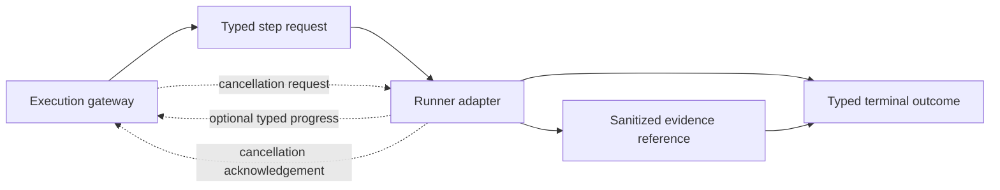

# EPIC-05 — Runner Protocol v2

## 1. Metadata

| Field | Value |
| --- | --- |
| Concept epic ID | `EPIC-05` |
| Slug | `runner-protocol-v2` |
| Pillar | `B` — Runtime Foundation |
| Phase | 1 |
| Priority | P0 |
| Delivery umbrella | `SVP2-B-02` (issue [#80](https://github.com/pestoura/hermes-security-labs/issues/80)) |
| Document version | 1.1.0 |
| Document date | 2026-08-06 |
| Catalogue | [Epic catalogue 45](../epic-catalogue-45.md) |
| Lifecycle contract | [Architecture documentation lifecycle](../../architecture/architecture-documentation-lifecycle.md) |

## 2. Current status

**IMPLEMENTING** — the first contract-only vertical slice is active on branch
`feat/epic-05-runner-protocol-v2`. It defines and validates the protocol without changing
existing runners, gateways, packs, laboratories or live runtime behaviour.

| Lifecycle state | Reached |
| --- | --- |
| INTENT | yes |
| IMPLEMENTING | yes |
| AS_BUILT | no |
| FINAL | no |

## 3. Problem and motivation

Runners differ in invocation, correlation, cancellation and error reporting, which prevents
uniform orchestration, deterministic replay decisions and uniform evidence.

## 4. Intended outcome

A single Runner Protocol covering correlation identifiers, cancellation, timeouts, progress,
idempotency, normalized errors and evidence emission.

## 5. Scope and non-goals

### In scope for the epic

- Correlation ID propagation across campaign, run, step and attempt
- Idempotency and deterministic replay/conflict classification
- Cooperative cancellation and bounded hard timeout
- Normalized error taxonomy shared with the gateway
- Mandatory evidence reference per terminal outcome
- Compatibility and migration gates for API, DevSecOps and AI/MCP runners

### In scope for implementation block 1

- Versioned JSON Schema contract bundle
- Semantic validator for timeout, retry, idempotency, progress and secret-safety invariants
- Contract-only compatibility matrix
- Positive and negative conformance tests
- CI integration

### Non-goals for implementation block 1

- Changing runbook semantics of existing packs
- Implementing runner adapters or gateway enforcement
- Starting, cancelling or terminating processes
- Implementing a persistent idempotency ledger or Evidence Plane
- Changing deployment, laboratories, Hermes or Kali MCP

## 6. Intent architecture

The execution gateway sends a typed step request to a runner. Progress is optional but typed
when emitted. Cancellation has a typed request and acknowledgement. Every terminal outcome
contains the same four correlation IDs and at least one sanitized evidence reference. Failure
modes use stable codes rather than raw exceptions or free-text-only status.

The contract does not grant authorization. Hermes remains the authorization authority and a
runner may only restrict, never expand, the active authorization reference.

## 7. Contracts, data and capabilities

The canonical implementation location for this epic is
[`platform/runner-protocol/`](../../../platform/runner-protocol/).

The first block defines:

- `runner.step.request`;
- `runner.progress`;
- `runner.cancellation.request`;
- `runner.cancellation.ack`;
- `runner.outcome`;
- normalized error and evidence-reference definitions;
- compatibility declarations for API, DevSecOps and AI/MCP runner families.

All execution messages carry:

- `campaign_id`;
- `run_id`;
- `step_id`;
- `attempt_id`.

Contracts are canonical in Git. Platform-wide authority and trust-boundary rules remain in the
[reference architecture](../../architecture/security-validation-reference-architecture.md),
[contract inventory](../../architecture/contracts/README.md) and
[EPIC-01](EPIC-01-architecture-and-canonical-contracts.md).

## 8. Dependencies and sequencing

- [EPIC-01 — Architecture and canonical contracts](EPIC-01-architecture-and-canonical-contracts.md) — `FINAL` before this branch was created.

This contract enables later implementation work in:

- EPIC-03 — Typed Kali MCP;
- EPIC-04 — Transactional lifecycle and isolation;
- EPIC-10 — Evidence Plane;
- EPIC-35 — SDK, plugins and runtime certification.

## 9. Security, risks and failure modes

- Legacy runners may partially migrate and diverge from the canonical contract.
- Cancellation may not be honoured by long-running tools until runtime enforcement exists.
- A replay cache may return stale or mismatched outcomes if fingerprint semantics are weakened.
- Retrying an uncertain effect may duplicate impact.
- Raw exception context may expose credentials unless adapters normalize and sanitize errors.
- A protocol-valid request may still be unauthorized; schema validity is never authorization.

Platform-wide invariants that this epic must not weaken:

- absence of evidence never produces a `PASS` verdict;
- no execution outside an active authorization contract;
- no secrets, tokens, cookies or raw credential material in documentation, telemetry
  or persisted evidence;
- no target outside registered laboratories;
- unknown protocol versions and invalid messages fail closed before execution.

## 10. Deliverables

- Runner Protocol v2 specification
- Versioned schema bundle and semantic validator
- Stable normalized error taxonomy
- Compatibility matrix and migration gates
- Contract conformance tests integrated into repository CI
- Migration notes and adapters for existing runners in later blocks

## 11. Acceptance criteria

### Block 1 contract criteria

- Every protocol message requires the four correlation IDs.
- Every terminal outcome requires at least one sanitized evidence reference.
- `PASS` without evidence is schema-invalid.
- Reusing one idempotency key with a different canonical fingerprint is classified as
  `IDEMPOTENCY_CONFLICT` without execution.
- Timeout and cancellation budgets are bounded and semantically ordered.
- Automatic retries are limited to declared transient error codes.
- Raw secret fields are rejected by semantic validation.
- The compatibility matrix makes no false implementation or conformance claim.

### Epic completion criteria

- Every runner adapter carries the four correlation IDs through logs and evidence.
- Repetition with the same idempotency key cannot duplicate effects.
- Cancellation is observable and bounded in live conformance tests.
- Errors are normalized, stable and sanitized across all runner families.

The epic completion criteria are not claimed by the contract-only block.

## 12. Evidence and validation plan

- Validate the JSON Schema as Draft 2020-12.
- Validate representative request, progress, cancellation and terminal outcome messages.
- Reject missing correlation, unknown versions and missing terminal evidence.
- Reject unordered timeout budgets and cancellation grace outside the hard budget.
- Verify identical logical retries have an identical fingerprint despite a new attempt ID.
- Verify changed effects under the same idempotency key become conflicts.
- Verify progress sequence and percentage monotonicity.
- Reject raw secret fields and retryability inconsistent with the stable taxonomy.
- Validate the compatibility matrix remains `contract_only` / `NOT_RUN`.
- Run repository, security, integration, Ruff and gitleaks workflows.
- Record runtime/deployment/Hermes gates as `NOT_APPLICABLE` for this block.

Evidence must be referenced from issue #80 and section 15 before the umbrella can close.

## 13. Decisions and open questions

### Decisions taken at intent time

- No `PASS` may be produced without an evidence reference.

### Decisions taken during implementation

- Protocol version `2.0.0` is one canonical message bundle with typed message variants.
- Progress is optional by default. If emitted, its sequence is strictly monotonic and its
  percentage cannot decrease.
- Absence of progress is not a failure; timeout budgets remain the temporal authority.
- All terminal outcomes, including refusal and timeout, require evidence. Pre-execution
  outcomes use decision/protocol evidence rather than claiming execution evidence.
- Retries retain campaign/run/step IDs and idempotency key but use a new attempt ID.
- `attempt_id` and timestamps are excluded from the canonical effect fingerprint.
- An uncertain result after a possible effect is `INCONCLUSIVE` and is not automatically retried.
- Only transient dependency, runner unavailable and eligible soft-timeout errors may be
  automatically retryable.
- The first block remains contract-only; no existing runner is marked conformant.

### Open questions

- Adapter-specific transport and streaming mechanisms remain for later implementation blocks.
- Persistent replay-ledger storage and retention belong to runtime/Evidence Plane design.
- Force-termination implementation belongs to the transactional runtime lifecycle.

## 14. Implementation notes

> Reserved lifecycle section. Populate during implementation with pull request references,
> deviations from intent and decisions taken while building. Do not delete this heading.

### Block 1 — typed contract and semantic validation

- Branch: `feat/epic-05-runner-protocol-v2`
- Umbrella issue: [#80](https://github.com/pestoura/hermes-security-labs/issues/80)
- Pull request: pending
- Runtime declaration: `NO_RUNTIME_CHANGE`
- Canonical location: `platform/runner-protocol/`
- Existing runner and pack code remains unchanged.

## 15. As-built / final architecture

> Reserved. Populate after the implementation pull request is merged. Must record what
> was actually built, evidence links, deviations and residual limitations. No umbrella may be
> closed while this section is empty.

_Not yet merged._

## 16. Document change log

| Date | Version | Change |
| --- | --- | --- |
| 2026-08-06 | 1.0.0 | Initial intent document created from the concept epic catalogue. |
| 2026-08-06 | 1.1.0 | Set IMPLEMENTING; define block 1 contract scope, decisions, validation plan and limits. |
