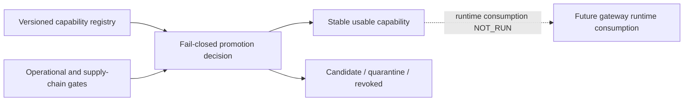

# EPIC-07 — Capability Registry

## 1. Metadata

| Field | Value |
| --- | --- |
| Concept epic ID | `EPIC-07` |
| Slug | `capability-registry` |
| Pillar | `C` — Image and Capability Factory |
| Phase | 3 |
| Priority | P0 |
| Delivery umbrella | `SVP2-C-02` (issue [#83](https://github.com/pestoura/hermes-security-labs/issues/83)) |
| Document version | 1.1.0 |
| Document date | 2026-08-07 |
| Catalogue | [Epic catalogue 45](../epic-catalogue-45.md) |
| Lifecycle contract | [Architecture documentation lifecycle](../../architecture/architecture-documentation-lifecycle.md) |

## 2. Current status

**IMPLEMENTING** — PR #143 integrated a repository-owned capability-registry and promotion-decision contract. The registry fixes canonical profiles and fail-closed usability/promotion rules, but runtime registry consumption, campaign snapshot pinning and production capability use remain `NOT_RUN`.

| Lifecycle state | Reached |
| --- | --- |
| INTENT | yes |
| IMPLEMENTING | yes |
| AS_BUILT | no |
| FINAL | no |

## 3. Problem and motivation

Typed operations need a canonical registry declaring which capabilities exist, their profiles and the evidence required before they can be considered usable. Without it, runtime availability could be confused with authorization or production readiness.

## 4. Intended outcome

A versioned capability registry that the gateway consults to authorize, route and bound every typed operation, with explicit promotion and revocation semantics.

## 5. Scope and non-goals

### In scope

- Strict capability-registry schema
- Canonical capability profiles
- Separate installed, executable, functionally-tested, authorized and compatible states
- Candidate/stable/quarantine/revoked promotion semantics
- Fail-closed stable-usability decision
- Supply-chain evidence references required for stable promotion

### Non-goals

- Runtime discovery of undeclared capabilities
- Treating installation as authorization
- Claiming production consumption of the registry
- Generating SBOM, signatures, provenance or image scan evidence in this lifecycle block

## 6. Intent architecture

The registry is declarative and versioned in Git. A capability becomes usable as `stable` only after all operational and supply-chain gates represented by the contract are satisfied. Candidate, quarantined or revoked entries cannot be treated as production-usable.

## 7. Contracts, data and capabilities

Canonical repository components are under `platform/capability-registry/` and include the strict registry schema, candidate registry/promotion data and decision logic introduced by PR #143.

The canonical profiles are:

- `web-api`;
- `devsecops`;
- `ai-mcp`;
- `exploitation`;
- `kubernetes`;
- `identity`;
- `cloud`;
- `mobile`;
- `iot-ot`.

Stable usability requires installed, executable, functionally tested, explicitly authorized and protocol-compatible state plus the supply-chain evidence gates owned jointly with EPIC-30.

## 8. Dependencies and sequencing

- [EPIC-03 — Typed Kali MCP](EPIC-03-typed-kali-mcp.md)
- [EPIC-06 — Kali Image Factory](EPIC-06-kali-image-factory.md)
- [EPIC-30 — Supply-chain attestations](EPIC-30-supply-chain-attestations.md)

The repository contract precedes live gateway/runtime consumption. C-01 image evidence and C-02 supply-chain evidence must converge before any capability is promoted operationally.

## 9. Security, risks and failure modes

- Registry drift versus actual image content
- Profiles silently widening intrusiveness
- Installed state being mistaken for functional or authorized state
- Candidate capabilities being consumed as stable
- Quarantine bypass or revoked capabilities being re-promoted
- Missing supply-chain evidence being treated as a warning instead of a blocker

Platform-wide invariants:

- capabilities absent from the registry are refused;
- candidate capabilities are not production-usable;
- quarantine is unusable and cannot jump directly to stable;
- revocation makes a capability immediately unusable;
- absence of required evidence cannot produce stable usability;
- authorization remains separate from installation and functional readiness.

## 10. Deliverables

Repository-level candidate delivered by PR #143:

- strict capability-registry schema;
- nine canonical profiles;
- promotion/usability decision logic;
- fail-closed quarantine/revocation semantics;
- supply-chain gate references;
- positive, negative and adversarial tests.

Still pending:

- live gateway loading of a pinned registry snapshot;
- campaign-level registry snapshot evidence;
- production capability routing/use;
- operational revocation exercise;
- image/SBOM/signature/provenance/scan generation and verification.

## 11. Acceptance criteria

Repository-level criteria currently demonstrated:

- unknown profiles and malformed promotion evidence are refused;
- stable usability requires all declared operational gates;
- candidate/quarantined/revoked entries cannot be treated as stable usable capabilities;
- required supply-chain evidence cannot be omitted from stable promotion.

Umbrella completion still requires operational evidence that:

- every typed operation resolves through the deployed pinned registry;
- campaign evidence records the registry snapshot used;
- revocation prevents real runtime consumption;
- registry/image content drift is detected before execution.

## 12. Evidence and validation plan

Current evidence is repository/CI only:

- PR #143 capability registry/promotion contract;
- capability registry schema and adversarial tests;
- full repository `security` and `validate` gates.

Runtime registry consumption and production revocation remain `NOT_RUN`.

## 13. Decisions and open questions

### Decisions

- Capabilities absent from the registry are refused.
- Installed, executable, functional, authorized and compatible are distinct states.
- Candidate, quarantined and revoked capabilities are not stable usable capabilities.
- Stable promotion requires supply-chain evidence; missing evidence blocks rather than warns.

### Open questions

- Whether capability deprecation blocks replay of historical campaigns
- Exact campaign snapshot/pinning mechanism used by the deployed gateway
- Operational revocation distribution and cache invalidation model

## 14. Implementation notes

> Reserved lifecycle section. It is populated progressively while the epic is `IMPLEMENTING`; retaining the `Reserved` marker is required by the architecture documentation lifecycle contract.

- PR #143 introduced the capability registry/promotion contract and regression tests.
- Issue #83 and master tracker #97 already classify C-02 as `implementing`.
- This reconciliation removes the stale `INTENT / not started` claim without promoting runtime state.

## 15. As-built / final architecture

> Reserved lifecycle section. This section records the current implementation boundary but remains non-final until runtime evidence satisfies the umbrella acceptance criteria.

Current factual boundary:

- capability registry schema/decision logic: `CANDIDATE`;
- nine canonical profiles: repository validated;
- candidate/stable/quarantine/revoked semantics: repository validated;
- supply-chain evidence requirements for stable promotion: repository validated;
- live gateway registry consumption: `NOT_RUN`;
- campaign registry snapshot pinning: `NOT_RUN`;
- production capability routing/use: `NOT_RUN`;
- production revocation exercise: `NOT_RUN`;
- runtime changes: `NO_RUNTIME_CHANGE`.

`AS_BUILT` and `FINAL` remain false.

_Lifecycle unchanged: EPIC-07 is `IMPLEMENTING`; `AS_BUILT` and `FINAL` remain no. The record below states exactly what was merged and where the evidence lives, so that a future promotion decision is not made from memory or by association._
### Exact evidence

| Evidence | Value |
| --- | --- |
| Technical pull request | [#143](https://github.com/pestoura/hermes-security-labs/pull/143) |
| Validated PR head | `b3092383ed487cced7885fd683a02e7c1fadbd9c` |
| Integrated `main` merge commit | `6d21031af130ac00be311911bb94185134e2dd18` |
| Pre-merge `validate` | success — run `31170650211` |
| Pre-merge `security` | success — run `31170650159` |
| Post-merge `main` `validate` | success — run `31170865032` |
| Post-merge `main` `security` | success — run `31170865044` |

The merge commit is an ancestor of `main`.

### Evidence that is missing for promotion

`AS_BUILT` is withheld because the epic's target state is not satisfied by repository-level contract integration alone:

- live gateway registry consumption, campaign snapshot pinning and production routing/use: NOT_RUN.

`NO_RUNTIME_CHANGE`.

## 16. Document change log

| Date | Version | Change |
| --- | --- | --- |
| 2026-08-06 | 1.0.0 | Initial intent document created from the concept epic catalogue. |
| 2026-08-07 | 1.1.0 | Reconciled EPIC-07 to `IMPLEMENTING` after PR #143 while preserving registry runtime consumption and production use as `NOT_RUN`. |
