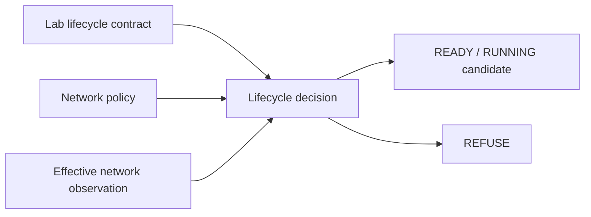

# EPIC-08 — Network and egress policy

## 1. Metadata

| Field | Value |
| --- | --- |
| Concept epic ID | `EPIC-08` |
| Slug | `network-and-egress-policy` |
| Pillar | `B` — Runtime Foundation |
| Phase | 2 |
| Priority | P0 |
| Delivery umbrella | `SVP2-B-03` (issue [#81](https://github.com/pestoura/hermes-security-labs/issues/81)) |
| Document version | 1.1.0 |
| Document date | 2026-08-07 |
| Catalogue | [Epic catalogue 45](../epic-catalogue-45.md) |
| Lifecycle contract | [Architecture documentation lifecycle](../../architecture/architecture-documentation-lifecycle.md) |

## 2. Current status

**IMPLEMENTING** — PR #139 integrated the repository-level network/isolation policy candidate used by the transactional lab lifecycle. The contract defaults to isolated/deny-all egress, permits only explicit restricted exceptions and validates effective network posture before READY/RUNNING. Real network-policy enforcement remains `NOT_RUN`.

| Lifecycle state | Reached |
| --- | --- |
| INTENT | yes |
| IMPLEMENTING | yes |
| AS_BUILT | no |
| FINAL | no |

## 3. Problem and motivation

Network posture applied per environment without a single policy contract is difficult to audit and easy to widen accidentally. Shared networks, stale exceptions or undeclared egress can also violate strict customer/laboratory separation.

## 4. Intended outcome

A declarative network policy model with isolated deny-all as the default, explicit restricted allowlists and auditable, owned, approved and time-bounded exceptions. A lifecycle transition refuses READY/RUNNING when the observed network posture is broader than the declared contract.

## 5. Scope and non-goals

### In scope

- Default isolated/deny-all egress profile
- Per-lab unique network identity in the lifecycle contract
- Restricted egress through explicit destinations only
- Time-bounded exceptions with owner, approver, validity and reason
- Effective network observation before READY/RUNNING
- Prohibition of open egress, shared networks and host-level network bypasses

### Non-goals

- Changing production network configuration outside labs
- Claiming deployed Docker/network enforcement without runtime evidence
- Allowing package-install convenience to silently widen default-deny

## 6. Intent architecture

The repository candidate binds the declared network profile to the lifecycle decision. `isolated` is the default and permits no egress exceptions. `restricted` permits only explicitly declared, owned, approved and currently valid destinations. Observed posture wider than the contract is refused.

Actual firewall/container-network enforcement remains `NOT_RUN`.

## 7. Contracts, data and capabilities

The network contract is implemented jointly with EPIC-04 under:

- `platform/lab-lifecycle/lab-lifecycle-contract.schema.json`;
- `platform/lab-lifecycle/lab-transition-request.schema.json`;
- `platform/lab-lifecycle/lifecycle-policy.yaml`;
- `platform/lab-lifecycle/lifecycle_protocol.py`.

The contract records network ID/profile, egress exceptions and effective network observation. The lifecycle contract additionally forbids privileged mode, host networking, Docker socket, host mounts and shared networks.

## 8. Dependencies and sequencing

- [EPIC-04 — Transactional lifecycle and isolation](EPIC-04-transactional-lifecycle-and-isolation.md)
- B-02 Runner Protocol precedes deployed laboratory execution.

Repository contract validation can proceed independently of real network enforcement.

## 9. Security, risks and failure modes

- Silent widening through shared networks
- Exceptions outliving their justification
- Effective posture not matching the declared profile
- Open egress introduced as an operational shortcut
- Package installation or dependency fetching bypassing the policy model

Current repository invariants:

- `isolated` is the default network profile;
- isolated egress is `deny-all` and exceptions are not allowed;
- restricted egress requires explicit allowlisted destinations;
- exceptions require owner, approver, validity window and reason;
- observed destinations must be a subset of active declared exceptions;
- `open` is not a permitted contract profile;
- shared networks, privileged mode, host networking, Docker socket and host mounts are forbidden;
- real enforcement remains `NOT_RUN` and therefore is not inferred from contract validation.

## 10. Deliverables

Repository candidates already delivered:

- isolated/restricted network policy model;
- network/isolation fields in the lab lifecycle contract;
- effective-network observation contract;
- deterministic network-posture refusal logic;
- exception ownership/approval/time-window validation;
- regression and adversarial tests.

Still pending:

- real Docker/network adapters;
- default-deny enforcement against actual lab networks;
- controlled egress exception application/removal;
- runtime observation proving effective posture;
- periodic detection of orphan/shared/unexpected network resources.

## 11. Acceptance criteria

Repository-level criteria implemented by #139:

- isolated/deny-all is the default policy;
- no contract permits open egress;
- every restricted exception carries explicit governance metadata;
- READY/RUNNING is refused without the required effective network observation;
- observed destinations wider than declared exceptions are refused.

Umbrella completion still requires runtime evidence that:

- no lab obtains egress by default;
- actual network isolation matches the declared per-lab profile;
- expired exceptions are removed and cannot remain effective;
- no shared/orphan network state survives cleanup.

## 12. Evidence and validation plan

Repository evidence:

- PR #139 merged as `591552d652fbff82d81f750535799380e9c643a9`;
- lifecycle/network policy tests were delivered with the technical block;
- post-merge `security` run `31135492162`: success;
- post-merge `validate` run `31135492132`: success.

Real network-policy enforcement and observation remain `NOT_RUN` and must be referenced from issue #81 before closure.

## 13. Decisions and open questions

### Decisions

- Default posture is isolated deny-all egress.
- Restricted egress requires explicit governed exceptions.
- Contract validation never substitutes for proof of deployed network enforcement.
- No shared lab network is permitted by the contract candidate.

### Open questions

- How package installation inside labs is handled without weakening default-deny
- Exact enforcement adapter for Docker and later Kubernetes environments
- Operational process for emergency egress exception revocation

## 14. Implementation notes

> Reserved lifecycle section. It is populated progressively while the epic is `IMPLEMENTING`; retaining the `Reserved` marker is required by the architecture documentation lifecycle contract.

- PR #139 implemented the network/isolation policy jointly with EPIC-04 transactional lifecycle.
- Technical merge: `591552d652fbff82d81f750535799380e9c643a9`.
- Post-merge `security` and `validate` both passed.
- No firewall, Docker network, laboratory or target configuration was changed.
- Current reconciliation promotes only lifecycle/source-of-truth from stale `INTENT` to factual `IMPLEMENTING`.

## 15. As-built / final architecture

> Reserved lifecycle section. This records current implementation limits but remains non-final until deployed runtime evidence satisfies issue #81 acceptance criteria.

Current factual boundary:

- isolated/restricted egress contract: `CANDIDATE`;
- governed exception validation: `CANDIDATE`;
- effective network observation decision logic: `CANDIDATE`;
- network-policy enforcement: `NOT_RUN`;
- actual deny-all observation: `NOT_RUN`;
- periodic orphan/network detector: `NOT_IMPLEMENTED`;
- runtime changes: `NO_RUNTIME_CHANGE`.

`AS_BUILT` and `FINAL` remain false.

## 16. Document change log

| Date | Version | Change |
| --- | --- | --- |
| 2026-08-06 | 1.0.0 | Initial intent document created from the concept epic catalogue. |
| 2026-08-07 | 1.1.0 | Reconciled lifecycle to `IMPLEMENTING` using PR #139 and post-merge evidence; preserved all runtime limitations. |
