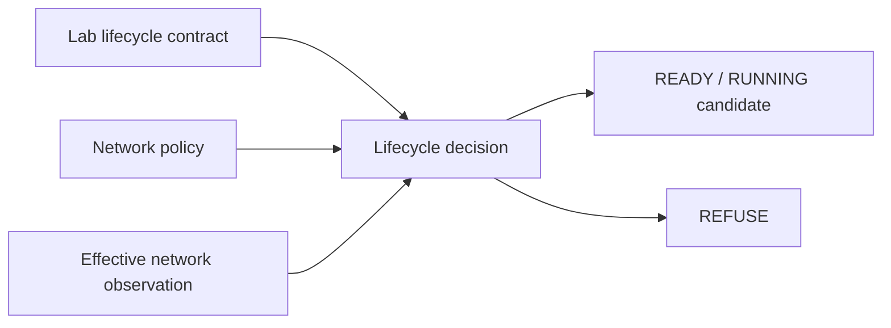
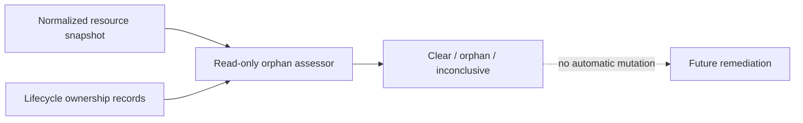

# EPIC-08 — Network and egress policy

## 1. Metadata

| Field | Value |
| --- | --- |
| Concept epic ID | `EPIC-08` |
| Slug | `network-and-egress-policy` |
| Pillar | `B` — Runtime Foundation |
| Phase | 2 |
| Priority | P0 |
| Delivery umbrella | `SVP2-B-03` (issue [#81](https://github.com/pestoura/hermes-security-labs/issues/81)) |
| Document version | 1.2.0 |
| Document date | 2026-08-07 |
| Catalogue | [Epic catalogue 45](../epic-catalogue-45.md) |
| Lifecycle contract | [Architecture documentation lifecycle](../../architecture/architecture-documentation-lifecycle.md) |

## 2. Current status

**IMPLEMENTING** — PR #139 integrated the repository-level network/isolation policy candidate used by the transactional lab lifecycle. The contract defaults to isolated/deny-all egress, permits only explicit restricted exceptions and validates effective network posture before READY/RUNNING. The current block adds read-only classification of orphan network/resource observations; real network-policy enforcement and runtime scanning remain `NOT_RUN` / `NOT_IMPLEMENTED`.

| Lifecycle state | Reached |
| --- | --- |
| INTENT | yes |
| IMPLEMENTING | yes |
| AS_BUILT | no |
| FINAL | no |

## 3. Problem and motivation

Network posture applied per environment without a single policy contract is difficult to audit and easy to widen accidentally. Shared networks, stale exceptions or undeclared egress can also violate strict customer/laboratory separation. Residual network resources after a lab reaches a terminal state must also be detectable without coupling observation to automatic deletion.

## 4. Intended outcome

A declarative network policy model with isolated deny-all as the default, explicit restricted allowlists and auditable, owned, approved and time-bounded exceptions. A lifecycle transition refuses READY/RUNNING when the observed network posture is broader than the declared contract.

A separate read-only orphan assessor can classify normalized network/resource residue against lifecycle ownership. It never applies firewall, Docker network or cleanup changes.

## 5. Scope and non-goals

### In scope

- Default isolated/deny-all egress profile
- Per-lab unique network identity in the lifecycle contract
- Restricted egress through explicit destinations only
- Time-bounded exceptions with owner, approver, validity and reason
- Effective network observation before READY/RUNNING
- Prohibition of open egress, shared networks and host-level network bypasses
- Normalized orphan-resource observation including network resources
- Read-only classification of orphan network residue

### Non-goals

- Changing production network configuration outside labs
- Claiming deployed Docker/network enforcement without runtime evidence
- Allowing package-install convenience to silently widen default-deny
- Enumerating real runtime networks from this repository-only assessor
- Automatically deleting or disconnecting an orphan network finding

## 6. Intent architecture

The repository candidate binds the declared network profile to the lifecycle decision. `isolated` is the default and permits no egress exceptions. `restricted` permits only explicitly declared, owned, approved and currently valid destinations. Observed posture wider than the contract is refused.

Orphan detection is a separate non-mutating path:

Actual firewall/container-network enforcement, scanning and remediation remain `NOT_RUN`.

## 7. Contracts, data and capabilities

The network contract is implemented jointly with EPIC-04 under:

- `platform/lab-lifecycle/lab-lifecycle-contract.schema.json`;
- `platform/lab-lifecycle/lab-transition-request.schema.json`;
- `platform/lab-lifecycle/lifecycle-policy.yaml`;
- `platform/lab-lifecycle/lifecycle_protocol.py`;
- `platform/lab-lifecycle/orphan-observation.schema.json`;
- `platform/lab-lifecycle/orphan-assessment.schema.json`;
- `platform/lab-lifecycle/orphan_detector.py`.

The lifecycle contract records network ID/profile, egress exceptions and effective network observation. It additionally forbids privileged mode, host networking, Docker socket, host mounts and shared networks. The orphan observation contract carries opaque resource references only and includes `network` as one normalized resource kind without carrying raw network addresses or configuration.

## 8. Dependencies and sequencing

- [EPIC-04 — Transactional lifecycle and isolation](EPIC-04-transactional-lifecycle-and-isolation.md)
- B-02 Runner Protocol precedes deployed laboratory execution.

Repository contract validation can proceed independently of real network enforcement. A future authenticated read-only runtime scanner must precede scheduled orphan detection.

## 9. Security, risks and failure modes

- Silent widening through shared networks
- Exceptions outliving their justification
- Effective posture not matching the declared profile
- Open egress introduced as an operational shortcut
- Package installation or dependency fetching bypassing the policy model
- Partial scanner coverage being mistaken for proof that no orphan network exists
- Automatic cleanup triggered directly from an untrusted observation
- Raw network/path data leaking through assessment logs

Current repository invariants:

- `isolated` is the default network profile;
- isolated egress is `deny-all` and exceptions are not allowed;
- restricted egress requires explicit allowlisted destinations;
- exceptions require owner, approver, validity window and reason;
- observed destinations must be a subset of active declared exceptions;
- `open` is not a permitted contract profile;
- shared networks, privileged mode, host networking, Docker socket and host mounts are forbidden;
- partial/unavailable orphan observations cannot produce `CLEAR`;
- resources associated with unknown labs, mismatched campaigns, `VERIFIED` labs or expired active contracts are orphan candidates;
- cleanup-in-progress states are not prematurely classified as orphaned;
- orphan assessment performs no network or cleanup mutation;
- real enforcement/scanning remains `NOT_RUN` and therefore is not inferred from contract validation.

## 10. Deliverables

Repository candidates already delivered:

- isolated/restricted network policy model;
- network/isolation fields in the lab lifecycle contract;
- effective-network observation contract;
- deterministic network-posture refusal logic;
- exception ownership/approval/time-window validation;
- normalized read-only orphan observation/assessment for network and other lab resources;
- regression and adversarial tests.

Still pending:

- real Docker/network adapters;
- default-deny enforcement against actual lab networks;
- controlled egress exception application/removal;
- runtime observation proving effective posture;
- runtime resource scanner;
- periodic orphan/network scan scheduler;
- separately authorized/audited orphan remediation.

## 11. Acceptance criteria

Repository-level criteria implemented by #139 and the current assessor block:

- isolated/deny-all is the default policy;
- no contract permits open egress;
- every restricted exception carries explicit governance metadata;
- READY/RUNNING is refused without the required effective network observation;
- observed destinations wider than declared exceptions are refused;
- incomplete orphan scans cannot falsely attest absence of network residue;
- orphan-network findings do not trigger automatic remediation.

Umbrella completion still requires runtime evidence that:

- no lab obtains egress by default;
- actual network isolation matches the declared per-lab profile;
- expired exceptions are removed and cannot remain effective;
- a real scanner detects shared/orphan network state;
- no shared/orphan network state survives cleanup.

## 12. Evidence and validation plan

Existing repository evidence:

- PR #139 merged as `591552d652fbff82d81f750535799380e9c643a9`;
- post-merge `security` run `31135492162`: success;
- post-merge `validate` run `31135492132`: success;
- PR #166 reconciled EPIC-04/08 lifecycle/source-of-truth with post-merge `security #1092` and `validate #1094` success.

Current block adds strict orphan observation/assessment schemas and adversarial classification tests, including network-kind resources. Real network-policy enforcement and runtime scanning remain `NOT_RUN`.

## 13. Decisions and open questions

### Decisions

- Default posture is isolated deny-all egress.
- Restricted egress requires explicit governed exceptions.
- Contract validation never substitutes for proof of deployed network enforcement.
- No shared lab network is permitted by the contract candidate.
- Orphan observation is read-only and separated from remediation.
- A partial/unavailable scan cannot prove the absence of orphan networks.

### Open questions

- How package installation inside labs is handled without weakening default-deny
- Exact enforcement adapter for Docker and later Kubernetes environments
- Runtime scanner identity and observation-authenticity model
- Operational process for emergency egress exception revocation
- Cadence and remediation approval for orphan network findings

## 14. Implementation notes

> Reserved lifecycle section. It is populated progressively while the epic is `IMPLEMENTING`; retaining the `Reserved` marker is required by the architecture documentation lifecycle contract.

- PR #139 implemented the network/isolation policy jointly with EPIC-04 transactional lifecycle.
- Technical merge: `591552d652fbff82d81f750535799380e9c643a9`.
- PR #166 reconciled EPIC-04/08 source-of-truth to `IMPLEMENTING` with green post-merge gates.
- The current block adds read-only orphan observation/assessment including normalized network resources.
- No firewall, Docker network, runtime scanner, laboratory, target or remediation action is executed.

## 15. As-built / final architecture

> Reserved lifecycle section. This records current implementation limits but remains non-final until deployed runtime evidence satisfies issue #81 acceptance criteria.

Current factual boundary:

- isolated/restricted egress contract: `CANDIDATE`;
- governed exception validation: `CANDIDATE`;
- effective network observation decision logic: `CANDIDATE`;
- orphan observation/assessment contract and decision logic: `CANDIDATE`;
- runtime resource scanner: `NOT_IMPLEMENTED` / `NOT_RUN`;
- periodic orphan/network scan scheduler: `NOT_IMPLEMENTED`;
- orphan remediation: `NOT_IMPLEMENTED` / `NOT_RUN`;
- network-policy enforcement: `NOT_RUN`;
- actual deny-all observation: `NOT_RUN`;
- runtime changes: `NO_RUNTIME_CHANGE`.

`AS_BUILT` and `FINAL` remain false.

## 16. Document change log

| Date | Version | Change |
| --- | --- | --- |
| 2026-08-06 | 1.0.0 | Initial intent document created from the concept epic catalogue. |
| 2026-08-07 | 1.1.0 | Reconciled lifecycle to `IMPLEMENTING` using PR #139 and post-merge evidence; preserved all runtime limitations. |
| 2026-08-07 | 1.2.0 | Added read-only orphan observation/assessment contract candidate while preserving runtime scanning, enforcement and remediation as unimplemented. |
