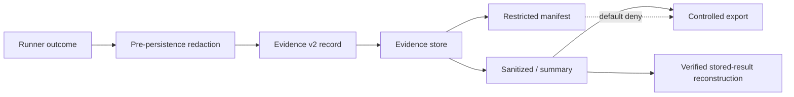

# EPIC-10 — Evidence Plane

## 1. Metadata

| Field | Value |
| --- | --- |
| Concept epic ID | `EPIC-10` |
| Slug | `evidence-plane` |
| Pillar | `D` — Evidence Observability and Assurance |
| Phase | 2 |
| Priority | P0 |
| Delivery umbrella | `SVP2-D-01` (issue [#84](https://github.com/pestoura/hermes-security-labs/issues/84)) |
| Document version | 1.3.0 |
| Document date | 2026-08-08 |
| Catalogue | [Epic catalogue 45](../epic-catalogue-45.md) |
| Lifecycle contract | [Architecture documentation lifecycle](../../architecture/architecture-documentation-lifecycle.md) |

## 2. Current status

**IMPLEMENTING** — PR #141 delivered the Evidence Plane v2 record/classification/replay contract. PR #217 added controlled local content-addressed persistence. PRs #219/#221 added deterministic structured redaction and redaction-before-persistence for synthetic structured sources. PR #223 added canonical record-metadata integrity sidecars and deterministic verified reconstruction of stored sanitized/summary results.

The delivery umbrella `SVP2-D-01` may be completed at this controlled local boundary once its completion PR and post-merge gates are GREEN. That delivery completion does **not** promote this concept to `AS_BUILT` or `FINAL`.

| Lifecycle state | Reached |
| --- | --- |
| INTENT | yes |
| IMPLEMENTING | yes |
| AS_BUILT | no |
| FINAL | no |

Current evidence boundary:

- record/schema contract: implemented;
- local content-addressed persistence: `PASS_LOCAL_CONTROLLED_CI`;
- local payload + record-metadata integrity/reopen: `PASS_CONTROLLED_CI`;
- local export classification boundary: `PASS_CONTROLLED_CI`;
- structured redaction: `PASS_CONTROLLED_CI`;
- redaction before persistence: `PASS_CONTROLLED_CI`;
- verified stored-result reconstruction: `PASS_CONTROLLED_CI`;
- execution replay: `NOT_CLAIMED`;
- authorization replay: `NOT_CLAIMED`;
- encryption at rest: `NOT_RUN`;
- WORM/immutable storage service: `NOT_IMPLEMENTED` / `NOT_RUN`;
- retention enforcement/deletion: `NOT_IMPLEMENTED` / `NOT_RUN`;
- object storage: `NOT_RUN`;
- production redaction/replay: `NOT_RUN`;
- customer export: `NOT_RUN`;
- deployed platform integration: `NO_RUNTIME_CHANGE`.

## 3. Problem and motivation

Evidence produced per campaign needs a unified, versioned model and a custody boundary so that integrity, retention, derivation and replay can be audited rather than inferred from runner output.

## 4. Intended outcome

An Evidence Plane v2 with normalized records, chain of custody, retention policy, separation of raw and sanitized artefacts, deterministic replay/reconstruction and controlled publication.

## 5. Scope and non-goals

### In scope

- Normalized evidence record envelope
- Four Runner Protocol correlation identifiers
- Content hashes and content-addressed references
- Raw/restricted/sanitized/summary classification
- Parent/redaction lineage for derived evidence
- Default-deny sharing for raw/restricted evidence
- Retention metadata and replay descriptor contract
- Controlled local persistence reference implementation
- Controlled redaction-before-persistence for structured synthetic sources
- Deterministic verified reconstruction of stored sanitized/summary results

### Non-goals of the current local store

- Production object storage
- Encryption-at-rest claims
- WORM/legal-hold backend implementation
- Automatic retention deletion
- Customer publication/export workflow
- Re-execution of the originating security operation
- Replay of authorization decisions
- Protection against an actor with write control over the complete store
- Storing real client secrets or credentials in CI fixtures

## 6. Intent architecture

The local reference store implements persistence, payload integrity, canonical record-metadata integrity, lineage verification, replay descriptors, controlled sanitized export and stored-result reconstruction. It does not implement production storage, production replay or external export.

## 7. Contracts, data and capabilities

Canonical implementation:

- `platform/evidence-plane/evidence-record.schema.json`
- `platform/evidence-plane/evidence-policy.yaml`
- `platform/evidence-plane/evidence_plane.py`
- `platform/evidence-plane/local_store.py`
- `platform/evidence-plane/redaction.py`
- `platform/evidence-plane/safe_persistence.py`
- `platform/evidence-plane/reconstruction.py`

The local store and reconstruction boundary:

- verify payload SHA-256 and byte count before persistence;
- use content-addressed object paths;
- write object/record files with create-only semantics and refuse identity mutation;
- bind canonical record metadata to a separate SHA-256 integrity sidecar;
- store files/directories with owner-only permissions in the controlled boundary;
- reopen and verify persisted evidence across store instances;
- fail closed on payload, record, sidecar or parent-lineage tampering;
- verify parent existence, parent integrity and source digest before accepting derived evidence;
- refuse raw/restricted export;
- redact structured sensitive source material in memory before the first store write;
- reconstruct only sanitized/summary results with verified lineage;
- emit deterministic reconstruction receipts that explicitly state `execution_replayed=false` and `authorization_replayed=false`.

Evidence content never grants or expands execution authority.

## 8. Dependencies and sequencing

- [EPIC-05 — Runner Protocol v2](EPIC-05-runner-protocol-v2.md)
- [EPIC-12 — Redaction and data classification](EPIC-12-redaction-and-data-classification.md)

Runner Protocol B-02 is completed at its delivery boundary, while production Runner execution remains non-final. D-01 can likewise complete at the declared controlled local boundary without claiming production Evidence Plane finality.

## 9. Security, risks and failure modes

- Evidence volume outgrowing retention budget
- Sanitization removing information needed for later analysis
- Storage or export layers bypassing classification rules
- Record metadata mutation after persistence
- Payload tampering after persistence
- Derived evidence referencing the wrong source digest
- Local filesystem sidecars being mistaken for WORM guarantees
- Treating stored-result reconstruction as re-execution of the original operation
- Treating controlled CI evidence as production custody evidence

Platform-wide invariants remain:

- absence of evidence never produces a `PASS` verdict;
- no execution outside active authorization;
- evidence never grants or expands authorization;
- no secrets/tokens/cookies/raw credential material in documentation or telemetry;
- raw/restricted evidence is not externally shareable by default;
- controlled CI fixtures contain synthetic data only.

## 10. Deliverables

Delivered for the D-01 umbrella:

- Evidence Plane v2 specification and schema;
- classification/export policy;
- retention and replay metadata contract;
- deterministic replay descriptor;
- controlled local content-addressed persistence reference;
- payload + canonical record metadata integrity;
- deterministic structured redaction;
- redaction-before-persistence safe ingress;
- deterministic verified stored-result reconstruction;
- adversarial integrity/lineage/export/reconstruction tests in canonical CI.

Still pending for the broader concept/finality:

- selected production backend and encryption-at-rest proof;
- WORM/immutability and legal-hold enforcement;
- executable retention/deletion policy;
- production Runner/Evidence Plane handoff;
- production redaction/replay;
- customer export/release process.

## 11. Acceptance criteria

Demonstrated at repository/local-controlled level:

- evidence records include hashes, origin and all four correlation IDs;
- payload digest/size are verified before local persistence;
- record metadata is bound to a canonical SHA-256 sidecar;
- payload, record, sidecar and parent-lineage tampering fail closed;
- records can be reopened and verified from a fresh store instance;
- raw/restricted evidence cannot cross the local export boundary;
- structured sensitive source material is redacted before persistence;
- a sanitized/summary stored result can be deterministically reconstructed from its record and verified lineage;
- reconstruction receipts contain no storage reference and explicitly do not claim operation or authorization replay.

Not yet demonstrated at production level:

- encryption at rest and WORM/immutability backend;
- retention expiry/legal-hold execution;
- production redaction/replay and external publication;
- end-to-end production Runner → Evidence Plane → evaluation/customer export.

## 12. Evidence and validation plan

Current evidence:

- PR #217 merge `aa589bbaa6ede9192963ff2a47244ab34309c1c6`; post-merge security `31265416771` PASS; validate `31265416803` PASS;
- PR #219 merge `383d60479f5874ac103fe3a74654e85690be19d0`; post-merge security `31266367567` PASS; validate `31266367331` PASS;
- PR #221 merge `cbf88aecb9bf69ad4d7bd0164f8ac8f61f04b4aa`; post-merge security `31267199992` PASS; validate `31267199995` PASS;
- PR #223 validated head `38ad140426392f13e2ac361016d5ec952ddb5665`; pre-merge security `31268294121` PASS; validate `31268294124` PASS; squash merge `fa0e0eb40e0fd558b43a2bae8f411761d51f9807`; post-merge security `31268410335` PASS; validate `31268410326` PASS.

Future finality evidence must include the production backend, encryption/WORM controls, retention operations, deployed handoff and controlled release/export path.

## 13. Decisions and open questions

### Decisions

- Missing evidence yields UNKNOWN, never PASS.
- Raw/restricted evidence is non-exportable by default.
- Structured sensitive sources are redacted before persistence in the controlled safe-ingress path.
- Local persistence is content-addressed and fail-closed on payload/record/sidecar/lineage mutation.
- Stored-result reconstruction is not execution replay and not authorization replay.
- Controlled local persistence does not imply production durability, WORM compliance or concept finality.

### Open questions

- Production evidence backend and WORM mechanism
- Encryption/key lifecycle and tenant isolation
- Retention classes/deletion scheduler
- Whether production replay requires pinned images or only evidence reconstruction
- Customer export/release approval workflow

## 14. Implementation notes

> Reserved lifecycle section. Keep populated while implementation advances.

- PR #141 integrated the contract.
- PR #217 integrated `LocalEvidenceStore` plus adversarial persistence tests.
- PR #219 integrated deterministic structured redaction.
- PR #221 integrated structured redaction-before-persistence.
- PR #223 integrated record metadata integrity sidecars and verified stored-result reconstruction.
- All fixtures are synthetic and filesystem-local to CI temporary directories.
- No customer payload, credential, target, network or deployed Evidence Plane was used.
- Production/deployed runtime remains `NO_RUNTIME_CHANGE`.

## 15. As-built / final architecture

> Reserved lifecycle section. The D-01 delivery boundary is implemented in controlled local CI, but the concept remains non-final.

Current factual state:

- Evidence v2 schema/policy/validators: implemented;
- local content-addressed store: `PASS_LOCAL_CONTROLLED_CI`;
- owner-only local storage permissions: `PASS_CONTROLLED_CI`;
- create-only record/object writes: `PASS_CONTROLLED_CI`;
- canonical record metadata integrity sidecar: `PASS_CONTROLLED_CI`;
- reopen/payload/record/lineage tamper detection: `PASS_CONTROLLED_CI`;
- local raw/restricted export denial: `PASS_CONTROLLED_CI`;
- structured redaction: `PASS_CONTROLLED_CI`;
- redaction before persistence: `PASS_CONTROLLED_CI`;
- verified stored-result reconstruction: `PASS_CONTROLLED_CI`;
- operation/authorization replay: `NOT_CLAIMED`;
- encryption at rest: `NOT_RUN`;
- WORM/object storage: `NOT_IMPLEMENTED` / `NOT_RUN`;
- retention execution: `NOT_IMPLEMENTED` / `NOT_RUN`;
- production redaction/replay: `NOT_RUN`;
- customer export: `NOT_RUN`;
- deployed Evidence Plane: `NO_RUNTIME_CHANGE`.

`AS_BUILT` for the complete concept remains false; `FINAL` remains false.

_Lifecycle unchanged: EPIC-10 is `IMPLEMENTING`; `AS_BUILT` and `FINAL` remain no. The record below states exactly what was merged and where the evidence lives, so that a future promotion decision is not made from memory or by association._
### Exact evidence

| Evidence | Value |
| --- | --- |
| Technical pull request | [#141](https://github.com/pestoura/hermes-security-labs/pull/141) |
| Validated PR head | `00d174672da10e58aa4f2d87e5770e5627f05ebf` |
| Integrated `main` merge commit | `4ff6e51f8f0ecd258c1f0bca888b77005f4ecdf8` |
| Pre-merge `validate` | success — run `31170817757` |
| Pre-merge `security` | success — run `31170817768` |
| Post-merge `main` `validate` | success — run `31171061241` |
| Post-merge `main` `security` | success — run `31171061289` |

The merge commit is an ancestor of `main`.

### Evidence that is missing for promotion

`AS_BUILT` is withheld because the epic's target state is not satisfied by repository-level contract integration alone:

- production evidence storage, encryption at rest, WORM/immutability, retention enforcement and production redaction/replay: NOT_IMPLEMENTED / NOT_RUN.

`NO_RUNTIME_CHANGE`.

## 16. Document change log

| Date | Version | Change |
| --- | --- | --- |
| 2026-08-06 | 1.0.0 | Initial intent document. |
| 2026-08-07 | 1.1.0 | Reconciled contract candidate to IMPLEMENTING while preserving operational non-claims. |
| 2026-08-08 | 1.2.0 | Record PR #217 controlled local persistence, integrity/replay and export-boundary evidence. |
| 2026-08-08 | 1.3.0 | Record redaction-before-persistence and PR #223 verified stored-result reconstruction; separate D-01 delivery completion from EPIC-10 production finality. |
