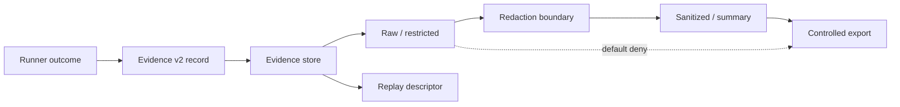

# EPIC-10 — Evidence Plane

## 1. Metadata

| Field | Value |
| --- | --- |
| Concept epic ID | `EPIC-10` |
| Slug | `evidence-plane` |
| Pillar | `D` — Evidence Observability and Assurance |
| Phase | 2 |
| Priority | P0 |
| Delivery umbrella | `SVP2-D-01` (issue [#84](https://github.com/pestoura/hermes-security-labs/issues/84)) |
| Document version | 1.2.0 |
| Document date | 2026-08-08 |
| Catalogue | [Epic catalogue 45](../epic-catalogue-45.md) |
| Lifecycle contract | [Architecture documentation lifecycle](../../architecture/architecture-documentation-lifecycle.md) |

## 2. Current status

**IMPLEMENTING** — PR #141 delivered the Evidence Plane v2 record/classification/replay contract. PR #217 added a controlled local content-addressed persistence reference that is executed by CI and verifies reopen, payload integrity, immutable record identity, derived-evidence lineage, replay descriptors and default-deny export for raw/restricted evidence.

| Lifecycle state | Reached |
| --- | --- |
| INTENT | yes |
| IMPLEMENTING | yes |
| AS_BUILT | no |
| FINAL | no |

Current evidence boundary:

- record/schema contract: implemented;
- local content-addressed persistence: `PASS_LOCAL_CONTROLLED_CI`;
- local integrity/reopen/replay: `PASS_CONTROLLED_CI`;
- local export classification boundary: `PASS_CONTROLLED_CI`;
- encryption at rest: `NOT_RUN`;
- WORM/immutable storage service: `NOT_IMPLEMENTED` / `NOT_RUN`;
- retention enforcement/deletion: `NOT_IMPLEMENTED` / `NOT_RUN`;
- object storage: `NOT_RUN`;
- production redaction/replay: `NOT_RUN`;
- customer export: `NOT_RUN`;
- deployed platform integration: `NO_RUNTIME_CHANGE`.

## 3. Problem and motivation

Evidence produced per campaign needs a unified, versioned model and a custody boundary so that integrity, retention, derivation and replay can be audited rather than inferred from runner output.

## 4. Intended outcome

An Evidence Plane v2 with normalized records, chain of custody, retention policy, separation of raw and sanitized artefacts, deterministic replay and controlled publication.

## 5. Scope and non-goals

### In scope

- Normalized evidence record envelope
- Four Runner Protocol correlation identifiers
- Content hashes and content-addressed references
- Raw/restricted/sanitized/summary classification
- Parent/redaction lineage for derived evidence
- Default-deny sharing for raw/restricted evidence
- Retention metadata and replay descriptor contract
- Controlled local persistence reference implementation

### Non-goals of the current local store

- Production object storage
- Encryption-at-rest claims
- WORM/legal-hold backend implementation
- Automatic retention deletion
- Customer publication/export workflow
- Storing real client secrets or credentials in CI fixtures

## 6. Intent architecture

The local reference store implements `STORE`, integrity verification, replay descriptors and the classification gate. It does not implement production redaction, object storage or external export.

## 7. Contracts, data and capabilities

Canonical implementation:

- `platform/evidence-plane/evidence-record.schema.json`
- `platform/evidence-plane/evidence-policy.yaml`
- `platform/evidence-plane/evidence_plane.py`
- `platform/evidence-plane/local_store.py`

The local store:

- verifies payload SHA-256 and byte count before persistence;
- uses content-addressed object paths;
- writes object/record files with create-only semantics and refuses identity mutation;
- stores files/directories with owner-only permissions in the controlled boundary;
- reopens and verifies persisted evidence across store instances;
- fails closed on payload or record tampering;
- verifies parent existence, parent integrity and source digest before accepting derived evidence;
- refuses raw/restricted export;
- returns replay descriptors without payload bytes or storage references.

It is an evidence-integrity component, not an authorization source. Evidence content never grants or expands execution authority.

## 8. Dependencies and sequencing

- [EPIC-05 — Runner Protocol v2](EPIC-05-runner-protocol-v2.md)
- [EPIC-12 — Redaction and data classification](EPIC-12-redaction-and-data-classification.md) for production redaction/publication controls

Runner Protocol B-02 is completed at its delivery boundary, but production Runner execution remains non-final. Evidence Plane work therefore continues independently with controlled local fixtures until deployed integrations are available.

## 9. Security, risks and failure modes

- Evidence volume outgrowing retention budget
- Sanitization removing information needed for replay
- Storage or export layers bypassing classification rules
- Record identity mutation after an effect
- Payload tampering after persistence
- Derived evidence referencing the wrong source digest
- Local filesystem persistence being mistaken for WORM/object-storage durability
- Treating controlled CI evidence as production custody evidence

Platform-wide invariants remain:

- absence of evidence never produces a `PASS` verdict;
- no execution outside active authorization;
- evidence never grants or expands authorization;
- no secrets/tokens/cookies/raw credential material in documentation or telemetry;
- raw/restricted evidence is not externally shareable by default;
- controlled CI fixtures contain synthetic data only.

## 10. Deliverables

Delivered so far:

- Evidence Plane v2 specification and schema;
- classification/export policy;
- retention and replay metadata contract;
- deterministic replay descriptor;
- controlled local content-addressed persistence reference;
- integrity/reopen/tamper/lineage/export tests in canonical CI.

Still pending for the broader epic/delivery:

- selected production backend and encryption-at-rest proof;
- WORM/immutability and legal-hold enforcement;
- executable retention/deletion policy;
- production redaction pipeline;
- production Runner/Evidence Plane handoff;
- customer export/release process.

## 11. Acceptance criteria

Demonstrated at repository/local-controlled level:

- evidence records include hashes, origin and all four correlation IDs;
- payload digest/size are verified before local persistence;
- persisted payload tampering is detected and replay fails closed;
- records can be reopened and verified from a fresh store instance;
- derived evidence requires an existing integral parent and matching source digest;
- raw/restricted evidence cannot cross the local export boundary;
- replay descriptors contain provenance and hashes, not payload/storage references.

Not yet demonstrated at production level:

- encryption at rest and WORM/immutability backend;
- retention expiry/legal-hold execution;
- production redaction and external publication;
- end-to-end production Runner → Evidence Plane → evaluation/customer export.

## 12. Evidence and validation plan

Current:

- PR #141 — contract candidate;
- PR #170 — initial lifecycle reconciliation;
- PR #217 validated head `128d9936ef866c6b81a0cfad903f35dcd2128ebf`;
- PR #217 `security` `31265296798`: PASS;
- PR #217 `validate` `31265296781`: PASS;
- PR #217 squash merge `aa589bbaa6ede9192963ff2a47244ab34309c1c6`;
- post-merge `security` `31265416771`: PASS;
- post-merge `validate` `31265416803`: PASS.

Future evidence must include the production backend, encryption/WORM controls, retention operations, redaction pipeline and controlled release/export path before any finality claim.

## 13. Decisions and open questions

### Decisions

- Missing evidence yields UNKNOWN, never PASS.
- Raw/restricted evidence is non-exportable by default.
- Replay descriptors carry provenance and hashes, never payload bytes.
- Local persistence is content-addressed and fail-closed on identity/content mutation.
- Derived evidence is accepted only after parent integrity and source-digest verification.
- Controlled local persistence does not imply production durability or WORM compliance.

### Open questions

- Production evidence backend and WORM mechanism
- Encryption/key lifecycle and tenant isolation
- Retention classes/deletion scheduler
- Whether replay requires pinned images or accepts equivalent digests
- Customer export/release approval workflow

## 14. Implementation notes

> Reserved lifecycle section. Keep populated while implementation advances.

- PR #141 integrated the contract.
- PR #217 integrated `LocalEvidenceStore` plus adversarial persistence tests.
- All #217 fixtures are synthetic and filesystem-local to CI temporary directories.
- No customer payload, credential, target, network or deployed Evidence Plane was used.
- Production/deployed runtime remains `NO_RUNTIME_CHANGE`.

## 15. As-built / final architecture

> Reserved lifecycle section. The current local reference implementation is recorded here, but the concept remains non-final and the delivery umbrella stays open.

Current factual state:

- Evidence v2 schema/policy/validators: implemented;
- local content-addressed store: `PASS_LOCAL_CONTROLLED_CI`;
- owner-only local storage permissions: `PASS_CONTROLLED_CI`;
- immutable record identity/create-only writes: `PASS_CONTROLLED_CI`;
- reopen/integrity/tamper detection: `PASS_CONTROLLED_CI`;
- derived parent/source-digest lineage: `PASS_CONTROLLED_CI`;
- local raw/restricted export denial: `PASS_CONTROLLED_CI`;
- encryption at rest: `NOT_RUN`;
- WORM/object storage: `NOT_IMPLEMENTED` / `NOT_RUN`;
- retention execution: `NOT_IMPLEMENTED` / `NOT_RUN`;
- production redaction/replay: `NOT_RUN`;
- customer export: `NOT_RUN`;
- deployed Evidence Plane: `NO_RUNTIME_CHANGE`.

`AS_BUILT` for the complete concept remains false; `FINAL` remains false.

## 16. Document change log

| Date | Version | Change |
| --- | --- | --- |
| 2026-08-06 | 1.0.0 | Initial intent document. |
| 2026-08-07 | 1.1.0 | Reconciled contract candidate to IMPLEMENTING while preserving operational non-claims. |
| 2026-08-08 | 1.2.0 | Record PR #217 controlled local persistence, integrity/replay and export-boundary evidence; production durability, retention and redaction remain non-final. |
