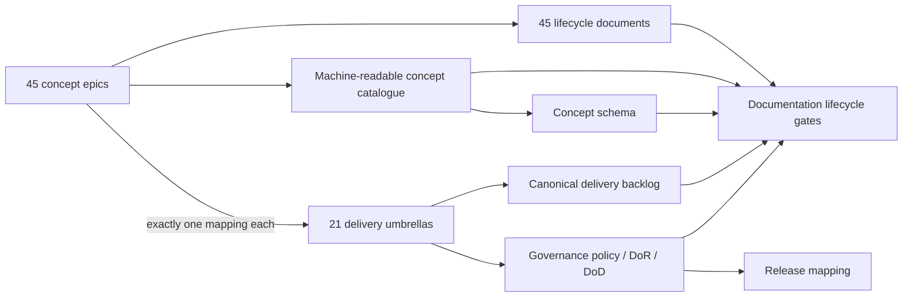

# EPIC-15 — Backlog and documentation quality

## 1. Metadata

| Field | Value |
| --- | --- |
| Concept epic ID | `EPIC-15` |
| Slug | `backlog-and-documentation-quality` |
| Pillar | `A` — Governance and Architecture |
| Phase | 1 |
| Priority | P1 |
| Delivery umbrella | `SVP2-A-03` (issue [#78](https://github.com/pestoura/hermes-security-labs/issues/78)) |
| Document version | 1.1.0 |
| Document date | 2026-08-07 |
| Catalogue | [Epic catalogue 45](../epic-catalogue-45.md) |
| Lifecycle contract | [Architecture documentation lifecycle](../../architecture/architecture-documentation-lifecycle.md) |

## 2. Current status

**FINAL** — the repository now has the governed 45-concept / 21-umbrella documentation and backlog model, machine-readable catalogue/schema, lifecycle contract, Definition of Ready/Done governance and automated integrity gates delivered by PRs #99, #135 and #138. Umbrella #78 is closed with repository evidence. This promotion is a retrospective lifecycle repair because #78 was historically closed while this document still had an empty section 15, contrary to the lifecycle contract.

| Lifecycle state | Reached |
| --- | --- |
| INTENT | yes |
| IMPLEMENTING | yes |
| AS_BUILT | yes |
| FINAL | yes |

## 3. Problem and motivation

Concept-level planning and delivery-level backlog were maintained separately, and documentation could describe intent without recording what was actually built.

## 4. Intended outcome

A governed documentation and backlog system where 45 concept epics map to 21 delivery umbrellas and every epic document evolves intent to as-built to final.

## 5. Scope and non-goals

### In scope

- Concept epic catalogue and machine-readable registry
- 45 to 21 mapping maintained in Git
- Documentation lifecycle contract and Definition of Done
- Automated documentation and mapping tests

### Non-goals

- Opening 45 new GitHub issues
- Changing the scope of existing umbrella issues

## 6. Intent architecture

Concept registry references umbrella identifiers; documentation tests enforce completeness, uniqueness, link resolution and section presence.

## 7. Contracts, data and capabilities

- Concept epic record schema
- Epic document mandatory sections
- Documentation lifecycle states
- Governance policy with Definition of Ready and Definition of Done
- Release and umbrella mapping rules

Contracts are canonical in Git. Where this epic reuses a platform-wide contract, the
canonical definition lives in the
[reference architecture](../../architecture/security-validation-reference-architecture.md)
and in [EPIC-01](EPIC-01-architecture-and-canonical-contracts.md); this document
references it instead of restating it.

## 8. Dependencies and sequencing

- [EPIC-01 — Architecture and canonical contracts](EPIC-01-architecture-and-canonical-contracts.md)

Sequencing follows the phase model in the
[intent document](../../architecture/security-validation-platform-v2-intent.md).
This epic is planned for phase 1.

## 9. Security, risks and failure modes

- Catalogue drifting from the delivery backlog
- Documents becoming templates without content
- Umbrella state being inherited blindly by concept epics
- Closing a delivery umbrella before the corresponding concept document records its as-built/final evidence

Platform-wide invariants that this epic must not weaken:

- absence of evidence never produces a `PASS` verdict;
- no execution outside an active authorization contract;
- no secrets, tokens, cookies or raw credential material in documentation, telemetry
  or persisted evidence;
- no target outside registered laboratories.

## 10. Deliverables

- Epic catalogue, per-epic documents, lifecycle contract, tests
- Machine-readable concept catalogue and schema
- Governance policy and machine-readable validation
- Definition of Ready and Definition of Done
- Release coverage for all delivery umbrellas
- Source-of-truth reconciliation process

## 11. Acceptance criteria

- Exactly 45 concept epic documents exist and validate
- Every concept epic maps to an existing umbrella

## 12. Evidence and validation plan

- Documentation and roadmap test runs
- Catalogue/schema validation
- Governance policy tests
- Pull-request and post-merge repository/security gates

Evidence must be referenced from the delivery umbrella issue before the umbrella can
be closed, and this document must record the references in section 15.

## 13. Decisions and open questions

### Decisions taken at intent time

- Concept epics never replace umbrella issues as delivery units

### Decisions taken during implementation

- The 45 concept epics remain planning/architecture records while the 21 umbrella issues remain delivery units.
- The 45→21 relationship is explicit and machine-readable; a concept epic maps to exactly one existing umbrella.
- Lifecycle state is evidence-driven and must not be inherited from an umbrella merely by association.
- Governance uses versioned machine-readable policy, explicit Definition of Ready/Done and repository tests rather than prose-only convention.
- Delivery status and the canonical backlog must be reconciled after implementation evidence is integrated.

### Open questions

- None for the completed A-03 repository-governance scope. Future changes to catalogue shape or lifecycle semantics require their own governed change and, if structural, an ADR.

## 14. Implementation notes

> Reserved lifecycle section. Updated retrospectively with the implementation that had already been integrated before this concept document was reconciled. Do not delete this heading.

### Block 1 — concept catalogue and lifecycle contract

PR #99 (`docs(roadmap): 45 concept epics, 45→21 mapping and documentation lifecycle contract`) established:

- all 45 concept epic documents with the mandatory 16-section structure;
- the 45→21 mapping while preserving the 21 umbrella issues as delivery units;
- `roadmap/epics/security-validation-platform-v2-concepts.yaml`;
- `schemas/concept-epic.schema.json`;
- the architecture documentation lifecycle contract;
- documentation and machine-readable catalogue tests for completeness, uniqueness, mapping validity, dependencies and deterministic structure;
- CI integration for documentation/catalogue validation.

PR #99 merge commit: `27068b4c8c0eb44d6279e65f61030ac391fe0148`.

### Block 2 — verifiable governance model

PR #135 (`docs(roadmap): add verifiable governance model`) established:

- versioned machine-readable governance policy and strict schema;
- explicit label/status taxonomy;
- eight verifiable Definition of Ready criteria;
- ten verifiable Definition of Done criteria;
- five critical functions with fail-safe/degraded behaviour and measurable planned resilience objectives;
- release mapping in which all 21 delivery umbrellas are represented exactly once;
- tests for governance cardinality, DoR/DoD identity, critical-function coverage and release coverage.

PR #135 merge commit: `42167c358ce6466394b52aafed0a40eef9036acd`.

### Block 3 — canonical backlog reconciliation

PR #138 (`chore(roadmap): reconcile implemented umbrella statuses`) reconciled implementation evidence back into the canonical machine-readable backlog and moved `SVP2-A-03` to `completed` without changing unrelated scope, dependencies or acceptance criteria.

PR #138 merge commit: `51a0a914dd14aef15af3debe890cd0d30a2a747b`.

No runtime, target, container, service, schedule or offensive execution was introduced by these blocks.

## 15. As-built / final architecture

> Reserved lifecycle section. This section is now populated as the FINAL repository-governance record for EPIC-15 / SVP2-A-03.

### Delivered repository-governance model

The authoritative delivered artefacts include:

- `docs/roadmap/epic-catalogue-45.md`;
- `docs/roadmap/epics/EPIC-01` through `EPIC-45`;
- `roadmap/epics/security-validation-platform-v2-concepts.yaml`;
- `schemas/concept-epic.schema.json`;
- `docs/architecture/architecture-documentation-lifecycle.md`;
- `docs/tests/test_epic_catalogue.py`;
- `roadmap/tests/test_concept_catalogue.py`;
- the A-03 governance policy/schema and their repository tests introduced by PR #135;
- the canonical delivery backlog reconciled by PR #138.

### Acceptance assessment

| Criterion | Result | Evidence |
| --- | --- | --- |
| Exactly 45 concept epic documents exist and validate | `MET` | PR #99 catalogue/doc tests and continuing CI gate |
| Every concept epic maps to an existing umbrella | `MET` | PR #99 machine-readable catalogue/schema and mapping tests |
| 21 umbrellas remain the delivery units | `MET` | PR #99 explicit 45→21 model; existing umbrella scope preserved |
| Verifiable governance / DoR / DoD exists | `MET` | PR #135 governance policy/schema/tests |
| Canonical backlog reflects completed A-03 delivery | `MET` | PR #138 reconciliation |
| Runtime validation | `NOT_APPLICABLE` | governance/documentation-only work; `NO_RUNTIME_CHANGE` |

### Evidence

| Evidence | Result |
| --- | --- |
| PR #99 merge | `27068b4c8c0eb44d6279e65f61030ac391fe0148` |
| PR #135 merge | `42167c358ce6466394b52aafed0a40eef9036acd` |
| PR #135 post-merge validate | success — run `31133412691` |
| PR #135 post-merge security | success — run `31133412654` |
| PR #138 merge | `51a0a914dd14aef15af3debe890cd0d30a2a747b` |
| PR #138 pre-merge validate | success — run `31134759558` |
| PR #138 pre-merge security | success — run `31134759555` |
| PR #138 post-merge validate | success — run `31134972611` |
| PR #138 post-merge security | success — run `31134972630` |
| Delivery umbrella #78 | closed with repository completion evidence |
| Runtime change | `NO_RUNTIME_CHANGE` |

### Recorded lifecycle divergence and repair

A historical lifecycle inconsistency is deliberately preserved in this final record rather than hidden:

1. the lifecycle contract required section 15 to be populated before the delivery umbrella could be closed;
2. issue #78 was nevertheless closed after PRs #135/#138 while EPIC-15 still declared `INTENT` and section 15 remained `_Not started_`;
3. the implementation and validation evidence existed, but the concept-level lifecycle/source-of-truth was not reconciled before closure;
4. this reconciliation repairs the documentary and machine-readable lifecycle state to match the already-integrated evidence; it does **not** retroactively claim that the closure sequence originally complied with the lifecycle contract.

The preventive control is the repository regression test added with this reconciliation: EPIC-15 cannot return to an empty/INTENT state while its final evidence and machine-readable `final` status are present.

`FINAL` here applies to the A-03 repository documentation/backlog-governance scope only. It makes no claim that other Security Validation Platform v2 epics, production runtime or operationalization are complete.

`NO_RUNTIME_CHANGE`.

## 16. Document change log

| Date | Version | Change |
| --- | --- | --- |
| 2026-08-07 | 1.1.0 | Retrospectively reconciled the completed A-03 repository-governance implementation to `FINAL`; populated as-built/final evidence and recorded the historical closure-before-section-15 lifecycle divergence. |
| 2026-08-06 | 1.0.0 | Initial intent document created from the concept epic catalogue. |
