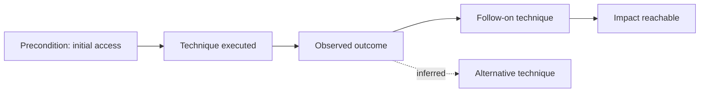

# EPIC-23 — Attack Graph and Attack Flow

## 1. Metadata

| Field | Value |
| --- | --- |
| Concept epic ID | `EPIC-23` |
| Slug | `attack-graph-and-attack-flow` |
| Pillar | `F` — Threat-Informed Validation |
| Phase | 7 |
| Priority | P1 |
| Delivery umbrella | `SVP2-F-01` (issue [#88](https://github.com/pestoura/hermes-security-labs/issues/88)) |
| Document version | 1.1.0 |
| Document date | 2026-08-07 |
| Catalogue | [Epic catalogue 45](../epic-catalogue-45.md) |
| Lifecycle contract | [Architecture documentation lifecycle](../../architecture/architecture-documentation-lifecycle.md) |

## 2. Current status

**IMPLEMENTING** — PR #150 integrated a repository-level attack-graph contract and deterministic repository-only path/centrality logic. Attack Flow transport and production graph storage remain `NOT_IMPLEMENTED`; production path finding remains `NOT_RUN`.

| Lifecycle state | Reached |
| --- | --- |
| INTENT | yes |
| IMPLEMENTING | yes |
| AS_BUILT | no |
| FINAL | no |

Implemented contract state:

- graph nodes distinguish asset, identity, trust, credential, vulnerability, control and evidence;
- graph edges distinguish `hypothetical` from `evidenced` paths;
- evidenced edges require explicit evidence identifiers;
- hypothetical edges are forbidden from claiming evidence identifiers;
- deterministic path finding and degree-centrality calculations operate only on repository-owned graph data;
- graph analysis never executes security actions.

The current candidate does not implement persistent graph storage, Attack Flow export/transport, production path finding or automatic exploitation of discovered paths. Credential use and lateral movement remain `NOT_RUN`.

## 3. Problem and motivation

Findings are reported as isolated items, losing the chain of preconditions and consequences that determines real impact.

## 4. Intended outcome

Campaigns produce attack graphs and exportable attack flows showing preconditions, techniques, outcomes and reachable impact.

## 5. Scope and non-goals

### In scope

- Attack graph model: nodes, edges, preconditions, postconditions
- Attack Flow export for interoperability
- Path scoring inputs for prioritization

### Non-goals

- Automated exploitation of discovered paths

## 6. Intent architecture

Each validated step contributes a node with declared preconditions and observed postconditions; the graph is derived from evidence only.

### Intent diagram

## 7. Contracts, data and capabilities

- Attack graph node and edge schema
- Attack Flow export mapping

Contracts are canonical in Git. Where this epic reuses a platform-wide contract, the canonical definition lives in the [reference architecture](../../architecture/security-validation-reference-architecture.md) and in [EPIC-01](EPIC-01-architecture-and-canonical-contracts.md); this document references it instead of restating it.

## 8. Dependencies and sequencing

- [EPIC-22 — Threat-Informed Security Validation](EPIC-22-threat-informed-security-validation.md)

Sequencing follows the phase model in the [intent document](../../architecture/security-validation-platform-v2-intent.md). This epic is planned for phase 7.

## 9. Security, risks and failure modes

- Graphs implying paths that were never validated
- Combinatorial growth reducing readability
- Hypothetical edges being mistaken for evidenced attack paths
- Repository-only graph calculations being mistaken for production path validation

Platform-wide invariants that this epic must not weaken:

- absence of evidence never produces a `PASS` verdict;
- no execution outside an active authorization contract;
- no secrets, tokens, cookies or raw credential material in documentation, telemetry or persisted evidence;
- no target outside registered laboratories.

## 10. Deliverables

- Attack graph specification and export mapping

## 11. Acceptance criteria

- Every graph edge references supporting evidence
- Unvalidated inferences are visually and semantically distinct

The current contract deliberately refines the first criterion: only `evidenced` edges may carry and must carry supporting evidence; `hypothetical` edges are explicitly distinct and cannot claim evidence. Attack Flow export remains unimplemented, so the epic cannot be `AS_BUILT` or `FINAL`.

## 12. Evidence and validation plan

- Contract tests from PR #150
- Future graph-store persistence evidence
- Future Attack Flow export/round-trip samples
- Future campaign graph records with evidence-backed edges

## 13. Decisions and open questions

### Decisions taken

- Hypothetical and evidenced edges are semantically distinct.
- Hypothetical edges never claim evidence.
- Graph analysis is read-only and cannot execute a discovered path.

### Open questions

- Whether hypothetical edges are exported at all
- Canonical Attack Flow mapping and export version

## 14. Implementation notes

> Reserved. Populate during implementation with pull request references, deviations from intent, and decisions taken while building. Do not delete this heading.

- PR #150 integrated attack-graph node/edge contracts and repository-only deterministic path/centrality logic.
- Attack Flow transport and graph store remain `NOT_IMPLEMENTED`.
- Production path finding, credential use and lateral movement remain `NOT_RUN`.
- `NO_RUNTIME_CHANGE`.

## 15. As-built / final architecture

> Reserved. Populate when the delivery umbrella reaches completion. Must record what was actually built, evidence links, and every divergence from sections 6 to 11. No umbrella may be closed while this section is empty.

_Not final. Persistent graph storage, Attack Flow export and production path validation remain NOT_IMPLEMENTED/NOT_RUN._

_Lifecycle unchanged: EPIC-23 is `IMPLEMENTING`; `AS_BUILT` and `FINAL` remain no. The record below states exactly what was merged and where the evidence lives, so that a future promotion decision is not made from memory or by association._

### What is actually built and merged

- typed attack-graph nodes, explicit hypothetical/evidenced edge semantics with evidence binding, and deterministic repository-only path/centrality analysis from PR #150 are integrated in main;
- Attack Flow transport, graph store and production path finding remain NOT_IMPLEMENTED / NOT_RUN.

### Exact evidence

| Evidence | Value |
| --- | --- |
| Technical pull request | [#150](https://github.com/pestoura/hermes-security-labs/pull/150) |
| Validated PR head | `7285c98a877dad21c7f0d74bec76f834c780d07f` |
| Integrated `main` merge commit | `f865bc9e2ff86684262c4eab45af0bc2e2f8a3c5` |
| Pre-merge `validate` | success — run `31173409373` |
| Pre-merge `security` | success — run `31173409095` |
| Post-merge `main` `validate` | success — run `31173980236` |
| Post-merge `main` `security` | success — run `31173980463` |

The merge commit is an ancestor of `main`.

### Evidence that is missing for promotion

`AS_BUILT` is withheld because the epic's target state is not satisfied by repository-level contract integration alone:

- Attack Flow transport, graph store and production path finding, credential use and lateral movement: NOT_IMPLEMENTED / NOT_RUN.

`NO_RUNTIME_CHANGE`.

## 16. Document change log

| Date | Version | Change |
| --- | --- | --- |
| 2026-08-06 | 1.0.0 | Initial intent document created from the concept epic catalogue. |
| 2026-08-07 | 1.1.0 | Reconciled lifecycle to IMPLEMENTING against PR #150 while preserving graph-store/Attack-Flow/runtime non-claims. |
