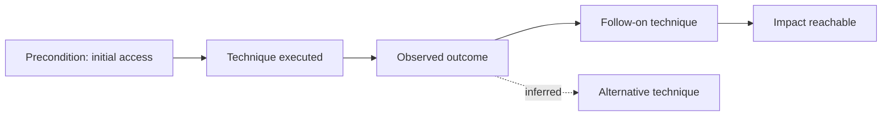

# EPIC-23 — Attack Graph and Attack Flow

## 1. Metadata

| Field | Value |
| --- | --- |
| Concept epic ID | `EPIC-23` |
| Slug | `attack-graph-and-attack-flow` |
| Pillar | `F` — Threat-Informed Validation |
| Phase | 7 |
| Priority | P1 |
| Delivery umbrella | `SVP2-F-01` (issue [#88](https://github.com/pestoura/hermes-security-labs/issues/88)) |
| Document version | 1.0.0 |
| Document date | 2026-08-06 |
| Catalogue | [Epic catalogue 45](../epic-catalogue-45.md) |
| Lifecycle contract | [Architecture documentation lifecycle](../../architecture/architecture-documentation-lifecycle.md) |

## 2. Current status

**INTENT** — nothing described in this document is implemented. Sections 14 and 15
are reserved and must be filled during and after implementation, as required by the
[documentation lifecycle contract](../../architecture/architecture-documentation-lifecycle.md).

| Lifecycle state | Reached |
| --- | --- |
| INTENT | yes |
| IMPLEMENTING | no |
| AS_BUILT | no |
| FINAL | no |

## 3. Problem and motivation

Findings are reported as isolated items, losing the chain of preconditions and consequences that determines real impact.

## 4. Intended outcome

Campaigns produce attack graphs and exportable attack flows showing preconditions, techniques, outcomes and reachable impact.

## 5. Scope and non-goals

### In scope

- Attack graph model: nodes, edges, preconditions, postconditions
- Attack Flow export for interoperability
- Path scoring inputs for prioritization

### Non-goals

- Automated exploitation of discovered paths

## 6. Intent architecture

Each validated step contributes a node with declared preconditions and observed postconditions; the graph is derived from evidence only.

### Intent diagram

## 7. Contracts, data and capabilities

- Attack graph node and edge schema
- Attack Flow export mapping

Contracts are canonical in Git. Where this epic reuses a platform-wide contract, the
canonical definition lives in the
[reference architecture](../../architecture/security-validation-reference-architecture.md)
and in [EPIC-01](EPIC-01-architecture-and-canonical-contracts.md); this document
references it instead of restating it.

## 8. Dependencies and sequencing

- [EPIC-22 — Threat-Informed Security Validation](EPIC-22-threat-informed-security-validation.md)

Sequencing follows the phase model in the
[intent document](../../architecture/security-validation-platform-v2-intent.md).
This epic is planned for phase 7.

## 9. Security, risks and failure modes

- Graphs implying paths that were never validated
- Combinatorial growth reducing readability

Platform-wide invariants that this epic must not weaken:

- absence of evidence never produces a `PASS` verdict;
- no execution outside an active authorization contract;
- no secrets, tokens, cookies or raw credential material in documentation, telemetry
  or persisted evidence;
- no target outside registered laboratories.

## 10. Deliverables

- Attack graph specification and export mapping

## 11. Acceptance criteria

- Every graph edge references supporting evidence
- Unvalidated inferences are visually and semantically distinct

## 12. Evidence and validation plan

- Graph export samples with evidence references

Evidence must be referenced from the delivery umbrella issue before the umbrella can
be closed, and this document must record the references in section 15.

## 13. Decisions and open questions

### Decisions taken at intent time

- Inferred edges are labelled as inferred, never as validated

### Open questions

- Whether inferred edges are exported at all

## 14. Implementation notes

> Reserved. Populate during implementation with pull request references, deviations
> from intent, and decisions taken while building. Do not delete this heading.

_Not started._

## 15. As-built / final architecture

> Reserved. Populate when the delivery umbrella reaches completion. Must record what
> was actually built, evidence links, and every divergence from sections 6 to 11.
> No umbrella may be closed while this section is empty.

_Not started._

## 16. Document change log

| Date | Version | Change |
| --- | --- | --- |
| 2026-08-06 | 1.0.0 | Initial intent document created from the concept epic catalogue. |
