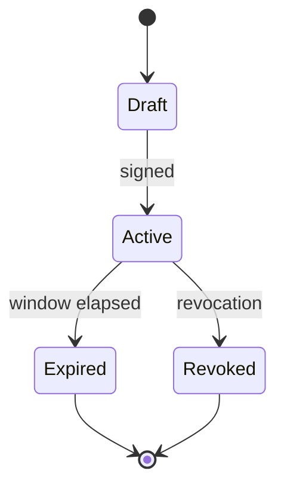

# EPIC-28 — Rules of Engagement as Code

## 1. Metadata

| Field | Value |
| --- | --- |
| Concept epic ID | `EPIC-28` |
| Slug | `rules-of-engagement-as-code` |
| Pillar | `A` — Governance and Architecture |
| Phase | 1 |
| Priority | P0 |
| Delivery umbrella | `SVP2-A-02` (issue [#77](https://github.com/pestoura/hermes-security-labs/issues/77)) |
| Document version | 1.1.0 |
| Document date | 2026-08-06 |
| Catalogue | [Epic catalogue 45](../epic-catalogue-45.md) |
| Lifecycle contract | [Architecture documentation lifecycle](../../architecture/architecture-documentation-lifecycle.md) |

## 2. Current status

**IMPLEMENTING** — repository-level contract work is integrated on `main`: the signed
RoE contract with trust store and external kill switch (#159), the enforcement of the
signed RoE at typed gateway admission (#160), and the TB1 control-plane issued
authorization receipt contract with its verifier that corrects #161. This is a
repository contract and validation state only: no runtime, no deployment, no runner and
no target execution exist, so sections 14 and 15 remain non-final and runtime evidence
stays `NOT_RUN`, as required by the
[documentation lifecycle contract](../../architecture/architecture-documentation-lifecycle.md).

| Lifecycle state | Reached |
| --- | --- |
| INTENT | yes |
| IMPLEMENTING | yes |
| AS_BUILT | no |
| FINAL | no |

## 3. Problem and motivation

Engagement authorization exists as prose, so it cannot be enforced by machines nor used to refuse out-of-scope actions deterministically.

## 4. Intended outcome

A signed, machine-readable Rules of Engagement contract declaring scope, targets, windows, limits, approvers and stop conditions.

## 5. Scope and non-goals

### In scope

- RoE schema with scope, targets, windows, intrusiveness ceiling and approvers
- Signature and validity verification
- Refusal semantics for steps outside the contract
- Contract lifecycle: draft, active, expired, revoked

### Non-goals

- Replacing human accountability with automation

## 6. Intent architecture

The gateway loads the active contract per campaign; every step is checked against target scope, time window and intrusiveness ceiling before dispatch.

### Intent diagram

## 7. Contracts, data and capabilities

- RoE document schema
- Signature verification requirements
- Refusal reason codes

Contracts are canonical in Git. Where this epic reuses a platform-wide contract, the
canonical definition lives in the
[reference architecture](../../architecture/security-validation-reference-architecture.md)
and in [EPIC-01](EPIC-01-architecture-and-canonical-contracts.md); this document
references it instead of restating it.

## 8. Dependencies and sequencing

- [EPIC-01 — Architecture and canonical contracts](EPIC-01-architecture-and-canonical-contracts.md)

Sequencing follows the phase model in the
[intent document](../../architecture/security-validation-platform-v2-intent.md).
This epic is planned for phase 1.

## 9. Security, risks and failure modes

- Contracts kept permanently active for convenience
- Scope expressed too loosely to be enforceable

Platform-wide invariants that this epic must not weaken:

- absence of evidence never produces a `PASS` verdict;
- no execution outside an active authorization contract;
- no secrets, tokens, cookies or raw credential material in documentation, telemetry
  or persisted evidence;
- no target outside registered laboratories.

## 10. Deliverables

- Rules of Engagement schema and lifecycle specification

## 11. Acceptance criteria

- A step outside the active contract is refused deterministically
- Expired or revoked contracts block all execution

## 12. Evidence and validation plan

- Contract reference recorded in campaign evidence

Evidence must be referenced from the delivery umbrella issue before the umbrella can
be closed, and this document must record the references in section 15.

## 13. Decisions and open questions

### Decisions taken at intent time

- No campaign executes without an active signed contract

### Open questions

- Whether emergency stop can be triggered without the original approver

## 14. Implementation notes

> Reserved. Populate during implementation with pull request references, deviations
> from intent, and decisions taken while building. Do not delete this heading.

### Block 1 — signed RoE contract, trust store and external kill switch

- Umbrella issue: [#77](https://github.com/pestoura/hermes-security-labs/issues/77)
- Pull request: [#159](https://github.com/pestoura/hermes-security-labs/pull/159)
- Branch: `feat/svp2-a-02-trust-store-kill-switch`
- Validated PR head: `bcb410fb575a2f6bd13ae39210600ebab853a926`
- Squash merge: `8f326c2f0fec1fbd97870ba20d0ec64ecb8db21f`
- Runtime declaration: `NO_RUNTIME_CHANGE`
- Added the signed RoE contract schema and canonical payload/digest rules, the
  public-key-only signing trust store with key states and validity windows, and the
  external kill switch honoured fail-closed.

### Block 2 — signed RoE enforcement at typed gateway admission

- Pull request: [#160](https://github.com/pestoura/hermes-security-labs/pull/160)
- Branch: `feat/svp2-a02-admission-boundary`
- Validated PR head: `3170e8e37b0f6b440bdfb6f729458e3a7c9d4545`
- Squash merge: `b344c34ebf34328dd105ed2a76ae4e1ce4ccd6c5`
- Runtime declaration: `NO_RUNTIME_CHANGE`
- `authorize_admission()` revalidates the signed contract, the trust store, the kill
  switch and the typed gateway bindings on every call; no caller-supplied admission
  decision is ever accepted.

### Block 3 — gateway to Runner Protocol v2 handoff

- Pull request: [#161](https://github.com/pestoura/hermes-security-labs/pull/161)
- Branch: `feat/svp2-b-gateway-runner-handoff`
- Validated PR head: `c64047b6eeb308b52f0cfb46563ba91a274678e5`
- Squash merge: `316f70e7c2d319e9f5a97e47c34e58042d284974`
- Runtime declaration: `NO_RUNTIME_CHANGE`
- Bound admission to a canonically validated `runner.step.request`. `request_built`
  means construction only: nothing is dispatched.

### Block 4 — TB1 control-plane issued authorization receipt (corrects block 3)

- Branch: `fix/tb1-control-plane-issued-authorization`
- Pull request: pending (branch placeholder; no PR opened in this block)
- Runtime declaration: `NO_RUNTIME_CHANGE`
- Added `platform/roe-contract/authorization-receipt.schema.json` and
  `platform/roe-contract/authorization_receipt.py`: a versioned, strict, signed
  authorization receipt issued by the Hermes control plane, with domain separation
  `hex0r.tb1.authorization.v1`, a deterministic canonical `authorization_ref`
  algorithm, a purpose-bound (`tb1-authorization`) public-key-only trust store, and
  real Ed25519 / ECDSA-P256-SHA256 verification.
- `runner_handoff.build_step_request(...)` now requires the signed receipt as a
  separate TB1 boundary artefact plus server-side authorization trust-store
  configuration. It verifies and consumes the receipt, cross-checks every binding
  against the freshly admitted context, and propagates the reference **issued by the
  control plane**. The gateway no longer computes an authorization reference of its
  own.
- Hermes issuance runtime and deployed validation remain `NOT_IMPLEMENTED` /
  `NOT_RUN`: the repository ships canonicalization, reference derivation and
  verification primitives only, and no private key material.

### Recorded divergence

| Intent reference | Observed state | Resolution | Decision record |
| --- | --- | --- | --- |
| block 3 (#161) `runner_handoff.py` | the execution-plane gateway computed and emitted its own `authorization_ref`, making it a de facto authorization issuer | corrected in block 4: the control plane issues a signed receipt carrying the reference; the gateway may only verify and consume it, and recomputation is documented as an integrity check that creates no authority | `ADR-0001` |
| authorization signing keys | reusing the RoE signing trust store for TB1 authorization would allow cross-protocol key confusion | a dedicated, purpose-bound authorization trust store is required; an RoE-purpose key is refused deterministically | `ADR-0001` |

## 15. As-built / final architecture

> Reserved. Populate when the delivery umbrella reaches completion. Must record what
> was actually built, evidence links, and every divergence from sections 6 to 11.
> No umbrella may be closed while this section is empty.

_Not final. The umbrella is `IMPLEMENTING`, not `AS_BUILT` and not `FINAL`._

Runtime, deployment, runner execution and target execution evidence: `NOT_RUN`.
Hermes authorization issuance runtime: `NOT_IMPLEMENTED`. Deployed validation of the
authorization receipt: `NOT_RUN`. This section may only be populated once those states
change and the umbrella reaches completion.

## 16. Document change log

| Date | Version | Change |
| --- | --- | --- |
| 2026-08-06 | 1.0.0 | Initial intent document created from the concept epic catalogue. |
| 2026-08-07 | 1.1.0 | Set IMPLEMENTING; record #159, #160 and #161 evidence and the TB1 control-plane issued authorization receipt correction block; sections 14 and 15 remain non-final with runtime NOT_RUN. |
