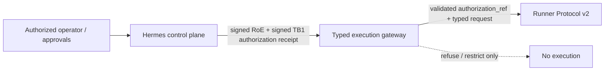

# EPIC-28 — Rules of Engagement as Code

## 1. Metadata

| Field | Value |
| --- | --- |
| Concept epic ID | `EPIC-28` |
| Slug | `rules-of-engagement-as-code` |
| Pillar | `A` — Governance and Architecture |
| Phase | 1 |
| Priority | P0 |
| Delivery umbrella | `SVP2-A-02` (issue [#77](https://github.com/pestoura/hermes-security-labs/issues/77)) |
| Document version | 1.1.0 |
| Document date | 2026-08-07 |
| Catalogue | [Epic catalogue 45](../epic-catalogue-45.md) |
| Lifecycle contract | [Architecture documentation lifecycle](../../architecture/architecture-documentation-lifecycle.md) |

## 2. Current status

**IMPLEMENTING** — repository-level RoE enforcement and TB1 authorization contracts exist in `main` or are under controlled implementation, but deployed Hermes issuance, deployed gateway enforcement and production execution remain `NOT_RUN`.

| Lifecycle state | Reached |
| --- | --- |
| INTENT | yes |
| IMPLEMENTING | yes |
| AS_BUILT | no |
| FINAL | no |

## 3. Problem and motivation

Engagement authorization cannot remain prose-only: execution must be constrained by machine-verifiable scope, validity, approvals, stop conditions and an independently controlled authorization boundary.

## 4. Intended outcome

A signed, machine-readable Rules of Engagement contract declaring scope, targets, windows, limits, approvers and stop conditions, combined with a control-plane-owned authorization reference that the execution plane can verify but never create or expand.

## 5. Scope and non-goals

### In scope

- RoE schema with scope, targets, windows, intrusiveness ceiling and approvers
- Real signature and validity verification
- External fail-closed kill switch
- Refusal semantics for steps outside the contract
- Contract lifecycle: draft, active, expired, revoked
- TB1 signed authorization receipt/reference issued by Hermes and verified by the execution plane
- Purpose/domain separation between RoE signing and TB1 authorization signing keys

### Non-goals

- Replacing human accountability with automation
- Allowing the gateway or runner to create execution authority
- Production deployment or execution evidence in this document

## 6. Intent architecture

Hermes is the authorization authority. The gateway independently validates the active signed RoE contract and kill switch, validates the Hermes-issued TB1 authorization receipt, requires both views to bind to the same campaign/run/step/operation/target/intrusiveness context, and refuses before runner-message construction on any mismatch.

### Intent diagram

The execution plane may validate and restrict authorization; it may not create, expand or approve it, as fixed by ADR-0001.

## 7. Contracts, data and capabilities

Canonical repository contracts currently include:

- `platform/roe-contract/roe-contract.schema.json`
- `platform/roe-contract/roe-step-request.schema.json`
- `platform/roe-contract/intrusiveness-policy.yaml`
- `platform/roe-contract/trust_store.py`
- `platform/roe-contract/kill_switch.py`
- `platform/gateway-protocol/admission.py`
- `platform/authorization-contract/authorization-receipt.schema.json`
- `platform/authorization-contract/authorization-trust-store.schema.json`
- `platform/authorization-contract/authorization_receipt.py`

Cross-plane ownership and precedence remain governed by the [reference architecture](../../architecture/security-validation-reference-architecture.md), [ADR-0001](../../architecture/adr/ADR-0001-plane-separation-and-authorization-authority.md) and the [canonical contract inventory](../../architecture/contracts/README.md).

## 8. Dependencies and sequencing

- [EPIC-01 — Architecture and canonical contracts](EPIC-01-architecture-and-canonical-contracts.md)
- [EPIC-03 — Typed Kali MCP](EPIC-03-typed-kali-mcp.md)
- [EPIC-05 — Runner Protocol v2](EPIC-05-runner-protocol-v2.md)

Repository-level contract work precedes any runtime wiring. No runner candidate may treat an authorization reference as actionable authority unless the reference is carried by a valid Hermes-issued receipt and all gateway/RoE bindings revalidate successfully.

## 9. Security, risks and failure modes

- Contracts kept permanently active for convenience
- Scope expressed too loosely to be enforceable
- Execution plane accidentally creating or amplifying authorization
- Cross-protocol reuse of RoE signing keys for TB1 authorization
- Naked authorization references treated as bearer grants
- Stale, expired or revoked authorization accepted after policy state changes

Platform-wide invariants:

- absence of evidence never produces a `PASS` verdict;
- no execution outside an active authorization contract;
- Hermes/control plane is the only execution authorization authority;
- downstream components may restrict or refuse, never expand authorization;
- no secrets, tokens, cookies or raw credential material in documentation, telemetry or persisted decision metadata;
- no target outside registered laboratories.

## 10. Deliverables

- Rules of Engagement schema and lifecycle specification
- File-backed public-key RoE trust store and cryptographic verification
- External fail-closed kill switch
- Canonical gateway admission boundary
- Purpose-bound TB1 authorization receipt/reference contract and verifier

## 11. Acceptance criteria

- A step outside the active contract is refused deterministically
- Expired or revoked contracts block execution
- Missing or invalid TB1 authorization receipt prevents runner-message construction
- A naked or caller-supplied authorization reference never grants authority
- Gateway cannot create or expand authorization
- RoE signing material cannot be reused silently as TB1 authorization signing material

## 12. Evidence and validation plan

- Contract and trust-store positive/negative/adversarial tests
- Gateway admission tests
- TB1 receipt/reference integrity and key-purpose tests
- Gateway-to-Runner handoff tests proving fail-closed behavior and no partial request on refusal
- GitHub `security` and `validate` gates plus post-merge validation

Evidence must be referenced from the delivery umbrella issue before the umbrella can close.

## 13. Decisions and open questions

### Decisions

- No campaign executes without an active signed RoE contract.
- Hermes/control plane is the sole execution authorization authority.
- The TB1 `authorization_ref` is content-addressed, non-bearer and carried inside a signed control-plane receipt.
- The execution plane may recompute a reference only as an integrity check; that does not constitute issuance.
- `attempt_id` is excluded from the authorization receipt so a retry of the same logical step can reuse the same authorization.
- RoE and TB1 authorization use separate trust purposes/domains to prevent key confusion.

### Open questions

- Final deployed Hermes signing-key custody/HSM or secret-manager integration.
- Production receipt revocation/online status model beyond short receipt expiry.
- Final runtime wiring and audit evidence for Hermes issuance and gateway verification.

## 14. Implementation notes

> Reserved lifecycle section. It is populated progressively while the epic is `IMPLEMENTING`; retaining the `Reserved` marker is required by the architecture documentation lifecycle contract and does not mean implementation has not started.

Repository-level work completed or integrated:

- PR #159 — real Ed25519/ECDSA RoE verification, file-backed public trust store and external fail-closed kill switch; merged and CI green.
- PR #160 — canonical gateway admission derives and revalidates RoE instead of trusting caller-supplied `ALLOW`; merged and CI green.
- PR #161 — repository-level gateway-to-Runner Protocol message construction; merged and CI green. A subsequent ADR-0001 review identified that the gateway-created authorization reference conflicted with control-plane authority ownership.
- Current corrective block — replaces gateway-created authority with a signed TB1 authorization receipt/reference issued by Hermes and verified/consumed by the execution plane; also introduces key-purpose/domain separation.

No customer/external target, Kali/scanner, runner capability, network, cloud or production runtime has been executed by these repository-level blocks.

## 15. As-built / final architecture

> Reserved lifecycle section. This section remains non-final until the umbrella acceptance criteria and deployed runtime evidence exist; the current content records explicit implementation limits only.

Not final. Repository contracts and verification logic are being implemented, but the following remain explicitly outside current evidence:

- Hermes operational TB1 receipt issuance: `NOT_IMPLEMENTED` / `NOT_RUN`
- deployed RoE trust store and kill switch: `NOT_RUN`
- deployed TB1 authorization trust store: `NOT_RUN`
- deployed gateway enforcement: `NOT_RUN`
- real Runner Protocol dispatch/capability execution: `NOT_RUN`
- production Evidence Plane integration: `NOT_RUN`
- runtime changes: `NO_RUNTIME_CHANGE`

`AS_BUILT` and `FINAL` remain false until deployed runtime evidence and umbrella acceptance criteria are satisfied.

_Lifecycle unchanged: EPIC-28 is `IMPLEMENTING`; `AS_BUILT` and `FINAL` remain no. The record below states exactly what was merged and where the evidence lives, so that a future promotion decision is not made from memory or by association._
### Exact evidence

| Evidence | Value |
| --- | --- |
| Technical pull request | [#161](https://github.com/pestoura/hermes-security-labs/pull/161) |
| Validated PR head | `c64047b6eeb308b52f0cfb46563ba91a274678e5` |
| Integrated `main` merge commit | `316f70e7c2d319e9f5a97e47c34e58042d284974` |
| Pre-merge `validate` | success — run `31183133643` |
| Pre-merge `security` | success — run `31183131710` |
| Post-merge `main` `validate` | success — run `31183572511` |
| Post-merge `main` `security` | success — run `31183570442` |

The merge commit is an ancestor of `main`.

### Evidence that is missing for promotion

`AS_BUILT` is withheld because the epic's target state is not satisfied by repository-level contract integration alone:

- Hermes operational TB1 receipt issuance, deployed gateway enforcement and production execution: NOT_IMPLEMENTED / NOT_RUN.

`NO_RUNTIME_CHANGE`.

## 16. Document change log

| Date | Version | Change |
| --- | --- | --- |
| 2026-08-06 | 1.0.0 | Initial intent document created from the concept epic catalogue. |
| 2026-08-07 | 1.1.0 | Reconciled lifecycle to IMPLEMENTING; recorded #159/#160/#161 and TB1 control-plane authorization correction without claiming runtime enforcement. |
