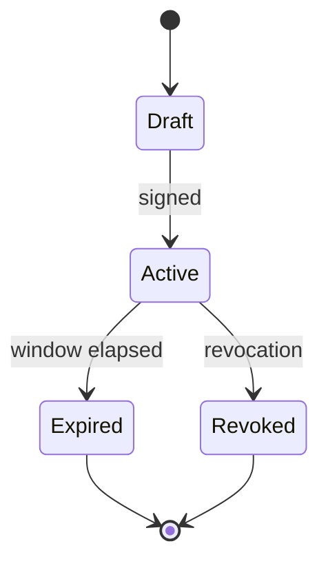

# EPIC-28 — Rules of Engagement as Code

## 1. Metadata

| Field | Value |
| --- | --- |
| Concept epic ID | `EPIC-28` |
| Slug | `rules-of-engagement-as-code` |
| Pillar | `A` — Governance and Architecture |
| Phase | 1 |
| Priority | P0 |
| Delivery umbrella | `SVP2-A-02` (issue [#77](https://github.com/pestoura/hermes-security-labs/issues/77)) |
| Document version | 1.0.0 |
| Document date | 2026-08-06 |
| Catalogue | [Epic catalogue 45](../epic-catalogue-45.md) |
| Lifecycle contract | [Architecture documentation lifecycle](../../architecture/architecture-documentation-lifecycle.md) |

## 2. Current status

**INTENT** — nothing described in this document is implemented. Sections 14 and 15
are reserved and must be filled during and after implementation, as required by the
[documentation lifecycle contract](../../architecture/architecture-documentation-lifecycle.md).

| Lifecycle state | Reached |
| --- | --- |
| INTENT | yes |
| IMPLEMENTING | no |
| AS_BUILT | no |
| FINAL | no |

## 3. Problem and motivation

Engagement authorization exists as prose, so it cannot be enforced by machines nor used to refuse out-of-scope actions deterministically.

## 4. Intended outcome

A signed, machine-readable Rules of Engagement contract declaring scope, targets, windows, limits, approvers and stop conditions.

## 5. Scope and non-goals

### In scope

- RoE schema with scope, targets, windows, intrusiveness ceiling and approvers
- Signature and validity verification
- Refusal semantics for steps outside the contract
- Contract lifecycle: draft, active, expired, revoked

### Non-goals

- Replacing human accountability with automation

## 6. Intent architecture

The gateway loads the active contract per campaign; every step is checked against target scope, time window and intrusiveness ceiling before dispatch.

### Intent diagram

## 7. Contracts, data and capabilities

- RoE document schema
- Signature verification requirements
- Refusal reason codes

Contracts are canonical in Git. Where this epic reuses a platform-wide contract, the
canonical definition lives in the
[reference architecture](../../architecture/security-validation-reference-architecture.md)
and in [EPIC-01](EPIC-01-architecture-and-canonical-contracts.md); this document
references it instead of restating it.

## 8. Dependencies and sequencing

- [EPIC-01 — Architecture and canonical contracts](EPIC-01-architecture-and-canonical-contracts.md)

Sequencing follows the phase model in the
[intent document](../../architecture/security-validation-platform-v2-intent.md).
This epic is planned for phase 1.

## 9. Security, risks and failure modes

- Contracts kept permanently active for convenience
- Scope expressed too loosely to be enforceable

Platform-wide invariants that this epic must not weaken:

- absence of evidence never produces a `PASS` verdict;
- no execution outside an active authorization contract;
- no secrets, tokens, cookies or raw credential material in documentation, telemetry
  or persisted evidence;
- no target outside registered laboratories.

## 10. Deliverables

- Rules of Engagement schema and lifecycle specification

## 11. Acceptance criteria

- A step outside the active contract is refused deterministically
- Expired or revoked contracts block all execution

## 12. Evidence and validation plan

- Contract reference recorded in campaign evidence

Evidence must be referenced from the delivery umbrella issue before the umbrella can
be closed, and this document must record the references in section 15.

## 13. Decisions and open questions

### Decisions taken at intent time

- No campaign executes without an active signed contract

### Open questions

- Whether emergency stop can be triggered without the original approver

## 14. Implementation notes

> Reserved. Populate during implementation with pull request references, deviations
> from intent, and decisions taken while building. Do not delete this heading.

_Not started._

## 15. As-built / final architecture

> Reserved. Populate when the delivery umbrella reaches completion. Must record what
> was actually built, evidence links, and every divergence from sections 6 to 11.
> No umbrella may be closed while this section is empty.

_Not started._

## 16. Document change log

| Date | Version | Change |
| --- | --- | --- |
| 2026-08-06 | 1.0.0 | Initial intent document created from the concept epic catalogue. |
