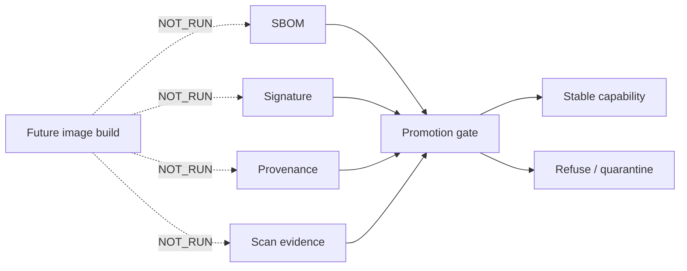

# EPIC-30 — Supply-chain attestations

## 1. Metadata

| Field | Value |
| --- | --- |
| Concept epic ID | `EPIC-30` |
| Slug | `supply-chain-attestations` |
| Pillar | `C` — Image and Capability Factory |
| Phase | 3 |
| Priority | P0 |
| Delivery umbrella | `SVP2-C-02` (issue [#83](https://github.com/pestoura/hermes-security-labs/issues/83)) |
| Document version | 1.1.0 |
| Document date | 2026-08-07 |
| Catalogue | [Epic catalogue 45](../epic-catalogue-45.md) |
| Lifecycle contract | [Architecture documentation lifecycle](../../architecture/architecture-documentation-lifecycle.md) |

## 2. Current status

**IMPLEMENTING** — PR #143 integrated repository-level supply-chain promotion gates into the capability registry: stable promotion requires SBOM, signature and provenance references plus zero blocking scan findings. The repository does not yet generate or operationally verify those artefacts, so build/sign/scan/publication remain `NOT_RUN`.

| Lifecycle state | Reached |
| --- | --- |
| INTENT | yes |
| IMPLEMENTING | yes |
| AS_BUILT | no |
| FINAL | no |

## 3. Problem and motivation

Images and artefacts must not become trusted merely because they exist in a registry. Stable use needs explicit supply-chain evidence and fail-closed verification semantics.

## 4. Intended outcome

Every project-built artefact carries provenance and is verified before use; unverifiable artefacts are refused.

## 5. Scope and non-goals

### In scope

- Supply-chain evidence requirements for stable capability promotion
- Mandatory SBOM reference
- Mandatory signature reference
- Mandatory provenance reference
- Blocking image-scan finding gate
- Fail-closed quarantine/revocation/promotion semantics
- Future verification at consumption

### Non-goals

- Publishing new public packages in this lifecycle block
- Generating SBOMs, signatures or provenance in this block
- Running image scanners or registry publication
- Claiming operational signature verification or runtime consumption

## 6. Intent architecture

Build and promotion are separate concerns. The repository contract currently defines what evidence must exist before a capability may become `stable`; future build/promotion infrastructure will produce and verify that evidence.

## 7. Contracts, data and capabilities

PR #143 integrated the supply-chain evidence requirements into the canonical `platform/capability-registry/` contract.

Stable usability requires:

- SBOM reference present;
- signature reference present;
- provenance reference present;
- zero blocking scan findings;
- capability not quarantined or revoked;
- all EPIC-07 operational gates also satisfied.

These are repository decision semantics, not evidence that SBOM/signature/provenance/scan generation has run.

## 8. Dependencies and sequencing

- [EPIC-06 — Kali Image Factory](EPIC-06-kali-image-factory.md)
- [EPIC-07 — Capability Registry](EPIC-07-capability-registry.md)

C-01 produces future image artefacts; C-02 defines and later exercises the evidence required before those artefacts can be promoted and consumed.

## 9. Security, risks and failure modes

- Verification disabled to unblock operations
- Third-party images without usable provenance
- Reference presence being mistaken for cryptographic verification
- Scan results becoming stale before promotion
- Quarantined or revoked artefacts being reused
- Mutable tags bypassing digest-bound evidence

Current invariants:

- missing required supply-chain evidence blocks stable promotion;
- blocking scan findings block stable promotion;
- quarantine is unusable and cannot directly transition to stable;
- revocation makes a capability immediately unusable;
- repository evidence references do not prove that cryptographic or scanner operations actually ran;
- operational verification must fail closed when introduced.

## 10. Deliverables

Repository-level candidate delivered by PR #143:

- supply-chain promotion evidence requirements;
- blocking scan gate;
- quarantine/revocation semantics;
- fail-closed promotion tests.

Still pending:

- SBOM generation and retention;
- artefact signing and signature verification;
- provenance generation/verification;
- image scanning and freshness policy;
- registry publication/promotion;
- production revocation exercise;
- third-party artefact exception policy.

## 11. Acceptance criteria

Repository-level criteria currently demonstrated:

- a capability cannot become stable without SBOM/signature/provenance references;
- blocking scan findings prevent stable promotion;
- quarantined/revoked capabilities are unusable.

Umbrella completion still requires operational evidence that:

- accepted images have real SBOM and provenance records;
- signatures are cryptographically verified before consumption;
- scanning is actually executed against the promoted digest;
- unverifiable artefacts are refused at the consumption boundary;
- production revocation prevents subsequent use.

## 12. Evidence and validation plan

Current evidence is repository/CI only:

- PR #143 capability-registry/supply-chain promotion contract;
- schema and promotion-decision regression tests;
- full repository `security` and `validate` gates.

SBOM generation, signing, provenance generation, image scanning, publication and production revocation remain `NOT_RUN`.

## 13. Decisions and open questions

### Decisions

- Verification failure blocks promotion/use; it does not warn.
- Stable promotion requires all supply-chain evidence gates.
- Quarantine and revocation are fail-closed states.
- Evidence references alone are not claimed as proof of operational verification.

### Open questions

- Policy for necessary third-party images lacking attestations
- Concrete signing/verification technology and key custody
- SBOM format and retention location
- Provenance format/attestor and builder identity
- Scanner freshness threshold and blocking severity policy

## 14. Implementation notes

> Reserved lifecycle section. It is populated progressively while the epic is `IMPLEMENTING`; retaining the `Reserved` marker is required by the architecture documentation lifecycle contract.

- PR #143 introduced mandatory SBOM/signature/provenance/scan gates in the capability promotion contract.
- Issue #83 and master tracker #97 already classify C-02 as `implementing`.
- This reconciliation removes the stale `INTENT / not started` claim without claiming that any supply-chain tool has executed.

## 15. As-built / final architecture

> Reserved lifecycle section. This section records the current implementation boundary but remains non-final until operational evidence satisfies the umbrella acceptance criteria.

Current factual boundary:

- supply-chain promotion decision requirements: `CANDIDATE`;
- SBOM reference requirement: repository validated;
- signature reference requirement: repository validated;
- provenance reference requirement: repository validated;
- blocking scan gate: repository validated;
- SBOM generation: `NOT_RUN`;
- artefact signing/signature verification: `NOT_RUN`;
- provenance generation/verification: `NOT_RUN`;
- image scanning: `NOT_RUN`;
- image publication/promotion: `NOT_RUN`;
- production revocation: `NOT_RUN`;
- runtime changes: `NO_RUNTIME_CHANGE`.

`AS_BUILT` and `FINAL` remain false.

## 16. Document change log

| Date | Version | Change |
| --- | --- | --- |
| 2026-08-06 | 1.0.0 | Initial intent document created from the concept epic catalogue. |
| 2026-08-07 | 1.1.0 | Reconciled EPIC-30 to `IMPLEMENTING` after PR #143 while preserving all supply-chain generation/verification operations as `NOT_RUN`. |
