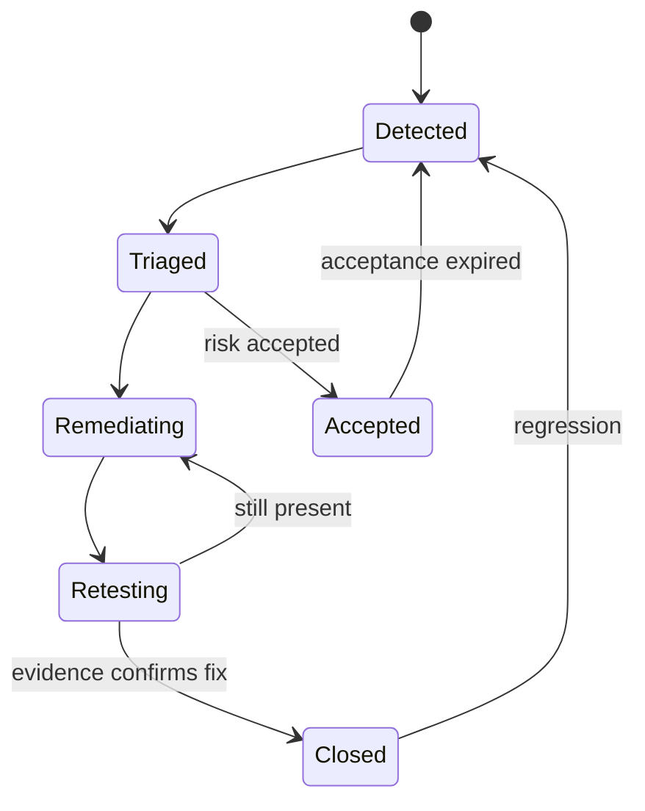

# EPIC-33 — Finding and remediation lifecycle

## 1. Metadata

| Field | Value |
| --- | --- |
| Concept epic ID | `EPIC-33` |
| Slug | `finding-and-remediation-lifecycle` |
| Pillar | `J` — Risk Findings and Interoperability |
| Phase | 7 |
| Priority | P1 |
| Delivery umbrella | `SVP2-J-01` (issue [#93](https://github.com/pestoura/hermes-security-labs/issues/93)) |
| Document version | 1.1.0 |
| Document date | 2026-08-07 |
| Catalogue | [Epic catalogue 45](../epic-catalogue-45.md) |
| Lifecycle contract | [Architecture documentation lifecycle](../../architecture/architecture-documentation-lifecycle.md) |

## 2. Current status

**AS_BUILT** — repository contract. PR #155 integrated the repository-owned finding
lifecycle contract and regression tests. The state machine, evidence requirements and
regression semantics are implemented at repository level; production remediation and
retest workflows have not been executed.

| Lifecycle state | Reached |
| --- | --- |
| INTENT | yes |
| IMPLEMENTING | yes |
| AS_BUILT | yes |
| FINAL | no |

## 3. Problem and motivation

Findings have no formal lifecycle, so remediation, retest, acceptance and closure are not tracked with evidence.

## 4. Intended outcome

A finding lifecycle from detection through remediation and evidence-backed retest to closure, with explicit risk acceptance.

## 5. Scope and non-goals

### In scope

- Finding states and permitted transitions
- Retest requirement and evidence linkage
- Risk acceptance with owner and expiry
- Reopen semantics on regression

### Non-goals

- Automatically closing findings without retest evidence

## 6. Intent architecture

A finding references originating evidence; closure requires new evidence from a retest, not a claim.

### Intent diagram

## 7. Contracts, data and capabilities

- Finding record schema
- Transition rules
- Risk acceptance record

Contracts are canonical in Git. Where this epic reuses a platform-wide contract, the
canonical definition lives in the
[reference architecture](../../architecture/security-validation-reference-architecture.md)
and in [EPIC-01](EPIC-01-architecture-and-canonical-contracts.md); this document
references it instead of restating it.

## 8. Dependencies and sequencing

- [EPIC-10 — Evidence Plane](EPIC-10-evidence-plane.md)
- [EPIC-27 — Risk Intelligence and contextual prioritization](EPIC-27-risk-intelligence-and-contextual-prioritization.md)

Sequencing follows the phase model in the
[intent document](../../architecture/security-validation-platform-v2-intent.md).
This epic is planned for phase 7.

## 9. Security, risks and failure modes

- Findings closed administratively without retest
- Duplicate findings across campaigns

Platform-wide invariants that this epic must not weaken:

- absence of evidence never produces a `PASS` verdict;
- no execution outside an active authorization contract;
- no secrets, tokens, cookies or raw credential material in documentation, telemetry
  or persisted evidence;
- no target outside registered laboratories.

## 10. Deliverables

- Finding lifecycle specification

## 11. Acceptance criteria

- Closure requires referenced retest evidence
- Risk acceptance always carries an owner and expiry

## 12. Evidence and validation plan

- Lifecycle transition log per finding

Evidence must be referenced from the delivery umbrella issue before the umbrella can
be closed, and this document must record the references in section 15.

## 13. Decisions and open questions

### Decisions taken at intent time

- No closure without evidence

### Open questions

- Deduplication key for recurring findings

## 14. Implementation notes

> Reserved lifecycle section. This section records the repository-contract implementation
> integrated by PR #155 and preserves runtime non-claims.

PR #155 (`feat(svp2-j-01): add auditable risk and finding lifecycle`) introduced the
repository-owned finding lifecycle under `platform/risk-findings/`.

The implementation:

- defines explicit states `OBSERVED`, `VALIDATED`, `TRIAGED`, `ASSIGNED`, `FIXED`,
  `RETEST`, `VERIFIED`, `CLOSED`, `ACCEPTED_RISK` and `REGRESSED`;
- enforces an explicit allowlisted transition graph and fails closed on invalid states,
  transitions or missing actor identity;
- requires originating evidence and root-cause information when a finding is created;
- requires after-evidence before entering `RETEST`, `VERIFIED` or `CLOSED`;
- preserves before/after evidence, remediation effectiveness, transition history,
  root cause and the systemic-finding flag;
- supports explicit regression from assessed states only when comparable before/after
  evidence exists, and marks the finding as reopened.

The schema and tests delivered by PR #155 exercise the lifecycle and evidence gates.
No production ticketing system, customer remediation workflow or live retest runner is
invoked by this block.

The intent text references owner/expiry for risk acceptance, but PR #155 only provides
an explicit `ACCEPTED_RISK` lifecycle state and controlled transitions; it does **not**
yet implement an operational risk-acceptance record with owner/expiry enforcement.
That gap remains explicit rather than being inferred from the lifecycle state.

## 15. As-built / final architecture

The repository now contains an **as-built contract** for evidence-bound finding state
transitions, remediation/retest progression and regression reopening. Closure is not
possible through the contract without after-evidence, and regression is represented as
an explicit state transition rather than silent mutation.

The following operational capabilities remain outside the evidence currently available:

- production ticketing synchronization: `NOT_RUN`;
- customer remediation workflow: `NOT_RUN`;
- real retest execution: `NOT_RUN`;
- live evidence-plane persistence/integration for findings: `NOT_RUN`;
- operational risk-acceptance owner/expiry enforcement: `NOT_IMPLEMENTED`;
- automatic risk acceptance: `NOT_IMPLEMENTED`.

`AS_BUILT` therefore applies to the repository contract, schema and tests only. `FINAL`
remains `no` until the lifecycle contract's final evidence requirements are satisfied.

`NO_RUNTIME_CHANGE`.

## 16. Document change log

| Date | Version | Change |
| --- | --- | --- |
| 2026-08-07 | 1.1.0 | Reconciled PR #155 repository contract as `AS_BUILT`; recorded lifecycle evidence requirements and operational non-claims; retained `FINAL=no`. |
| 2026-08-06 | 1.0.0 | Initial intent document created from the concept epic catalogue. |
