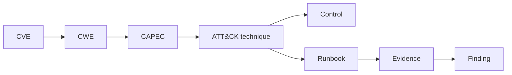

# EPIC-36 — Security Knowledge Fabric

## 1. Metadata

| Field | Value |
| --- | --- |
| Concept epic ID | `EPIC-36` |
| Slug | `security-knowledge-fabric` |
| Pillar | `E` — Security Knowledge Fabric |
| Phase | 5 |
| Priority | P0 |
| Delivery umbrella | `SVP2-E-01` (issue [#86](https://github.com/pestoura/hermes-security-labs/issues/86)) |
| Document version | 1.1.0 |
| Document date | 2026-08-07 |
| Catalogue | [Epic catalogue 45](../epic-catalogue-45.md) |
| Lifecycle contract | [Architecture documentation lifecycle](../../architecture/architecture-documentation-lifecycle.md) |

## 2. Current status

**IMPLEMENTING** — PR #146 integrated the repository-owned Security Knowledge Fabric contract candidate. External source synchronization and a persistent graph store remain `NOT_RUN` / `NOT_IMPLEMENTED`.

| Lifecycle state | Reached |
| --- | --- |
| INTENT | yes |
| IMPLEMENTING | yes |
| AS_BUILT | no |
| FINAL | no |

Implemented contract state:

- immutable raw knowledge records identified by SHA-256;
- complete source provenance with source name, version, retrieval time and locator;
- typed entity inventory spanning CVE, CPE, PURL, CWE, CAPEC, ATT&CK, ATLAS, KEV, EPSS, CSAF, VEX, OSCAL, OWASP, assets and SBOMs;
- derived relations require explicit provenance records, rationale and bounded confidence in `[0,1]`;
- source conflicts are persisted as unresolved and cannot be silently selected;
- conflict resolution requires an explicit precedence policy and an assertion already present in the conflict;
- applicability selectors are bounded to asset, SBOM, CPE and PURL.

No graph database, campaign knowledge snapshot service, external source ingestion or framework synchronization is claimed. NVD/TAXII/KEV/EPSS and other external sync operations remain `NOT_RUN`; graph storage remains `NOT_IMPLEMENTED`.

## 3. Problem and motivation

Security knowledge (vulnerabilities, weaknesses, patterns, techniques, controls, runbooks, evidence) is scattered and unlinked, preventing reasoning across domains.

## 4. Intended outcome

A versioned knowledge graph linking CVE, CWE, CAPEC, ATT&CK, controls, runbooks and evidence with provenance and confidence on every edge.

## 5. Scope and non-goals

### In scope

- Graph schema: node types, edge types, provenance, confidence
- Versioning and snapshotting per campaign
- Source precedence and trust levels
- Query surface definition

### Non-goals

- Treating the graph as an authoritative compliance record

## 6. Intent architecture

Nodes are typed entities; edges carry source, ingest timestamp and confidence. Campaign planning consumes a pinned snapshot for reproducibility.

### Intent diagram

## 7. Contracts, data and capabilities

- Node and edge schema
- Provenance record
- Snapshot reference

Contracts are canonical in Git. Where this epic reuses a platform-wide contract, the canonical definition lives in the [reference architecture](../../architecture/security-validation-reference-architecture.md) and in [EPIC-01](EPIC-01-architecture-and-canonical-contracts.md); this document references it instead of restating it.

## 8. Dependencies and sequencing

- [EPIC-21 — Framework Crosswalk and canonical methodology](EPIC-21-framework-crosswalk-and-canonical-methodology.md)

Sequencing follows the phase model in the [intent document](../../architecture/security-validation-platform-v2-intent.md). This epic is planned for phase 5.

## 9. Security, risks and failure modes

- Graph growth without curation
- Conflicting edges from different sources
- Treating generic relation support as validated semantic mappings
- Consuming stale or unsynchronized external knowledge as current

Platform-wide invariants that this epic must not weaken:

- absence of evidence never produces a `PASS` verdict;
- no execution outside an active authorization contract;
- no secrets, tokens, cookies or raw credential material in documentation, telemetry or persisted evidence;
- no target outside registered laboratories.

## 10. Deliverables

- Knowledge fabric specification

## 11. Acceptance criteria

- Every edge carries source and confidence
- Campaigns record the snapshot identifier used

The repository candidate establishes provenance, relation, conflict and applicability primitives. Persistent graph storage and campaign snapshot pinning still require implementation/evidence before `AS_BUILT` or `FINAL`.

## 12. Evidence and validation plan

- Contract tests from PR #146
- Future graph-store persistence evidence
- Future pinned campaign snapshot hashes
- Future external source ingestion/synchronization evidence

## 13. Decisions and open questions

### Decisions taken

- Knowledge proposes; it never authorizes.
- Conflicting sources remain unresolved until an explicit precedence policy selects an existing assertion.
- Derived relations require explicit provenance and confidence.

### Open questions

- Storage model for large historical snapshots
- Canonical persistent graph backend
- Snapshot retention and compatibility policy

## 14. Implementation notes

> Reserved. Populate during implementation with pull request references, deviations from intent, and decisions taken while building. Do not delete this heading.

- PR #146 integrated the repository-level knowledge-record, derivation, conflict and applicability contract.
- No graph store or external source synchronization was activated.
- `NO_RUNTIME_CHANGE`.

## 15. As-built / final architecture

> Reserved. Populate when the delivery umbrella reaches completion. Must record what was actually built, evidence links, and every divergence from sections 6 to 11. No umbrella may be closed while this section is empty.

_Not final. Persistent graph storage, campaign snapshots and external synchronization remain NOT_IMPLEMENTED/NOT_RUN._

## 16. Document change log

| Date | Version | Change |
| --- | --- | --- |
| 2026-08-06 | 1.0.0 | Initial intent document created from the concept epic catalogue. |
| 2026-08-07 | 1.1.0 | Reconciled lifecycle to IMPLEMENTING against PR #146 while preserving graph storage and external synchronization as NOT_IMPLEMENTED/NOT_RUN. |
