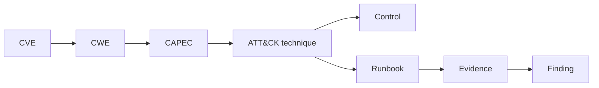

# EPIC-36 — Security Knowledge Fabric

## 1. Metadata

| Field | Value |
| --- | --- |
| Concept epic ID | `EPIC-36` |
| Slug | `security-knowledge-fabric` |
| Pillar | `E` — Security Knowledge Fabric |
| Phase | 5 |
| Priority | P0 |
| Delivery umbrella | `SVP2-E-01` (issue [#86](https://github.com/pestoura/hermes-security-labs/issues/86)) |
| Document version | 1.0.0 |
| Document date | 2026-08-06 |
| Catalogue | [Epic catalogue 45](../epic-catalogue-45.md) |
| Lifecycle contract | [Architecture documentation lifecycle](../../architecture/architecture-documentation-lifecycle.md) |

## 2. Current status

**INTENT** — nothing described in this document is implemented. Sections 14 and 15
are reserved and must be filled during and after implementation, as required by the
[documentation lifecycle contract](../../architecture/architecture-documentation-lifecycle.md).

| Lifecycle state | Reached |
| --- | --- |
| INTENT | yes |
| IMPLEMENTING | no |
| AS_BUILT | no |
| FINAL | no |

## 3. Problem and motivation

Security knowledge (vulnerabilities, weaknesses, patterns, techniques, controls, runbooks, evidence) is scattered and unlinked, preventing reasoning across domains.

## 4. Intended outcome

A versioned knowledge graph linking CVE, CWE, CAPEC, ATT&CK, controls, runbooks and evidence with provenance and confidence on every edge.

## 5. Scope and non-goals

### In scope

- Graph schema: node types, edge types, provenance, confidence
- Versioning and snapshotting per campaign
- Source precedence and trust levels
- Query surface definition

### Non-goals

- Treating the graph as an authoritative compliance record

## 6. Intent architecture

Nodes are typed entities; edges carry source, ingest timestamp and confidence. Campaign planning consumes a pinned snapshot for reproducibility.

### Intent diagram

## 7. Contracts, data and capabilities

- Node and edge schema
- Provenance record
- Snapshot reference

Contracts are canonical in Git. Where this epic reuses a platform-wide contract, the
canonical definition lives in the
[reference architecture](../../architecture/security-validation-reference-architecture.md)
and in [EPIC-01](EPIC-01-architecture-and-canonical-contracts.md); this document
references it instead of restating it.

## 8. Dependencies and sequencing

- [EPIC-21 — Framework Crosswalk and canonical methodology](EPIC-21-framework-crosswalk-and-canonical-methodology.md)

Sequencing follows the phase model in the
[intent document](../../architecture/security-validation-platform-v2-intent.md).
This epic is planned for phase 5.

## 9. Security, risks and failure modes

- Graph growth without curation
- Conflicting edges from different sources

Platform-wide invariants that this epic must not weaken:

- absence of evidence never produces a `PASS` verdict;
- no execution outside an active authorization contract;
- no secrets, tokens, cookies or raw credential material in documentation, telemetry
  or persisted evidence;
- no target outside registered laboratories.

## 10. Deliverables

- Knowledge fabric specification

## 11. Acceptance criteria

- Every edge carries source and confidence
- Campaigns record the snapshot identifier used

## 12. Evidence and validation plan

- Snapshot hashes recorded per campaign

Evidence must be referenced from the delivery umbrella issue before the umbrella can
be closed, and this document must record the references in section 15.

## 13. Decisions and open questions

### Decisions taken at intent time

- Knowledge proposes; it never authorizes

### Open questions

- Storage model for large historical snapshots

## 14. Implementation notes

> Reserved. Populate during implementation with pull request references, deviations
> from intent, and decisions taken while building. Do not delete this heading.

_Not started._

## 15. As-built / final architecture

> Reserved. Populate when the delivery umbrella reaches completion. Must record what
> was actually built, evidence links, and every divergence from sections 6 to 11.
> No umbrella may be closed while this section is empty.

_Not started._

## 16. Document change log

| Date | Version | Change |
| --- | --- | --- |
| 2026-08-06 | 1.0.0 | Initial intent document created from the concept epic catalogue. |
