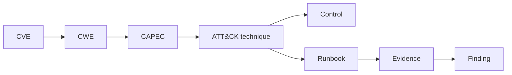

# EPIC-36 — Security Knowledge Fabric

## 1. Metadata

| Field | Value |
| --- | --- |
| Concept epic ID | `EPIC-36` |
| Slug | `security-knowledge-fabric` |
| Pillar | `E` — Security Knowledge Fabric |
| Phase | 5 |
| Priority | P0 |
| Delivery umbrella | `SVP2-E-01` (issue [#86](https://github.com/pestoura/hermes-security-labs/issues/86)) |
| Document version | 1.2.0 |
| Document date | 2026-08-08 |
| Catalogue | [Epic catalogue 45](../epic-catalogue-45.md) |
| Lifecycle contract | [Architecture documentation lifecycle](../../architecture/architecture-documentation-lifecycle.md) |

## 2. Current status

**IMPLEMENTING** — PR #146 integrated the repository-owned Security Knowledge Fabric contract candidate. PR #226 added a controlled local persistence/integrity boundary for raw source records, relation publication provenance, unresolved conflicts and explicit non-rewriting resolutions. External source synchronization, a production graph store and campaign snapshot pinning remain `NOT_RUN` / `NOT_IMPLEMENTED`.

| Lifecycle state | Reached |
| --- | --- |
| INTENT | yes |
| IMPLEMENTING | yes |
| AS_BUILT | no |
| FINAL | no |

Implemented/observed controlled state:

- immutable raw knowledge records identified by SHA-256;
- complete source provenance with source name, version, retrieval time and locator;
- controlled local raw bytes persisted content-addressed/create-only with canonical record sidecars;
- typed entity inventory spanning CVE, CPE, PURL, CWE, CAPEC, ATT&CK, ATLAS, KEV, EPSS, CSAF, VEX, OSCAL, OWASP, assets and SBOMs;
- derived relations require explicit provenance records, rationale and bounded confidence in `[0,1]`;
- controlled relation publication refuses missing or invalid provenance records;
- source conflicts are persisted unresolved and cannot be silently selected;
- conflict resolution requires an explicit precedence policy and an assertion already present in the conflict;
- controlled resolution creates a separate immutable record and does not rewrite the original conflict;
- persisted relations/resolutions have `execution_authority=NONE`;
- applicability selectors are bounded to asset, SBOM, CPE and PURL.

No production graph database, campaign knowledge snapshot service, external source ingestion or framework synchronization is claimed. NVD/TAXII/KEV/EPSS and other external sync operations remain `NOT_RUN`; production graph storage remains `NOT_IMPLEMENTED`.

## 3. Problem and motivation

Security knowledge (vulnerabilities, weaknesses, patterns, techniques, controls, runbooks, evidence) is scattered and unlinked, preventing reasoning across domains.

## 4. Intended outcome

A versioned knowledge graph linking CVE, CWE, CAPEC, ATT&CK, controls, runbooks and evidence with provenance and confidence on every edge.

## 5. Scope and non-goals

### In scope

- Graph schema: node types, edge types, provenance, confidence
- Versioning and snapshotting per campaign
- Source precedence and trust levels
- Query surface definition

### Non-goals

- Treating the graph as an authoritative compliance record
- Treating controlled local filesystem integrity as production WORM storage
- Treating knowledge as execution authorization

## 6. Intent architecture

Nodes are typed entities; edges carry source, ingest timestamp and confidence. Campaign planning consumes a pinned snapshot for reproducibility.

### Intent diagram

The controlled local implementation currently proves raw-record integrity, relation provenance gates and conflict persistence/resolution semantics. It is not the production graph architecture.

## 7. Contracts, data and capabilities

Canonical repository components include:

- `platform/knowledge-fabric/knowledge-record.schema.json`;
- `platform/knowledge-fabric/knowledge_fabric.py`;
- `platform/knowledge-fabric/source-policy.yaml`;
- `platform/knowledge-fabric/local_knowledge_store.py`.

The local store:

- persists raw bytes under their SHA-256;
- uses create-only object/record writes and canonical record-integrity sidecars;
- fails verification on raw or metadata mutation;
- publishes relations only after every provenance record verifies;
- persists conflicts only in the unresolved state;
- records explicit resolutions separately without historical rewrite;
- carries no execution authority.

Where this epic reuses a platform-wide contract, the canonical definition lives in the [reference architecture](../../architecture/security-validation-reference-architecture.md) and in [EPIC-01](EPIC-01-architecture-and-canonical-contracts.md); this document references it instead of restating it.

## 8. Dependencies and sequencing

- [EPIC-21 — Framework Crosswalk and canonical methodology](EPIC-21-framework-crosswalk-and-canonical-methodology.md)

Sequencing follows the phase model in the [intent document](../../architecture/security-validation-platform-v2-intent.md). This epic is planned for phase 5.

## 9. Security, risks and failure modes

- Graph growth without curation
- Conflicting edges from different sources
- Treating generic relation support as validated semantic mappings
- Consuming stale or unsynchronized external knowledge as current
- Treating local create-only semantics as a production WORM/storage-administrator guarantee
- Treating relation confidence as authorization or a security verdict

Platform-wide invariants that this epic must not weaken:

- absence of evidence never produces a `PASS` verdict;
- no execution outside an active authorization contract;
- knowledge proposes; it never authorizes;
- no secrets, tokens, cookies or raw credential material in documentation, telemetry or persisted evidence;
- no target outside registered laboratories.

## 10. Deliverables

Delivered for the E-01 umbrella:

- Knowledge Fabric architecture/specification;
- source/synchronization policy specification;
- controlled local raw-record integrity boundary;
- controlled relation provenance publication gate;
- controlled unresolved-conflict persistence and explicit non-rewriting resolution evidence.

Still pending for EPIC-36 finality:

- production persistent graph backend;
- campaign snapshot service and pinned snapshot identifiers;
- external source synchronization/currentness evidence;
- scale/retention/compatibility evidence for historical snapshots.

## 11. Acceptance criteria

Repository/control evidence now demonstrates:

- every controlled published relation carries explicit provenance record IDs, rationale and confidence, and all provenance records must exist and verify;
- controlled conflicts are persisted unresolved and cannot be preselected/silently resolved;
- raw source bytes are content-addressed/create-only and metadata integrity is verified.

Still not demonstrated for the complete concept:

- campaigns record a pinned Knowledge Fabric snapshot identifier;
- production graph persistence;
- external synchronization and currentness of declared sources.

The delivery umbrella `SVP2-E-01` may therefore complete on its own three criteria while this broader concept remains non-final.

## 12. Evidence and validation plan

Current evidence:

- PR #146 — repository contract candidate;
- PR #226 final clean head `28d4d2bd399e497f44a877d318001ea6138a92ff`;
- PR #226 pre-merge security `31270424217`: PASS;
- PR #226 pre-merge validate `31270424092`: PASS;
- PR #226 squash merge `3329923039970da74a8b99bd4d28ef4fbe58039c`;
- PR #226 post-merge security `31270509628`: PASS;
- PR #226 post-merge validate `31270509655`: PASS.

Future concept-finality evidence must include production graph persistence, campaign snapshot pinning and actual external synchronization/currentness.

## 13. Decisions and open questions

### Decisions taken

- Knowledge proposes; it never authorizes.
- Conflicting sources remain unresolved until an explicit precedence policy selects an existing assertion.
- Derived relations require explicit provenance and confidence.
- Relation publication in the controlled local store requires all provenance records to verify.
- Resolution history is append-only at the contract level; the original conflict is not rewritten.
- Local create-only/content-addressed storage is not claimed as WORM.

### Open questions

- Storage model for large historical snapshots
- Canonical persistent graph backend
- Snapshot retention and compatibility policy
- Production source-currentness and trust verification

## 14. Implementation notes

> Reserved. Populate during implementation with pull request references, deviations from intent, and decisions taken while building. Do not delete this heading.

- PR #146 integrated the repository-level knowledge-record, derivation, conflict and applicability contract.
- PR #226 integrated `LocalKnowledgeStore` and adversarial persistence/provenance/conflict tests.
- #226 uses only synthetic data in temporary local CI directories.
- No external feed, target, credential or deployed graph was accessed.
- `NO_RUNTIME_CHANGE` outside controlled CI.

## 15. As-built / final architecture

> Reserved lifecycle section. The E-01 delivery boundary is implemented in controlled local CI, but EPIC-36 remains non-final.

Current factual state:

- Knowledge Fabric contracts: implemented;
- controlled local raw persistence/integrity: `PASS_CONTROLLED_CI`;
- controlled relation provenance publication gate: `PASS_CONTROLLED_CI`;
- controlled unresolved conflict persistence: `PASS_CONTROLLED_CI`;
- explicit non-rewriting conflict resolution: `PASS_CONTROLLED_CI`;
- execution authority from knowledge: `NONE`;
- campaign snapshot pinning: `NOT_RUN` for this concept-finality criterion;
- external synchronization/currentness: `NOT_RUN`;
- production graph store: `NOT_IMPLEMENTED`;
- production persistence: `NOT_RUN`;
- deployed runtime: `NO_RUNTIME_CHANGE`.

`AS_BUILT` for the complete concept remains false; `FINAL` remains false.

## 16. Document change log

| Date | Version | Change |
| --- | --- | --- |
| 2026-08-06 | 1.0.0 | Initial intent document created from the concept epic catalogue. |
| 2026-08-07 | 1.1.0 | Reconciled lifecycle to IMPLEMENTING against PR #146 while preserving graph storage and external synchronization as NOT_IMPLEMENTED/NOT_RUN. |
| 2026-08-08 | 1.2.0 | Record PR #226 controlled local persistence/provenance/conflict evidence and separate E-01 delivery completion from EPIC-36 graph/snapshot/sync finality. |
