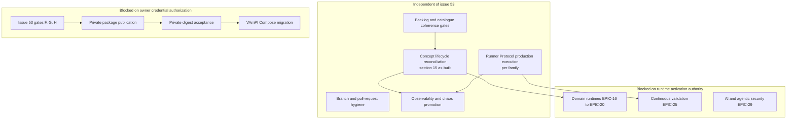

# Lane B — Cross-cutting reconciliation, dependency map and execution queue

> **Scope: documentation and backlog reconciliation only.** No runtime, secret, package
> visibility or VAmPI Compose change is made or implied by this document. Every state below
> is derived from the canonical machine-readable sources, the repository tree and the GitHub
> issue/pull-request record at the referenced reconciliation point.

## 1. Purpose

The project reached a state where the delivery backlog reports 21 of 21 umbrellas
`completed` and 57 of 58 issues closed, while 37 of 45 concept epics are still `IMPLEMENTING`
or `INTENT`. That is not a contradiction, but it was not written down anywhere, so the
backlog could be read as either "finished" or "mostly unfinished" depending on which source
was opened first.

This document is the single reconciled view: what is delivered, what is partial, what is
blocked, what is future, and in which order the remaining work can proceed. It complements
rather than replaces:

- [`epic-catalogue-45.md`](epic-catalogue-45.md) section 7 — the per-epic lifecycle register;
- [`SVP2-final-delivery-reconciliation.md`](SVP2-final-delivery-reconciliation.md) — why the
  umbrellas were reconciled to `completed`;
- [`architecture-documentation-lifecycle.md`](../architecture/architecture-documentation-lifecycle.md)
  — the rules that govern promotion between lifecycle states.

## 2. Two axes, never one

| Axis | Values | Unit | Source of truth |
| --- | --- | --- | --- |
| Delivery status | `proposed`, `implementing`, `completed` | 21 umbrella epics, issues #76–#96 | [`security-validation-platform-v2.yaml`](../../roadmap/epics/security-validation-platform-v2.yaml) |
| Concept lifecycle | `INTENT`, `IMPLEMENTING`, `AS_BUILT`, `FINAL` | 45 concept epics | [`security-validation-platform-v2-concepts.yaml`](../../roadmap/epics/security-validation-platform-v2-concepts.yaml) |

A `completed` umbrella means its declared acceptance criteria were met with gated evidence in
the repository and controlled runtime. It does **not** promote the concept epics it covers.
A concept epic reaches `AS_BUILT` only when section 15 of its document records what was
actually built, with evidence.

## 3. Reconciled state of the repository

### 3.1 Delivered

| Area | Evidence |
| --- | --- |
| 21 delivery umbrellas | issues #76–#96 closed with `status:completed`; master tracking #97 closed |
| Concept epics at `FINAL` | `EPIC-01`, `EPIC-02`, `EPIC-15` |
| Concept epics at `AS_BUILT` | `EPIC-05`, `EPIC-09`, `EPIC-21`, `EPIC-27`, `EPIC-33` |
| Environment catalogue | `platform/scripts/labctl.py validate` reports 57 manifests |
| Runtime source of truth | `validate_source_of_truth.py` reports 5 runtimes, 57 environments |
| Runner Protocol v2 | contract, SDK, conformance kit, durable idempotency ledger, POSIX supervisor |
| Deployment tracking | tri-state drift tooling with dedicated test suite and documented lock contract |
| GHCR public rollout | five accepted public packages with immutable digests, tracked under #34 |

### 3.2 Partially delivered

| Item | What exists | What is missing |
| --- | --- | --- |
| Runner Protocol production execution | contract, SDK, conformance kit, supervised candidates for API, DevSecOps and AI/MCP | production execution for every family is unimplemented; the calibrated AI/MCP runtime is not connected to the protocol |
| 29 concept epics at `IMPLEMENTING` | intent sections 3–13 complete, section 14 recording delivered increments | section 15 as-built not populated, so none can be promoted |
| Domain runtimes | contracts, activation gate and constraints under `SVP2-L-01` | Kubernetes, identity/AD, cloud, mobile and IoT/OT runtimes are not activated |
| Observability and chaos | evidence-bound failure suite and controlled readiness gate | production observability and chaos execution remain unclaimed |

### 3.3 Blocked

| Item | Blocker | Nature |
| --- | --- | --- |
| Issue #53 gates F, G, H | no dedicated PAT classic exposing exactly `read:packages` in the Hermes secret store | credential provisioning, requires explicit owner authorization |
| Private GHCR publication | GitHub Actions publication depends on package Actions access plus a billing/quota precondition | external account state |
| VAmPI Compose migration to a private digest | must not start before the private digest is independently accepted | deliberate sequencing boundary |

Blocked work is limited to the private-registry chain. It does **not** gate the concept-epic
lifecycle, the documentation contract, the roadmap or any repository-local validation.

### 3.4 Obsolete or superseded

| Item | Disposition |
| --- | --- |
| 194 remote branches whose pull request is merged | fully absorbed into `main`; retained history only, no pending content |
| 40 remote branches with no commit absent from `main` | strictly redundant |
| Closed duplicate pull requests #127/#128 and the reopened #55, #145, #149 lines | superseded by the merged equivalents already in `main` |

### 3.5 Future or dependent

`EPIC-14`, `EPIC-16`–`EPIC-20`, `EPIC-25` and `EPIC-29` remain `INTENT`. They depend on
runtime activation authority that the repository deliberately does not hold, and they must not
be promoted by documentation work alone.

## 4. Dependency map

The three groups do not intersect. Work in the independent group can proceed today and is not
serialized behind issue #53 or behind any runtime activation decision.

## 5. Prioritized execution queue

Ordered so that each entry unblocks the next and none waits on a blocked dependency.

| # | Work item | Depends on | Blocked by #53 | Rationale |
| --- | --- | --- | --- | --- |
| 1 | Reconcile lifecycle state across catalogue, registry and backlog, with a mechanical gate | — | no | Removes the ambiguity that made every other status question unanswerable |
| 2 | Populate section 15 for the `IMPLEMENTING` concept epics whose umbrella already closed with evidence | 1 | no | The evidence already exists in merged pull requests; only the as-built record is missing |
| 3 | Promote those epics to `AS_BUILT` once section 15 cites evidence | 2 | no | Restores agreement between the lifecycle contract and reality |
| 4 | Connect the calibrated AI/MCP runtime to Runner Protocol and record the divergence | — | no | Largest remaining functional gap that needs no external authority |
| 5 | Delete the 194 remote branches whose pull request is merged | — | no | 206 of 207 remote branches are noise; the signal is one open lane |
| 6 | Close the milestone accounting gap on `SVP v2 Foundation` | 1 | no | The milestone reports two open items while its four issues are closed |
| 7 | Provision the dedicated `read:packages` credential | owner authorization | yes | Only step that unblocks the private-registry chain |
| 8 | Execute issue #53 gates F, G and H | 7 | yes | Cannot start earlier without a credential |
| 9 | Accept the private digest, then migrate VAmPI Compose | 8 | yes | Explicit sequencing boundary in #53 |
| 10 | Domain runtime activation, `EPIC-16`–`EPIC-20`, `EPIC-25`, `EPIC-29` | separate authorization | no | Independent of #53 but requires activation authority the repository does not hold |

Items 1 through 6 are available immediately. Item 1 is delivered by the pull request that
introduces this document.

## 6. Known accounting divergences

Recorded rather than corrected silently:

1. Milestone `SVP v2 Foundation` reports two open items through the GitHub milestone counter
   while all four issues assigned to it (#76, #77, #78, #80) are closed. No open issue or pull
   request resolves against that milestone. This is a GitHub-side counter divergence, not a
   backlog gap, and it must not be treated as outstanding delivery work.
2. `SVP2-I-01` (#92) has no dedicated concept epic. This gap is already recorded in
   [`epic-catalogue-45.md`](epic-catalogue-45.md) section 2 and is preserved here.
3. `.deployment.json` in a local checkout reports `DRIFT_DETECTED` against a newer `main`
   commit. That is the tool behaving correctly on a stale local state and is not a repository
   defect.

## 7. Boundaries

- No runtime, service, container, credential, package visibility or Compose file is changed by
  this reconciliation. `NO_RUNTIME_CHANGE`.
- No concept epic is promoted by this document; promotion requires section 15 evidence.
- No issue is closed or reopened on the basis of this document alone.
- Blocked items stay blocked until the owner authorizes the specific credential or activation.

## 8. Related documents

- [Epic catalogue — 45 concept epics](epic-catalogue-45.md)
- [SVP2 final delivery reconciliation](SVP2-final-delivery-reconciliation.md)
- [Architecture documentation lifecycle](../architecture/architecture-documentation-lifecycle.md)
- [Roadmap SVP v2](security-validation-platform-v2.md)
- [Backlog README](../../roadmap/README.md)
