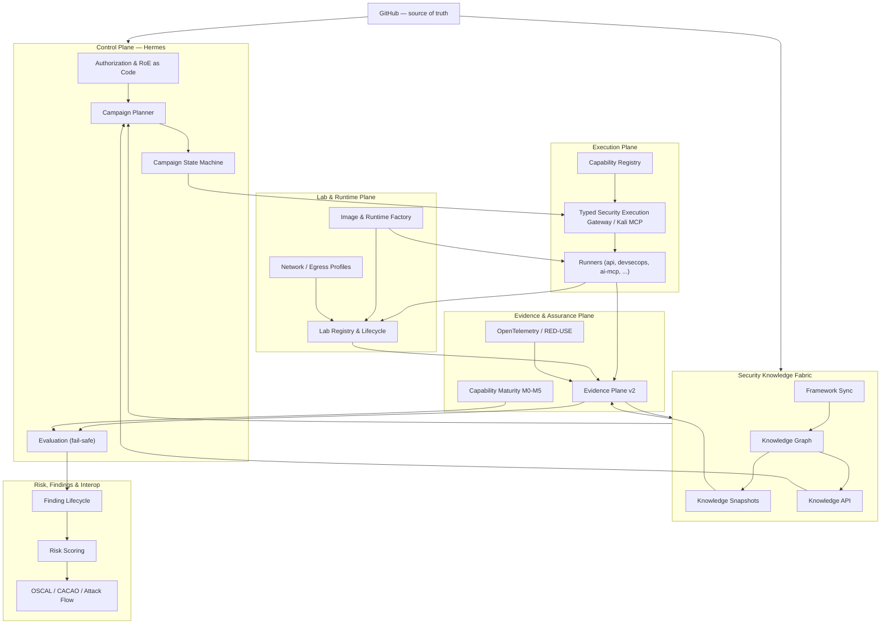
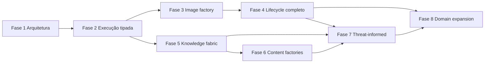

# Security Validation Platform v2 — Roadmap

> Documento canónico de visão e roadmap. Backlog machine-readable em
> [`roadmap/epics/security-validation-platform-v2.yaml`](../../roadmap/epics/security-validation-platform-v2.yaml).
> Este documento não contém instruções ofensivas executáveis.

## 1. Visão executiva

Evoluir `hermes-security-labs` de uma biblioteca de runbooks com um executor Kali
para uma **Threat-Informed Continuous Security Validation Platform**:

- **Hermes** permanece o *control plane*: autoriza, planeia, orquestra e regista.
- **Security Execution Gateway / Kali MCP** passa a ser um *execution plane* tipado,
  com contratos explícitos em vez de execução de comandos arbitrários.
- **Runners especializados** (API, DevSecOps, AI/MCP e futuros domínios) partilham um
  Runner Protocol comum.
- **Runtimes e laboratórios isolados** têm lifecycle transacional, prova de zero resíduo
  e políticas de rede default-deny.
- **Evidence plane** e **evaluation fail-safe** garantem que ausência de prova nunca é
  interpretada como sucesso.
- **GitHub** é a fonte de verdade de código, manifestos, conhecimento versionado e backlog.

O objetivo final é responder de forma repetível e auditável a: *este controlo previne,
deteta ou falha perante este comportamento adversário, neste ativo, hoje?*

## 2. Estado atual (base de partida)

| Domínio | Estado |
| --- | --- |
| Runbooks | 370 validados pelo catálogo (`api=150`, `devsecops=120`, `ai-mcp=100`, warnings=0) |
| Execução | Kali MCP com superfície de comando genérica |
| Laboratórios | Ambientes Docker Web/API, DevSecOps e AI/MCP catalogados |
| Deployment | `deployment/` com deploy, verify, drift-check e rollback tri-estado |
| Supply chain | Adoção GHCR iniciada por ambiente, com proveniência |
| Evidência | Produzida por campanha, sem plano de evidência unificado versionado |
| Conhecimento | Sem grafo de conhecimento; mapeamentos framework implícitos |

Limitações estruturais que este roadmap resolve: execução não tipada, ausência de
registo de capacidades, evidência não normalizada, mapeamento de frameworks manual e
inexistência de validação informada por ameaça.

## 3. Princípios

1. **Knowledge proposes, Hermes authorizes, runtimes execute.** Nenhuma camada acumula
   as três responsabilidades.
2. **Fail-safe evaluation.** Falta de evidência, erro ou timeout nunca produz `PASS`.
3. **Typed over generic.** Contratos tipados substituem execução de comando livre.
4. **Isolation by default.** Default-deny egress, uma rede por laboratório, sem
   privileged, sem host network, sem Docker socket, sem host mounts.
5. **Provenance everywhere.** Imagens, conhecimento, evidências e findings carregam
   origem, versão e confiança.
6. **Reproducible or not accepted.** Conteúdo sem reprodutibilidade demonstrada fica
   em estado candidato.
7. **Never auto-merge generated content.** Geração automática produz propostas; a
   promoção exige revisão humana.
8. **Separate raw from sanitized.** Evidência bruta é restrita; a partilha usa
   derivações sanitizadas.
9. **Least privilege and explicit authorization.** Intrusividade elevada exige
   aprovação adicional e janelas temporais.
10. **Versioned everything.** Schemas, snapshots de conhecimento e conteúdo têm versão.

## 4. Arquitetura alvo

## 5. Pilares

| ID | Pilar | Foco |
| --- | --- | --- |
| A | Governance and Architecture | Arquitetura canónica, ADRs, RoE as Code, L0-L4, state machine |
| B | Runtime Foundation | Gateway tipado, Runner Protocol v2, lab lifecycle transacional |
| C | Image and Capability Factory | Base runtime mínima, capability registry, perfis, supply chain |
| D | Evidence, Observability and Assurance | Evidence Plane v2, OTel, chaos tests, maturidade M0-M5 |
| E | Security Knowledge Fabric | Grafo, sync de frameworks, confiança e precedência |
| F | Threat-Informed Validation | Threat profiles, attack graph, purple team, D3FEND, TIBER-EU |
| G | Vulnerability-Specific Validation | CVE→comportamento, validation providers, quarentena de PoC |
| H | Continuous Content Factories | Coverage, geração de candidatos, promoção/retirada |
| I | Lab Factory and Registry | Lab Schema v2, famílias/variantes, isolamento, maturidade L0-L5 |
| J | Risk, Findings and Interoperability | Scoring, ciclo de vida de findings, OSCAL/CACAO/Attack Flow |
| K | SDK and Extensibility | SDKs, conformance kit, assinaturas, certificação |
| L | Domain Expansion | Kubernetes, identidade/AD, cloud, mobile, IoT/OT |

## 6. Fases

| Fase | Nome | Conteúdo |
| --- | --- | --- |
| 0 | Current-base closure | Referência apenas: PR #61, limpeza de resíduo, sincronização de deployment, higiene de issues |
| 1 | Architecture & source of truth | Arquitetura canónica, ADRs, lifecycle, Runner Protocol v2 |
| 2 | Typed execution | MCP tipado, capability registry, política de rede, Evidence v2 |
| 3 | Image factory | Base runtime mínima e perfis core |
| 4 | Full pentest lifecycle | Ciclo completo e segurança L3/L4 |
| 5 | Knowledge fabric | Grafo e sync de frameworks |
| 6 | Content factories | Runbook, lab, runtime e detection factories |
| 7 | Threat-informed | Purple team, risco e interoperabilidade |
| 8 | Domain expansion | Kubernetes, identidade, cloud, mobile, IoT/OT |

## 7. Dependências principais

Dependências duras: Evidence Plane v2 antes de avaliação de maturidade; capability
registry antes de perfis de imagem promovidos; knowledge fabric antes de planeamento
informado por ameaça; lab lifecycle transacional antes de expansão de domínio.

## 8. Riscos

| Risco | Impacto | Mitigação |
| --- | --- | --- |
| Execução genérica persistir por conveniência | Perda de auditabilidade | Remover `execute_command` do perfil normal e aplicar enforcement no gateway |
| Mapeamentos de framework simplistas | Conclusões erradas de cobertura | Níveis de confiança e proveniência obrigatórios |
| Conteúdo gerado degradar a qualidade | Falsos positivos e ruído | Anti-degradation gates e proibição de auto-merge |
| Resíduo de laboratórios | Contaminação e custo | Cleanup idempotente, zero-residue proof e orphan detector |
| Crescimento descontrolado de imagens | Superfície e supply chain | Base mínima non-root, SBOM, assinatura e promoção controlada |
| Evidência bruta com dados sensíveis | Exposição | Separação raw/sanitized e redaction contextual |
| Ações L3/L4 sem controlo | Dano operacional | Dual approval, TTL de sessão, kill switch e budgets |
| Sobre-engenharia | Entrega parada | Fases incrementais e Definition of Done por epic |

## 9. Non-goals

- Não é um serviço de pentest contra sistemas de terceiros sem autorização formal.
- Não executa ações destrutivas em produção.
- Não substitui equipas de resposta a incidentes nem ferramentas de SIEM.
- Não publica exploits armados nem instruções ofensivas prontas a usar.
- Não introduz deployment automático de GitHub para o Hermes.
- Não cria automações agendadas nem integração RITMO no âmbito deste backlog.

## 10. Definition of Ready

Um epic está pronto quando tem: objetivo, âmbito e não-âmbito, deliverables versionados,
dependências identificadas, critérios de aceitação verificáveis, nível de intrusividade,
requisitos de evidência, impacto em schemas e plano de rollback quando aplicável.

## 11. Definition of Done

Um epic está concluído quando: deliverables estão em `main`; schemas e validadores
passam; testes novos e existentes passam; `securityctl validate` mantém
`api=150 devsecops=120 ai-mcp=100 total=370 warnings=0` ou documenta a alteração
deliberada; a documentação canónica está atualizada; a evidência é sanitizada; não há
segredos; e o comportamento em falha é fail-safe.

## 12. Roadmap por releases

| Release | Milestone | Fases | Resultado |
| --- | --- | --- | --- |
| v2.0 | SVP v2 Foundation | 1 | Arquitetura canónica, ADRs, RoE as Code, Runner Protocol v2 |
| v2.1 | SVP v2 Runtime | 2-3 | Gateway tipado, capability registry, Evidence v2, image factory |
| v2.2 | SVP v2 Knowledge | 4-5 | Lifecycle completo, segurança L3/L4, knowledge fabric |
| v2.3 | SVP v2 Validation | 6-7 | Content factories, purple team, risco e interoperabilidade |
| v2.4 | SVP v2 Expansion | 8 | Kubernetes, identidade, cloud, mobile, IoT/OT |

## 13. Documentos relacionados

- [Platform v2 intent (45 concept epics)](../architecture/security-validation-platform-v2-intent.md)
- [Epic catalogue — 45 concept epics e mapping 45→21](epic-catalogue-45.md)
- [Architecture documentation lifecycle](../architecture/architecture-documentation-lifecycle.md)
- [Reference architecture](../architecture/security-validation-reference-architecture.md)
- [Framework crosswalk](../architecture/framework-crosswalk.md)
- [Security knowledge fabric](../architecture/security-knowledge-fabric.md)
- [Continuous content factories](../architecture/continuous-content-factories.md)
- [Backlog README](../../roadmap/README.md)
