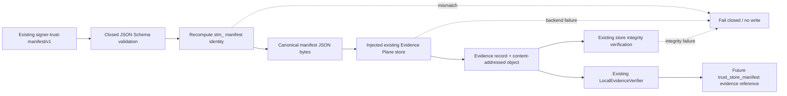

# CHG-HSL-077 — Signer Trust Manifest Custody Design

**Date:** 2026-08-16  
**Status:** approved design / implementation not started  
**Campaign:** `VAL-HSL-RUNNER-L1-LIVE-PROMOTION`  
**Scope:** provider-neutral repository hardening only

## Decision

Implement **Option A — dedicated and minimal custody bridge** for the existing public `signer-trust-manifest/v1` object.

The bridge will:

1. validate the existing closed JSON Schema;
2. independently recompute and verify the content-addressed `manifest_id` from the canonical manifest body;
3. persist only the exact public manifest JSON through an injected existing Evidence Plane store;
4. require the existing Evidence Plane store integrity verification to pass after write;
5. return a content-addressed `evidence_id`, public `evidence_ref`, payload SHA-256, classification and `manifest_id`;
6. rely on the existing `LocalEvidenceVerifier` for later `evidence_ref + sha256` verification.

The canonical policy remains **`DISABLED / deny / NOT_RUN / execution_authority=none`**. Tests may enable a copy only against disposable temporary storage.

No trust installation, provider selection, key provisioning, provider SDK/networking, Runner effect or promotion authority is introduced.

---

## 1. Facts known

- `platform/assurance/signer_trust_manifest.py` already builds a deterministic, public, no-authority `signer-trust-manifest/v1` object.
- `platform/schemas/signer-trust-manifest.schema.json` already defines a closed schema (`additionalProperties=false`) for that object.
- The manifest contains only public/auditable fields: provider class/reference, key id, algorithm, SPKI SHA-256, attestation provenance, trust-store generation identity/digest and explicit no-authority flags.
- CHG-HSL-074 explicitly deferred custody of this manifest as a follow-up.
- The human signer decision contract requires `trust_store_manifest` as one of the evidence classes that a future approved decision must reference by canonical evidence reference plus SHA-256.
- `LocalEvidenceStore` and `LocalEvidenceVerifier` already provide the canonical LAB_L1 content-addressed storage/integrity verification path.
- CHG-HSL-076 established the repository pattern for a narrow custody bridge that receives an existing Evidence Plane store through dependency injection and leaves the canonical runtime policy disabled.
- The canonical signer-audit custody precedent uses `default-30d` with a 30-day retention period.
- Trust-store generation/freshness/rotation/revocation contracts already exist independently and must not be duplicated by this change.

---

## 2. Assumptions

- The existing `signer-trust-manifest/v1` schema remains the authoritative public manifest shape for CHG-HSL-077.
- Manifest payload hashing/storage reuses the repository canonical JSON convention: `sort_keys=True`, compact separators `(',', ':')`, `ensure_ascii=True`, encoded as UTF-8.
- `LocalEvidenceStore.put(record, payload)` and `.verify(evidence_id)` remain the canonical LAB_L1 store contract for repository tests.
- No operational signer/provider evidence is created merely because a structurally valid manifest can be stored.
- Human decision #403 remains independent; CHG-HSL-077 must not populate or modify its decision state.

---

## 3. Architecture

### 3.1 New component

Add one focused component:

```text
platform/evidence-plane/signer_trust_manifest_custody.py
```

Its responsibility is only:

```text
validated public signer trust manifest
        ↓
canonical JSON bytes + SHA-256
        ↓
injected existing Evidence Plane store
        ↓
Evidence Plane record + content object
        ↓
existing store integrity verification
        ↓
content-addressed custody result
```

It must not instantiate or import a concrete Evidence Plane backend for production use.

### 3.2 Policy

Add:

```text
platform/evidence-plane/signer-trust-manifest-custody-policy.yaml
```

The policy contract is exact and closed:

```yaml
schema_version: '1.0'
policy_id: hexor.signer.trust_manifest.custody
state: DISABLED
default: deny
runtime_status: NOT_RUN
execution_authority: none
custody:
  evidence_plane_projection: required
  classification: restricted
  retention_policy_id: default-30d
  retention_days: 30
  include_private_key: false
  include_raw_signing_payload: false
  include_raw_signature: false
  install_trust: false
```

Any missing or extra field fails validation. The canonical committed state must remain `DISABLED`.

### 3.3 Existing components reused

CHG-HSL-077 reuses rather than replaces:

- `signer_trust_manifest.py` for manifest composition;
- `signer-trust-manifest.schema.json` for structural validation;
- `evidence_plane.py` for Evidence Plane record construction and hashing helpers;
- injected `LocalEvidenceStore` in tests;
- `LocalEvidenceVerifier` for verification by evidence reference + digest;
- existing trust-store lifecycle/rotation/revocation logic.

No second datastore, verifier, chain, seal or ledger is permitted.

---

## 4. Content-addressed manifest validation

Schema validation alone is insufficient because a caller could mutate a valid field while reusing a stale `manifest_id`.

The custody bridge must therefore independently recompute the manifest identity before any write.

Validation sequence:

1. require a mapping/object;
2. validate against the existing closed schema;
3. copy the manifest without `manifest_id`;
4. canonical-JSON encode that body using the exact repository convention;
5. SHA-256 the canonical body;
6. derive `stm_<first 32 lowercase hex chars of canonical-body SHA-256>`;
7. compare the expected id with the supplied `manifest_id` using exact equality;
8. refuse before write on mismatch.

This check binds custody to actual manifest content rather than trusting caller-supplied identity metadata.

The bridge does **not** re-run provider attestation or trust lifecycle evaluation. Those remain upstream canonical verifier/composer responsibilities.

---

## 5. Evidence Plane projection

For an accepted manifest, the bridge persists the exact canonical public JSON manifest bytes using these record values:

```text
classification = restricted
producer = signer-trust-manifest-custody-v1
operation = signer.trust_manifest.custody
protocol_version = signer-trust-manifest/v1
media_type = application/json
payload_sha256 = sha256(canonical manifest JSON bytes)
payload_size = exact byte length
storage_ref = evidence://signer-trust-manifest/<payload_sha256>
retention_policy_id = default-30d
retain_until = recorded_at + 30 days
legal_hold = false
```

Metadata is an exact public allowlist derived from the manifest:

- `manifest_id`;
- `provider_kind`;
- opaque `provider_ref`;
- `key_id`;
- `algorithm`;
- `public_key_spki_sha256`;
- `attestation_id`;
- `generation_id`;
- `generation_sequence`;
- `trust_store_sha256`;
- `source_evidence_ref`;
- `source_evidence_sha256`;
- `trust_binding_allowed=false`;
- `promotion_allowed=false`;
- `runtime_status=NOT_RUN`;
- `execution_authority=NONE`.

No metadata field may imply that trust is installed or that a provider/candidate is selected.

After `put`, the bridge must call the injected store's integrity verification. A failed or unavailable verification is a hard refusal.

---

## 6. Result contract

Return one immutable result:

```text
SignerTrustManifestCustodyResult
  evidence_id
  evidence_ref
  payload_sha256
  classification
  manifest_id
```

`evidence_ref` uses the canonical public Evidence Plane form:

```text
evidence://ev_<32hex>
```

The result is evidence location/integrity metadata only. It is not a signer decision or trust-binding record.

---

## 7. Data flow



The future evidence reference does not mutate #403. It only makes a later evidence binding technically possible.

---

## 8. Error handling

Errors use stable machine-readable codes and sanitized messages.

Minimum refusal codes:

```text
CUSTODY_DISABLED
POLICY_INVALID
MANIFEST_INVALID
MANIFEST_ID_MISMATCH
EVIDENCE_STORE_UNAVAILABLE
EVIDENCE_PROJECTION_FAILED
EVIDENCE_VERIFICATION_FAILED
```

Rules:

- no backend path, token, credential, stack detail or secret appears in caller-visible errors;
- validation and identity mismatch occur before any write;
- missing `.put` or `.verify` capability fails closed;
- backend exception after write returns failure and never marks the result verified;
- failed store integrity verification returns failure;
- no fallback store or offline success path exists.

---

## 9. Security invariants

Implementation and tests mechanically preserve:

```text
human decision = NO_DECISION
supplier/provider selection = NO_SELECTION
selected_class = null
human_decision_id = null
trust installation = NONE
key provisioning = NONE
private-key handling = NONE
provider calls = NONE
runtime_status = NOT_RUN
promotion_allowed = false
execution_authority = NONE
Runner effect = NOT_RUN
campaign = BLOCKED / HOLD
```

An `ENABLED` policy copy inside a disposable unit test is test composition only and must never be committed as canonical runtime state.

---

## 10. Secret and data minimization rules

The custody boundary persists only the closed public manifest schema.

It must not add or persist:

- private key/private key material;
- raw signing payload;
- raw signature/base64 signature;
- credentials;
- tokens;
- passwords;
- provider secrets;
- trust-store private material.

Any added property is rejected before write by the closed schema.

---

## 11. Idempotency

Persisting the exact same canonical manifest with the same correlation and recorded timestamp must resolve to the same content-addressed Evidence Plane record under existing store semantics.

Tests prove repeated identical writes do not create divergent payload objects or conflicting evidence records.

No deduplication mechanism is implemented inside the custody bridge itself.

---

## 12. Testing strategy

### 12.1 Contract tests

Tests first cover:

- canonical repository policy is exactly `DISABLED / deny / NOT_RUN / none` with `default-30d` / 30 days;
- disabled policy refuses before accessing a store;
- valid existing `signer-trust-manifest/v1` passes schema + identity recomputation;
- any valid-field mutation with unchanged `manifest_id` fails `MANIFEST_ID_MISMATCH` before write;
- extra/secret-bearing fields fail closed via the closed schema;
- malformed or extended policy fails closed.

### 12.2 Evidence Plane integration tests

Using disposable `tmp_path` storage only:

- exact canonical public manifest is persisted;
- record classification is `restricted`;
- content digest equals SHA-256 of exact persisted canonical bytes;
- `storage_ref` is `evidence://signer-trust-manifest/<payload_sha256>`;
- retention is `default-30d` / 30 days;
- `LocalEvidenceStore.verify(evidence_id)` succeeds for intact evidence;
- repeated identical persistence remains content-addressed/idempotent.

### 12.3 EvidenceVerifier tests

Using existing `LocalEvidenceVerifier`:

- exact `evidence_ref + payload_sha256` succeeds;
- raw `evidence_id + payload_sha256` is tested only if the canonical verifier already supports it;
- wrong digest fails;
- missing reference fails;
- tampered stored object fails.

No signer-specific verifier is introduced.

### 12.4 Static safety tests

AST/source guards reject accidental runtime/provider side effects, including direct imports/calls of:

```text
socket
subprocess
requests
httpx
boto3
hvac
pkcs11
docker
```

The custody module must not instantiate:

```text
LocalEvidenceStore
LocalEvidenceVerifier
EvidenceChain
AuditSink
```

These remain injected/reused canonical components where relevant.

### 12.5 Repository gates

Before merge:

- targeted tests;
- full `platform/tests` / source-of-truth suite;
- security workflow;
- release governance;
- Private VAmPI deny;
- validate;
- Exact-SHA validation evidence;
- PR mergeability and review-thread check;
- post-merge repeat on exact new `main` SHA.

---

## 13. Alternatives considered

### A. Dedicated minimal custody bridge — selected

**Advantages:** smallest coherent implementation; follows CHG-HSL-076; makes future `trust_store_manifest` evidence verifiable; no immediate AuditSink coupling; easy to test; no provider dependency.

**Limitations:** one additional focused custody adapter; no generic custody framework.

**MVP fit:** excellent.

### B. Custody plus AuditSink/EvidenceChain binding

**Advantages:** immediate hash-chain traceability.

**Limitations:** more code/coupling than required by #403 evidence references; increases failure surface before a demonstrated consumer requirement.

**MVP fit:** unnecessary now.

### C. Generic public-evidence custody framework

**Advantages:** may reduce future adapter duplication.

**Limitations:** premature abstraction; risks forcing unlike evidence classes into one policy/schema model; larger refactoring surface.

**MVP fit:** poor at this stage.

---

## 14. Risks

### Schema-valid content with stale/tampered `manifest_id`
Mitigation: recompute content-addressed identity before write.

### Stored manifest mistaken for provider/custody proof
Mitigation: retain explicit no-authority metadata and leave #403 untouched.

### Canonical policy accidentally enabled
Mitigation: tests assert committed policy is exactly `DISABLED`; runtime remains `NOT_RUN`.

### Evidence integrity logic duplicated
Mitigation: injected store + existing `LocalEvidenceVerifier`; no new verifier/store implementation.

### Sensitive data enters custody metadata
Mitigation: closed manifest schema, exact metadata allowlist, source tests and security gates.

---

## 15. Dependencies

Required existing contracts:

- `platform/assurance/signer_trust_manifest.py`;
- `platform/schemas/signer-trust-manifest.schema.json`;
- `platform/evidence-plane/evidence_plane.py`;
- `platform/evidence-plane/local_store.py` for disposable tests;
- `platform/evidence-plane/local_evidence_verifier.py` for verifier tests.

No operational Vault/KMS/HSM dependency is allowed.

---

## 16. Out of scope

CHG-HSL-077 excludes:

- selecting `VAULT`, `KMS` or `HSM`;
- supplier/product choice;
- real provider calls or provisioning;
- private key generation/import/export;
- trust-store generation beyond existing test fixtures;
- trust-store installation/binding;
- rotation/revocation redesign;
- changing #403 to `APPROVED`;
- changing signer baseline from `NO_SELECTION`;
- authenticated receipt delivery;
- enabling signer-audit custody runtime;
- Runner or target interaction;
- PRE_PROMOTION completion;
- LAB_L1 promotion.

---

## 17. Phasing

### MVP — CHG-HSL-077

- dedicated disabled custody policy;
- closed schema validation;
- independent `manifest_id` recomputation;
- canonical JSON content hashing;
- injected Evidence Plane persistence;
- post-write canonical integrity verification;
- EvidenceVerifier proof;
- idempotency/tamper/fail-closed tests;
- governance/documentation/CI reconciliation.

### Later

After an explicit human custody decision and real provider evidence exist:

- custodize an actually observed provider-bound signer trust manifest under the same contract;
- bind that evidence reference into the human decision record through the existing decision workflow;
- independently govern any real trust-store installation.

### Future / production

- durable/WORM-backed evidence custody;
- tenant/campaign isolation of persistent evidence;
- evidence export/retention integration;
- operational trust distribution and revocation propagation evidence.

---

## 18. Acceptance criteria

CHG-HSL-077 is complete only when all of the following hold:

1. canonical custody policy is repository-locked to `DISABLED / deny / NOT_RUN / none`, `default-30d`, 30 days;
2. valid manifest schema is enforced before write;
3. `manifest_id` is recomputed and exact-match checked before write;
4. altered content with stale `manifest_id` is refused with zero writes;
5. only canonical public manifest JSON is persisted;
6. payload digest and Evidence Plane record digest match exactly;
7. existing store integrity verification passes after write;
8. existing `LocalEvidenceVerifier` proves exact reference+digest and rejects tamper/mismatch/missing refs;
9. identical replay is content-addressed/idempotent under existing store semantics;
10. no provider/network/subprocess/trust/key/Runner side effects exist;
11. no second store/verifier/chain/seal/ledger is created;
12. #403 remains `NO_DECISION / NO_SELECTION`;
13. campaign remains `BLOCKED / HOLD`, `promotion_allowed=false`, runtime `NOT_RUN`;
14. full repository gates are GREEN on the exact final PR head and exact post-merge `main` SHA.

---

## 19. Decision record

**Decision:** implement Option A, dedicated minimal signer trust manifest custody bridge.  
**Context:** CHG-HSL-074 produces the required public trust manifest but explicitly left Evidence Plane custody for follow-up.  
**Alternatives:** AuditSink linkage now; generic custody framework.  
**Justification:** smallest implementation that turns the existing public manifest into independently verifiable evidence without creating runtime/provider authority.  
**Risks accepted:** one additional focused custody adapter; no generic abstraction yet.  
**Impact:** enables a future canonical `trust_store_manifest` evidence reference but does not satisfy or mutate the human signer decision.  
**State:** approved design; implementation pending spec review.  
**Next action:** after spec review approval, write the TDD implementation plan and implement CHG-HSL-077 on this branch.
