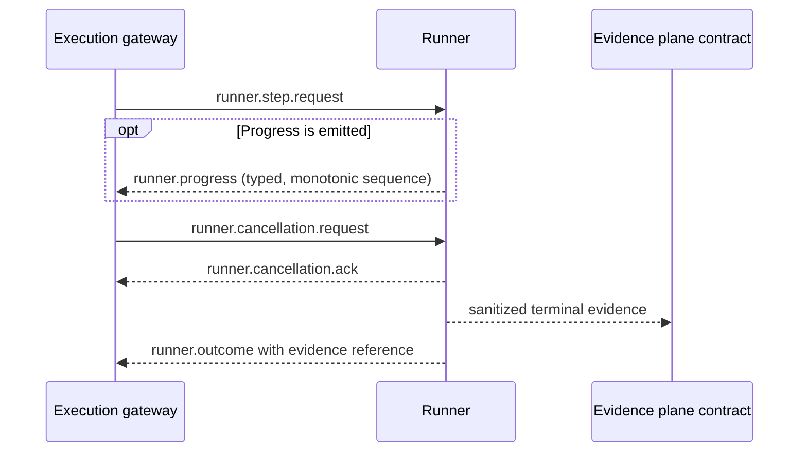

# Runner Protocol v2

Runner Protocol v2 is the canonical contract between an execution gateway and a runner. It normalizes dispatch, correlation, progress, cancellation, timeout, idempotency, errors and terminal evidence without granting authorization or changing any existing runner.

## Lifecycle and authority

- Owner: `EPIC-05` / delivery umbrella `SVP2-B-02`.
- Protocol version: `2.0.0`.
- Current implementation state: contract, repository-local SDK, vendor-neutral conformance kit, durable transactional idempotency ledger and POSIX process supervisor are available; API-family in-memory and durable candidates pass synthetic conformance, while fixed-worker API, DevSecOps and AI/MCP supervised candidates are `AS_BUILT` with `PASS_SYNTHETIC_PROCESS`; production execution remains unimplemented for every family, and the calibrated AI/MCP runtime is connected to Runner Protocol by contract projection only (`CONTRACT_PROJECTION_ONLY`), with no execution integration.
- Hermes remains the authorization authority. A valid protocol message cannot create, extend or replace authorization.
- Unknown versions, invalid messages, missing correlation or missing evidence fail closed.

## Message flow



The cancellation exchange is conditional. A normal completion may emit only the request, optional progress and terminal outcome.

## Correlation contract

Every message carries exactly four UUID correlation identifiers:

- `campaign_id`: authorized campaign context;
- `run_id`: one orchestration run inside the campaign;
- `step_id`: one logical step whose effect must be idempotent;
- `attempt_id`: one concrete attempt of that step.

Retries preserve `campaign_id`, `run_id`, `step_id` and `idempotency_key`, but use a new `attempt_id`. Logs, progress, errors, decisions and evidence derived from the message must retain all four identifiers.

## Idempotency

The request carries an `idempotency_key`. The canonical request fingerprint is a SHA-256 digest over these normalized fields:

- protocol major version;
- `campaign_id`, `run_id` and `step_id`;
- authorization reference;
- capability identifier and canonical JSON input;
- timeout, retry and cancellation policies.

`attempt_id` and `emitted_at` are deliberately excluded so a retry of the same logical effect has the same fingerprint.

Required runner behaviour when enforcement is implemented:

| Existing key | Candidate fingerprint | Result |
| --- | --- | --- |
| absent | any valid fingerprint | `NEW` |
| present | identical | `REPLAY_SAME` — return the recorded terminal result/evidence; do not repeat effects |
| present | different | `IDEMPOTENCY_CONFLICT` — refuse without execution |

A transient failure may be retried only when the runner can prove that no effect occurred or when the effect is intrinsically idempotent. An uncertain result after a possible effect becomes `INCONCLUSIVE`; it is not automatically retried.

## Progress

Progress is optional by default and may be requested as required for a specific capability. Absence of progress is not itself a failure; timeout budgets remain the temporal authority.

When progress is emitted:

- `sequence` starts at 1 and increases strictly for the same `attempt_id`;
- states are `accepted`, `running` or `cancelling`;
- percentages, when present, never decrease;
- messages are sanitized, bounded and contain no secret material;
- progress never substitutes a terminal outcome.

## Timeout and cancellation

Each request declares:

- `soft_timeout_ms`: initiates cooperative cancellation and records a `TIMEOUT_SOFT` event;
- `hard_timeout_ms`: maximum wall-clock budget; expiry yields `TIMED_OUT` and `TIMEOUT_HARD`;
- cancellation mode: cooperative or cooperative-then-force;
- `grace_period_ms`: bounded period between cancellation request and permitted force termination.

Semantic invariants:

1. `hard_timeout_ms` is greater than `soft_timeout_ms`.
2. `grace_period_ms` fits inside the hard timeout budget.
3. Cancellation is observable through an acknowledgement or a terminal timeout/error outcome.
4. Cancellation, timeout or loss of control can never produce `PASS`.
5. Force termination, when later implemented, remains sandbox/runtime enforcement and is not provided by this contract-only block.

## Retry policy

Automatic retry is limited to:

- `TRANSIENT_DEPENDENCY`;
- `RUNNER_UNAVAILABLE`;
- `TIMEOUT_SOFT`, only when no effect occurred.

Authorization, validation, compatibility, idempotency conflict, hard timeout, evidence and internal errors are not automatically retryable. Maximum attempts are bounded by the schema.

## Terminal outcomes and evidence

Terminal status is one of:

- `PASS`;
- `FAIL`;
- `ERROR`;
- `CANCELLED`;
- `TIMED_OUT`;
- `INCONCLUSIVE`;
- `REFUSED`.

Every terminal outcome carries at least one sanitized evidence reference. For pre-execution refusal, cancellation or timeout, the evidence may be a decision/protocol record rather than execution output. This preserves auditability while avoiding a false claim that technical execution occurred.

`PASS` is invalid without evidence and cannot carry an error. `ERROR`, `TIMED_OUT` and `REFUSED` require a normalized error.

## Normalized errors

Errors expose a stable code, category, retryability flag, bounded human-readable message and optional safe scalar context. Raw exceptions, stack traces, tokens, passwords, cookies, authorization headers, API keys, credentials and private keys are forbidden.

The initial stable codes are declared in the JSON Schema. Adding a code is a compatibility change; changing the meaning of an existing code is breaking and requires a protocol major version.

## Repository-local Python SDK

The canonical validation, compatibility, progress and fingerprint logic is exposed through the
`runner_protocol_v2` package under [`src/runner_protocol_v2/`](src/runner_protocol_v2/). The
root [`validate_protocol.py`](validate_protocol.py) file is only a CLI wrapper and contains no
duplicate protocol logic.

For repository development, install the package in editable mode:

```bash
python -m pip install -e platform/runner-protocol
```

Consumers import the explicit package name rather than `platform.*`, avoiding collision with
the Python standard-library `platform` module:

```python
from runner_protocol_v2 import request_fingerprint, validate_semantics
```

The SDK deliberately does not package copied schemas. In an editable repository checkout it
resolves the canonical `schemas/` and `compatibility.yaml` artefacts beside the project. A
non-editable installation must set `RUNNER_PROTOCOL_CONTRACT_ROOT` to that canonical contract
directory. Missing or incomplete contract artefacts fail closed.

The SDK validation functions remain side-effect free. The optional
[`SQLiteIdempotencyLedger`](durable-idempotency-ledger.md) persists only caller-supplied
idempotency state and validated terminal outcomes. The optional
[`PosixProcessSupervisor`](supervised-process-boundary.md) is an execution primitive that starts
only an absolute executable without a shell and owns bounded process-group cleanup. It does not
authorize, select capabilities, map targets or produce protocol evidence. Only the fixed-worker
API, DevSecOps and AI/MCP synthetic-process candidates consume it; no production adapter does.
The SDK remains the shared dependency so protocol and lifecycle semantics are not copied per family.

## Supervised process boundary

The repository-local SDK includes the `PosixProcessSupervisor` described in
[`supervised-process-boundary.md`](supervised-process-boundary.md). It validates an absolute
executable and working directory, invokes without a shell, creates a new process group, captures
bounded output, escalates `SIGTERM` to `SIGKILL`, and refuses to classify root exit as success
while descendants remain. `CLEANUP_FAILED` is never eligible for protocol `PASS`.

This is not a sandbox. It provides no cgroup, namespace, seccomp, network, privilege or resource
quota enforcement. The API, DevSecOps and AI/MCP fixed-worker synthetic candidates exercise it
without accepting a caller-controlled command; no production adapter consumes it and real
capability execution remains `NOT_RUN`.

### API supervised synthetic-process candidate

The block-8 candidate is implemented at
[`security/packs/api/src/api_pentest_runbooks/supervised_runner_protocol_adapter.py`](../../security/packs/api/src/api_pentest_runbooks/supervised_runner_protocol_adapter.py).
It requires `--conformance-only`, `--synthetic-process-only` and an external durable ledger. The
request cannot select `argv`, working directory, environment or worker mode. A durable claim is
created before the fixed worker starts; timeout, cancellation and descendant residue are mapped to
validated terminal outcomes, and raw worker streams are replaced by hashes and byte counts.

Its compatibility state is `PASS_SYNTHETIC_PROCESS`, not production conformance. Sandboxing, real
authorization lookup, target allowlisting, Evidence Plane integration and real API execution remain
`NOT_RUN`; promotion remains blocked.

### DevSecOps supervised synthetic-process candidate

The block-9 candidate is implemented at
[`security/packs/devsecops/src/devsecops_runbooks/supervised_runner_protocol_adapter.py`](../../security/packs/devsecops/src/devsecops_runbooks/supervised_runner_protocol_adapter.py)
and documented in
[`security/packs/devsecops/docs/runner-protocol-supervised-candidate.md`](../../security/packs/devsecops/docs/runner-protocol-supervised-candidate.md).
It uses the same shared supervised engine and fixed activation controls as the API candidate, but
supplies a separate DevSecOps worker and imports no API-family implementation. It cannot invoke a
scanner, pipeline, repository, network, target or command supplied by a request.

Its compatibility state is `PASS_SYNTHETIC_PROCESS` for fixed synthetic process evidence only.
Sandboxing, production authorization, repository credentials, pipeline integration, real DevSecOps
capability execution and Evidence Plane integration remain `NOT_RUN`; promotion remains blocked.

### AI/MCP supervised synthetic-process candidate

The block-10 candidate is implemented at
[`security/packs/ai-mcp/src/ai_mcp_runbooks/supervised_runner_protocol_adapter.py`](../../security/packs/ai-mcp/src/ai_mcp_runbooks/supervised_runner_protocol_adapter.py)
and documented in
[`security/packs/ai-mcp/docs/runner-protocol-supervised-candidate.md`](../../security/packs/ai-mcp/docs/runner-protocol-supervised-candidate.md).
It uses the shared supervised engine with a separate fixed AI/MCP worker and imports no API or
DevSecOps implementation. It is deliberately isolated from the calibrated AI/MCP runtime,
handlers, providers, agents, memory/RAG adapters and campaigns.

Its compatibility state is `PASS_SYNTHETIC_PROCESS` for fixed synthetic process evidence only.
Sandboxing, production authorization, MCP provider integration, real AI/MCP capability execution
and Evidence Plane integration remain `NOT_RUN`; promotion remains blocked.

### AI/MCP runtime contract projection

Separately from the supervised candidate, the calibrated AI/MCP runtime is now *addressable
and validatable* through a pure contract projection at
[`security/packs/ai-mcp/src/ai_mcp_runbooks/runner_protocol_projection.py`](../../security/packs/ai-mcp/src/ai_mcp_runbooks/runner_protocol_projection.py),
documented in
[`security/packs/ai-mcp/docs/runner-protocol-runtime-projection.md`](../../security/packs/ai-mcp/docs/runner-protocol-runtime-projection.md).
It translates a validated `runner.step.request` carrying the capability
`ai-mcp.runtime.handler-invoke` into an authorised pack `ExecutionRequest`, and a sanitised
`ExecutionResult` into a validated `runner.outcome` whose evidence reference is a digest only.

The projection executes nothing. It imports no dispatch, execution or adapter module, creates
no subprocess and opens no socket; `validate_compatibility_matrix()` parses its AST to enforce
that mechanically. Its compatibility state is `CONTRACT_PROJECTION_ONLY` with
`execution_integration: NOT_RUN`; the AI/MCP family remains `conformance_only` and blocked from
promotion.

## Conformance kit

The vendor-neutral conformance kit is implemented in [`conformance.py`](conformance.py). It
starts a candidate adapter as a disposable process and exchanges language-neutral JSON-lines
control messages over standard input and output.

The candidate must support the test-only control actions `reset`, `dispatch`, `cancel`, `stats`
and `shutdown`. The kit exercises only synthetic `conformance.*` capabilities; it does not
invoke real security tools, customer targets or operational credentials.

The mandatory cases demonstrate:

- propagation of all four correlation identifiers and terminal evidence;
- replay of the same logical effect without increasing the candidate's effect counter;
- refusal of a changed effect under the same idempotency key;
- normalized hard timeout and transient dependency errors;
- cooperative cancellation with acknowledgement and terminal outcome;
- rejection of a controlled secret canary leak.

Results are written as a sanitized report conforming to
[`schemas/conformance-report.schema.json`](schemas/conformance-report.schema.json). The raw
candidate command is not persisted; only its SHA-256 digest is recorded.

A `PASS` verdict is necessary but not sufficient for promotion. It has no automatic promotion
effect, and human review remains mandatory. Third-party or untrusted candidates must run in an
isolated sandbox without customer network access, customer data, real credentials or production
secrets.

The adapter in [`fixtures/reference_adapter.py`](fixtures/reference_adapter.py) is test-only. It
proves the kit can accept a deterministic reference implementation and reject controlled broken
implementations. It is not an API, DevSecOps or AI/MCP runner and provides no production
conformance evidence.

## Compatibility

Compatibility rules and current adapter status are in [`compatibility.yaml`](compatibility.yaml).

- major versions must match exactly;
- an unknown major version fails closed before execution;
- optional fields may be added only when older consumers safely ignore them;
- removing or reinterpreting a required field requires a new major version;
- API, DevSecOps and AI/MCP remain `conformance_only` with fixed synthetic evidence only; every production adapter remains unimplemented and blocked from promotion.

## Canonical artefacts

- [`schemas/runner-protocol-v2.schema.json`](schemas/runner-protocol-v2.schema.json)
- [`pyproject.toml`](pyproject.toml)
- [`src/runner_protocol_v2/`](src/runner_protocol_v2/)
- [`src/runner_protocol_v2/idempotency.py`](src/runner_protocol_v2/idempotency.py)
- [`src/runner_protocol_v2/supervision.py`](src/runner_protocol_v2/supervision.py)
- [`durable-idempotency-ledger.md`](durable-idempotency-ledger.md)
- [`supervised-process-boundary.md`](supervised-process-boundary.md)
- [`validate_protocol.py`](validate_protocol.py) — thin CLI wrapper
- [`compatibility.yaml`](compatibility.yaml)
- [`conformance.py`](conformance.py)
- [`schemas/conformance-report.schema.json`](schemas/conformance-report.schema.json)
- [`fixtures/reference_adapter.py`](fixtures/reference_adapter.py) — test-only
- [`tests/test_runner_protocol.py`](tests/test_runner_protocol.py)
- [`tests/test_conformance.py`](tests/test_conformance.py)
- [`tests/test_sdk.py`](tests/test_sdk.py)
- [`tests/test_supervision.py`](tests/test_supervision.py)

## API-family conformance candidate

The first family-specific candidate is implemented at
[`security/packs/api/src/api_pentest_runbooks/runner_protocol_adapter.py`](../../security/packs/api/src/api_pentest_runbooks/runner_protocol_adapter.py).
It is an opt-in protocol candidate, not a production runner.

The in-memory process starts only with `--conformance-only`. The durable candidate at
[`security/packs/api/src/api_pentest_runbooks/durable_runner_protocol_adapter.py`](../../security/packs/api/src/api_pentest_runbooks/durable_runner_protocol_adapter.py)
requires both `--conformance-only` and `--durable-ledger`. The supervised candidate additionally
requires `--synthetic-process-only` and invokes only the fixed repository worker. All candidates
accept only synthetic capabilities and `authz/conformance/active`; real API capabilities and real
authorization references fail closed before an executable effect. None references the bridge or
legacy executor.

The vendor-neutral conformance kit returns `PASS` for this candidate. The compatibility record
therefore uses the deliberately narrower state `PASS_SYNTHETIC`, while preserving:

- `execution_integration: NOT_RUN`;
- `promotion_status: blocked`;
- no connection to `execute_runbook()`;
- no connection to `ProcessBridgeAdapter` or `execute_command`;
- durable persistence limited to synthetic conformance and disposable external SQLite state;
- supervised timeout/cancellation limited to the fixed synthetic worker;
- no customer-target or real security-tool execution.

`PASS_SYNTHETIC` proves protocol behaviour only. It cannot be used as evidence of production
safety, operational readiness or real API-runner conformance.

## Canonical gateway handoff

The canonical producer of a `runner.step.request` inside this repository is
[`platform/gateway-protocol/runner_handoff.py`](../gateway-protocol/runner_handoff.py).
It imports this SDK (`request_fingerprint`, `validate_semantics`) rather than
duplicating protocol schema or logic. Before it can construct a message, the
handoff requires a **separate signed TB1 authorization receipt issued by the
Hermes control plane**, verifies that receipt with the dedicated
`tb1-authorization` trust purpose/domain, independently re-runs the signed RoE
and typed gateway admission checks, and requires exact binding between both
views of the authorization context, including the canonical digest of the
validated typed-operation parameters.

The `authorization_ref` in `runner.step.request` is copied exactly from the
verified Hermes receipt. The gateway does **not** create, expand or approve the
authorization. It may recompute the expected reference only inside receipt
verification as an integrity check; this does not constitute issuance.

The reference uses the TB1 domain (`tb1-authz:v1:<sha256>`) and is **not a bearer token, grant, capability or signature**. It authorizes nothing and grants nothing by possession. A naked reference or caller-supplied authorization is refused. Hermes operational receipt issuance remains `NOT_IMPLEMENTED` and `NOT_RUN`; deployed authorization validation remains `NOT_RUN`.

A positive handoff outcome is reported as `request_built`, never as
`dispatched`: it means a valid message was constructed, not that anything was
sent, accepted or executed.

The handoff is boundary-only: it is not wired to the synthetic candidates, the
supervisor or any process. `execution_integration: NOT_RUN`, sandbox
`NOT_IMPLEMENTED`, promotion blocked, `NO_RUNTIME_CHANGE`.

## Non-goals of this block

- no production runner adapter or gateway enforcement;
- no change to existing pack/runbook semantics;
- no adapter-level live cancellation or production process termination;
- no production adapter integration of the durable idempotency ledger;
- no Evidence Plane implementation;
- no deployment, laboratory, Hermes or Kali MCP change.
